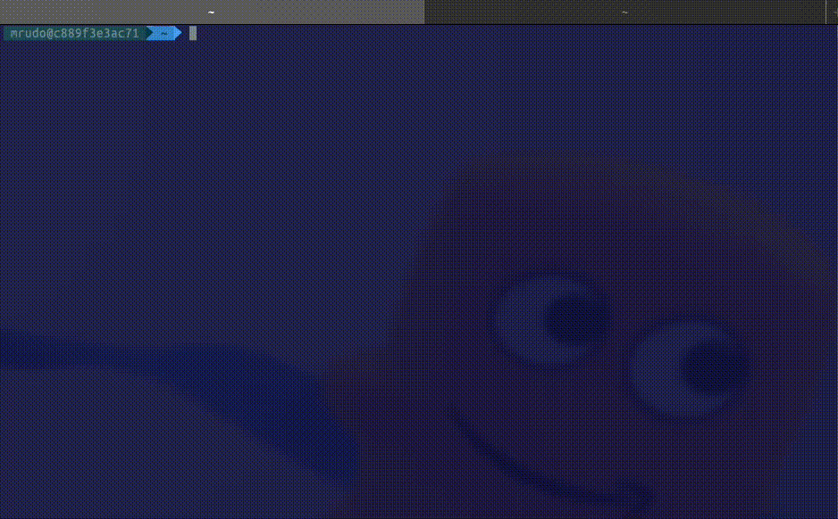

Shop Floor Connectivity (SFC) Framework
=======================================

> This repository is the successor of the archived [aws-samples/shopfloor-connectivity](https://github.com/aws-samples/shopfloor-connectivity) repo.

## Introduction

Shop Floor Connectivity (SFC) is a data ingestion technology that can deliver data to multiple AWS Services.

SFC extends and unifies data collection capabilities additionally to our existing IIoT data collection services, allowing customers to provide data in a consistent way to a wide range of AWS Services. It allows customers to collect data from their industrial equipment and deliver it to the AWS services that work best for their requirements. Customers get the cost and functional benefits of specific AWS services and save costs on licenses for additional connectivity products.

[**Supported protocols:**](./docs/adapters/README.md)

- [Allen-Bradley Rockwell PCCC](./docs/adapters/pccc.md)
- [Beckhoff ADS](./docs/adapters/ads.md)
- [J1939](./docs/adapters/j1939.md)
- [MQTT](./docs/adapters/mqtt.md)
- [Mitsubishi/Melsec SLMP](./docs/adapters/slmp.md)
- [Modbus-TCP](./docs/adapters/modbus.md)
- [NATS](./docs/adapters/nats.md)
- [OPC-UA](./docs/adapters/opcua.md)
- [REST](./docs/adapters/rest.md)
- [Simulator](./docs/adapters/simulator.md)
- [SNMP](./docs/adapters/snmp.md)
- [SQL](./docs/adapters/sql.md)
- [Siemens S7](./docs/adapters/s7.md)

[**Supported  service targets:** ](./docs/targets/README.md)

- [AWS IoT Core](./docs/targets/aws-iot-core.md)
- [AWS IoT Sitewise](./docs/targets/aws-sitewise.md)
- [AWS Kinesis Firehose](./docs/targets/aws-kinesis-firehose.md)
- [AWS Kinesis](./docs/targets/aws-kinesis.md)
- [AWS Lambda](./docs/targets/aws-lambda.md)
- [AWS MSK](./docs/targets/aws-msk.md)
- [AWS S3](./docs/targets/aws-s3.md)
- [AWS S3 Tables](./docs/targets/aws-s3-tables.md)
- [AWS SNS](./docs/targets/aws-sns.md)
- [AWS SQS](./docs/targets/aws-sqs.md)

[**Supported  edge  targets:** ](./docs/targets/README.md)

- [OPCUA](./docs/targets/opcua.md)
- [OPCUA Writer](./docs/targets/opcua-writer.md)
- [Debug Terminal](./docs/targets/debug.md)
- [File system](./docs/targets/file.md)
- [MQTT](./docs/targets/mqtt.md)
- [NATS](./docs/targets/nats.md)

**SFC Docs:** [`docs/README.md`](./docs/README.md)

**SFC Examples:** [`docs/examples/README.md`](./docs/examples/README.md)

&nbsp;

### SFC Components

There are three main types of components that make up SFC:

- `Protocol Adapters`
- `SFC Core`
- `Target Adapters`

Shop Floor Connectivity (SFC) is a versatile data ingestion solution that can be deployed in a variety of environments, including standalone applications, Docker containers, and Kubernetes pods. With no additional requirements beyond a Java JVM 17 runtime, SFC can be deployed on Linux and Windows systems. To optimize hardware utilization, SFC uses parallel and non-blocking async patterns in its software.

SFC protocol and target adapters can be implemented as a JVM component or as an external microservices using the gRPC protocol for communication. When running as stand-alone services, protocol adapters can be deployed on separate machines from the SFC Core process, with secure communication facilitated by gRPC (`IPC-mode`). The SFC Core provides a consistent infrastructure allowing all JVM based protocol and target adapters to run in the same process as the SFC Core (`In-Process mode`).

Distributed deployment using microservices is required to deploy in environments that use segregated OT and IT networks, with components connected to devices, protocol adapters, deployed in the OT network and components requiring internet access, targets adapters, in a DMZ.

The SFC core will provide the services, protocol and target adapters, with the required configuration after these are bootstrapped, providing a single, monitored and consistent source and location of configuration.

```mermaid
%%{init: {'theme':'base','themeVariables':{
  'background':'#0a0e14','primaryColor':'#0d1117','primaryTextColor':'#e6faff',
  'primaryBorderColor':'#1f6feb','lineColor':'#7d8590','fontFamily':'monospace',
  'clusterBkg':'#0a0e14','clusterBorder':'#1f6feb'}}}%%
flowchart LR
    PLANT[/"Shop floor<br/><i>PLCs · sensors · historians</i>"/]:::data
    ADAPTER(["<b>Protocol adapters</b><br/>OPC-UA · S7 · Modbus · …"]):::tool
    CORE(["<b>SFC Core</b><br/>schedules · transforms · filters"]):::core
    TARGET(["<b>Target adapters</b><br/>S3 · IoT Core · SiteWise · S3Tables · etc."]):::tool
    CLOUD{{"<b>AWS Target Services</b><br/> - e.g. MSK, S3Tables, IoT Core"}}:::aws

    PLANT --> ADAPTER
    ADAPTER ==> CORE
    CORE ==> TARGET
    TARGET ==> CLOUD

    classDef core fill:#0d1117,stroke:#ff6b35,stroke-width:2px,color:#ffd4c2,font-weight:bold;
    classDef tool fill:#0d1117,stroke:#1f6feb,stroke-width:2px,color:#e6faff,font-weight:bold;
    classDef data fill:#0d1117,stroke:#ff2bd6,stroke-width:1px,color:#ffb3f0;
    classDef aws fill:#0d1117,stroke:#b6ff00,stroke-width:2px,color:#d9ffb3;
    classDef ext fill:#0d1117,stroke:#7d8590,stroke-width:1px,color:#9aa4b2,stroke-dasharray:5 3;
```





## Documentation

Read more in the [SFC documentation](./docs/README.md)


## Quickstart

Two steps: the first needs **nothing but a JVM** and puts live data on your screen in under a minute;
the second connects a real OPC-UA server and streams to S3.

Both run from **one install**. The uberjar bundle ships the SFC core with every adapter and target
included, so a component is named by its `FactoryClassName` alone — there are no `JarFiles` paths to
wire up. *SFC speaks many more industrial protocols — [see the adapter docs](docs/adapters/README.md).*

### 1. Install

>**Requirements**: a Java 17 (or newer) runtime.

**Linux / macOS**

```shell
curl -fsSL https://raw.githubusercontent.com/awslabs/industrial-shopfloor-connect/main/sfcup.sh | bash
```

**Windows (PowerShell)**

```powershell
irm https://raw.githubusercontent.com/awslabs/industrial-shopfloor-connect/main/sfcup.ps1 | iex
```

That installs the latest release into `~/.sfc` and puts `sfc` on your `PATH` — start a new shell, or
`. "$HOME/.sfc/env"` to use it right away. Re-run `sfcup` any time to upgrade, `sfcup --uninstall` to
remove it. See [`sfcup.sh --help`](./sfcup.sh) for pinning a version or choosing another directory.

### 2. First data — no hardware, no cloud

The **simulator adapter** generates signals in-process, so you can watch SFC work before connecting
anything. Save this as `simulator.json`:

```json
{
  "AWSVersion": "2022-04-02",
  "Name": "Simulator to console",
  "Version": 1,
  "LogLevel": "Info",
  "Schedules": [
    {
      "Name": "SimSchedule",
      "Interval": 1000,
      "Active": true,
      "TimestampLevel": "Both",
      "Sources": { "Simulator": ["*"] },
      "Targets": ["DebugTarget"]
    }
  ],
  "Sources": {
    "Simulator": {
      "Name": "Sim",
      "ProtocolAdapter": "SimulatorAdapter",
      "Channels": {
        "sinus":    { "Simulation": { "SimulationType": "Sinus",    "DataType": "Double", "Min": 0, "Max": 100  } },
        "triangle": { "Simulation": { "SimulationType": "Triangle", "DataType": "Double", "Min": 0, "Max": 100  } },
        "sawtooth": { "Simulation": { "SimulationType": "Sawtooth", "DataType": "Double", "Min": 0, "Max": 100  } },
        "square":   { "Simulation": { "SimulationType": "Square",   "DataType": "Double", "Min": 0, "Max": 100  } },
        "random":   { "Simulation": { "SimulationType": "Random",   "DataType": "Byte",   "Min": 0, "Max": 100  } },
        "counter":  { "Simulation": { "SimulationType": "Counter",  "DataType": "Int",    "Min": 0, "Max": 1000 } }
      }
    }
  },
  "Targets": {
    "DebugTarget": { "Active": true, "TargetType": "DEBUG-TARGET" }
  },
  "TargetTypes": {
    "DEBUG-TARGET": { "FactoryClassName": "com.amazonaws.sfc.debugtarget.DebugTargetWriter" }
  },
  "ProtocolAdapters": {
    "SimulatorAdapter": { "AdapterType": "SIMULATOR" }
  },
  "AdapterTypes": {
    "SIMULATOR": { "FactoryClassName": "com.amazonaws.sfc.simulator.SimulatorAdapter" }
  }
}
```

Run it:

```shell
sfc -config simulator.json -info
```

Six simulated signals now print once per second. `Ctrl-C` to stop. That is the whole loop — read a
source, run a schedule, write a target — and everything below just swaps the source and the target.

### 3. Real OPC-UA to S3

Now the same pipeline against a real OPC-UA server, writing to an S3 bucket in your account.

>**Additionally needs**: Docker, and the aws cli with [credentials configured](https://docs.aws.amazon.com/cli/latest/userguide/cli-chap-configure.html#configure-precedence).

```shell
# Linux / macOS
export AWS_REGION="us-east-1"
export ACCOUNT_ID=$(aws sts get-caller-identity --query "Account" --output text)
export SFC_S3_BUCKET_NAME="sfc-s3-bucket-${AWS_REGION}-${ACCOUNT_ID}"

aws s3api create-bucket --bucket ${SFC_S3_BUCKET_NAME} --region ${AWS_REGION}
```

```bat
:: Windows (cmd)
set AWS_REGION=us-east-1
for /f %%i in ('aws sts get-caller-identity --query "Account" --output text') do set ACCOUNT_ID=%%i
set SFC_S3_BUCKET_NAME=sfc-s3-bucket-%AWS_REGION%-%ACCOUNT_ID%

aws s3api create-bucket --bucket %SFC_S3_BUCKET_NAME% --region %AWS_REGION%
```

Save the [configuration](./docs/core/sfc-configuration.md) below as `sfc/example.json`, replacing
`YOUR_BUCKET_NAME` with the bucket you just created. It reads nine nodes from the OPC-UA server and
sends them to S3 — note again that no `JarFiles` appear anywhere.

<details>
  <summary><b>Expand example.json</b></summary>

```json
{
  "AWSVersion": "2022-04-02",
  "Name": "OPCUA to S3",
  "Version": 1,
  "LogLevel": "Info",
  "ElementNames": {
    "Value": "value",
    "Timestamp": "timestamp",
    "Metadata": "metadata"
  },
  "Schedules": [
    {
      "Name": "OpcuaToS3",
      "Interval": 1000,
      "Description": "Read OPCUA data once per second and send to S3",
      "Active": true,
      "TimestampLevel": "Both",
      "Sources": { "OPCUA-SOURCE": ["*"] },
      "Targets": ["S3Target"]
    }
  ],
  "Sources": {
    "OPCUA-SOURCE": {
      "Name": "OPCUA-SOURCE",
      "ProtocolAdapter": "OPC-UA",
      "AdapterOpcuaServer": "OPCUA-SERVER-1",
      "Description": "OPCUA local test server",
      "SourceReadingMode": "Polling",
      "SubscribePublishingInterval": 100,
      "Channels": {
        "ServerStatus":                   { "Name": "ServerStatus",           "NodeId": "ns=0;i=2256" },
        "ServerTime":                     { "Name": "ServerTime",             "NodeId": "ns=0;i=2256", "Selector": "@.currentTime" },
        "State":                          { "Name": "State",                  "NodeId": "ns=0;i=2259" },
        "Machine1AbsoluteErrorTime":      { "Name": "AbsoluteErrorTime",      "NodeId": "ns=20;i=59217" },
        "Machine1AbsoluteLength":         { "Name": "AbsoluteLength",         "NodeId": "ns=20;i=59235" },
        "Machine1AbsoluteMachineOffTime": { "Name": "AbsoluteMachineOffTime", "NodeId": "ns=20;i=59210" },
        "Machine1AbsoluteMachineOnTime":  { "Name": "AbsoluteMachineOnTime",  "NodeId": "ns=20;i=59219" },
        "Machine1AbsolutePiecesIn":       { "Name": "AbsolutePiecesIn",       "NodeId": "ns=20;i=59237" },
        "Machine1FeedSpeed":              { "Name": "FeedSpeed",              "NodeId": "ns=20;i=59208" }
      }
    }
  },
  "Targets": {
    "S3Target": {
      "Active": true,
      "TargetType": "AWS-S3",
      "Region": "us-east-1",
      "BucketName": "YOUR_BUCKET_NAME",
      "Interval": 60,
      "BufferSize": 1,
      "Prefix": "opcua-data",
      "Compression": "None"
    }
  },
  "TargetTypes": {
    "AWS-S3": { "FactoryClassName": "com.amazonaws.sfc.awss3.AwsS3TargetWriter" }
  },
  "ProtocolAdapters": {
    "OPC-UA": {
      "AdapterType": "OPCUA",
      "OpcuaServers": {
        "OPCUA-SERVER-1": {
          "Address": "opc.tcp://localhost",
          "Path": "/",
          "Port": 4840,
          "ConnectTimeout": "10000",
          "ReadBatchSize": 500
        }
      }
    }
  },
  "AdapterTypes": {
    "OPCUA": { "FactoryClassName": "com.amazonaws.sfc.opcua.OpcuaAdapter" }
  }
}
```

</details>

Start the OPC-UA server and SFC:

```shell
docker run -d -p 4840:4840 ghcr.io/umati/sample-server:main
sfc -config example.json -info
```

Check what landed in your bucket:

```shell
export KEY=$(aws s3api list-objects --bucket $SFC_S3_BUCKET_NAME | jq -r '.Contents[0].Key')
aws s3 cp s3://$SFC_S3_BUCKET_NAME/$KEY - | jq '.[0]'
```


