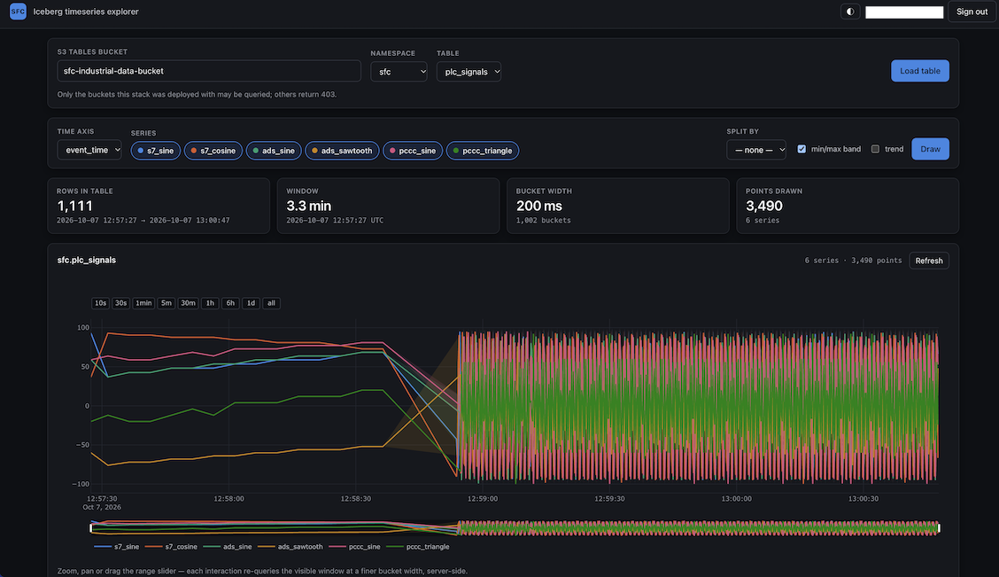
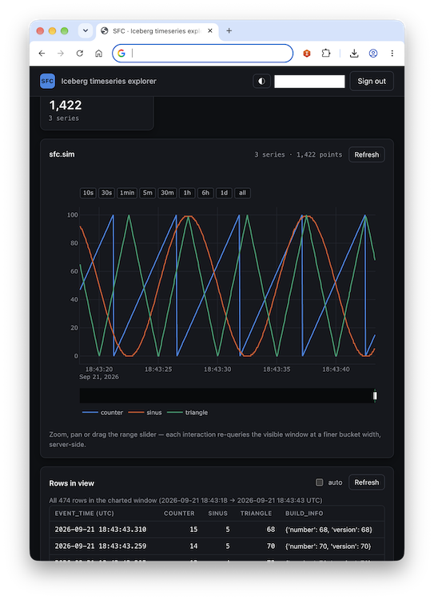

Shop Floor Connectivity (SFC) Framework
=======================================

> This repository is the successor of the archived [aws-samples/shopfloor-connectivity](https://github.com/aws-samples/shopfloor-connectivity) repo.

## Introduction

Shop Floor Connectivity (SFC) is a data ingestion technology that can deliver data to multiple AWS Services.

SFC extends and unifies data collection capabilities additionally to our existing IIoT data collection services, allowing customers to provide data in a consistent way to a wide range of AWS Services. It allows customers to collect data from their industrial equipment and deliver it to the AWS services that work best for their requirements. Customers get the cost and functional benefits of specific AWS services and save costs on licenses for additional connectivity products.

[**Supported protocols:**](./docs/adapters/README.md)

- [Allen-Bradley Rockwell PCCC](./docs/adapters/pccc.md)
- [Beckhoff ADS](./docs/adapters/ads.md)
- [J1939](./docs/adapters/j1939.md)
- [MQTT](./docs/adapters/mqtt.md)
- [Mitsubishi/Melsec SLMP](./docs/adapters/slmp.md)
- [Modbus-TCP](./docs/adapters/modbus.md)
- [NATS](./docs/adapters/nats.md)
- [OPC-UA](./docs/adapters/opcua.md)
- [REST](./docs/adapters/rest.md)
- [Simulator](./docs/adapters/simulator.md)
- [SNMP](./docs/adapters/snmp.md)
- [SQL](./docs/adapters/sql.md)
- [Siemens S7](./docs/adapters/s7.md)

[**Supported  service targets:** ](./docs/targets/README.md)

- [AWS IoT Core](./docs/targets/aws-iot-core.md)
- [AWS IoT Sitewise](./docs/targets/aws-sitewise.md)
- [AWS Kinesis Firehose](./docs/targets/aws-kinesis-firehose.md)
- [AWS Kinesis](./docs/targets/aws-kinesis.md)
- [AWS Lambda](./docs/targets/aws-lambda.md)
- [AWS MSK](./docs/targets/aws-msk.md)
- [AWS S3](./docs/targets/aws-s3.md)
- [AWS S3 Tables](./docs/targets/aws-s3-tables.md)
- [AWS SNS](./docs/targets/aws-sns.md)
- [AWS SQS](./docs/targets/aws-sqs.md)

[**Supported  edge  targets:** ](./docs/targets/README.md)

- [AWS IoT SiteWise Edge](./docs/targets/aws-sitewiseedge.md)
- [OPCUA](./docs/targets/opcua.md)
- [OPCUA Writer](./docs/targets/opcua-writer.md)
- [Debug Terminal](./docs/targets/debug.md)
- [File system](./docs/targets/file.md)
- [MQTT](./docs/targets/mqtt.md)
- [NATS](./docs/targets/nats.md)

&nbsp;

**SFC Docs:** [`docs/README.md`](./docs/README.md)

**SFC Examples:** [`docs/examples/README.md`](./docs/examples/README.md)

&nbsp;

### SFC Components

A SFC pipeline has three parts, all set up in the same configuration:

- **Protocol adapters** read from the shop floor. Each adapter speaks one industrial protocol and turns
  device values into SFC's common data format.
- **SFC Core** runs your schedules: it reads the sources, applies transformations, filters and aggregations,
  adds metadata, and hands the result to the targets.
- **Target adapters** deliver the data to AWS services, to systems on your network, or to an intermediate
  target that buffers or reroutes it.



```mermaid
%%{init: {'theme':'base','themeVariables':{
  'background':'#0a0e14','primaryColor':'#0d1117','primaryTextColor':'#e6faff',
  'primaryBorderColor':'#1f6feb','lineColor':'#7d8590','fontFamily':'monospace',
  'clusterBkg':'#0a0e14','clusterBorder':'#1f6feb'}}}%%
flowchart LR
    PLANT[/"Shop floor<br/><i>PLCs · sensors · historians</i>"/]:::data
    ADAPTER(["<b>Protocol adapters</b><br/>OPC-UA · S7 · Modbus · …"]):::tool
    CORE(["<b>SFC Core</b><br/>schedules · transforms · filters"]):::core
    TARGET(["<b>Target adapters</b><br/>S3 · IoT Core · SiteWise · S3Tables · etc."]):::tool
    CLOUD{{"<b>AWS Target Services</b><br/> - e.g. MSK, S3Tables, IoT Core"}}:::aws

    PLANT --> ADAPTER
    ADAPTER ==> CORE
    CORE ==> TARGET
    TARGET ==> CLOUD

    classDef core fill:#0d1117,stroke:#ff6b35,stroke-width:2px,color:#ffd4c2,font-weight:bold;
    classDef tool fill:#0d1117,stroke:#1f6feb,stroke-width:2px,color:#e6faff,font-weight:bold;
    classDef data fill:#0d1117,stroke:#ff2bd6,stroke-width:1px,color:#ffb3f0;
    classDef aws fill:#0d1117,stroke:#b6ff00,stroke-width:2px,color:#d9ffb3;
    classDef ext fill:#0d1117,stroke:#7d8590,stroke-width:1px,color:#9aa4b2,stroke-dasharray:5 3;
```


## Quickstart

Three steps take you from nothing to machine data in the cloud:

1. **Install** SFC with one command, on Linux, macOS or Windows.
2. **See data right away:** the built-in simulator prints live values to your console. No hardware, no
   cloud account.
3. **Connect a real OPC UA server**, the umati sample server in Docker, and write its values to an Apache
   Iceberg table in Amazon S3 Tables.

Everything runs from that one install. It contains the SFC core with every adapter and target, so a
configuration names each component by its `FactoryClassName` alone, with no `JarFiles` paths to set up.
SFC speaks many more industrial protocols; see the [adapter docs](docs/adapters/README.md).

### 1. Install

**Linux / macOS**

```shell
curl -fsSL https://raw.githubusercontent.com/awslabs/industrial-shopfloor-connect/main/sfcup.sh | bash
```

**Windows (PowerShell)**

```powershell
irm https://raw.githubusercontent.com/awslabs/industrial-shopfloor-connect/main/sfcup.ps1 | iex
```

### 2. HelloWorld Simulator Example

The **simulator adapter** generates signals in-process, so you can watch SFC work before connecting
anything. Save this as `simulator.json`:

```json
{
  "AWSVersion": "2022-04-02",
  "Name": "Simulator to console",
  "Version": 1,
  "LogLevel": "Info",
  "Schedules": [
    {
      "Name": "SimSchedule",
      "Interval": 1000,
      "Active": true,
      "TimestampLevel": "Both",
      "Sources": { "Simulator": ["*"] },
      "Targets": ["DebugTarget"]
    }
  ],
  "Sources": {
    "Simulator": {
      "Name": "Sim",
      "ProtocolAdapter": "SimulatorAdapter",
      "Channels": {
        "sinus":    { "Simulation": { "SimulationType": "Sinus",    "DataType": "Double", "Min": 0, "Max": 100  } },
        "triangle": { "Simulation": { "SimulationType": "Triangle", "DataType": "Double", "Min": 0, "Max": 100  } },
        "sawtooth": { "Simulation": { "SimulationType": "Sawtooth", "DataType": "Double", "Min": 0, "Max": 100  } },
        "square":   { "Simulation": { "SimulationType": "Square",   "DataType": "Double", "Min": 0, "Max": 100  } },
        "random":   { "Simulation": { "SimulationType": "Random",   "DataType": "Byte",   "Min": 0, "Max": 100  } },
        "counter":  { "Simulation": { "SimulationType": "Counter",  "DataType": "Int",    "Min": 0, "Max": 1000 } }
      }
    }
  },
  "Targets": {
    "DebugTarget": { "Active": true, "TargetType": "DEBUG-TARGET" }
  },
  "TargetTypes": {
    "DEBUG-TARGET": { "FactoryClassName": "com.amazonaws.sfc.debugtarget.DebugTargetWriter" }
  },
  "ProtocolAdapters": {
    "SimulatorAdapter": { "AdapterType": "SIMULATOR" }
  },
  "AdapterTypes": {
    "SIMULATOR": { "FactoryClassName": "com.amazonaws.sfc.simulator.SimulatorAdapter" }
  }
}
```

Run it:

```shell
sfcx -config simulator.json -info
```

Six simulated signals now print once per second, one JSON record per read (shortened here):

```text
INFO  - {
  "schedule": "SimSchedule",
  ...
  "sources": {
    "Sim": {
      "values": {
        "sinus": { "value": 79.38926261462365, "timestamp": "..." },
        ...
        "counter": { "value": 12, "timestamp": "..." }
```
Every simulation type (counters, waves, random values, ranges and more) is described in the
[Simulator adapter](./docs/adapters/simulator.md) docs.

### 3. A more serious Example - Ingest OPC-UA to Iceberg (AWS S3 Tables)

<p align="center">
  
  
</p>

*Reference: the [Iceberg timeseries explorer](./examples/in-process-sim-s3tables/cdk/README.md) charting S3 Tables (using DuckDB) tables written by SFC (left: the PLC simulator example, right: the simulator example).*

Now the same pipeline against a real OPC-UA server, writing to an Apache Iceberg table in
[Amazon S3 Tables](./docs/targets/aws-s3-tables.md) in your account.

>**Additionally needs**: Docker, and the AWS CLI v2, recent enough to have `aws s3tables`, with
>[credentials configured](https://docs.aws.amazon.com/cli/latest/userguide/cli-chap-configure.html#configure-precedence).
>On Windows: `winget install Docker.DockerDesktop` (start it and keep its default Linux containers) and
>`winget install Amazon.AWSCLI`, then open a new terminal.

The credentials need the `s3tables` actions that the
[S3 Tables target](./docs/targets/aws-s3-tables.md#awss3tablestargetconfiguration) documents:
`ListTableBuckets`, `CreateTableBucket`, `GetTableBucket`, `ListNamespaces`, `CreateNamespace`,
`ListTables`, `CreateTable`, `GetTable`, `GetTableMetadataLocation`, `GetTableData`, `PutTableData` and
`UpdateTableMetadataLocation`, plus `DeleteTable`, `DeleteNamespace` and `DeleteTableBucket` for the
clean-up.

Choose a [region with S3 Tables](https://docs.aws.amazon.com/AmazonS3/latest/userguide/s3-tables-regions-quotas.html)
and a name for the table bucket. Nothing needs creating by hand: with
[`AutoCreate`](./docs/targets/aws-s3-tables.md#autocreate) the target creates the table bucket, the
namespace and the table when it starts, if they are missing. SFC needs only the bucket name;
`BUCKET_ARN` is for the AWS CLI commands further down.

**Linux / macOS**

```shell
export AWS_REGION="us-west-2"
export SFC_TABLE_BUCKET="sfc-quickstart"
ACCOUNT=$(aws sts get-caller-identity --query Account --output text)
BUCKET_ARN="arn:aws:s3tables:${AWS_REGION}:${ACCOUNT}:bucket/${SFC_TABLE_BUCKET}"
```

**Windows (PowerShell)**

```powershell
$env:AWS_REGION = "us-west-2"
$env:SFC_TABLE_BUCKET = "sfc-quickstart"
$ACCOUNT = aws sts get-caller-identity --query Account --output text
$BUCKET_ARN = "arn:aws:s3tables:${env:AWS_REGION}:${ACCOUNT}:bucket/${env:SFC_TABLE_BUCKET}"
```

Save the [configuration](./docs/core/sfc-configuration.md) below as `example.json` in the current
directory. It reads nine channels of the umati sample server, prints each read with the [debug target](./docs/targets/debug.md), and writes one row per read to
the table `umati` in the namespace `sfc`: its `Schema` declares `event_time` and the six numeric machine
values as Iceberg columns, `Mappings` fills each column with a `ValueQuery` into the
[record SFC produces](./docs/sfc-data-format.md#output-data-format), and `Partition` partitions the table
by day. SFC replaces `${AWS_REGION}` and `${SFC_TABLE_BUCKET}` with the environment variables you just
set, so start it in the same terminal.

<details>
  <summary><b>Expand example.json</b></summary>

```json
{
  "AWSVersion": "2022-04-02",
  "Name": "OPC UA server to S3 Tables (uberjar)",
  "Version": 1,
  "LogLevel": "Info",
  "Schedules": [
    {
      "Name": "OpcuaSchedule",
      "Interval": 1000,
      "Active": true,
      "TimestampLevel": "Both",
      "Sources": { "OPCUA-SOURCE": ["*"] },
      "Targets": ["S3TablesTarget", "DebugTarget"]
    }
  ],
  "Sources": {
    "OPCUA-SOURCE": {
      "Name": "OPCUA-SOURCE",
      "ProtocolAdapter": "OPC-UA",
      "AdapterOpcuaServer": "OPCUA-SERVER-1",
      "Description": "umati OPC UA sample server",
      "SourceReadingMode": "Polling",
      "SubscribePublishingInterval": 100,
      "Channels": {
        "ServerStatus":                   { "Name": "ServerStatus",           "NodeId": "ns=0;i=2256" },
        "ServerTime":                     { "Name": "ServerTime",             "NodeId": "ns=0;i=2256", "Selector": "@.currentTime" },
        "State":                          { "Name": "State",                  "NodeId": "ns=0;i=2259" },
        "Machine1AbsoluteErrorTime":      { "Name": "AbsoluteErrorTime",      "NodeId": "ns=20;i=59217" },
        "Machine1AbsoluteLength":         { "Name": "AbsoluteLength",         "NodeId": "ns=20;i=59235" },
        "Machine1AbsoluteMachineOffTime": { "Name": "AbsoluteMachineOffTime", "NodeId": "ns=20;i=59210" },
        "Machine1AbsoluteMachineOnTime":  { "Name": "AbsoluteMachineOnTime",  "NodeId": "ns=20;i=59219" },
        "Machine1AbsolutePiecesIn":       { "Name": "AbsolutePiecesIn",       "NodeId": "ns=20;i=59237" },
        "Machine1FeedSpeed":              { "Name": "FeedSpeed",              "NodeId": "ns=20;i=59208" }
      }
    }
  },
  "Targets": {
    "S3TablesTarget": {
      "Active": true,
      "TargetType": "AWS-S3-TABLES",
      "Region": "${AWS_REGION}",
      "TableBucket": "${SFC_TABLE_BUCKET}",
      "Namespace": "sfc",
      "AutoCreate": true,
      "Tables": [
        {
          "TableName": "umati",
          "Schema": [
            { "Name": "event_time",                "Type": "timestamptz", "Optional": false },
            { "Name": "absolute_error_time",       "Type": "double" },
            { "Name": "absolute_length",           "Type": "double" },
            { "Name": "absolute_machine_off_time", "Type": "double" },
            { "Name": "absolute_machine_on_time",  "Type": "double" },
            { "Name": "absolute_pieces_in",        "Type": "double" },
            { "Name": "feed_speed",                "Type": "double" }
          ],
          "Mappings": [
            {
              "event_time":                { "ValueQuery": "@.timestamp" },
              "absolute_error_time":       { "ValueQuery": "@.sources.OPCUA-SOURCE.values.AbsoluteErrorTime.value" },
              "absolute_length":           { "ValueQuery": "@.sources.OPCUA-SOURCE.values.AbsoluteLength.value" },
              "absolute_machine_off_time": { "ValueQuery": "@.sources.OPCUA-SOURCE.values.AbsoluteMachineOffTime.value" },
              "absolute_machine_on_time":  { "ValueQuery": "@.sources.OPCUA-SOURCE.values.AbsoluteMachineOnTime.value" },
              "absolute_pieces_in":        { "ValueQuery": "@.sources.OPCUA-SOURCE.values.AbsolutePiecesIn.value" },
              "feed_speed":                { "ValueQuery": "@.sources.OPCUA-SOURCE.values.FeedSpeed.value" }
            }
          ],
          "Partition": { "day": "event_time" }
        }
      ]
    },
    "DebugTarget": { "Active": true, "TargetType": "DEBUG-TARGET" }
  },
  "TargetTypes": {
    "AWS-S3-TABLES": { "FactoryClassName": "com.amazonaws.sfc.awss3tables.AwsS3TablesTargetWriter" },
    "DEBUG-TARGET":  { "FactoryClassName": "com.amazonaws.sfc.debugtarget.DebugTargetWriter" }
  },
  "ProtocolAdapters": {
    "OPC-UA": {
      "AdapterType": "OPCUA",
      "OpcuaServers": {
        "OPCUA-SERVER-1": {
          "Address": "opc.tcp://localhost",
          "Path": "/",
          "Port": 4840,
          "ConnectTimeout": "10000",
          "ReadBatchSize": 500
        }
      }
    }
  },
  "AdapterTypes": {
    "OPCUA": { "FactoryClassName": "com.amazonaws.sfc.opcua.OpcuaAdapter" }
  }
}
```

</details>

Start the OPC-UA server and SFC:

```shell
docker run -d --name umati -p 4840:4840 ghcr.io/umati/sample-server:main
sfcx -config example.json -info
```

The debug target prints each read, once per second. The S3 Tables target logs
`Created table "sfc.umati" for bucket "sfc-quickstart"` when it starts (on later runs
`Table "sfc.umati" does exist`), then writes the collected rows every 10 seconds, its default
[`Interval`](./docs/targets/aws-s3-tables.md#interval), and logs
`Written … buffered records for table "umati" in …` each time. Once that line appears, the data is in the
table; press `Ctrl-C` when you have seen enough.

Check the table from the same terminal (the command is the same in PowerShell):

```shell
aws s3tables list-tables --table-bucket-arn "$BUCKET_ARN" --namespace sfc
```

It lists the table `umati`. The data can also be viewed in the Amazon S3 console, under
**Table buckets**. To chart it, the optional
[Iceberg timeseries explorer](./examples/in-process-sim-s3tables/cdk/README.md) pictured above is a
ready-made web app for S3 Tables data; deploy it with your table bucket in its `tableBucketNames` setting.

Clean up: remove the OPC-UA server container, then delete the table, the namespace and the table bucket
(the commands are the same in PowerShell):

```shell
docker rm -f umati
aws s3tables delete-table --table-bucket-arn "$BUCKET_ARN" --namespace sfc --name umati
aws s3tables delete-namespace --table-bucket-arn "$BUCKET_ARN" --namespace sfc
aws s3tables delete-table-bucket --table-bucket-arn "$BUCKET_ARN"
```

If you deployed the explorer, remove it as its
[clean-up section](./examples/in-process-sim-s3tables/cdk/README.md#clean-up) describes.

### Next steps

- **A PLC, without hardware:** [uberjar-plc-sim-s3tables](./examples/uberjar-plc-sim-s3tables/README.md)
  reads three simulated PLCs (Siemens S7, Beckhoff ADS, Allen-Bradley PCCC) and writes them to the S3
  Tables table pictured in step 3.
- **Adapters and targets in-process or as separate services:** [Choose a deployment mode](./docs/sfc-deployment.md#choose-a-deployment-mode).
- **More ready-made configurations:** the [examples catalog](./docs/examples/README.md).
- **Linux, macOS and Windows differences:** [Platform support](./docs/README.md#platform-support).
