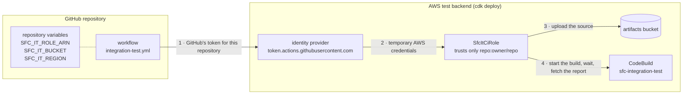
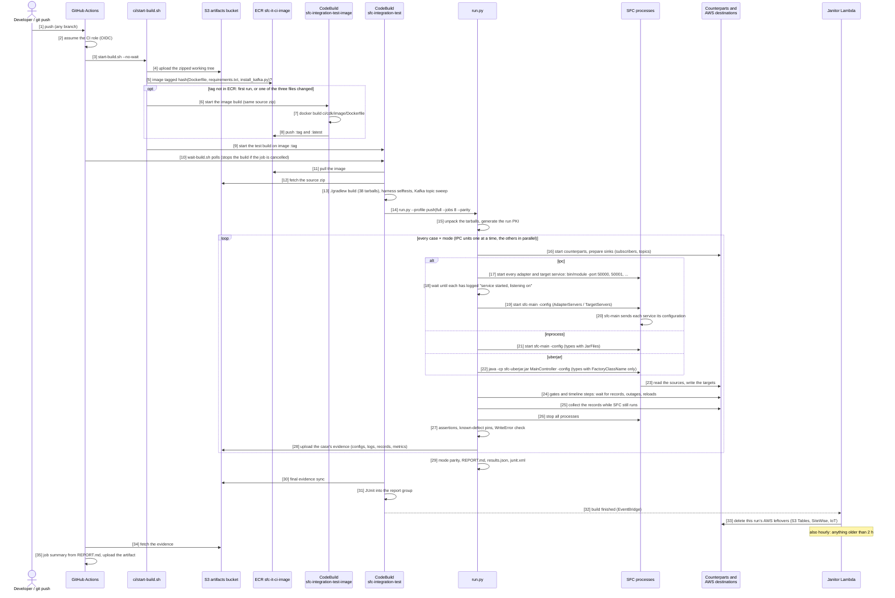

# SFC CI: integration tests in AWS

On every push, GitHub Actions starts a build in AWS CodeBuild. The build compiles SFC and runs the
end-to-end suite: about 300 test cases, each in up to three SFC deployment modes (in-process, IPC and
uberjar). A case does four things:
1. starts real SFC processes and feeds them data;
2. lets them write to real AWS services or to local test servers;
3. reads back what arrived;
4. checks it.

The result is a report in the GitHub run summary.

## 1. What it is

| Part | Where | What it does |
|---|---|---|
| AWS Test Backend | `ci/cdk` | One CDK stack: the CodeBuild project, a destination for every SFC AWS target except SiteWise Edge, test fixtures, a cleanup Lambda, and the role GitHub uses |
| GitHub workflow | `.github/workflows/integration-test.yml` | Starts the build on every push and posts the report |
| The suite | `ci/e2e` | The harness (`run.py`) and the test cases (`cases/<group>/<area>.json`). How to write tests: [ci/e2e/README.md](e2e/README.md) |
| Build scripts | `ci/start-build.sh`, `ci/wait-build.sh` | Package the source and start a build; follow a build |

A case checks:
- that every record arrives exactly once and decodes correctly;
- the target's options (batching, compression, templates and so on);
- SFC's own metrics and logs;
- that SFC behaves the same in all three deployment modes.

When SFC itself is wrong, the case records it as a **known defect**. It asserts today's behaviour, so
the suite stays green, and it reports the day the bug is fixed.

## 2. Deploy

You do this once per AWS account. After that, every push runs the tests by itself.

### 2.1 Deploy the AWS Test Backend

You need:
- an AWS account used only for testing, and credentials for it;
- Node.js;
- the GitHub name `<owner>/<repo>` of your repository.

```shell
cd ci/cdk
npm ci
npx cdk bootstrap                                                   # only the first time CDK is used in this account and region
npx cdk deploy -c githubRepo=<owner>/<repo> --outputs-file outputs.json
```

- **`-c githubRepo`** names the GitHub repository that may start builds. Leave it out for
  `awslabs/industrial-shopfloor-connect`.
- **The first deploy takes up to an hour**, because of MSK (see below).
- **At the end the deploy prints its outputs.** You need two of them in 2.2: `CiRoleArn` and
  `ArtifactsBucket`.

**What gets deployed:**

| Group | Resources |
|---|---|
| Destinations | S3 prefixes `s3-target/`, `firehose/`, `lambda-evidence/`; SNS topic with a raw-delivery queue; IoT rule `sfc/it/#` into a queue, plus an error queue; Kinesis stream (1 shard); Firehose (0 s buffering); the evidence Lambda; MSK Provisioned (2 × kafka.m5.large, IAM auth, public access on 9198) |
| Created per case run, by the sinks | SQS queue `sfc-it-<marker>`; MSK topic `sfc_it_<utc>_<marker>`; the S3 Tables namespaces and buckets and SiteWise models and assets that AutoCreate and AssetCreation cases name with the marker |
| Fixtures | S3 Tables bucket `sfc-it-fixture-<acct>` with namespace `sfc_it` and tables `sim_a`, `sim_b`; a SiteWise model and two assets with aliases `/sfc-it/fixture/a{1,2}/<prop>`; a secret; an IoT role alias and device policy |
| Build | `sfc-integration-test` (LARGE, 50 min, 4 concurrent builds, no VPC); `sfc-integration-test-image` (builds the image); ECR `sfc-it-ci-image`; a report group. The VPC holds only the MSK brokers. |
| Access | SFC runs as the project role, which holds every target's permissions. `SfcItCiRole` is for GitHub: upload the source, start, stop and inspect builds, read the evidence. |
| Teardown | The janitor Lambda, run on every finished build and hourly |


### 2.2 Connect GitHub

GitHub needs no AWS keys. On every push, the workflow does two things:
1. It shows AWS a token that GitHub signed for your repository, and receives temporary credentials for
   the role `SfcItCiRole`, which trusts only that repository.
2. It uses three repository variables to know which role, bucket and region to use.



1. **Push the workflow file** `.github/workflows/integration-test.yml`. It is in this repository.
2. **Set the three repository variables.** Use GitHub, under Settings → Secrets and variables → Actions
   → Variables. Or use the GitHub CLI: run `gh auth login` first, with admin rights on the repository.

   ```shell
   gh variable set SFC_IT_ROLE_ARN --repo <owner>/<repo> --body "<CiRoleArn>"
   gh variable set SFC_IT_BUCKET   --repo <owner>/<repo> --body "<ArtifactsBucket>"
   gh variable set SFC_IT_REGION   --repo <owner>/<repo> --body "<region of the stack, e.g. eu-central-1>"
   ```

3. **Push any branch.** A run starts in the repository's Actions tab. Its "Start the build" step shows
   `build: sfc-integration-test:<id>`.


## 3. How a run works

| Trigger | Profile | Runs |
|---|---|---|
| push to any branch | `push` | P0 and P1 cases |
| push to `main`, nightly at 02:17 UTC, *Run workflow* | `full` | all cases |

A new push to the same branch cancels the previous run and stops its build.



**The steps:**
- **[1]–[12]:** GitHub packages the source and makes sure the build image exists in ECR. The image is
  built in AWS on the first run. Then GitHub starts the build.
- **[13]:** The build compiles SFC (38 tarballs). It then runs the harness's own tests, including a check
  that every case's configuration follows SFC's deployment rules.
- **[16]–[28]** repeat for every case and mode:
  1. start the test servers and readers;
  2. start SFC in the case's mode;
  3. let data flow;
  4. read back;
  5. stop SFC;
  6. check;
  7. upload the evidence.
- **[32]–[35]:** A cleanup Lambda removes what the run created in AWS, and GitHub posts the report.

**Worth knowing:**
- **Two kinds of case run one at a time:**
  - IPC cases, because they use fixed ports (50000 and up);
  - IoT Core cases, because they share one read-back queue.

  Everything else runs in parallel.
- **IPC start-up:** the adapter and target services start first. sfc-main starts once each has reported
  that it listens.
- **Collection:** results are read while SFC is still running, because SFC does not flush buffered data
  when it stops.

## 4. Results

- **Where:**
  - the GitHub run summary (REPORT.md) and the run's artifact;
  - all evidence in `s3://<ArtifactsBucket>/evidence/<build-id>/`;
  - JUnit results in the CodeBuild report group.
- **Verdicts:** ✅ pass · ❌ fail (a check did not hold) · 💥 error (the case could not run, for example
  a timeout) · — skipped (with the reason).
- **A failure** shows each failed check with its expected and actual values. To dig deeper, open
  `cases/<ID>.<mode>/` in the evidence:

  | Path | What it holds |
  |---|---|
  | `config.json` | the exact configuration SFC ran |
  | `logs/` | every process's output; SFC writes errors to stderr |
  | `collected/<sink>.jsonl` | what was read back |
  | `metrics.jsonl` | SFC's own metrics |
  | `services/` | the test servers' logs |

- **Known defects** have their own table. If one starts failing, the bug was probably fixed: move the
  case's expected behaviour from `assertCorrect` into `assert`.

## 5. Coverage

| Group | Cases | Tier | Modes ip / ipc / uj | Covers | Counterparts, destinations | Known defects pinned | Case IDs |
|---|---:|---|---|---|---|---:|---|
| `core/simulator` | 11 | core | 10 / 9 / 10 | counters, data types, composites, intervals, clamping, invalid configs | file | 5 | `CORE-SIM-CLAMP-01` `CORE-SIM-COMPOSITES-01` `CORE-SIM-COUNTER-01` `CORE-SIM-COUNTER-VARIANTS-01` `CORE-SIM-DATATYPES-01` `CORE-SIM-DATATYPES-02` `CORE-SIM-DATATYPES-03` `CORE-SIM-DATETIME-01` `CORE-SIM-INTERVAL-BUFFERED-01` `CORE-SIM-INVALID-01` `CORE-SIM-WALLCLOCK-01` |
| `core/transformations` | 22 | core | 20 / 18 / 20 | every operator, chains, typing, nulls, arrays, non-finite results | file | 10 | `CORE-XFRM-ARRAY-01` `CORE-XFRM-CHAIN-01` `CORE-XFRM-ISOPARSE-01` `CORE-XFRM-LISTOF-01` `CORE-XFRM-LISTOF-IPC-01` `CORE-XFRM-LOG10-01` `CORE-XFRM-LOG2-01` `CORE-XFRM-NONFINITE-01` `CORE-XFRM-NULL-01` `CORE-XFRM-OPS-ARITH-01` `CORE-XFRM-OPS-BITS-01` `CORE-XFRM-OPS-BYTES-01` `CORE-XFRM-OPS-CONVERT-01` `CORE-XFRM-OPS-LIST-01` `CORE-XFRM-OPS-MATH-01` `CORE-XFRM-OPS-STRING-01` `CORE-XFRM-SCALING-01` `CORE-XFRM-TRUNCAT-01` `CORE-XFRM-TYPES-01` `CORE-XFRM-UNSIGNED-01` `CORE-XFRM-UNSIGNED-IPC-01` `CORE-XFRM-VALIDATION-01` |
| `core/filters` | 11 | core | 11 / 11 / 11 | change, value and condition filters, precedence, fail-open validation | file | 6 | `CORE-FILT-CHG-ABS-01` `CORE-FILT-CHG-ALWAYS-01` `CORE-FILT-CHG-ATLEAST-01` `CORE-FILT-CHG-NEGCFG-01` `CORE-FILT-CHG-PCT-01` `CORE-FILT-COND-OPS-01` `CORE-FILT-COND-SIZE-PATH-01` `CORE-FILT-FAILOPEN-01` `CORE-FILT-ORDER-01` `CORE-FILT-VAL-OPS-01` `CORE-FILT-VAL-TYPES-01` |
| `core/aggregation` | 10 | core | 10 / 9 / 10 | all aggregation functions, output shape, wildcards, degenerate windows | file | 5 | `CORE-AGG-ARRAY-01` `CORE-AGG-FILTERED-01` `CORE-AGG-KEYS-01` `CORE-AGG-NUMERIC-01` `CORE-AGG-PRECEDENCE-01` `CORE-AGG-RAGGED-01` `CORE-AGG-SHAPE-01` `CORE-AGG-SIZE1-01` `CORE-AGG-WILDCARD-01` `CORE-AGG-XFORM-01` |
| `core/output`, `metadata`, `element-names`, `timestamps` | 11 | core | 9 / 7 / 9 | envelope and key order, metadata at every level, renamed elements, timestamp levels | file | 6 | `CORE-OUT-ENVELOPE-01` `CORE-OUT-NULLS-01` `CORE-OUT-SERIAL-01` `CORE-OUT-UNQUOTE-01` `CORE-META-LEVELS-01` `CORE-ENAMES-COLLISION-01` `CORE-ENAMES-RENAME-01` `CORE-ENAMES-RENAME-02` `CORE-TS-ADJUST-01` `CORE-TS-ADJUST-02` `CORE-TS-LEVELS-01` |
| `core/schedules`, `pipeline`, `restructure` | 9 | core | 9 / 8 / 9 | multiple schedules and sources, error containment, decompose / spread | file | 6 | `CORE-SCHED-CHANNELS-01` `CORE-SCHED-IDLE-01` `CORE-SCHED-MULTI-01` `CORE-SCHED-SILENT-01` `CORE-SCHED-SOURCES-01` `CORE-PIPE-TRACE-01` `CORE-PIPE-WEDGE-01` `CORE-RESTRUCT-01` `CORE-RESTRUCT-02` |
| `core/config-validation`, `config` | 15 | core | 15 / 14 / 15 | invalid configurations rejected at startup, with the exact message | — | 1 | `CORE-CFG-NEG-AGG-01` `CORE-CFG-NEG-AGG-WILDCARD-01` `CORE-CFG-NEG-AWSVERSION-01` `CORE-CFG-NEG-CHANNEL-ID-01` `CORE-CFG-NEG-DUP-NAMES-01` `CORE-CFG-NEG-FILTER-OP-01` `CORE-CFG-NEG-FILTER-REF-01` `CORE-CFG-NEG-LOOP-01` `CORE-CFG-NEG-LOOP-DIAMOND-01` `CORE-CFG-NEG-NO-ACTIVE-01` `CORE-CFG-NEG-SCHED-CHANNEL-01` `CORE-CFG-NEG-TEMPLATE-01` `CORE-CFG-NEG-XFRM-ID-01` `CORE-CFG-NEG-XFRM-OP-01` `CORE-CFG-PLACEHOLDER-NEG-01` |
| `crosscutting/cli` | 18 | core | 17 / 7 / 17 | command line: options, order, log levels, colour, help, exit codes | — | 6 | `CORE-CFG-TYPE-NEG-01` `CORE-CFG-VALIDATE-NEG-01` `CORE-CFG-VALIDATE-NEG-02` `CORE-CLI-ARGORDER-01` `CORE-CLI-HELP-01` `CORE-CLI-HELP-02` `CORE-CLI-LOGFLAG-CONFLICT-01` `CORE-CLI-LOGLEVEL-01` `CORE-CLI-LOGLEVEL-02` `CORE-CLI-MISSINGARG-01` `CORE-CLI-MISSINGFILE-01` `CORE-CLI-NOCOLOR-01` `CORE-CLI-NOCOLOR-02` `CORE-CLI-NOCOLOR-03` `CORE-CLI-NOCONFIG-01` `CORE-CLI-TRACE-01` `CORE-CLI-TRACE-02` `CORE-CLI-UNKNOWNOPT-01` |
| `crosscutting/config-env`, `-include`, `-templates`, `-reload` | 24 | core | 19 / 19 / 22 | placeholders, `@include` / `@file`, templates, live reload | file | 12 | `CORE-CFG-DISABLED-CHANNEL-01` `CORE-CFG-ENV-01` `CORE-CFG-ENV-ESCAPE-01` `CORE-CFG-ENVCONFIG-01` `CORE-CFG-FILE-SELECT-01` `CORE-CFG-FILE-SELECT-02` `CORE-CFG-INCLUDE-01` `CORE-CFG-INCLUDE-COMPACT-01` `CORE-CFG-INCLUDE-CWD-01` `CORE-CFG-INCLUDE-CYCLE-01` `CORE-CFG-INCLUDE-CYCLE-02` `CORE-CFG-INCLUDE-ENV-01` `CORE-CFG-INCLUDE-INTERVAL-01` `CORE-CFG-INCLUDE-MISSING-01` `CORE-CFG-TPL-01` `CORE-CFG-TPL-MISSING-01` `CORE-CFG-TPL-MISSING-02` `CORE-CFG-TPL-NUMPARTIAL-01` `CORE-CFG-TPL-RECURSIVE-01` `CORE-CFG-RELOAD-01` `CORE-CFG-RELOAD-02` `CORE-CFG-RELOAD-03` `CORE-CFG-RELOAD-04` `CORE-CFG-RELOAD-INCLUDE-01` |
| `crosscutting/ipc`, `ipc-tls` | 15 | core | — / 15 / — | IPC startup; PlainText, ServerSideTLS and MutualTLS between sfc-main and the services | file, TLS probe | 8 | `CORE-IPC-STARTUP-01` `CORE-IPC-SVC-CLI-01` `CORE-IPC-SVC-CONFIG-01` `CORE-IPC-SVC-CONFIG-02` `CORE-IPC-TLS-CERTEXPIRY-01` `CORE-IPC-TLS-FAILOPEN-01` `CORE-IPC-TLS-MISMATCH-01` `CORE-IPC-TLS-MISMATCH-02` `CORE-IPC-TLS-MTLS-01` `CORE-IPC-TLS-MTLS-NOCLIENTCERT-01` `CORE-IPC-TLS-PLAIN-01` `CORE-IPC-TLS-SST-01` `CORE-IPC-TLS-SST-TOFU-01` `CORE-IPC-TLS-TARGET-01` `CORE-IPC-TLS-WRONGCA-01` |
| `crosscutting/secrets` | 1 | local-infra | 1 / 1 / 1 | Secrets Manager placeholders, encrypted store, log blanking | local Secrets Manager stand-in | 1 | `LOC-SEC-SM-01` |
| `adapters/opcua` | 24 | local-infra | 22 / 21 / 22 | polling, subscriptions, events, data types, namespaces, deadbands, reconnects | asyncua server, SFC OPC-UA target | 8 | `ADP-OPCUA-BADNODE-01` `ADP-OPCUA-DEADBAND-ABS-01` `ADP-OPCUA-DEADBAND-PCT-01` `ADP-OPCUA-DOWN-01` `ADP-OPCUA-DTYPES-01` `ADP-OPCUA-DTYPES-02` `ADP-OPCUA-DTYPES-03` `ADP-OPCUA-DTYPES-UNSIGNED-01` `ADP-OPCUA-EVENTS-01` `ADP-OPCUA-LATESERVER-01` `ADP-OPCUA-NS-01` `ADP-OPCUA-PILOT` `ADP-OPCUA-POLL-INDEXRANGE-01` `ADP-OPCUA-POLL-INDEXRANGE-02` `ADP-OPCUA-POLL-STD-01` `ADP-OPCUA-POLL-STRUCT-01` `ADP-OPCUA-RECONNECT-SUB-01` `ADP-OPCUA-RT-AUTOCREATE-01` `ADP-OPCUA-RT-POLL-01` `ADP-OPCUA-RT-SUB-01` `ADP-OPCUA-SELECTOR-INVALID-01` `ADP-OPCUA-SUB-CURTIME-01` `ADP-OPCUA-TS-PROPAGATION-01` `ADP-OPCUA-TS-PROPAGATION-IPC-01` |
| `adapters/mqtt` | 21 | local-infra | 18 / 18 / 18 | read modes, retained messages, wildcards, raw / JSON, broker outage, auth | mosquitto, tcpgate, publisher | 11 | `ADP-MQTT-AUTH-01` `ADP-MQTT-CONNMETRIC-01` `ADP-MQTT-DOWN-01` `ADP-MQTT-EXPLICITCHANNELS-01` `ADP-MQTT-INVALIDJSON-01` `ADP-MQTT-KEEPLAST-IPC-01` `ADP-MQTT-KEEPLAST-NESTED-01` `ADP-MQTT-MULTIADAPTER-01` `ADP-MQTT-MULTIADAPTER-02` `ADP-MQTT-RAW-01` `ADP-MQTT-RESTART-01` `ADP-MQTT-RETAINED-01` `ADP-MQTT-RETAINED-02` `ADP-MQTT-RT-KEEPALL-01` `ADP-MQTT-RT-KEEPALL-02` `ADP-MQTT-RT-KEEPALL-03` `ADP-MQTT-SELECTOR-INVALID-01` `ADP-MQTT-TOPICMAP-UNMAPPED-01` `ADP-MQTT-UTF8-01` `ADP-MQTT-WILDCARD-01` `ADP-MQTT-XFORM-FILTER-01` |
| `adapters/cross-adapter` | 3 | local-infra | 2 / 3 / 2 | read errors, isolation between adapters | dead / silent peers | 2 | `ADP-XCUT-IPC-NULLMAP-01` `ADP-XCUT-ISOLATION-01` `ADP-XCUT-READERROR-NOTLOGGED-01` |
| `targets/file`, `debug` | 28 | core | 26 / 26 / 26 | framing, compression, templates, formatters, buffering, write errors | file, debug output | 12 | `TGT-FILE-BATCH-JSON-01` `TGT-FILE-BUFFERSIZE-01` `TGT-FILE-COMPRESS-EDGE-01` `TGT-FILE-DIR-01` `TGT-FILE-ELEMNAMES-01` `TGT-FILE-ELEMNAMES-IPC-01` `TGT-FILE-FMT-01` `TGT-FILE-FMT-NEG-01` `TGT-FILE-FMT-NONASCII-01` `TGT-FILE-FMT-TPL-EXCL-NEG-01` `TGT-FILE-GZIP-01` `TGT-FILE-JSON-FALSE-BATCH-01` `TGT-FILE-JSONL-01` `TGT-FILE-NONASCII-01` `TGT-FILE-PATH-EXT-01` `TGT-FILE-SHUTDOWN-FLUSH-IPC-01` `TGT-FILE-SHUTDOWN-LOSS-01` `TGT-FILE-TPL-01` `TGT-FILE-TPL-BROKEN-01` `TGT-FILE-TPL-EPOCH-01` `TGT-FILE-TPL-MISSING-NEG-01` `TGT-FILE-TPL-TOOLS-01` `TGT-FILE-UNQUOTE-01` `TGT-FILE-VAL-DEAD-01` `TGT-FILE-WRITEERROR-METRIC-01` `TGT-FILE-ZIP-01` `TGT-FILE-ZIP-NOJSON-01` `TGT-DEBUG-PILOT` |
| `targets/mqtt`, `nats`, `opcua` | 3 | local-infra | 3 / 3 / 3 | delivery to a broker or an OPC-UA server, read back independently | mosquitto, nats-server, OPC-UA client | 0 | `TGT-MQTT-PILOT` `TGT-NATS-PILOT` `TGT-OPCUA-READ-TYPES-01` |
| `targets/store-forward`, `chaining` | 16 | core, local-infra | 12 / 15 / 12 | buffering through outages, resubmission, retention, restarts, chains | mosquitto, tcpgate, AWS wire stub | 10 | `CHAIN-SF-MIDRUN-OUTAGE-01` `CHAIN-SF-MIDRUN-OUTAGE-02` `CHAIN-SF-PASSTHRU-01` `CHAIN-SF-PASSTHRU-02` `CHAIN-SF-RECOVER-MQTT-01` `CHAIN-SF-RECOVER-MQTT-02` `CHAIN-SF-RECOVER-MQTT-03` `CHAIN-SF-RESTART-REPLAY-01` `CHAIN-SF-RESTART-REPLAY-02` `CHAIN-SF-RESTART-REPLAY-IPC-01` `CHAIN-SF-VAL-DIR-01` `CHAIN-SF-VAL-NONE-01` `CHAIN-SF-VAL-ONE-01` `CHAIN-SF-VAL-TWO-01` `CHAIN-SF-LOOP-NEG-01` `CHAIN-SF-LOOP-NEG-02` |
| `targets/aws-common`, `aws-sqs` | 5 | core, local-infra | 5 / 5 / 5 | AWS target validation; SQS retry and partial failure on the wire | AWS wire stub (no AWS access) | 1 | `CORE-AWSTGT-VAL-NAMES-REQUIRED-01` `CORE-AWSTGT-VAL-NAMES-REQUIRED-02` `CORE-AWSTGT-VAL-RANGES-01` `CORE-AWSTGT-VAL-REGION-01` `LOC-AWSTGT-SQS-COMPRESSION-WRAPPER-01` |
| `aws/s3` | 6 | aws | 6 / 6 / 6 | the S3 target: one object per record, GZip/Zip, size buffering, the Interval timer and array framing, object keys, a denied write | S3 (the run's own prefix) | 1 | `AWS-S3-01` `AWS-S3-02` `AWS-S3-03` `AWS-S3-04` `AWS-S3-05` `AWS-S3-NEG-01` |
| `aws/s3tables` | 6 | aws | 5 / 5 / 6 | S3 Tables: the fixture tables, two tables in one target, AutoCreate of namespace, tables and bucket, a missing table, a schema mismatch | S3 Tables (fixture tables, per-run namespaces and buckets) | 5 | `AWS-S3T-01` `AWS-S3T-02` `AWS-S3T-03` `AWS-S3T-04` `AWS-S3T-NEG-01` `AWS-S3T-NEG-02` |
| `aws/sitewise` | 6 | aws | 6 / 6 / 6 | SiteWise: alias writes to the fixture assets, AssetCreation, batching, data-type and error-counting defects | SiteWise (two fixture assets, per-run models) | 4 | `AWS-SW-01` `AWS-SW-02` `AWS-SW-03` `AWS-SW-DEF-01` `AWS-SW-DEF-02` `AWS-SW-DEF-03` |
| `aws/sns` | 5 | aws | 5 / 5 / 5 | SNS: per record, batching and Interval, GZip/Zip, the size limit | SNS topic and its subscribed queue | 2 | `AWS-SNS-01` `AWS-SNS-02` `AWS-SNS-03` `AWS-SNS-NEG-01` `AWS-SNS-DEF-01` |
| `aws/iot` | 5 | aws | 5 / 5 / 5 | IoT Core: publish through the rule, Retain, topic templates, batching with compression, oversize payloads | IoT rule into a queue, retained messages | 1 | `AWS-IOT-01` `AWS-IOT-02` `AWS-IOT-03` `AWS-IOT-04` `AWS-IOT-DEF-01` |
| `aws/kinesis` | 5 | aws | 5 / 5 / 5 | Kinesis: per record, batching and Interval, GZip/Zip, a batch with an empty payload | Kinesis stream (1 shard) | 2 | `AWS-KIN-01` `AWS-KIN-02` `AWS-KIN-03` `AWS-KIN-DEF-01` `AWS-KIN-DEF-02` |
| `aws/firehose` | 4 | aws | 4 / 4 / 4 | Firehose: per record, batching, templates, an oversize record in a batch | Firehose into S3 | 2 | `AWS-FH-01` `AWS-FH-02` `AWS-FH-03` `AWS-FH-NEG-01` |
| `aws/lambda` | 4 | aws | 4 / 4 / 4 | Lambda: per invocation, batching and Interval, GZip/Zip, an invalid function name | evidence function, read back from S3 | 1 | `AWS-LAM-01` `AWS-LAM-02` `AWS-LAM-03` `AWS-LAM-DEF-01` |
| `aws/msk` | 6 | aws | 1 / 5 / 5 | MSK over IAM: JSON, acks all + gzip + key, protobuf, Interval unset, doubled metrics, in-process class loading | MSK Provisioned (a topic per case run) | 3 | `AWS-MSK-01` `AWS-MSK-02` `AWS-MSK-03` `AWS-MSK-DEF-01` `AWS-MSK-DEF-02` `AWS-MSK-CL-01` |
| `aws/sqs` | 4 | aws | 4 / 4 / 4 | the SQS target against the real queue: per record, batching, compression, size limit | SQS (a queue per case run) | 1 | `AWS-SQS-01` `AWS-SQS-02` `AWS-SQS-03` `AWS-SQS-NEG-01` |

**Not covered here.** The report lists these with their reasons (`ci/e2e/untestable.json`).

| What | Why |
|---|---|
| SiteWise Edge | out of scope |
| J1939/CAN | needs vcan and `CAP_NET_ADMIN` |
| PCCC, ADS, SLMP | no maintained emulators |
| SQL Server, Oracle | Docker only (driver loading is still covered) |
| Greengrass-only paths, cross-host IPC, Windows | not available in CodeBuild |
