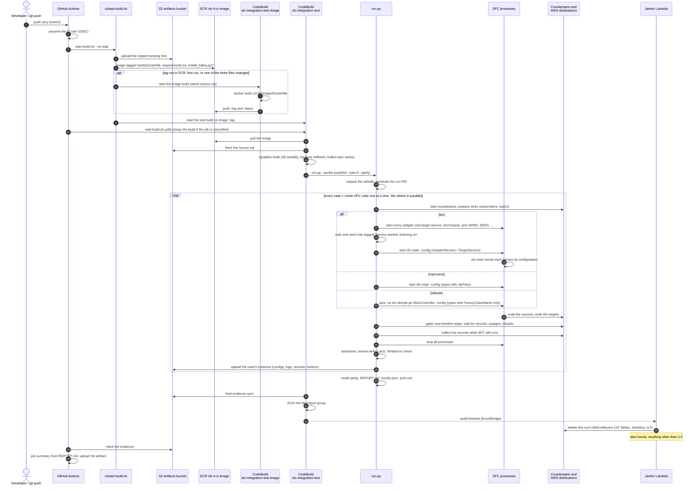

# SFC integration tests

Every push to every branch builds the pushed tree in CodeBuild and runs the end-to-end suite against it.
The suite starts the **real SFC processes** in all three deployment modes (in-process, IPC, uberjar). It
writes to real AWS destinations and to local counterparts (MQTT and NATS brokers, an OPC-UA server, and
others), then asserts on what arrived. The result is a markdown report in the GitHub job summary.

```
ci/
├── README.md         this file
├── start-build.sh    zip the working tree → S3 → start the CodeBuild build (uncommitted changes included)
├── wait-build.sh     poll a build; stops it on Ctrl-C / job cancellation
├── cdk/              the stack: CodeBuild project, every target's destination, fixtures, janitor, CI role
├── e2e/              the suite: run.py, lib/ (harness), cases/<group>/<area>.json, counterparts/, selftest/
└── e2e-support/      :ci:e2e-support - E2eMetricsWriter and E2eLineFormatter (a plain jar, no tarball)
```

## 1. Deploy the stack (once per account)

Use a dedicated sandbox account. The stack creates destinations that every build writes to.

```shell
cd ci/cdk
npm ci
export AWS_REGION=us-east-1            # or: npx cdk ... --profile <name> with a region in that profile
npx cdk bootstrap                      # first CDK use in this account/region only
npx cdk deploy --outputs-file outputs.json
```

- The CI role's OIDC trust is scoped to `awslabs/industrial-shopfloor-connect`, on any branch. For a
  fork, override with `-c githubRepo=<owner>/<repo>`.
- If the account already has the GitHub OIDC provider, also pass
  `-c oidcProviderArn=arn:aws:iam::<acct>:oidc-provider/token.actions.githubusercontent.com`.
- `outputs.json` holds the stack outputs used below. It is git-ignored.

Then set three repository variables from the outputs, for example with `gh variable set`:

| Variable | Value |
|---|---|
| `SFC_IT_ROLE_ARN` | output `CiRoleArn` |
| `SFC_IT_BUCKET` | output `ArtifactsBucket` |
| `SFC_IT_REGION` | the stack's region |

Without them the workflow writes "not configured" and does nothing, so forks stay quiet.

**What the stack holds.**

| Group | Resources |
|---|---|
| Destinations | S3 prefix, per-run SQS queues (created by the sink), SNS topic plus its subscribed queue, IoT rule into a queue, Kinesis stream (1 shard), Firehose (0 s buffering), evidence Lambda, MSK Provisioned (2 × kafka.m5.large, IAM auth, public access on 9198 - the endpoint SFC's MSK target uses from outside AWS) |
| Fixtures | S3 Tables bucket `sfc-it-fixture-<acct>` with namespace `sfc_it` and tables `sim_a`, `sim_b`; one SiteWise model and two assets with aliases `/sfc-it/fixture/a{1,2}/<prop>`; a secret; an IoT role alias |
| Build | CodeBuild project (LARGE, no VPC), report group. The VPC holds only the MSK brokers, in two public subnets, no NAT. |
| Teardown | the janitor Lambda, run on every finished build and hourly |
| Access | the CI role GitHub assumes: upload source, start/stop/inspect this project, read evidence |

**Cost.** About $330 a month standing, almost all of it the two MSK brokers (~$310). A push run costs about $0.50.

**MSK public access.** AWS does not allow public access while a cluster is being created, so the stack creates the cluster and a
custom resource turns public access on afterwards: the first deploy takes up to an hour. The listener is open to anywhere on 9198,
IAM-authenticated over TLS; restrict it with `-c mskIngressCidrs=<cidr>,<cidr>`.

## 2. Run in CodeBuild

**Push a branch.** The workflow does the rest:

- profile `push` (P0+P1 cases) on every branch;
- profile `full` on `main`, nightly, and from *Run workflow*;
- a new push cancels the previous run of the same branch, and its build is stopped.

**From your machine.** This needs AWS credentials for the stack's account; nothing else is needed.

```shell
ci/start-build.sh --bucket <ArtifactsBucket>                    # push profile, wait, exit with the verdict
ci/start-build.sh --bucket <ArtifactsBucket> --profile full
ci/start-build.sh --bucket <ArtifactsBucket> --tiers core --modes uberjar --no-wait
```

The working tree is zipped as it is on disk, with uncommitted changes and with `.git`, because the
version comes from `git describe`. `build/` and `node_modules` are left out. No git command is run.

**The full sequence.**



**What runs in the loop (steps 16–28).** 298 cases in 43 files, one file per group, about 774
case × mode units per full run. Every case does steps 16, 23–28, plus 21 (in-process), 22 (uberjar) or
17–20 (IPC) for each mode it has a configuration for. The rule check over all configurations, and the
harness selftests, run before the suite in step 13. AWS leftovers are removed in step 33.

| Group | Cases | Tier | Modes ip / ipc / uj | Covers | Counterparts, destinations (16, 23) | Known defects pinned | Case IDs |
|---|---:|---|---|---|---|---:|---|
| `core/simulator` | 11 | core | 10 / 9 / 10 | counters, data types, composites, intervals, clamping, invalid configs | file | 5 | `CORE-SIM-CLAMP-01` `CORE-SIM-COMPOSITES-01` `CORE-SIM-COUNTER-01` `CORE-SIM-COUNTER-VARIANTS-01` `CORE-SIM-DATATYPES-01` `CORE-SIM-DATATYPES-02` `CORE-SIM-DATATYPES-03` `CORE-SIM-DATETIME-01` `CORE-SIM-INTERVAL-BUFFERED-01` `CORE-SIM-INVALID-01` `CORE-SIM-WALLCLOCK-01` |
| `core/transformations` | 22 | core | 20 / 18 / 20 | every operator, chains, typing, nulls, arrays, non-finite results | file | 10 | `CORE-XFRM-ARRAY-01` `CORE-XFRM-CHAIN-01` `CORE-XFRM-ISOPARSE-01` `CORE-XFRM-LISTOF-01` `CORE-XFRM-LISTOF-IPC-01` `CORE-XFRM-LOG10-01` `CORE-XFRM-LOG2-01` `CORE-XFRM-NONFINITE-01` `CORE-XFRM-NULL-01` `CORE-XFRM-OPS-ARITH-01` `CORE-XFRM-OPS-BITS-01` `CORE-XFRM-OPS-BYTES-01` `CORE-XFRM-OPS-CONVERT-01` `CORE-XFRM-OPS-LIST-01` `CORE-XFRM-OPS-MATH-01` `CORE-XFRM-OPS-STRING-01` `CORE-XFRM-SCALING-01` `CORE-XFRM-TRUNCAT-01` `CORE-XFRM-TYPES-01` `CORE-XFRM-UNSIGNED-01` `CORE-XFRM-UNSIGNED-IPC-01` `CORE-XFRM-VALIDATION-01` |
| `core/filters` | 11 | core | 11 / 11 / 11 | change, value and condition filters, precedence, fail-open validation | file | 6 | `CORE-FILT-CHG-ABS-01` `CORE-FILT-CHG-ALWAYS-01` `CORE-FILT-CHG-ATLEAST-01` `CORE-FILT-CHG-NEGCFG-01` `CORE-FILT-CHG-PCT-01` `CORE-FILT-COND-OPS-01` `CORE-FILT-COND-SIZE-PATH-01` `CORE-FILT-FAILOPEN-01` `CORE-FILT-ORDER-01` `CORE-FILT-VAL-OPS-01` `CORE-FILT-VAL-TYPES-01` |
| `core/aggregation` | 10 | core | 10 / 9 / 10 | all aggregation functions, output shape, wildcards, degenerate windows | file | 5 | `CORE-AGG-ARRAY-01` `CORE-AGG-FILTERED-01` `CORE-AGG-KEYS-01` `CORE-AGG-NUMERIC-01` `CORE-AGG-PRECEDENCE-01` `CORE-AGG-RAGGED-01` `CORE-AGG-SHAPE-01` `CORE-AGG-SIZE1-01` `CORE-AGG-WILDCARD-01` `CORE-AGG-XFORM-01` |
| `core/output`, `metadata`, `element-names`, `timestamps` | 11 | core | 9 / 7 / 9 | envelope and key order, metadata at every level, renamed elements, timestamp levels | file | 6 | `CORE-OUT-ENVELOPE-01` `CORE-OUT-NULLS-01` `CORE-OUT-SERIAL-01` `CORE-OUT-UNQUOTE-01` `CORE-META-LEVELS-01` `CORE-ENAMES-COLLISION-01` `CORE-ENAMES-RENAME-01` `CORE-ENAMES-RENAME-02` `CORE-TS-ADJUST-01` `CORE-TS-ADJUST-02` `CORE-TS-LEVELS-01` |
| `core/schedules`, `pipeline`, `restructure` | 9 | core | 9 / 8 / 9 | multiple schedules and sources, error containment, decompose / spread | file | 6 | `CORE-SCHED-CHANNELS-01` `CORE-SCHED-IDLE-01` `CORE-SCHED-MULTI-01` `CORE-SCHED-SILENT-01` `CORE-SCHED-SOURCES-01` `CORE-PIPE-TRACE-01` `CORE-PIPE-WEDGE-01` `CORE-RESTRUCT-01` `CORE-RESTRUCT-02` |
| `core/config-validation`, `config` | 15 | core | 15 / 14 / 15 | invalid configurations rejected at startup, with the exact message | — | 1 | `CORE-CFG-NEG-AGG-01` `CORE-CFG-NEG-AGG-WILDCARD-01` `CORE-CFG-NEG-AWSVERSION-01` `CORE-CFG-NEG-CHANNEL-ID-01` `CORE-CFG-NEG-DUP-NAMES-01` `CORE-CFG-NEG-FILTER-OP-01` `CORE-CFG-NEG-FILTER-REF-01` `CORE-CFG-NEG-LOOP-01` `CORE-CFG-NEG-LOOP-DIAMOND-01` `CORE-CFG-NEG-NO-ACTIVE-01` `CORE-CFG-NEG-SCHED-CHANNEL-01` `CORE-CFG-NEG-TEMPLATE-01` `CORE-CFG-NEG-XFRM-ID-01` `CORE-CFG-NEG-XFRM-OP-01` `CORE-CFG-PLACEHOLDER-NEG-01` |
| `crosscutting/cli` | 18 | core | 17 / 7 / 17 | command line: options, order, log levels, colour, help, exit codes | — | 6 | `CORE-CFG-TYPE-NEG-01` `CORE-CFG-VALIDATE-NEG-01` `CORE-CFG-VALIDATE-NEG-02` `CORE-CLI-ARGORDER-01` `CORE-CLI-HELP-01` `CORE-CLI-HELP-02` `CORE-CLI-LOGFLAG-CONFLICT-01` `CORE-CLI-LOGLEVEL-01` `CORE-CLI-LOGLEVEL-02` `CORE-CLI-MISSINGARG-01` `CORE-CLI-MISSINGFILE-01` `CORE-CLI-NOCOLOR-01` `CORE-CLI-NOCOLOR-02` `CORE-CLI-NOCOLOR-03` `CORE-CLI-NOCONFIG-01` `CORE-CLI-TRACE-01` `CORE-CLI-TRACE-02` `CORE-CLI-UNKNOWNOPT-01` |
| `crosscutting/config-env`, `-include`, `-templates`, `-reload` | 24 | core | 19 / 19 / 22 | placeholders, `@include` / `@file`, templates, live reload | file | 12 | `CORE-CFG-DISABLED-CHANNEL-01` `CORE-CFG-ENV-01` `CORE-CFG-ENV-ESCAPE-01` `CORE-CFG-ENVCONFIG-01` `CORE-CFG-FILE-SELECT-01` `CORE-CFG-FILE-SELECT-02` `CORE-CFG-INCLUDE-01` `CORE-CFG-INCLUDE-COMPACT-01` `CORE-CFG-INCLUDE-CWD-01` `CORE-CFG-INCLUDE-CYCLE-01` `CORE-CFG-INCLUDE-CYCLE-02` `CORE-CFG-INCLUDE-ENV-01` `CORE-CFG-INCLUDE-INTERVAL-01` `CORE-CFG-INCLUDE-MISSING-01` `CORE-CFG-TPL-01` `CORE-CFG-TPL-MISSING-01` `CORE-CFG-TPL-MISSING-02` `CORE-CFG-TPL-NUMPARTIAL-01` `CORE-CFG-TPL-RECURSIVE-01` `CORE-CFG-RELOAD-01` `CORE-CFG-RELOAD-02` `CORE-CFG-RELOAD-03` `CORE-CFG-RELOAD-04` `CORE-CFG-RELOAD-INCLUDE-01` |
| `crosscutting/ipc`, `ipc-tls` | 15 | core | — / 15 / — | IPC startup; PlainText, ServerSideTLS and MutualTLS between sfc-main and the services (17–20) | file, TLS probe | 8 | `CORE-IPC-STARTUP-01` `CORE-IPC-SVC-CLI-01` `CORE-IPC-SVC-CONFIG-01` `CORE-IPC-SVC-CONFIG-02` `CORE-IPC-TLS-CERTEXPIRY-01` `CORE-IPC-TLS-FAILOPEN-01` `CORE-IPC-TLS-MISMATCH-01` `CORE-IPC-TLS-MISMATCH-02` `CORE-IPC-TLS-MTLS-01` `CORE-IPC-TLS-MTLS-NOCLIENTCERT-01` `CORE-IPC-TLS-PLAIN-01` `CORE-IPC-TLS-SST-01` `CORE-IPC-TLS-SST-TOFU-01` `CORE-IPC-TLS-TARGET-01` `CORE-IPC-TLS-WRONGCA-01` |
| `crosscutting/secrets` | 1 | local-infra | 1 / 1 / 1 | Secrets Manager placeholders, encrypted store, log blanking | local Secrets Manager stand-in | 1 | `LOC-SEC-SM-01` |
| `adapters/opcua` | 24 | local-infra | 22 / 21 / 22 | polling, subscriptions, events, data types, namespaces, deadbands, reconnects | asyncua server, SFC OPC-UA target | 8 | `ADP-OPCUA-BADNODE-01` `ADP-OPCUA-DEADBAND-ABS-01` `ADP-OPCUA-DEADBAND-PCT-01` `ADP-OPCUA-DOWN-01` `ADP-OPCUA-DTYPES-01` `ADP-OPCUA-DTYPES-02` `ADP-OPCUA-DTYPES-03` `ADP-OPCUA-DTYPES-UNSIGNED-01` `ADP-OPCUA-EVENTS-01` `ADP-OPCUA-LATESERVER-01` `ADP-OPCUA-NS-01` `ADP-OPCUA-PILOT` `ADP-OPCUA-POLL-INDEXRANGE-01` `ADP-OPCUA-POLL-INDEXRANGE-02` `ADP-OPCUA-POLL-STD-01` `ADP-OPCUA-POLL-STRUCT-01` `ADP-OPCUA-RECONNECT-SUB-01` `ADP-OPCUA-RT-AUTOCREATE-01` `ADP-OPCUA-RT-POLL-01` `ADP-OPCUA-RT-SUB-01` `ADP-OPCUA-SELECTOR-INVALID-01` `ADP-OPCUA-SUB-CURTIME-01` `ADP-OPCUA-TS-PROPAGATION-01` `ADP-OPCUA-TS-PROPAGATION-IPC-01` |
| `adapters/mqtt` | 21 | local-infra | 18 / 18 / 18 | read modes, retained messages, wildcards, raw / JSON, broker outage, auth | mosquitto, tcpgate, publisher | 11 | `ADP-MQTT-AUTH-01` `ADP-MQTT-CONNMETRIC-01` `ADP-MQTT-DOWN-01` `ADP-MQTT-EXPLICITCHANNELS-01` `ADP-MQTT-INVALIDJSON-01` `ADP-MQTT-KEEPLAST-IPC-01` `ADP-MQTT-KEEPLAST-NESTED-01` `ADP-MQTT-MULTIADAPTER-01` `ADP-MQTT-MULTIADAPTER-02` `ADP-MQTT-RAW-01` `ADP-MQTT-RESTART-01` `ADP-MQTT-RETAINED-01` `ADP-MQTT-RETAINED-02` `ADP-MQTT-RT-KEEPALL-01` `ADP-MQTT-RT-KEEPALL-02` `ADP-MQTT-RT-KEEPALL-03` `ADP-MQTT-SELECTOR-INVALID-01` `ADP-MQTT-TOPICMAP-UNMAPPED-01` `ADP-MQTT-UTF8-01` `ADP-MQTT-WILDCARD-01` `ADP-MQTT-XFORM-FILTER-01` |
| `adapters/cross-adapter` | 3 | local-infra | 2 / 3 / 2 | read errors, isolation between adapters | dead / silent peers | 2 | `ADP-XCUT-IPC-NULLMAP-01` `ADP-XCUT-ISOLATION-01` `ADP-XCUT-READERROR-NOTLOGGED-01` |
| `targets/file`, `debug` | 28 | core | 26 / 26 / 26 | framing, compression, templates, formatters, buffering, write errors | file, debug output | 12 | `TGT-FILE-BATCH-JSON-01` `TGT-FILE-BUFFERSIZE-01` `TGT-FILE-COMPRESS-EDGE-01` `TGT-FILE-DIR-01` `TGT-FILE-ELEMNAMES-01` `TGT-FILE-ELEMNAMES-IPC-01` `TGT-FILE-FMT-01` `TGT-FILE-FMT-NEG-01` `TGT-FILE-FMT-NONASCII-01` `TGT-FILE-FMT-TPL-EXCL-NEG-01` `TGT-FILE-GZIP-01` `TGT-FILE-JSON-FALSE-BATCH-01` `TGT-FILE-JSONL-01` `TGT-FILE-NONASCII-01` `TGT-FILE-PATH-EXT-01` `TGT-FILE-SHUTDOWN-FLUSH-IPC-01` `TGT-FILE-SHUTDOWN-LOSS-01` `TGT-FILE-TPL-01` `TGT-FILE-TPL-BROKEN-01` `TGT-FILE-TPL-EPOCH-01` `TGT-FILE-TPL-MISSING-NEG-01` `TGT-FILE-TPL-TOOLS-01` `TGT-FILE-UNQUOTE-01` `TGT-FILE-VAL-DEAD-01` `TGT-FILE-WRITEERROR-METRIC-01` `TGT-FILE-ZIP-01` `TGT-FILE-ZIP-NOJSON-01` `TGT-DEBUG-PILOT` |
| `targets/mqtt`, `nats`, `opcua` | 3 | local-infra | 3 / 3 / 3 | delivery to a broker or an OPC-UA server, read back independently | mosquitto, nats-server, OPC-UA client | 0 | `TGT-MQTT-PILOT` `TGT-NATS-PILOT` `TGT-OPCUA-READ-TYPES-01` |
| `targets/store-forward`, `chaining` | 16 | core, local-infra | 12 / 15 / 12 | buffering through outages, resubmission, retention, restarts, chains | mosquitto, tcpgate, AWS wire stub | 10 | `CHAIN-SF-MIDRUN-OUTAGE-01` `CHAIN-SF-MIDRUN-OUTAGE-02` `CHAIN-SF-PASSTHRU-01` `CHAIN-SF-PASSTHRU-02` `CHAIN-SF-RECOVER-MQTT-01` `CHAIN-SF-RECOVER-MQTT-02` `CHAIN-SF-RECOVER-MQTT-03` `CHAIN-SF-RESTART-REPLAY-01` `CHAIN-SF-RESTART-REPLAY-02` `CHAIN-SF-RESTART-REPLAY-IPC-01` `CHAIN-SF-VAL-DIR-01` `CHAIN-SF-VAL-NONE-01` `CHAIN-SF-VAL-ONE-01` `CHAIN-SF-VAL-TWO-01` `CHAIN-SF-LOOP-NEG-01` `CHAIN-SF-LOOP-NEG-02` |
| `targets/aws-common`, `aws-sqs` | 5 | core, local-infra | 5 / 5 / 5 | AWS target validation; SQS retry and partial failure on the wire | AWS wire stub (no AWS access) | 1 | `CORE-AWSTGT-VAL-NAMES-REQUIRED-01` `CORE-AWSTGT-VAL-NAMES-REQUIRED-02` `CORE-AWSTGT-VAL-RANGES-01` `CORE-AWSTGT-VAL-REGION-01` `LOC-AWSTGT-SQS-COMPRESSION-WRAPPER-01` |
| `aws/s3` | 6 | aws | 6 / 6 / 6 | the S3 target: one object per record, GZip/Zip, size buffering, the Interval timer and array framing, object keys, a denied write | S3 (the run's own prefix) | 1 | `AWS-S3-01` `AWS-S3-02` `AWS-S3-03` `AWS-S3-04` `AWS-S3-05` `AWS-S3-NEG-01` |
| `aws/s3tables` | 6 | aws | 5 / 5 / 6 | S3 Tables: the fixture tables, two tables in one target, AutoCreate of namespace, tables and bucket, a missing table, a schema mismatch | S3 Tables (fixture tables, per-run namespaces and buckets) | 5 | `AWS-S3T-01` `AWS-S3T-02` `AWS-S3T-03` `AWS-S3T-04` `AWS-S3T-NEG-01` `AWS-S3T-NEG-02` |
| `aws/sitewise` | 6 | aws | 6 / 6 / 6 | SiteWise: alias writes to the fixture assets, AssetCreation, batching, data-type and error-counting defects | SiteWise (two fixture assets, per-run models) | 4 | `AWS-SW-01` `AWS-SW-02` `AWS-SW-03` `AWS-SW-DEF-01` `AWS-SW-DEF-02` `AWS-SW-DEF-03` |
| `aws/sns` | 5 | aws | 5 / 5 / 5 | SNS: per record, batching and Interval, GZip/Zip, the size limit | SNS topic and its subscribed queue | 2 | `AWS-SNS-01` `AWS-SNS-02` `AWS-SNS-03` `AWS-SNS-NEG-01` `AWS-SNS-DEF-01` |
| `aws/iot` | 5 | aws | 5 / 5 / 5 | IoT Core: publish through the rule, Retain, topic templates, batching with compression, oversize payloads | IoT rule into a queue, retained messages | 1 | `AWS-IOT-01` `AWS-IOT-02` `AWS-IOT-03` `AWS-IOT-04` `AWS-IOT-DEF-01` |
| `aws/kinesis` | 5 | aws | 5 / 5 / 5 | Kinesis: per record, batching and Interval, GZip/Zip, a batch with an empty payload | Kinesis stream (1 shard) | 2 | `AWS-KIN-01` `AWS-KIN-02` `AWS-KIN-03` `AWS-KIN-DEF-01` `AWS-KIN-DEF-02` |
| `aws/firehose` | 4 | aws | 4 / 4 / 4 | Firehose: per record, batching, templates, an oversize record in a batch | Firehose into S3 | 2 | `AWS-FH-01` `AWS-FH-02` `AWS-FH-03` `AWS-FH-NEG-01` |
| `aws/lambda` | 4 | aws | 4 / 4 / 4 | Lambda: per invocation, batching and Interval, GZip/Zip, an invalid function name | evidence function, read back from S3 | 1 | `AWS-LAM-01` `AWS-LAM-02` `AWS-LAM-03` `AWS-LAM-DEF-01` |
| `aws/msk` | 6 | aws | 1 / 5 / 5 | MSK over IAM: JSON, acks all + gzip + key, protobuf, Interval unset, doubled metrics, in-process class loading | MSK Provisioned (a topic per case run) | 3 | `AWS-MSK-01` `AWS-MSK-02` `AWS-MSK-03` `AWS-MSK-DEF-01` `AWS-MSK-DEF-02` `AWS-MSK-CL-01` |
| `aws/sqs` | 4 | aws | 4 / 4 / 4 | the SQS target against the real queue: per record, batching, compression, size limit | SQS (a queue per case run) | 1 | `AWS-SQS-01` `AWS-SQS-02` `AWS-SQS-03` `AWS-SQS-NEG-01` |


**The build image.** Builds run on the suite's own image, defined by `ci/cdk/image/Dockerfile`. It has
Corretto 17, Python 3.12 with the harness's packages, mosquitto, snmpd, PostgreSQL, nats-server, the
Kafka CLI with the MSK IAM jar, and the AWS CLI. The image is built in AWS by the CodeBuild project
`sfc-integration-test-image`, so no local Docker is needed, and pushed to ECR (`sfc-it-ci-image`). Its tag
is the hash of the Dockerfile and the two files it copies. `start-build.sh` builds a missing image first,
which happens on the first run and after changing one of those files (about 10–15 minutes), then runs the
test build on exactly that tag.

**Inside the build:**

1. `./gradlew build`, then check that all 38 tarballs exist;
2. run the harness selftests and sweep stale Kafka topics;
3. `run.py --profile <p> --jobs 8 --parity`;
4. upload each case's evidence to `s3://<bucket>/evidence/<build-uuid>/` as soon as it finishes.

## 3. The report

`ci/e2e/out/e2e-<time>-<run>/`:

| File | What it holds |
|---|---|
| `REPORT.md` | verdicts per case and mode; failures with expected vs actual; known defects; parity; coverage gaps |
| `results.json` | the same as data |
| `junit.xml` | for the CodeBuild report group |
| `cases/<ID>.<mode>/` | everything to reproduce the run: rendered `config.json`, `logs/`, `sinks/`, `metrics.jsonl`, counterpart logs, the command line |

Verdicts:

- ✅ **PASS**
- ❌ **FAIL**: an assertion failed. The row shows expected and actual.
- ⚠️ **ERROR**: the case could not run (a harness or setup problem, or a counterpart missing in CI).
- ⏭️ **SKIP**: with the reason.

A pinned known defect passes while the defect is present. When it starts failing, the report says the
defect looks fixed.

## 4. Add a case

Cases live in **one file per area**: `ci/e2e/cases/<group>/<area>.json`, holding `{"cases": [...]}`.
`<group>` is `core`, `adapters`, `targets`, `aws` or `crosscutting`; the area is the file name.

### The configuration, per deployment mode

A case holds its SFC configuration once per mode it runs in, each written in **that deployment's own
style**, exactly as in `examples/`:

| Section | Style | Like |
|---|---|---|
| `config` | what all modes share: schedules, sources, adapter and target settings, metadata | |
| `uberjar` | `AdapterTypes`/`TargetTypes` with `FactoryClassName` only | `examples/uberjar-*` |
| `inprocess` | the same, plus `"JarFiles": ["${SFC_DEPLOYMENT_DIR}/<module>/lib"]` | `examples/in-process-*` |
| `ipc` | no types: `"AdapterServer"`/`"TargetServer"` on each adapter and target, and `AdapterServers`/`TargetServers` entries `{"Address": "${SFC_E2E_IPC_HOST}", "Port": 50000}` (fixed ports from 50000) | `examples/ipc-*` |

- The runner merges the mode's section into `config` (RFC 7386 merge patch) and runs the result
  **unchanged**. `--render DIR` writes the merged file and the command lines for review.
- A case runs in exactly the modes it has a section for.
- **The rules are enforced:**
  - uberjar has no `JarFiles` and no servers;
  - in-process gives every `FactoryClassName` its `JarFiles`;
  - IPC has no `AdapterTypes`/`TargetTypes`, and every adapter and active target references a defined
    server.

  The metrics writer, a `Formatter`, `LogWriter` or `ConfigProvider` still run inside a process, so in
  in-process and IPC mode they carry `JarFiles` too. `lib/deploy.py:check` rejects a case that breaks
  a rule, and the selftests run it over every case.
- **IPC services.** As in `examples/ipc-*`: server entries have fixed ports, `"Port": 50000`,
  `50001`, … per case, and `"Address": "${SFC_E2E_IPC_HOST}"`. Every adapter and target service is
  started first with `bin/<module> -port <its port>`, from the module's tarball
  (docs/sfc-running-adapters.md). sfc-main starts only once each service has logged "… service
  started, listening on", and then sends each service its configuration. Because the ports are fixed,
  IPC units run one at a time. The ports lie in Linux's ephemeral range, so the runner holds them for
  the whole run, keeping outgoing connections off them (`lib/sfcproc.py:PortGuard`). `ipcServices: {"<Server>": {"module": "simulator", "args": [...]}}`
  says which module serves a server. `args` takes the documented service options, e.g.
  `["-connection", "ServerSideTLS", "-cert", "${SFC_E2E_PKI}/server.crt", "-key", "${SFC_E2E_PKI}/server.key"]`,
  with the matching `ConnectionType` and certificate keys on the server entry in `ipc`.
- **Uberjar classpath.** `uberjarClasspath: ["examples/custom-log-writer/build/libs/*.jar" |
  "module:<tarball>"]` adds extension jars to the uberjar's `-cp`.
- **Fixtures.** Included files, counterpart specs, templates and SQL go in `files: {"<path>": "<text>"}`.
  They are written into the run's case directory, `${SFC_E2E_CASE_DIR}`.
- **Values the run provides** are `${...}` placeholders, which SFC substitutes itself:

  | Placeholder | Value |
  |---|---|
  | `${SFC_E2E_SINK}`, `${SFC_E2E_SINK_<NAME>}` | the main or a named file sink's directory |
  | `${SFC_E2E_DIR_<NAME>}` | a directory listed in `dirs` |
  | `${SFC_E2E_<SERVICE>_PORT}` | a counterpart's port |
  | `${SFC_DEPLOYMENT_DIR}` | where the module tarballs are unpacked (in-process `JarFiles`) |
  | `${SFC_E2E_IPC_HOST}` | the address the IPC services listen on |
  | `${SFC_E2E_SUPPORT_JAR}`, `${SFC_E2E_REPO}` | the e2e-support jar; the repository root |
  | `${SFC_E2E_PKI}` | the run's PKI directory (CA, server, client and rogue certificates, PKCS#8 keys) |
  | `${SFC_E2E_DEAD_PORT}` | a port nothing listens on |
  | `${SFC_E2E_MARKER}`, `${SFC_E2E_RUN_ID}`, `${SFC_E2E_CASE}`, `${SFC_E2E_MODE}` | this case run's identity |
  | `${SFC_E2E_CASE_DIR}` | the case's fixture directory |
  | `${SFC_E2E_BUCKET}`, `${SFC_E2E_SNS_TOPIC_ARN}`, … | stack values (see the `E2eEnvironment` output) |
  | `${SFC_E2E_SQS_QUEUE_URL}` | the case run's own queue, created by the `sqs` sink |

- **The marker.** `config.Metadata` carries `{runId, case, mode, marker}`, written as placeholders.
  Every record then has `$.metadata.marker`, and sinks on shared destinations count only this case
  run's records. A case that asserts on exact metadata leaves it out and uses only per-case
  destinations.
- **Metrics.** To assert on metrics, configure the `com.amazonaws.sfc.e2e.E2eMetricsWriter` as the
  metrics writer, with `"JarFiles": ["${SFC_E2E_SUPPORT_JAR}"]` in in-process and IPC. The names are
  SFC's own: `WriteError` and `ReadError` are singular.

### The rest of a case

| Key | Meaning |
|---|---|
| `id`, `title`, `intent` | The id is unique. The intent explains why this behaviour matters and how the case proves it. |
| `tier` | `core` (nothing external), `local-infra` (counterparts), `aws` (the stack) |
| `priority` | `P0` (the push profile must never lose it), `P1` (push), `P2` (full only) |
| `pins` | `file:line` references the case is grounded in |
| `records` | shorthand for one gate: N records in sink `main` |
| `gate` / `gates` | `{"sink", "records", "timeoutSeconds", "orExit"}`. With `orExit: true`, SFC exiting first is accepted. |
| `sinks` | `{name: spec}` (below). Defaults to a file sink named `main`. |
| `services` | counterparts (below), started before SFC unless `"start": "deferred"` |
| `steps` | a timeline (below) |
| `dirs` | extra directories, exported as `SFC_E2E_DIR_<NAME>` |
| `env` | extra environment for SFC and the counterparts |
| `requires` | binaries or `python:<module>` the case needs beyond its services |
| `assert` | assertions (below), evaluated after collection |
| `knownDefect` | `{ref, summary, assertCurrent, assertCorrect}` (below) |
| `expectStartupFailure` | SFC must exit on its own; assert on `exitCode` and the logs |
| `allowWriteErrors` | `true`, or a list of targets allowed to report `WriteError` |
| `cliLogLevel` | `error`, `warning`, `info` (default), `trace`, or `none` for no flag. The CLI flag overrides `LogLevel` in the config. |
| `cliArgs` | extra arguments for sfc-main, e.g. `["-verify", "${SFC_E2E_CASE_DIR}/public.pem"]` |
| `cliNoConfig` | omit `-config <file>`, for the CLI cases |
| `cliColor` | `true` drops the default `-nocolor` |
| `failFast` | log texts that fail a gate at once (default: component construction errors); `[]` when the case expects them |
| `offlineSeconds`, `offlineExpectWrite` | the `--offline-aws` smoke (configuration and loading only, no AWS access): how long to watch (10 s), and whether a write attempt must be seen (true) |
| `modeParity` | include the case in the cross-mode comparison |
| `timeoutSeconds` | default for every gate and wait (60) |

**Collection order.** Sinks are read **while SFC is still running**, and only then is SFC stopped.
sfc-main installs no shutdown hook, so a case must never rely on a target flushing on exit. Use
per-record buffering: `BufferSize: 1`, `BatchSize: 1`, `BufferCount: 1`, or the target's equivalent.

Every case also gets two checks it does not declare:

- no `WriteError` from any target, unless the target is listed in `allowWriteErrors`;
- the records gate itself.

### Sinks: where the delivered records are read back

| Kind | Spec | Reads |
|---|---|---|
| `file` | `{}` | the directory a file target writes (`${SFC_E2E_SINK}` / `_<NAME>`); JSON, gzip, zip |
| `debug` | `{"target": "Dbg"}` | the debug target's records, from the log of the process that hosts it |
| `sqs` | `{}` | a queue of the case run's own, `sfc-it-<marker>`: created before SFC starts, read to the end after it stops (a standard queue keeps no order), then deleted |
| `s3` `sns` `iot` `kinesis` `firehose` `lambda` | `{}` | the stack destination, filtered by marker; `sns`, `iot` (rule queue), `firehose` and `lambda` keep no order, so after SFC stops they are read until nothing new arrives for 8 s |
| `s3tables` | `{"table": "sim_a"}` or AutoCreate names with `<run>` `<mode>` `<marker>` | pyiceberg scan where `label = marker` |
| `sitewise` | `{"aliases": [...]}` or `{"assetName": ...}` | property history, joined by timestamp |
| `kafka` | `{"format": "json"}`, `"raw"` or `"headers"` (binary values) | the case's own MSK topic (`SFC_E2E_KAFKA_TOPIC`, `SFC_E2E_KAFKA_BOOTSTRAP`); `raw`/`headers` records carry the Kafka headers, where a non-JSON case puts the marker |
| `mqtt` | `{"service": "broker", "topic": "sfc/#"}` | a subscriber connected before SFC starts |
| `nats` | `{"service": "nats", "subject": ">"}` | a subscriber connected before SFC starts |
| `opcua` | `{"port": "SFC_E2E_OPCUA_PORT", "nodes": {"name": "ns=..."}}` | polls the OPC-UA server opcua-target serves |
| `opcua-writes` | `{"service": "opcua"}` | what opcua-writer-target wrote into the counterpart server |
| `aws-stub` / `aws-stub-requests` | `{"service": "stub"}` | records the wire stub accepted / every wire request with its attempt number |
| `jsonl` | `{"service": "rest", "file": "requests.jsonl"}` | any counterpart's JSON-lines log |

All sinks take `"anyMarker": true` to turn off marker filtering.

### Services: counterparts

Every service gets ports allocated by the runner, exported as `SFC_E2E_<NAME>_PORT`.

| Kind | Args | Notes |
|---|---|---|
| `mosquitto` | `tls: "server"\|"mutual"` | TLS port `SFC_E2E_<NAME>_TLS_PORT`, using the run PKI |
| `nats` | `extra: [...]` | nats-server arguments |
| `tcpgate` | `to: <service>` or `toPort` | TCP forwarder: `gate-close` drops and refuses connections, `gate-open` restores. A deterministic outage that leaves the test's own subscriber connected. |
| `silent` | — | accepts and never answers: timeouts |
| `http` | `scenario: file.json` | scripted REST server (`counterparts/http_fake.py`); logs `requests.jsonl` |
| `opcua-server` | `spec: file.json` | asyncua server; counters, writable nodes, events; logs `writes.jsonl` |
| `modbus` | `spec: file.json` | pymodbus server with a fixed register map and counters |
| `snmpd` | `conf: file` | net-snmp agent on UDP |
| `postgres` | `sql: file.sql` | one cluster per run, one database per case run (`SFC_E2E_<NAME>_DB`, user/password `sfc_e2e`) |
| `aws-wire-stub` | `spec: file.json` | SQS/Firehose wire protocol with scripted throttling, 5xx, partial failure and delay |
| `sfc` | `config: file.json` | a second SFC (uberjar) as a counterpart, e.g. an OPC-UA server for the adapter |
| `command` | `argv: [...]`, `readyLog`, `listens` | anything else; `python` and `${COUNTERPARTS}` expand |

### Steps: a timeline while SFC runs

Each step is either `{"wait": ...}` or `{"do": ...}`:

```json
"steps": [
  {"wait": {"sink": "main", "records": 5}},
  {"do": "gate-close", "service": "gate"},
  {"do": "mark", "name": "closed"},
  {"wait": {"files": {"dir": "buffer", "min": 3}}},
  {"do": "gate-open", "service": "gate"},
  {"wait": {"sink": "main", "records": 20}}
]
```

**Waits** are on conditions:

- `sink`/`records`
- `files` in a dir
- `log` text, with a count and a process
- `metric` source/name/op/value
- `exit` of a process

`seconds` exists only as a settle step and must carry a `comment` saying why no condition works.

**Actions:**

- `start`, `stop`, `restart` a service
- `gate-close`, `gate-open`
- `sigterm`, `sigkill` a process
- `restart-sfc`
- `mark`, for `markDelta`
- `update-config`: merge-patch the running configuration (live reload)
- `write-file`
- `run`: a command run to completion, e.g. `["python", "${COUNTERPARTS}/publish.py", "mqtt", ...]`

### Assertions

These options apply to every record assertion:

- `sink` chooses the sink; the default is the gate's sink;
- `where: {"path": value}` filters the records;
- `comment` is free text that the report shows.

| Group | Kinds |
|---|---|
| Records | `recordCount`, `everyRecord` (`equals`/`in`/`regex`/`type`, `strictTypes`), `keysAbsent`, `keyOrder`, `keySet`, `deepEquals` (`index`, `path`, `normalise`), `pathsEqual`, `distinct`, `noDuplicates`, `serialSet` (two sinks, `equal`/`subset`), `cycle`, `tsDelta`, `valueSet` |
| Channels | `channelSequence` (ordered transports only), `channelValueRun` (a contiguous set, any order), `channelValueSet` (`tolerance`, `strictTypes`), `channelValueIn`, `channelNumericRange` |
| Logs and exit | `logContains` (`min`), `logAbsent`, `logCount`, `logRegex`, `exitCode`. Logs cover every SFC process on both streams by default (ERROR goes to stderr); narrow them with `process` and `stream`. |
| Metrics | `metric` (`op`, `value`), `metricRatio`, `metricAbsent` |
| Files | `rawContains`, `rawAbsent`, `fileNameRegex`, `fileCount`, `fileRecordCount`, `zipEntries`, `dirFiles`, `xmlPath` |
| Timeline | `markDelta` |

Two rules keep assertions honest:

- **Count, don't time.** No assertion depends on wall-clock duration. The simulator is deterministic in
  the number of reads, and the gates count records.
- **Order only where the transport keeps it.** Files, the debug target, MQTT on one topic and a Kafka
  partition keep order. SQS, SNS and Firehose don't: use `channelValueRun` there.

### Known defects: pin, don't fix

When SFC is wrong today, the case asserts the correct behaviour under `assertCorrect` and today's
behaviour under `assertCurrent`. `summary` says what is wrong and `ref` says where:

```json
"knownDefect": {
  "ref": "core/sfc-core/src/main/kotlin/com/amazonaws/sfc/transformations/Log2.kt:21",
  "summary": "Log2 applies ln() to every non-Float input",
  "assertCurrent": [{"kind": "channelValueSet", "source": "sim", "channel": "eight", "values": [2.0794415416798357], "tolerance": 1e-12}],
  "assertCorrect": [{"kind": "channelValueSet", "source": "sim", "channel": "eight", "values": [3.0], "tolerance": 1e-12}]
}
```

- The default run asserts `assertCurrent`, so the suite stays green.
- `--known-defects assert-correct` asserts `assertCorrect`, so every pinned case must fail. That
  proves each pin actually discriminates.
- When someone fixes the defect, the case goes red and the report says so. Then delete
  `assertCurrent` and fold `assertCorrect` into `assert`.

Pin a defect only after confirming it in the code, and cite the line.

### Checklist

1. Ground the case in the code: put the `file:line` of the behaviour in `pins`.
2. Make it deterministic: drive it with simulator counters or a counterpart with fixed data, and use
   per-record buffering.
3. Run it in all three modes, plus `--parity` if it is deterministic:

   ```shell
   $PY ci/e2e/run.py --case <ID> --parity
   ```

4. For a negative or defect case, prove it discriminates: break the expectation once and watch it fail.

## 5. Tear down

- **After every build:** the janitor deletes what that build created, matched by the build's run id:
  - S3 Tables namespaces and buckets;
  - SiteWise assets, models and orphaned time series;
  - IoT retained messages and the run's certificates.
- **Hourly:** it also sweeps anything older than 2 hours.
- **Kafka topics** are swept at the start of the next build.
- **Fixtures** are never touched.

To remove the stack, first make sure no build is running. Then:

```shell
aws lambda invoke --function-name <JanitorFunctionName> --cli-binary-format raw-in-base64-out --payload '{"mode": "age", "maxAgeSeconds": 0}' /dev/stdout
cd ci/cdk && npx cdk destroy
```

The sweep comes first because CloudFormation cannot delete the fixture table bucket while namespaces
that SFC created remain in it. The artifacts bucket and the Kinesis stream are deleted with the stack.

## 6. Scope

- **Covered:** all AWS targets except SiteWise Edge (out of scope), all local targets including router
  and store-forward, and the adapters with a software counterpart: OPC-UA, MQTT, NATS, REST,
  Modbus-TCP, SNMP and SQL (PostgreSQL).
- **Not covered:** J1939/CAN (needs vcan and `CAP_NET_ADMIN`); PCCC, ADS and SLMP (no maintained
  emulators); SQL Server and Oracle (Docker only; driver loading is still covered); Greengrass-only
  paths; cross-host IPC; Windows.
- The report lists the untestable cases with these reasons.
