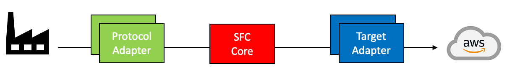
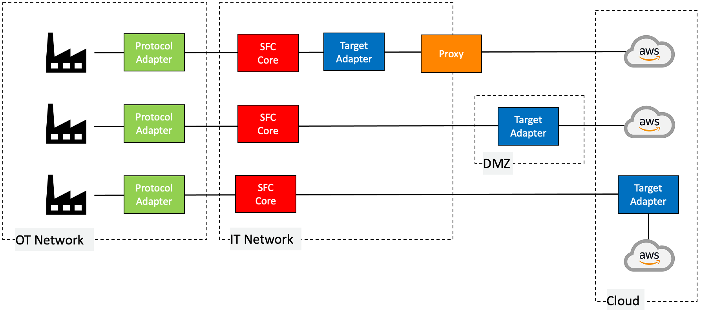
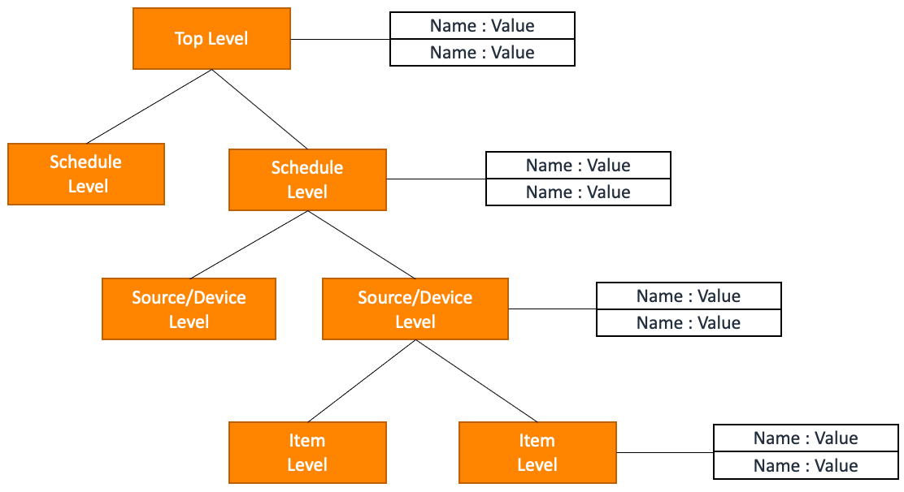

# SFC Documentation

The documentation provides a comprehensive overview of SFC's architecture, capabilities, and deployment options for industrial data collection and ingestion to AWS.

## **Summary**

Shop Floor Connectivity (SFC) is a data ingestion technology for collecting industrial data and delivering it to AWS services.

- Main components:
  - [Protocol Adapters](#protocol-adapters), read data from industrial devices
  - [SFC Core](#sfc-core) handles configuration, scheduling, data processing
  - [Target Adapters](#target-adapters) , send data to AWS/local services

- Key features:
  - [Extensible](#extensibility) . SFC  can be extended to include new protocol and target adapters.
  - [Flexible deployment options](./sfc-deployment.md), include standalone, containers, and Greengrass.
  - [Data transformations and filtering](./sfc-data-processing-filtering.md), processes, transforms, and filters data between sources and targets using configurable operators and rules
  - [Secure communication](./sfc-securing-component-traffic.md) between components
  - [Integration](./sfc-configuration.md#configuration-secrets) with AWS Secrets Manager

- [Terminology and Concepts](#terminology-and-concepts):

  - [Execution Environments](#execution-environments) where SFC components can be deployed and operated.
  - [Extensibility](#extensibility) Ability to extend SFC with custom protocol and target adapters and custom configuration.
  - [Network flexibility](#networking), OT/IT separation
  - [Scalability](#scalability)  to handle increased data loads by scaling SFC components horizontally.
  - [High availability](#high-availability) and continuous operation through redundant pods across multiple availability zones in Kubernetes clusters
  - [Data type fidelity](#data-types-and-formats), preserves and maintains accuracy of source data types throughout processing.
  - [Metadata enrichment](#metadata), enhances data with additional contextual information and attributes during ingestion.

  

## Table of contents

- [Introduction](#introduction)
  
  - [SFC Components](#sfc-components)
    - [SFC Core](#sfc-core)
    - [Protocol Adapters](#protocol-adapters)
    - [Target Adapters](#target-adapters)
  - [Terminology and concepts](#terminology-and-concepts)
  - [SFC data collection](#sfc-data-collection)
  - [Execution environments](#execution-environments)
  
- [High level design overview and tenets](#high-level-design-overview-and-tenets)
  
  - [Execution environment and platform dependencies](#execution-environment-and-platform-dependencies)
  - [Extensibility](#extensibility)
  - [Networking](#networking)
  - [Scalability](#scalability)
  - [Store and Forward](#store-and-forward)
  - [High availability](#high-availability)
  - [Data types and formats](#data-types-and-formats)
  - [Metadata](#metadata)
  
- [Deployment](sfc-deployment.md)

- [Configuration](./sfc-configuration.md)

- [SFC configuration file](./core/sfc-configuration.md)

- [Running the SFC core process](./sfc-running-core-process.md)

- [Running SFC protocol adapters](./sfc-running-adapters.md)

- [Running SFC targets](./sfc-running-targets.md)

- [Output data format](./sfc-data-format.md)

- [Data processing, transformations and filtering](./sfc-data-processing-filtering.md)

- [Target chaining](./sfc-targets-chaining.md)

- [Logging and Metrics collection](./sfc-logging-metrics.md)

- [Securing Network Traffic between SFC components](./sfc-securing-component-traffic.md)

- [AWS Service access credentials](sfc-aws-service-credentials.md)

- [Target data transformation templates](./sfc-target-templates.md)

- [Service Health Endpoints](./sfc-health-endpoints.md)

- [SFC tuning](./sfc-tuning.md)

- [.NET Core based protocol adapters](./sfc-dotnet.md)

  

## Quick links

**SFC Examples**

- [SFC examples collection](./examples/README.md)

  

**SFC Configuration Specifications**

- [SFC Configuration File](./core/sfc-configuration.md)

  

- [Protocol Adapters](./adapters/README.md)

- [Target Adapters](./targets/README.md)

  

**SFC Deployment**

- [Greengrass CDK](../deployment/README.md)
- [Greengrass Lab](../examples/greengrass-in-process/README.md)

---

# Introduction

Shop Floor Connectivity (SFC) is a data ingestion technology that can deliver data to multiple AWS Services.

SFC addresses limitations of, and unifies data collection of our existing IoT data collection services, allowing
customers to collect data in a consistent way to any AWS Service, not just the AWS IoT Services, that can collect and
process data. It allows customers to collect data from their industrial equipment and deliver it the AWS services that
work best for their requirements. Customers get the cost and functional benefits of specific AWS services and save costs
on licenses for additional connectivity products.

## SFC Components

There are three main type of components that make up SFC.

- [SFC Core](#sfc-core)
- [Protocol Adapters](./adapters/README.md)
- [Target Adapters](./targets/README.md)

## SFC Core

The SFC-Core component is the controller of the SFC Framework. It handles configuration and scheduling of the data
collection through the protocol adapters. It can optionally transform each received data value using a combination of
one or more of the 90+ transformation functions available functions, which can address complex data transformations
requirements. The core has end-to-end datatype fidelity, the data can be sent to the targets in the data format it was
read from the source, including complex structured datatypes and multidimensional arrays.

Optionally the data can be buffered and aggregated at the edge to reduce network traffic, by using one or more
available aggregation functions. After the aggregation has taken place, an additional transformation step can be
performed on the aggregated data. Before sending it to one or more SFC target adapters.

The core integrates with [AWS Secrets Manager](./sfc-configuration.md#configuration-secrets) and allows the use of placeholders for secrets used in the [configuration](./sfc-configuration.md), which will be transparently retrieved from AWS Secrets manager and substituted into the configuration.

In order to adapt to customer environments, logging, (dynamic) configuration and metrics collection is fully
configurable. Default implementations are provided, but can be replaced by custom ones by implementing a minimal
interface, and adding the implementation (JAR file) to the configuration.

## Protocol Adapters

An [SFC protocol adapter](./adapters/README.md) is used to read data from one or more industrial devices. This adapter 
interface abstracts the used protocol from and delivers the data with additional metadata in a common format to the SFC Core. The interface is
designed so that AWS, 3rd parties, or customers can [easily extend SFC](./sfc-extending.md) with new protocol adapters without any
modifications to the rest of the framework.

## Target Adapters

[SFC target adapters](./targets/README.md) are components that receive the data from the SFC Core and send it to their specific AWS or local
services. Components can optionally apply data transformations using an Apache Velocity template, to deliver the data in
the required format for the receiving service. At the moment of writing there are adapters for the following AWS
Services: IoT Analytics, IoT Core, Kinesis Streams, Kinesis Firehose, Lambda functions, IoT Core, S3, SiteWise,
Timestream, MKS, SNS, and SQS, with additional targets for the local filesystem, terminal output, OPCUA, NATS and MQTT clients.

Target buffering can be applied to reduce the number of required service API calls. All this is part of the SFC
infrastructure and makes it easier to develop new target types for additional AWS services Targets can be daisy-chained
in order to provide additional functionality which is discussed in this document.

## Terminology and concepts

SFC data collection is based on the following concepts

- The SFC Core process runs one or more configured [**schedules**](./core/schedule-configuration.md).

- A schedule defines from which **sources** the data is read, to **targets** the data is sent and the **interval** at
  which this happens.

- A [**source**](./core/source-configuration.md) defines from which protocol adapter the data is read and defines the 
- [**channels**](./core/target-configuration.md), which represent the
  actual values in a protocol agnostic way. A schedule can read from multiple sources which can read from different
  protocol adapters.

- A [**channel**](./core/target-configuration.md) defines the protocol specific details, like node id's, addresses etc., which are used by the adapter to
  read the values for that channel. Channels also can specify a **transformation** which will be applied to the read
  values, [**filters**](./sfc-data-processing-filtering.md#data-filtering) and **selectors**.

- A [**transformation**](./sfc-data-processing-filtering.md#transformations) is a configured set of data transformation operators which can be used to transform each
  individual value read from a **source**.

- A [**filter**](./sfc-data-processing-filtering.md#data-filtering) is a configured set of conditions to filter values based on 
relative or absolute values changes since the last time a value was read, of based on the actual value, defining a combination of boundaries and ranges.

- In order to reduce the amount of data written, or number of write actions to the [**targets, aggregation**](./core/aggregation-configuration.md) can be
  applied for a schedule. An aggregation defines the number of values to combine per batch, the aggregation functions
  that are applies to the aggregated data and the [**transformation**](./sfc-data-processing-filtering.md#transformations) for these values.

- A [**target**](./core/target-configuration.md) defines which target adapter is used to send the data to. It does contain target specific configuration
  for the specific adapter as well as common configuration items as buffer size, compression, applied transformation
  parameters, credentials providers etc.

- A [**schedule**](./core/schedule-configuration.md) can send data to one or more [**targets**](./core/target-configuration.md) of different types.

## SFC data collection

Configuring data collection with SFC involves defining one or more collection [schedules](./core/sfc-configuration.md#schedules) that
specify the interval and sources of data collection, as well as the targets for sending the collected data. These [sources](./core/sfc-configuration.md#sources)
can include multiple [protocol adapter](./core/sfc-configuration.md#protocoladapters) types, and individual data items can be transformed, filtered, or [aggregated](./core/schedule-configuration.md#aggregation) when needed.
SFC is designed as an active data collector handling all steps defined in the schedules automatically, without requiring
additional coding.

## Execution environments

Shop Floor Connectivity  is a versatile data ingestion solution that can be deployed in a variety of environments,
including standalone applications, Docker containers, and Kubernetes pods. With no additional requirements beyond a Java
JVM 1.8 runtime, SFC can be deployed on Linux and Windows systems. To optimize hardware utilization, SFC uses parallel
and non-blocking async patterns in its software.

SFC protocol and target adapters can be implemented as a JVM component or as an external microservices using the gRPC
protocol for communication. When running as [stand-alone services](./sfc-deployment.md#deployment-options), protocol adapters can be 
deployed on separate machines from the SFC Core process, with [secure communication](./sfc-securing-component-traffic.md) 
facilitated by gRPC. The SFC Core provides a consistent infrastructure allowing all JVM based protocol and target adapters 
to run in the [same process](sfc-deployment.md#in-process-and-ipc-deployment-models) as the SFC Core or as 
a [stand-alone microservice](./sfc-deployment.md#in-process-and-ipc-deployment-models).

Distributed deployment using microservices is required to deploy in environments that use segregated OT and IT networks,
with components connected to devices, protocol adapters, deployed in the OT network and components requiring internet
access, targets adapters, in a DMZ.

The SFC core will provide the services, protocol and target adapters, with the required configuration after these are
bootstrapped, providing a single, monitored and consistent source and location of configuration.

# High level design overview and tenets

SFC design and implementation tenets of the software are based on the experience from working with our industrial
customers. A major learning point is that hardly any assumptions can be made about the environment in which the software
is operated and integrated.

## Execution environment and platform dependencies

Edge software in industrial environments is typically running on a mix of different hardware architectures, operating
systems and runtimes. SFC can be deployed on platforms supporting a JVM and does not have platform or OS specific
requirements. SFC protocol and targets adapters can be implemented and executed in other runtimes, e.g., .NET, as well.

SFC components can be deployed and executed as:

- Standalone applications
- Containers in Docker or Kubernetes
- Greengrass components

## Extensibility

SFC can be [extended](./sfc-extending.md) with additional protocol and target adapters. New adapters can be implemented and added without
modifications to the SFC Core software. Using the infrastructure (JVM) code which is part of the framework, which
reduces the effort to implement new adapters and allows developers to focus on just the protocol or target specific
logic. Adapters can be implemented using a JVM language, or if due to the availability of protocol libraries or other
technical reasons this is not possible, alternative languages and runtimes can be used. JVM based adapters can run
either in-process with the SFC Core or as separate services in their own process. Adapters which are not JVM based
implementations can only run in their own process.

It is also possible to build and configure the following extensions to the SFC Core:

- *Logging*: the standard logging, which writes the output to the process console, can be replaced by a custom logger.
  The SFC configuration allows a [custom logger](./sfc-extending.md#custom-logging) to be configured by adding the library which implements it to the
  configuration.

- *Configuration*: the default configuration is using a JSON file, which is monitored for updates to the actual file, or
  updates to environment variables used for which the configuration file can contain placeholders. As configuration
  data, in customer environments, may be managed and stored in external systems, it is possible to implement and
  configure a [custom configuration provider](./sfc-extending.md#custom-configuration-handlers), that can actively and periodically call out to external systems, or wait
  for incoming calls, to obtain the configuration data to build or extend the SFC configuration dynamically.

- *Metrics*: SFC comes with a metrics collector for to the AWS CloudWatch Metrics service, which can be optionally added
  to the SFC configuration. [Custom metrics collectors](./sfc-extending.md#custom-metric-writers) can be implemented and configured.

## Networking

In industrial environments there are two different types of networks that have distinct characteristics and purposes.

IT (Information Technology) networks are used for communication and data management in a traditional office or
enterprise environment. These networks are designed for supporting business processes, data storage and retrieval, and
user communication.

OT (Operational Technology) networks, on the other hand, are used for controlling and monitoring physical processes in
industrial and manufacturing environments. These networks are designed for real-time monitoring and control of
machinery, production processes, and other industrial systems. They typically use specialized protocols and are managed
by operations or engineering departments. OT networks are often modelled after
the [Purdue network model](https://en.wikipedia.org/wiki/Purdue_Enterprise_Reference_Architecture).

In reality in most industrial environments OT and IT networks are not directly connected. Industrial devices are
unlikely to connect to the public internet. Solutions that retrieve data from these devices and submit this machine data
to a cloud service must be capable of handling this network separation, restrictions due to firewalls, proxies, DMZ's
and offline and/or intermittent connectivity.

SFC is designed so that protocol adapters, the SFC Core and target adapters can be deployed as separate services in
different networking or cloud environments. The diagrams below show some of the possible deployment scenarios.

SFC components running as microservices can explicitly specify which network interface to use for network connections to (OT) data sources and other components. By specifying the network interface, microservices can ensure that their network traffic flows through the desired network path, which can be important for optimizing network performance and ensuring network security.

By [configuring](./sfc-securing-component-traffic.md) the required X.509 certificates all network traffic can be secured using server side or mutual TLS.

See also:

- [Running the SFC core process](./sfc-running-core-process.md)

- [Running SFC protocol adapters](./sfc-running-adapters.md)

- [Running SFC targets](./sfc-running-targets.md)

## Scalability

As protocol and target adapters can run as standalone services, multiple instances can be instantiated on the same
system as the SFC Core, or on external systems to distribute the load and footprint of the components. By distributing
the load and footprint of these components, the overall throughput and scalability of the system can be improved. This
approach also enables better resource utilization and fault tolerance.

## Store and forward

For targets that require network access to send the collected data to their destinations, it is possible to use
intermediate [store and forward targets](sfc-targets-chaining.md#store-and-forward). Intermediate targets can be
configured in between the SFC Core and one or more target adapters by using target daisy-chaining. If the end target loses 
connectivity the intermediate target will store the data, optionally encrypted, for a [configured](./targets/store-and-forward-target.md) amount of time, data 
volume or number of messages, and will resubmit the data when the target regains network connectivity, in either FIFO or LIFO mode.

[Target chaining](./sfc-targets-chaining.md) is generic mechanism in SFC for adding additional processing steps, like store and forwarding as
described above, for target data without changes to the actual end targets.

## High availability

All SFC components that can run as microservices in their own processes can be configured to have an endpoint for
handling [health endpoints](./sfc-health-endpoints.md). Mechanisms used to manage the service instances, (e.g., Docker Compose, Kubernetes) can use
these endpoints in their configuration to check the status of a service and recycle instances failing to respond to the
health probe requests. This approach can help ensure the reliability and availability of microservices-based systems.

## Data types and formats

SFC provides full end to end data type-fidelity. Data which is read from the protocol adapters is delivered to the
target adapters as the same type of data as it was read. It does support numeric types, (Unicode)strings, time formats,
structured types, as well as vectors of these types.

By applying configured [transformations](./sfc-data-processing-filtering.md#transformations), which consists of a sequence of one or more provided transformation operators,
the SFC can transform every individual value that is read from a protocol adapter. Transformations can be used to
standardize data values and types read from different devices to be delivered in a consistent way to the consuming
target adapters. The SFC framework comes with a rich set of [transformation operators](./core/transformation-operator-configuration.md).

A source configuration can be configured to [compose](./core/source-configuration.md#compose) structured values from selected individual from that source. Channels, containing structures values, can be configured to be [decomposed](./core/channel-configuration.md#decompose) into individual values in the output.

The SFC core can also [aggregate](./core/aggregation-configuration.md) the data into batches and apply aggregation function to that data, which then can be
sent instead of, or with the individual values. This can be used to reduce the data volume by sending only the output of
selected aggregation functions or the number of data messages to the consuming targets. Additionally, transformations,
as described above, can be applied to the aggregated data.

The data is delivered to the target in a defined hierarchical structure. An additional, [template based, transformation](./core/target-configuration.md#template),
using Apache Velocity, can be configured for each target to select subsets, restructure or transform the data or
transform it into formats like CSV, YAML or XML.

For targets that don't require a specific format, the data is written as [JSON](./sfc-data-format.md#sfc-output-data-schemas) by default, unless a [template](./core/target-configuration.md#template) is specified for that target.

## Metadata

The data can be enriched with additional information before it is sent to the targets.

In the configuration information at schedule-level, source and channel level maps of (string) data can be configured
that will be added to the output data.

Configuration [top-level](./core/sfc-configuration.md#metadata) metadata will be merged with the data at [schedule-level](./core/schedule-configuration.md#metadata) and added to the target data under the
metadata node at top-level. If a value is defined at both top-level and schedule-level, the schedule-level value is
used (allowing the overwriting of top-level values at schedule-level).

Metadata at source-level will be added under a metadata node at [source-level](./core/source-configuration.md#metadata).

Metadata at channel-level will be added to the values under a metadata-level node at [channel-level](./core/channel-configuration.md#metadata).

