# PCCC Protocol Configuration

Configuration for PCCC protocol adapter, used script to read data from Allen Bradley/Rockwell PLCs using the PCCC (Programmable Controller Communication Commands) protocol.

- [PCCC Addressing](#pccc-addressing)

In order to use this adapter as in [in-process](../sfc-running-adapters.md#running-protocol-adapters-in-process) type adapter the type must be added to the [AdapterTypes](../core/sfc-configuration.md#adaptertypes) section in the [SFC configuration file](../core/sfc-configuration.md).

```json
"AdapterTypes" :{
  "PCCC" : {
    "JarFiles" : ["<location of deployment>/pccc/lib"]
  },
  "FactoryClassName" : "com.amazonaws.sfc.pccc.PcccAdapter"
}
```

**Configuration:**

- [PcccSourceConfiguration](#pcccsourceconfiguration)
- [PcccChannelConfiguration](#pcccchannelconfiguration)
- [PcccAdapterConfiguration](#pcccadapterconfiguration)
- [PcccControllerConfiguration](#pccccontrollerconfiguration)
- [PcccConnectPathConfiguration](#pcccconnectpathconfiguration)


## PCCC Addressing

The following data types, along with their respective addresses, can be used as the value for the "Address" field in a PCCCChannel.

PCCC addressing formats differ based on the data type and memory area. Each data type necessitates a specific addressing format to accurately access the PLC memory.


Datatype OUTPUT, Prefix O

Default file number 0

Syntax: `0<filenumber>:<element index>[/bit offset][,arraylen]`

**O0:0** First 16 output bits as Boolean values in logical order, the bit at offset 0 becomes the first item in the array.

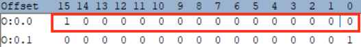


**O0:0.1** Second set of 16 output bites as 16 Boolean values in logical order

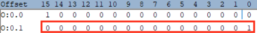


**O0:0,2** First 32 output bits as 2 sets of 16 Boolean values in logical order

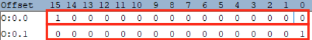


**O0:0/0** First output at offset 0 bit as Boolean value

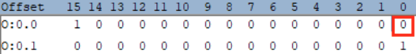


**O0:0/15** Fifteenth output bit at offset 15 as Boolean value

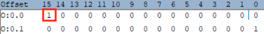


---


**Datatype INPUT, Prefix I**

Default file number 1

Syntax: `I<file number>:<element index>[/bit offset][,array len]`


**I1:0** First 16 input bits as Boolean values in logical order, the bit at offset 0 becomes the first item in the array.

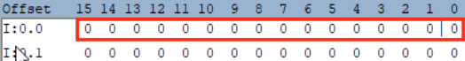


**I1:0.1.** Second set of 16 input bites as 16 Boolean values in logical

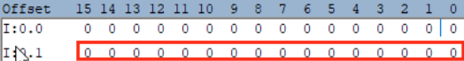


**I1:0,2** First 32 input bits as 2 sets of 16 Boolean values in logical order

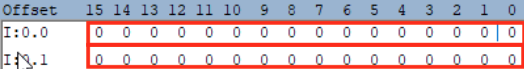


**I1:0/0**. First input bit at offset 0 as Boolean value

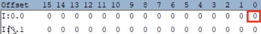


**O0:0/15** Fifteenth output at offset 15 bit as Boolean value

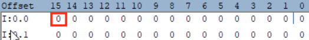


---

**Datatype BINARY, Prefix B**

Default file number 3

Syntax: `B<file number>:<element index>[/bit offset]`

**B3:0** First 16 binary bits as Boolean values in logical order, the bit shown below at offset 0 becomes the first item in the array.

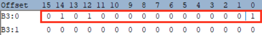


**B3:0.1** Second set of 16 binary bites as 16 Boolean values in logical

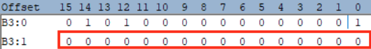


**B3:0/0.** First binary bit at offset as Boolean value

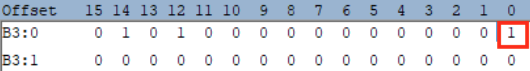


**B3:0/15** Fifteenth binary bit at offset 15 as Boolean value

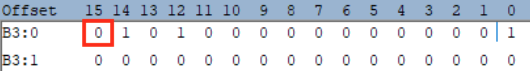


---

**Datatype TIMER, Prefix T**

Default file number 4

Syntax: 

`T<file number>:<element index>[/bit offset]` for bit values

`T<file number>:<element index>[.value by name]` for named numeric values

**T4:0** Timer as a structure containing all elements

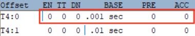


**T4:0.ACC** Timer numeric ACC value.

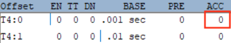


**T4:0.EN** Timer Boolean EN bit value

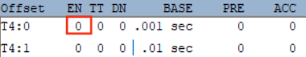


---

**Datatype COUNTER, Prefix C**

Default file number 5

Syntax: 

`C<file number>:<element index>[/bit offset]` for bit values

`C<file number>:<element index>[.value by name]` for named numeric values

**C5:0** Counter as a structure containing all elements

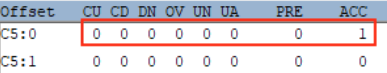


**C5:0.ACC Counter ACC numeric value**

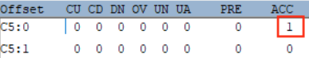


**C5:0.ACC Counter CU bit value**

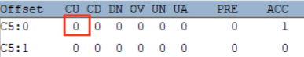


---

**Datatype CONTROL, Prefix R**

Default file number 6

Syntax: 

`R<file number>:<element index>[/bit offset]` for bit values

`R<file number>:<element index>[.value by name]` for named numeric values

**R6:0** Control as a structure containing all elements

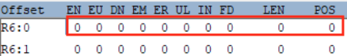


**R6:0.POS Counter POS numeric value**

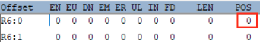


**R6:0.ACC Control EN bit value**

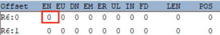


---

**Datatype OUTPUT, Prefix O**

Default file number 7

Syntax: `N<file number>:<element index>[<array len>]`

**N7:0 First 16 bits integer value**

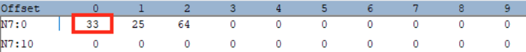


**N7:1 Second 16 bits integer value**

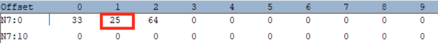


**N7:0,3 First 3 16 bits integer values**

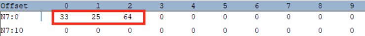


---

**Datatype FLOAT, Prefix F**

Syntax: `F<file number>:<element index>[<array len>]`

**F8:0 First float value**

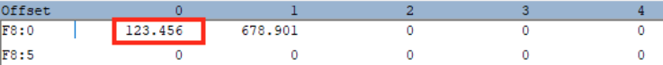


**F8:1 Second float value**

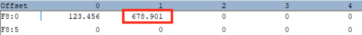


**F8:0,2 First 2 float value**

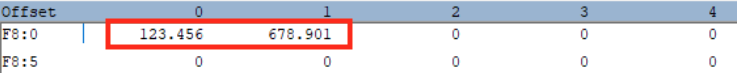


---

**Datatype STRING, Prefix ST**

Syntax: `ST<file number>:<element index>`

**ST9:0 First string value**

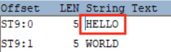


**ST9:1 Second string value**

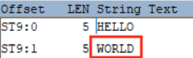


---

**Datatype LONG, Prefix L (32 bit)**

Syntax: `L<file number>:<element index>[<array len>]`

**L10:0 First 32 bits integer value**

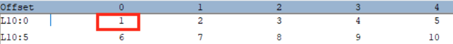


**L10:1 Second 32 bits integer value**

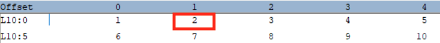


**L10:0,3 First 3 32 bits integer values**

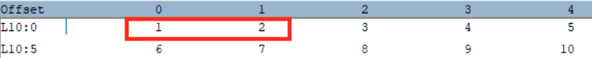


---

**Datatype ASCII, Prefix A**

Default file number 11

Syntax: `A<file number>:<element index>[/character offset]`

**A11:0 First character pair**

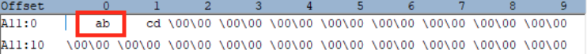


**A11:0 Second character pair**

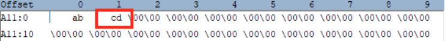


**A11:0/0 First character of in first character pair**

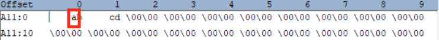


**A11:0/0 Second character of in seconds character pair**

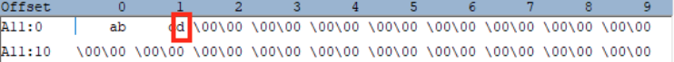

---


## PcccSourceConfiguration

[SFC Configuration](../core/sfc-configuration.md) > [Sources](../core/sfc-configuration.md#sources) >  [Source](../core/source-configuration.md) 

The PcccSourceConfiguration class defines which values (channels) to read from a PLC and references the controller configuration specified in the [Controllers](#controllers)  section through the AdapterController property. 

 This type extends the [SourceConfiguration](../core/source-configuration.md) type.

- [Schema](#pcccsourceconfiguration-schema)
- [Examples](#pcccsourceconfiguration-examples)

**Properties:**

- [AdapterController](#adaptercontroller)
- [Channels](#channels)

---

### AdapterController

The AdapterController property specifies the server identifier for the PLC controller to read from. This identifier must match a controller defined in the Controllers section of the PCCC adapter configuration referenced by the source's [ProtocolAdapter](../core/source-configuration.md#protocoladapter) attribute.

**Type** : String

The value must correspond to an existing controller identifier in the PCCC [adapter's](#pcccadapterconfiguration)  [Controllers](#controllers) section.

---

### Channels

The Channels property defines a map of data points to be read from the PLC, where each entry is indexed by a unique channel identifier. Each channel specifies what value to read from the controller. Channels can be disabled by prefixing their identifier with "#".

**Type**: Map[String,[PcccChannelConfiguration](#pcccchannelconfiguration)]

At least 1 channel must be configured.

### PcccSourceConfiguration Schema

```json
{
  "$schema": "http://json-schema.org/draft-07/schema#",
  "type": "object",
  "description": "Configuration for PCCC source",
  "allOf": [
    {
      "$ref": "#/definitions/SourceConfiguration"
    },
    {
      "type": "object",
      "properties": {
        "AdapterController": {
          "type": "string",
          "description": "Reference to the PCCC controller configuration in the adapter"
        },
        "Channels": {
          "type": "object",
          "description": "Map of PCCC channel configurations",
          "additionalProperties": {
            "$ref": "#/definitions/PcccChannelConfiguration"
          },
          "minProperties": 1
        }
      },
      "required": ["AdapterController", "Channels"]
    }
  ]
}

```

### PcccSourceConfiguration Examples

```json
{
  "Name": "ProductionLine1",
  "ProtocolAdapter" : "PCCCAdapter",
  "AdapterController": "MainPLC",
  "Channels": {
    "ProductCount": {
      "Name": "count",
      "Address": "N7:0",
      "Description": "Daily production counter"
    },
    "MachineStatus": {
      "Name": "status",
      "Address": "B3:0",
      "Description": "Machine running status"
    }
  }
}

```

[^top](#pccc-protocol-configuration)


## PcccChannelConfiguration

[SFC Configuration](../core/sfc-configuration.md) > [Sources](../core/sfc-configuration.md#sources) > [Source](../core/source-configuration.md)  > [Channels](../core/source-configuration.md#channels) > [Channel](../core/channel-configuration.md)

The PcccChannelConfiguration class extends  [ChannelConfiguration](../core/channel-configuration.md) , inheriting all its base properties, while adding PCCC-specific properties such as Address to define the PLC memory location to read from.

- [Schema](#pcccchannelconfiguration-schema)
- [Examples](#pcccchannelconfiguration-examples)

**Properties:**

- [Address](#address)

---

### Address

The Address property specifies the memory location in the PLC from which to read data. It must be formatted according to PCCC addressing conventions for the specific data type being accessed.

**Type**: String

For supported datatype and address syntax see [PCCC Addressing](#pccc-addressing).

### PcccChannelConfiguration Schema

```json
{
  "$schema": "http://json-schema.org/draft-07/schema#",
  "type": "object",
  "description": "Configuration for PCCC channel",
  "allOf": [
    {
      "$ref": "#/definitions/ChannelConfiguration"
    },
    {
      "type": "object",
      "properties": {
        "Address": {
          "type": "string",
          "description": "PCCC address for the channel",
          "pattern": "^[A-Z]:\\d+(\\.\\d+)?$"
        }
      },
      "required": ["Address"]
    }
  ]
}

```

### PcccChannelConfiguration Examples

Basic integer address:

```json
{
  "Name": "Counter1",
  "Address": "N7:0",
  "Description": "Production counter"
}
```

.

Bit address:

```json
{
  "Name": "RunningStatus",
  "Address": "B3:0",
  "Description": "Machine running status bit"
}
```

.

 Float address:

```json
{
  "Name": "Temperature",
  "Address": "F8:0",
  "Description": "Process temperature"
}
```

.

Timer address:

```json
{
  "Name": "CycleTimer",
  "Address": "T4:0",
  "Description": "Process cycle timer"
}
```

.

Counter with bit:

```json
{
  "Name": "PartCounter",
  "Address": "C5:0.0",
  "Description": "Parts counter done bit"
}
```


[^top](#pccc-protocol-configuration)


## PcccAdapterConfiguration

[SFC Configuration](../core/sfc-configuration.md) > [ProtocolAdapters](../core/sfc-configuration.md#protocoladapters) > [Adapter](../core/protocol-adapter-configuration.md) 

The PcccAdapterConfiguration class extends  [AdapterConfiguration](../core/protocol-adapter-configuration.md) to provide PCCC protocol-specific adapter settings. It includes a collection of controller configurations that define connection details for PCCC-capable PLCs.

- [Schema](#pcccadapterconfiguration-schema)
- [Examples](#pcccadapterconfiguration-examples)

**Properties:**

- [Controllers](#controllers)

---

### Controllers

PLCs servers configured for this adapter. The PCCC source using the adapter must have a reference to one of these in its [AdapterController](#adaptercontroller) attribute.

**Type**: Map[String,[PcccControllerConfiguration](#pccccontrollerconfiguration)]

### PcccAdapterConfiguration Schema

```json
{
  "$schema": "http://json-schema.org/draft-07/schema#",
  "type": "object",
  "description": "Configuration for PCCC adapter",
  "allOf": [
    {
      "$ref": "#/definitions/AdapterConfiguration"
    },
    {
      "type": "object",
      "properties": {
        "Controllers": {
          "type": "object",
          "description": "Map of PCCC controller configurations",
          "additionalProperties": {
            "$ref": "#/definitions/PcccControllerConfiguration"
          },
          "minProperties": 1
        }
      },
      "required": ["Controllers"]
    }
  ]
}
```

### PcccAdapterConfiguration Examples

```json
{
  "AdapterType": "PCCC",
  "Controllers": {
    "MainPLC": {
      "Address": "192.168.1.100",
      "ConnectPath": {
        "Backplane": 1,
        "Slot": 0
      },
      "ConnectTimeout": 10000,
      "ReadTimeout": 5000
    }
  }
}

```

[^top](#pccc-protocol-configuration)


## PcccControllerConfiguration

[PccAdapter](#pcccadapterconfiguration) > [Controllers](#controllers)


The PcccControllerConfiguration class defines the connection parameters and settings required to communicate with a specific PCCC-capable PLC controller. It contains properties that specify how to establish and maintain a connection to the PLC.


- [Schema](#pccccontrollerconfiguration-schema)
- [Examples](#pccccontrollerconfiguration-examples)

**Properties:**

- [Address](#address)
- [ConnectPath](#connectpath)
- [ConnectTimeout](#connecttimeout)
- [MaxReadGap](#maxreadgap)
- [OptimizeReads](#optimizereads)
- [Port](#port)
- [ReadTimeout](#readtimeout)
- [WaitAfterConnectError](#waitafterconnecterror)
- [WaitAfterReadError](#waitafterreaderror)
- [WaitAfterWriteError](#waitafterwriteerror)

---

### Address

The Address property specifies the IP address of the PLC controller that the adapter will connect to.

**Type**: String

IP address in format aaa.bbb.ccc.ddd

---

### ConnectPath

The ConnectPath property defines the routing path configuration used to establish a connection to the PLC controller. This property specifies how to route the communication through the network to reach the target PLC, which may include going through intermediate devices or network segments.

**Type**: PcccConnectPathConfiguration

Optional

---

### ConnectTimeout

The ConnectTimeout property specifies the maximum amount of time (in milliseconds) that the adapter will wait when attempting to establish a connection with the PLC controller before timing out. If the connection cannot be established within this time period, the connection attempt will fail and an error will be raised. 

**Type**: Integer

Default is 10000

---

### MaxReadGap

When optimization is used this specified the max number of bytes between near adjacent fields that may be combined in a single read.

When reading multiple fields that are close to each other in the PLC's memory, the adapter can optimize performance by combining them into a single read operation instead of performing multiple individual reads. This property controls how far apart fields can be while still being considered for combination:

- If two fields are separated by fewer bytes than MaxReadGap, they may be combined
- If the gap between fields exceeds MaxReadGap, they will be read separately

This optimization can improve performance by reducing the number of individual read operations, but setting the value too high might result in reading unnecessary data between the fields of interest

**Type**: Integer

Default is 32

---

### OptimizeReads

The OptimizeReads property determines whether the adapter should attempt to optimize read operations by combining multiple read requests for adjacent or nearby fields into a single read operation.

**Type** : Boolean

**Default** : true

When enabled (true):

- The adapter will attempt to combine multiple read requests for fields that are close together in memory
- The maximum gap between fields that can be combined is controlled by the MaxReadGap property
- This can significantly reduce the number of communications with the PLC
- Results in better performance and reduced network traffic

When disabled (false):

- Each field will be read individually
- Useful for troubleshooting when combined reads are failing
- Helps identify specific problematic fields
- May result in slower performance due to increased number of individual read operations

---

### Port

The Port property specifies the TCP port number used to communicate with the PLC controller.

This is the network port where the PLC controller listens for incoming PCCC communications. In most cases, the default port (44818) should be used unless your network configuration requires a different port number.

**Type**: Integer

Default is 44818

---

### ReadTimeout

The ReadTimeout property specifies the maximum amount of time (in milliseconds) that the adapter will wait for a response from the PLC controller after sending a read request.

**Type**: Integer

Default is 10000

---

### WaitAfterConnectError

The WaitAfterConnectError property specifies the delay time (in milliseconds) that the adapter should wait before attempting to (re)connect after experiencing a connection error with the PLC controller.

**Type**: Integer

Default is 10000

---

### WaitAfterReadError

The WaitAfterReadError property specifies the delay time (in milliseconds) that the adapter should wait before attempting another read operation after encountering a read error from the PLC controller.

**Type**: Integer

Default is 10000

---

### WaitAfterWriteError

The WaitAfterWriteError property specifies the delay time (in milliseconds) that the adapter should wait before attempting another write operation after encountering a write error to the PLC controller.

**Type**: Integer

Default is 10000

### PcccControllerConfiguration Schema

```json
{
  "$schema": "http://json-schema.org/draft-07/schema#",
  "type": "object",
  "description": "Configuration for PCCC controller",
  "properties": {
    "Address": {
      "type": "string",
      "description": "IP address or hostname of the PCCC controller"
    },
    "ConnectPath": {
      "$ref": "#/definitions/PcccConnectPathConfiguration",
      "description": "Connection path configuration"
    },
    "ConnectTimeout": {
      "type": "integer",
      "description": "Timeout for connection attempts in milliseconds",
      "default": 10000
    },
    "MaxReadGap": {
      "type": "integer",
      "description": "Maximum gap between addresses to combine reads",
      "default": 32
    },
    "OptimizeReads": {
      "type": "boolean",
      "description": "Enable read optimization by combining adjacent addresses",
      "default": true
    },
    "Port": {
      "type": "integer",
      "description": "Port number for the PCCC connection",
      "default": 44818
    },
    "ReadTimeout": {
      "type": "integer",
      "description": "Timeout for read operations in milliseconds",
      "default": 10000
    },
    "WaitAfterConnectError": {
      "type": "integer",
      "description": "Wait time after connection error in milliseconds",
      "minimum": 0,
      "default": 5000
    },
    "WaitAfterReadError": {
      "type": "integer",
      "description": "Wait time after read error in milliseconds",
      "minimum": 0,
      "default": 10000
    },
    "WaitAfterWriteError": {
      "type": "integer",
      "description": "Wait time after write error in milliseconds",
      "minimum": 0,
      "default": 10000
    }
  },
  "required": ["Address", "ConnectPath"]
}

```

### PcccControllerConfiguration Examples

```json
{
  "Address": "192.168.1.100",
  "ConnectPath": {
    "Backplane": 1,
    "Slot": 0
  }
}
```

[^top](#pccc-protocol-configuration)


## PcccConnectPathConfiguration

[PccAdapter](#pcccadapterconfiguration) > [Controllers](#controllers) > [PcccController](#pccccontrollerconfiguration) > [ConnectPath](#connectpath)

The PcccConnectPathConfiguration class defines the connection path configuration for establishing communication with a PLC using the PCCC (Programmable Controller Communication Commands) protocol.

- [Schema](#pcccconnectpathconfiguration-schema)
- [Examples](#pcccconnectpathconfiguration-examples)

**Properties:**

- [Backplane](#backplane)
- [Slot](#slot)

---

### Backplane

The Backplane property specifies the backplane number in the PCCC connection path configuration.

This property is used to identify the backplane connection in the PLC chassis system. The backplane is the physical communication bus that connects different modules within a PLC rack.

- Used in routing communications through the PLC system
- Typically remains at the default value of 1 for most configurations
- Part of the overall connection path specification
- Important when communicating through ControlLogix gateways or similar systems

**Type**: Integer

Default is 1


---

### Slot

The Slot property specifies the slot number where the target PLC module is installed in the chassis backplane.

This property identifies:

- The physical location of the PLC module in the rack
- Which slot the processor or communication module occupies
- The target destination for PCCC messages

**Type**: Integer

Default is 0

### PcccConnectPathConfiguration Schema

```json
{
  "$schema": "http://json-schema.org/draft-07/schema#",
  "type": "object",
  "description": "Configuration for PCCC connection path",
  "properties": {
    "Backplane": {
      "type": "integer",
      "description": "Backplane number",
      "default" : 1
    },
    "Slot": {
      "type": "integer",
      "description": "Slot number",
      "default": 0
    }
  }
}

```

### PcccConnectPathConfiguration Examples

```json
{
  "Backplane": 1,
  "Slot": 0
}

```

[^top](#pccc-protocol-configuration)

