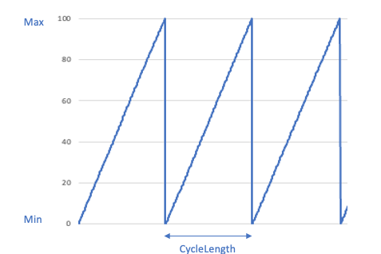
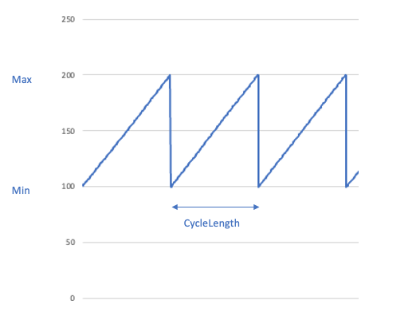
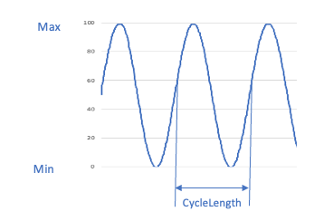
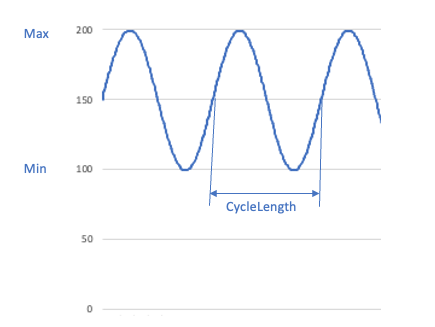
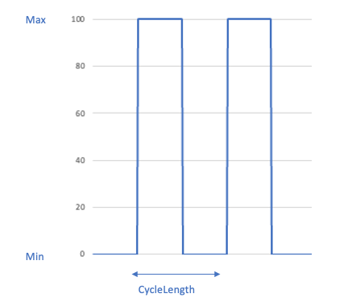
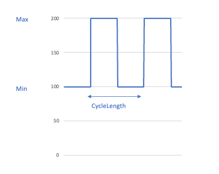
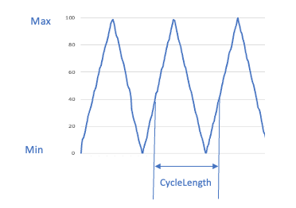
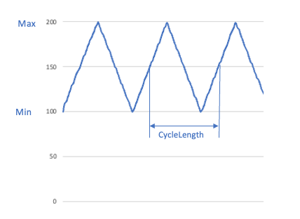

# Simulator Configuration

[SFC Configuration](../core/sfc-configuration.md) > [Sources](../core/sfc-configuration.md#sources) >  [Source](../core/source-configuration.md) 

The Simulator Adapter is a special-purpose adapter that generates synthetic data using [configurable simulations](#simulations) instead of reading data from physical industrial devices. This makes it ideal for testing, development, and demonstration purposes without requiring actual hardware.

Unlike other adapters that interface with industrial protocols and devices, the Simulator Adapter uses [simulation configurations](#simulations) to generate data values. Each channel in the adapter configuration contains one or more simulations that define how values should be generated.

## Deploy this adapter

`AdapterType` is `SIMULATOR` in every deployment mode. In the uberjar and in-process modes the `AdapterTypes` key is the same value. How the modes differ: [Configure a component in each mode](../sfc-deployment.md#configuration-in-each-mode). All types and classes: [Protocol adapter types and classes](../sfc-running-adapters.md#protocol-adapter-types-and-classes).

**Uberjar** - installed by [sfcup](../../README.md#1-install); run with `sfcx`:

```json
"AdapterTypes": {
  "SIMULATOR": { "FactoryClassName": "com.amazonaws.sfc.simulator.SimulatorAdapter" }
}
```

**In-process** - module bundle `simulator` unpacked into the directory named by `SFC_DEPLOYMENT_DIR`, run with `sfc-main`:

```json
"AdapterTypes": {
  "SIMULATOR": {
    "JarFiles": ["${SFC_DEPLOYMENT_DIR}/simulator/lib"],
    "FactoryClassName": "com.amazonaws.sfc.simulator.SimulatorAdapter"
  }
}
```

**IPC** - no `AdapterTypes`; the adapter runs as its own service:

```json
"ProtocolAdapters": {
  "SimulatorAdapter": {
    "AdapterType": "SIMULATOR",
    "AdapterServer": "SimulatorServer"
  }
},
"AdapterServers": {
  "SimulatorServer": { "Address": "localhost", "Port": 50000 }
}
```

Start the service before SFC, on the port of its `AdapterServers` entry:

**Linux / macOS**

```shell
simulator/bin/simulator -port 50000
```

**Windows (PowerShell)**

```powershell
java -cp "C:\sfc\simulator\lib\*" com.amazonaws.sfc.simulator.SimulatorService -port 50000
```

From an sfcup install, start the same service from the uberjar: `java -cp "$HOME/.sfc/current/lib/*" com.amazonaws.sfc.simulator.SimulatorService -port 50000` (Windows: `java -cp "$HOME\.sfc\versions\$(Get-Content $HOME\.sfc\current.txt)\lib\*" com.amazonaws.sfc.simulator.SimulatorService -port 50000`).

**Examples:** uberjar: [Quickstart step 2](../../README.md#2-helloworld-simulator-example), [simulator-to-s3tables-uberjar.json](../../examples/in-process-sim-s3tables/sfc-to-s3tables/simulator-to-s3tables-uberjar.json), [uberjar-sim-file](../../examples/uberjar-sim-file/README.md) · in-process: [in-process-sim-s3tables](../../examples/in-process-sim-s3tables/README.md) · all: [examples catalog](../examples/README.md)

**Configuration:**

- [SimulatorSourceConfiguration](#simulatorsourceconfiguration)
- [SimulatorChannelConfiguration](#simulatorchannelconfiguration)
- [SimulatorAdapterConfiguration](#simulatoradapterconfiguration)
- [**Simulations**](#simulations)


- [Simulation to OPCUA Example](#simulation-to-opc-ua-example)


## SimulatorSourceConfiguration

Source configuration for the Simulator protocol adapter. This type extends the [SourceConfiguration](../core/source-configuration.md) type. 

- [Schema](#simulatorsourceconfiguration-schema)
- [Example](#simulatorsourceconfiguration-example)

**Properties:**

- [Channels](#channels)

---
### Channels
The channels of a simulator source hold the configuration for the [simulation](#simulations) that generates the simulation values. Each channel is represented as a map indexed by its channel identifier. Channels can be "commented out" by prefixing their identifier with a "#".

**Type**: Map[String,[SimulatorChannelConfiguration](#simulatorchannelconfiguration)]

At least 1 channel must be configured.

[^top](#simulator-configuration)

### SimulatorSourceConfiguration Schema

```json
{
  "$schema": "http://json-schema.org/draft-07/schema#",
  "definitions": {
    "SimulatorSourceConfiguration": {
      "type": "object",
      "description": "Configuration for Simulator source adapter",
      "allOf": [
        {
          "$ref": "#/definitions/BaseSourceConfiguration"
        },
        {
          "type": "object",
          "properties": {
            "Channels": {
              "type": "object",
              "description": "Map of Simulator channel configurations",
              "additionalProperties": {
                "$ref": "#/definitions/SimulatorChannelConfiguration"
              },
              "minProperties": 1
            }
          },
          "required": [
            "Channels"
          ]
        }
      ]
    }
  }
}

```

### SimulatorSourceConfiguration Example

```json
{
  "ProtocolAdapter": "SimulatorAdapter",
  "Channels": {
    "counter": {
      "Simulation": {
        "SimulationType": "Counter",
        "DataType": "Int",
        "Min": 0,
        "Max": 100
      }
    },
    "sinus": {
      "Simulation": {
        "SimulationType": "Sinus",
        "DataType": "Byte",
        "Min": 0,
        "Max": 100
      }
    },
    "triangle": {
      "Simulation": {
        "SimulationType": "Triangle",
        "DataType": "Byte",
        "Min": 0,
        "Max": 100
      }
    }
  }
}
```


## SimulatorChannelConfiguration

[SFC Configuration](../core/sfc-configuration.md) > [Sources](../core/sfc-configuration.md#sources) > [Source](../core/source-configuration.md)  > [Channels](../core/source-configuration.md#channels) > [Channel](../core/channel-configuration.md)


The SimulatorChannelConfiguration type extends the [ChannelConfiguration](../core/channel-configuration.md) class with channel properties for the Simulator protocol adapter.

- [Schema](#simulatorchannelconfiguration-schema)
- [Examples](#simulatorchannelconfiguration-examples)

**Properties:**
- [Simulation](#simulation)

---
### Simulation

The configuration for the simulation that generates values for this channel. The simulation determines how and what kind of values are produced. Required property that must contain a valid  [simulation configuration](#simulations)  object.

If a channel's simulation is not valid (for example an unknown or missing `SimulationType`, or a missing `DataType`, `Value`, `Values`, `Item`, `Items` or `Properties`), the simulator adapter is not created, so none of its sources produces data, not even from valid channels. The log then shows `SimulationType "..." is not valid, <reason>`.

**Type:** Simulation


---

[^top](#simulator-configuration)

### SimulatorChannelConfiguration Schema

```json
{
  "$schema": "http://json-schema.org/draft-07/schema#",
  "type": "object",
  "description": "Configuration for Simulator channel",
  "allOf": [
    {
      "$ref": "#/definitions/ChannelConfiguration"
    },
    {
      "type": "object",
      "properties": {
        "Simulation": {
          "$ref": "#/definitions/Simulation"
        }
      },
      "required": [
        "Simulation"
      ]
    }
  ]
}
```


[^top](#simulator-configuration)


### SimulatorChannelConfiguration Examples

Defines  a channel that uses a [counter simulation](#counter) to count from 0 to 100 and returns an integer value.

```json
{
  "Simulation": {
    "SimulationType": "Counter",
    "DataType": "Int",
    "Min": 0,
    "Max": 100
  }
}
```


Defines a channel that utilizes the [sinus simulation](#sinus) algorithm to generate a byte value that ranges from 0 to 100.

```json
{
    "Simulation": {
       "SimulationType": "Sinus",
       "DataType": "Byte",
       "Min": 0,
       "Max": 100
    }
}
```


Defines a channel that utilizes the [random simulation](#random) algorithm to generate a byte value that ranges between 0 (inclusive) and 100 (inclusive)

```json
{
    "Simulation": {
       "SimulationType": "Random",
       "DataType": "Byte",
       "Min": 0,
       "Max": 100
    }
}
```

[^top](#simulator-configuration)


## SimulatorAdapterConfiguration

[SFC Configuration](../core/sfc-configuration.md) > [ProtocolAdapters](../core/sfc-configuration.md#protocoladapters) > [Adapter](../core/protocol-adapter-configuration.md) 

SimulatorAdapterConfiguration extends the [AdapterConfiguration](../core/protocol-adapter-configuration.md) for the Simulator

- [Schema](#simulatoradapterconfiguration-schema)
- [Example](#simulatoradapterconfiguration-example)


[^top](#simulator-configuration)

### SimulatorAdapterConfiguration Schema

```json
{
  "$schema": "http://json-schema.org/draft-07/schema#",
  "type": "object",
  "description": "Configuration for Simulator adapter",
  "allOf": [
    {
      "$ref": "#/definitions/AdapterConfiguration"
    }
  ]
}
```

### SimulatorAdapterConfiguration Example

```json
{
  "AdapterType": "SIMULATOR"
}
```

[^top](#simulator-configuration)


---


# Simulations

Simulations are used to generate values.

`SimulationType` and `DataType` are not case-sensitive. A misspelled `DataType` is not reported: the simulation then returns null instead of values.

Values are generated when the schedule reads the channel. Counter, Range and Random step once per read, List and Structure read each of their items once per read, and Constant never changes. Sawtooth, Sinus, Square and Triangle follow the wall clock, so `CycleLength` divided by the schedule's `Interval` is the number of samples per cycle, and a `Size` greater than 0 repeats the value of that moment. Reads that return no value (Interval or Buffered between emissions) are left out of the output.

There are two types of simulations:

- [Value simulations](#value-simulations) - These simulations generate actual values directly (like constant values, sine waves, or random numbers)

- [Composite simulations](#composite-simulations) - Composite simulations are simulations that contain one or more embedded simulations to generate actual values. These simulations allow complex behaviors to be built by combining simulations.

  

## Value simulations:

- [Constant](#constant)

- [Counter](#counter)

- [Random](#random)

- [Range](#range)

- [Sawtooth](#sawtooth)

- [Sinus](#sinus)

- [Square](#square)

- [Triangle](#triangle)

  

## Composite simulations

- [Buffered](#buffered)
- [Interval](#interval-1)
- [List](#list)
- [Structure](#structure)

**All simulation types at a glance:**

| SimulationType | Required | Optional (default) | Value changes |
| --- | --- | --- | --- |
| [Constant](#constant) | `DataType`, `Value` | none | never |
| [Counter](#counter) | `DataType` | `Min` (0), `Max` (type maximum), `Step` (1), `Direction` (`UP`), `Size` (0) | per read |
| `DateTime` | none | `UTC` (false) | per read |
| [Random](#random) | `DataType` | `Min` (type minimum), `Max` (type maximum - 1), `Size` (0) | per read |
| [Range](#range) | `DataType`, `Values` | `Random` (false), `Size` (0) | per read |
| [Sawtooth](#sawtooth), [Sinus](#sinus), [Square](#square), [Triangle](#triangle) | `DataType` | `Min` (0), `Max` (100), `CycleLength` (10000 ms), `Size` (0), and for Sinus `Shift` (0) | wall clock |
| [Buffered](#buffered) | `Item` | `Interval` (1000 ms) | batch per interval |
| [Interval](#interval-1) | `Item` | `Interval` (1000 ms) | once per interval |
| [List](#list) | `DataType`, `Items` | none | per read |
| [Structure](#structure) | `Properties` | none | per read |

`DateTime` returns the current time, with `"UTC": true` for UTC instead of the local time zone. It has no section below because its value is currently written as a structured object instead of an ISO-8601 timestamp.


## Constant

The Constant simulation type of simulation returns a constant value of a specific data type.

- [Schema](#constant-schema)
- [Examples](#constant--examples)

**Properties:**

- [DataType](#datatype)
- [SimulationType](#simulationtype)
- [Value](#value)

---

### DataType

The data type of the returned constant value.

Possible values are:

- `Boolean`
- `Byte`
- `Short`
- `Int`
- `Long`
- `Float`
- `Double`
- `String`
- `Char`
- `UByte`
- `UShort`
- `UInt`
- `ULong`

**Type:** String

Tip: prefer the signed types. In the uberjar and in-process modes `UByte`, `UShort` and `UInt` are written as JSON strings (for example `"200"`) and `ULong` as a double; over IPC they arrive as plain numbers.

---

### SimulationType

Type of the simulation, value is "**Constant**".

---

### Value

The value returned on every read. It must be of the specified data type, or convertible to that type. A single value only; arrays are not supported.

**Type:** Must match or be compatible with the Constant simulation's defined data type

---


## Constant schema

```json
{
  "$schema": "http://json-schema.org/draft-07/schema#",
  "type": "object",
  "description": "Configuration constant simulation",
  "properties": {
    "SimulationType": {
      "type": "string",
      "enum": ["Constant"]
    },
    "DataType": {
      "type": "string",
      "enum": [
        "Boolean",
        "Byte",
        "Short",
        "Int",
        "Long",
        "Float",
        "Double",
        "String",
        "Char",
        "UByte",
        "UShort",
        "UInt",
        "ULong"
      ],
      "description": "Type of the returned value"
    },
    "Value": {
      "description": "Value returned by the simulation"
    }
  },
  "required": [
    "DataType",
    "SimulationType",
    "Value"
  ]
}
```


## Constant  examples

Simulation returning a 16-bit integer value of 100

```json
{
  "SimulationType" : "Constant",
  "DataType" : "Short",
  "Value" : "100"
}
```


Simulation returning boolean type value of false

```json
{
  "SimulationType" : "Constant",
  "DataType" : "Boolean",
  "Value" : false
}
```


Simulation returning float type value of 3.14

```json
{
  "SimulationType" : "Constant",
  "DataType" : "Float",
  "Value" : 3.14
}
```


A Constant value is always a single value. To return the same array on every read, use a [Range](#range) simulation with `Size` set to the number of values.

```json
{
  "SimulationType" : "Range",
  "DataType" : "Byte",
  "Values" : [1, 2, 3, 4],
  "Size" : 4
}
```


## Counter

A Counter Simulation generates sequential values that change by a fixed amount each time a value is returned. The counter can operate in two directions: incrementing (counting up) or decrementing (counting down).

For incrementing counters, ([Direction](#direction) is set to "UP"):

- Starts at the minimum value (specified by [Min](#min) property, defaults to 0)
- Increases by the [Step](#step) amount with each value returned, defaults to 1.
- When the next step would exceed the maximum value (specified by the [Max](#max) property, default the type's maximum), wraps to the [Min](#min) value

For decrementing counters  ([Direction](#direction) is set to "DOWN"):

- Starts at the maximum value (specified by [Max](#max) property, or type's maximum)
- Decreases by the [Step](#step) amount with each value returned
- When the next step would go below the minimum value (specified by the [Min](#min) property, default 0 for both directions), wraps to the [Max](#max) value.

- [Schema](#counter-schema)
- [Examples](#counter-examples)

**Properties:**

- [DataType](#datatype-1)

- [Direction](#direction)

- [Max](#max)

- [Min](#min)

- [SimulationType](#simulationtype-1)

- [Size](#size)

- [Step](#step)

  

---

### DataType

The data type of the returned counter value or the elements of an array, if applicable.

Possible values are:

- `Byte`
- `Short`
- `Int`
- `Long`
- `Float`
- `Double`
- `UByte`
- `UShort`
- `UInt`
- `ULong`

**Type:** String

---

### Direction

Controls the direction of the counter.

- "UP" for incrementing (Default), starts counting up from at [Min](#min) value
- "DOWN" for decrementing,  starts counting down from at [Max](#max) value

**Type:** String

---

### Max

Sets the upper boundary and starting point for decrementing counters. The default value is the maximum value for the data type of the counter.

**Type :**  Compatible number with type of counter

---

### Min

Sets the lower boundary and starting point for incrementing counters. The default value is 0.

**Type :**  Compatible number with type of counter

---

### SimulationType

Type of the simulation, value is "**Counter**".

**Type:** String

---

### Size

Controls output format:

- When set to 0, returns individual values
- When greater than 0, returns an array of values of the specified size, incrementing or decrementing the counter value for every returned item.

**Type:** Int, default 0

---

### Step

The amount to change by each time (defaults to 1)

**Type:** Compatible number with type of counter

---


## Counter schema

```json
{
  "$schema": "http://json-schema.org/draft-07/schema#",
  "type": "object",
  "description": "Configuration counter simulation",
  "properties": {
   "SimulationType": {
      "type": "string",
      "enum" : ["Counter"]
    },
    "Size": {
      "type" : "integer"
    },
    "Direction": {
      "type" : "string",
      "enum" : ["UP", "DOWN"],
      "default": "UP"
    },
    "Max": {
      "type" : "number"
    },
    "Min": {
      "type" : "number"
    },
    "Step": {
      "type" : "number"
    },
    "DataType": {
      "type": "string",
      "enum": [
        "Byte",
        "Short",
        "Int",
        "Long",
        "Float",
        "Double",
        "UByte",
        "UShort",
        "UInt",
        "ULong"
      ],
      "description": "Type of the returned value"
    }
  },
  "required": ["SimulationType", "DataType"]
}
```


## Counter examples

Counter returning an integer value

Returned Values: 0, 1, 2, 3, 4, .... MAXINT

```json
{
  "SimulationType" : "Counter",
  "DataType" : "Int"
}
```


Counter returning a byte value with a custom step size of 2.

Returned Values:  0, 2, 4, .... 100, then reset to 0

```json
{
  "SimulationType" : "Counter",
  "Step" : 2,
  "Max" : 100,
  "DataType" : "Byte"
}
```


Counter counting down from 100 to 0, then reset to 100

Returned values: 100, 99, 98, ... 0, 100, 99, 98...

```json
{
  "SimulationType" : "Counter",
  "Direction" : "DOWN",
  "Max" : 100,
  "Min" : 0,
  "DataType" : "Int"
}
```


Counter counting up from 0 to 255, which is the maximum value for an unsigned byte value, then reset to 0

Returned values:  0,  1, 2,  3, ...255

```json
{
  "SimulationType" : "Counter",
  "DataType" : "UByte"
}
```


Counter counting down from 0 to -128, which is the minimum value for a byte value, then reset to 0

Returned values 0, -1, -2, ... -128

```json
{
  "SimulationType" : "Counter",
  "DataType" : "Byte",
  "Direction" : "DOWN",
  "Max" : 0,
  "Min" : -128
}
```


Counter with fractional step

Returned values 0.0, 0.5, 1.0, 1.5...

```json
{
  "SimulationType" : "Counter",
  "Direction" : "UP",
  "DataType" : "Float",
  "Step" : 0.5
}
```


Counter returning integer array values

Returned values [0,1],  [2,3], [4,5]...

```json
 {
   "SimulationType" : "Counter",
   "DataType" : "Int",
   "Size" : 2
 }
```


## Random

Random Simulation generates random values within a specified range. It requires a `DataType`; `Min` and `Max` default to the range of that type. Optionally, it can generate an array of random values when an array size is specified. 

- [Schema](#random-schema)
- [Examples](#random-examples)

**Properties:**

- [DataType](#datatype-2)

- [Max](#max-1)

- [Min](#min-1)

- [SimulationType](#simulationtype-2)

- [Size](#size-1)

  

### DataType

The data type of the returned random value or the elements of an array, if applicable.

Possible values are:

- `Boolean`

- `Byte`
- `Short`
- `Int`
- `Long`
- `Float`
- `Double`
- `UByte`
- `UShort`
- `UInt`
- `ULong`

**Type:** String

---

### Max

Upper bound for the random number generation. It must be compatible with the specified data type. It is exclusive for `Int`, `Long`, `Float`, `UByte`, `UShort`, `UInt` and `ULong`, and must then be greater than [Min](#min-1); otherwise the read fails and the source returns no data at all. It is inclusive for `Byte` and `Short`. For `Double` the values can currently exceed `Max`, up to `Max` + 1 (exclusive). This value is ignored for [DataType](#datatype-2) "Boolean". When this property is omitted the maximum value of the specified [DataType](#datatype-2) minus 1 is used.

**Type :**  Number

---

### Min

Minimum value (inclusive) for the random number generation. Must be less than or equal to the maximum value and must be compatible with the specified data type. This value is ignored for [DataType](#datatype-2) "Boolean". When this property is omitted the minimum value of the specified [DataType](#datatype-2) is used.

**Type :**  Number

---

### SimulationType

Type of the simulation, value is "**Random**".

**Type:** String

---

### Size

Controls output format:

- When set to 0, returns individual values
- When greater than 0, returns an array of the specified size with a new random value for every item.

**Type:** Int, default 0


## Random schema

```json
{
  "$schema": "http://json-schema.org/draft-07/schema#",
  "type": "object",
  "description": "Configuration random simulation",
  "properties": {
   "SimulationType": {
      "type": "string",
      "enum" : ["Random"]
    },
    "Size": {
      "type" : "integer"
    },
    "Max": {
      "type" : "number"
    },
    "Min": {
      "type" : "number"
    },
    "DataType": {
      "type": "string",
      "enum": [
        "Boolean",
        "Byte",
        "Short",
        "Int",
        "Long",
        "Float",
        "Double",
        "UByte",
        "UShort",
        "UInt",
        "ULong"
      ],
      "description": "Type of the returned value"
    }
  },
  "required": ["SimulationType", "DataType"]
}
```


## Random examples

Random integer values within the range of 0 (inclusive) and the range of 100 (exclusive).

```json
{
   "SimulationType" : "Random",
   "DataType" : "Int",
   "Min" : 0,
   "Max" : 100
}
```

Random byte values between -128 (inclusive) and 127 (exclusive).

```json
{
  "SimulationType" : "Random",
  "DataType" : "Byte"
}
```


Arrays containing 10 integer random values between 0 (inclusive) and 100 (exclusive).

```json
{
  "SimulationType" : "Random",
  "DataType" : "Int",
  "Min": 0,
  "Max" : 100,
  "Size" : 10
}
```


## Range

Returns values, or arrays of values, from a set of values configured for the simulation. Values are returned either sequentially or randomly selected from the range values.

- [Schema](#range-schema)
- [Examples](#range-examples)

**Properties:**

- [DataType](#datatype-3)

- [Random](#random-1)

- [SimulationType](#simulationtype-3)

- [Size](#size-2)

- [Values](#values)

  

### DataType

The data type of the returned range value or the elements of an array, if applicable.

Possible values are:

- `Boolean`

- `Byte`
- `Short`
- `Int`
- `Long`
- `Float`
- `Double`
- `String`
- `Char`
- `UByte`
- `UShort`
- `UInt`
- `ULong`

**Type:** String

---

### Random

Controls whether values are returned in random or sequential order. When set to true, values will be selected randomly from the specified [range values](#values). When set to false (default), values will be returned in sequential order, cycling back to the beginning after reaching the end of the range.

**Type:** Boolean

---

### SimulationType

Type of the simulation, value is "**Range**".

**Type:** String

---

### Size

Controls output format:

- When set to 0, returns individual values
- When greater than 0, returns an array of values of the specified size, selecting a new value from the range values for every item.

**Type:** Int, default 0

---

### Values

One or more values used by the Range simulation that will be returned as output values. The values must be compatible with the type specified in the DataType property and can include array values. When the [Random](#random-1) property is set to true, items are selected randomly from these values. When [Random](#random-1) is false (default), values are returned sequentially in order, cycling back to the beginning after reaching the end of the list.

Type: Any value compatible with type specified by [DataType](#datatype-3)


## Range schema

```json
{
  "$schema": "http://json-schema.org/draft-07/schema#",
  "type": "object",
  "description": "Configuration range simulation",
  "properties": {
   "SimulationType": {
      "type": "string",
      "enum" : ["Range"]
    },
    "Size": {
      "type" : "integer"
    },
    "DataType": {
      "type": "string",
      "enum": [
        "Boolean",
        "Byte",
        "Short",
        "Int",
        "Long",
        "Float",
        "Double",
        "String",
        "Char",
        "UByte",
        "UShort",
        "UInt",
        "ULong"
      ],
      "description": "Type of the returned value"
    },
    "Values": {
      "type": "array",
      "minItems": 1
    },
    "Random": {
      "type" : "boolean",
      "default" : false
    }
  },
  "required": ["SimulationType", "DataType", "Values"]
}
```


## Range examples


Returned integer values 1, 3, 5, 7...31 and cycling back to 1 after value 31

```json
{
  "SimulationType" : "Range",
  "DataType" : "Int",
  "Values" : [1, 3, 5, 7, 11, 13, 17, 19, 23, 29, 31]
}
```


Returns values from the range as arrays of size 2, with the returned values being [1, 3], [5, 7], [11, 13], and so on.

```json
{
  "SimulationType" : "Range",
  "DataType" : "Int",
  "Values" : [1, 3, 5, 7, 11, 13, 17, 19, 23, 29, 31],
  "Size" : 2
}
```


Returns values from range in random order.

```json
{
  "SimulationType" : "Range",
  "DataType" : "Int",
  "Values" : [1, 3, 5, 7, 11, 13, 17, 19, 23, 29, 31],
  "Random" : true
}
```


## Sawtooth

Returns values using a sawtooth wave pattern, where values increase linearly from a minimum to a maximum value and then reset back to the minimum to start the pattern again. The pattern repeats continuously throughout the simulation.

- [Schema](#sawtooth-schema)
- [Examples](#sawtooth-examples)

**Properties:**

- [CycleLength](#cyclelength)

- [DataType](#datatype-4)
- [Max](#max-2)
- [Min](#min-2)
- [SimulationType](#simulationtype-4)
- [Size](#size-3)


---

### CycleLength

Length of a sawtooth cycle in milliseconds, representing the time taken for the value to increase linearly from the minimum to maximum value before resetting back to the minimum value. The default cyclelength  is 10000 (10 sec).

**Type:** Long (milliseconds), default 10000

---

### DataType

The data type of the returned sawtooth value or the elements of an array, if applicable.

Possible values are:

- `Byte`
- `Short`
- `Int`
- `Long`
- `Float`
- `Double`
- `UByte`
- `UShort`
- `UInt`
- `ULong`

**Type:** String

---

### Max

Maximum value (inclusive) for the sawtooth number generation. Must be greater than or equal to the [minimum](#min-2) value and must be compatible with the specified [data type](#datatype-4). The default value is 100.

**Type :**  Number

---

### Min

Minimum value (inclusive) for the sawtooth number generation. Must be less than or equal to the [maximum](#max-2) value and must be compatible with the specified [data type](#datatype-4). The default value is 0.

**Type :**  Number

---

### SimulationType

Name of the simulation, value is "**Sawtooth**".

**Type:** String

---

### Size

Controls output format:

- When set to 0, returns individual values
- When greater than 0, returns an array of values of the specified size.

**Type:** Int, default 0

## Sawtooth schema

```json
{
  "$schema": "http://json-schema.org/draft-07/schema#",
  "type": "object",
  "description": "Configuration sawtooth simulation",
  "properties": {
   "SimulationType": {
      "type": "string",
      "enum" : ["Sawtooth"]
    },
    "Size": {
      "type" : "integer"
    },
    "Max": {
      "type" : "number"
    },
    "Min": {
      "type" : "number"
    },
    "CycleLength":{
      "type" : "integer",
      "default" : 10000
    },
    "DataType": {
      "type": "string",
      "enum": [
        "Byte",
        "Short",
        "Int",
        "Long",
        "Float",
        "Double",
        "UByte",
        "UShort",
        "UInt",
        "ULong"
      ],
      "description": "Type of the returned value"
    }
  },
  "required": ["SimulationType", "DataType"]
}
```


## Sawtooth examples

Integer values within the range of 0 (inclusive) and the 100 (inclusive).

```json
{
   "SimulationType" : "Sawtooth",
   "DataType" : "Int",
   "Min" : 0,
   "Max" : 100
}
```




Integer values within the range of 100 (inclusive) and the range of 200 (inclusive).

```json
{
   "SimulationType" : "Sawtooth",
   "DataType" : "Int",
   "Min" : 100,
   "Max" : 200
}
```




Simulation returning an array of 10 copies of the current value, an integer between 0 (inclusive) and 100 (inclusive).

```json
{
  "SimulationType" : "Sawtooth",
  "DataType" : "Int",
  "Min": 0,
  "Max" : 100,
  "Size" : 10
}
```


## Sinus

Returns values using a sine wave pattern, where values oscillate smoothly between minimum and maximum values following a sinusoidal curve. The pattern repeats continuously throughout the simulation.

- [Schema](#sinus-schema)
- [Examples](#sinus-examples)

**Properties:**

- [CycleLength](#cyclelength-1)
- [DataType](#datatype-5)
- [Max](#max-3)
- [Min](#min-3)
- [SimulationType](#simulationtype-5)
- [Size](#size-4)
- [Shift](#shift)

---

### CycleLength

Length of a sine wave cycle in milliseconds, representing the time taken for one complete oscillation from [minimum](#min-3) to [maximum](#max-3) and back to [minimum](#min-3) value, completing a full 360-degree cycle. The default cyclelength  is 10000 (10 sec).

**Type:** Long (milliseconds), default 10000

---

### DataType

The data type of the returned sinus value or the elements of an array, if applicable.

Possible values are:

- `Byte`
- `Short`
- `Int`
- `Long`
- `Float`
- `Double`
- `UByte`
- `UShort`
- `UInt`
- `ULong`

**Type:** String

---

### Max

Maximum value (inclusive) for the sinus number generation. Must be greater than or equal to the [minimum](#min-3) value and must be compatible with the specified [data type](#datatype-5). The default value is 100.

**Type :**  Number

---

### Min

Minimum value (inclusive) for the sinus number generation. Must be less than or equal to the [maximum](#max-3) value and must be compatible with the specified [data type](#datatype-5). The default value is 0.

**Type :**  Number

---

### SimulationType

Type of the simulation, value is "**Sinus**".

**Type:** String

---

### Size

Controls output format:

- When set to 0, returns individual values
- When greater than 0, returns an array of values of the specified size.

**Type:** Int, default 0

---

### Shift

The Shift property specifies the starting phase angle (in degrees) of the sine wave. The value is taken modulo 360. This determines where in the sine wave cycle the simulation begins generating values. The generated value is the midpoint between [Min](#min-3) and [Max](#max-3) plus the sine of the angle times half the range, so with the default shift of 0 the wave starts at that midpoint and rises, a shift of 90 degrees starts at the maximum value, and a shift of 180 degrees starts at the midpoint and falls.

**Type:** Int (degrees), default 0

## Sinus schema

```json
{
  "$schema": "http://json-schema.org/draft-07/schema#",
  "type": "object",
  "description": "Configuration sinus simulation",
  "properties": {
   "SimulationType": {
      "type": "string",
      "enum" : ["Sinus"]
    },
    "Size": {
      "type" : "integer"
    },
    "Max": {
      "type" : "number"
    },
    "Min": {
      "type" : "number"
    },
    "CycleLength":{
      "type" : "integer",
      "default" : 10000
    },
    "Shift": {
      "type" : "integer"
    },
    "DataType": {
      "type": "string",
      "enum": [
        "Byte",
        "Short",
        "Int",
        "Long",
        "Float",
        "Double",
        "UByte",
        "UShort",
        "UInt",
        "ULong"
      ],
      "description": "Type of the returned value"
    }
  },
  "required": ["SimulationType", "DataType"]
}
```


## Sinus examples

Integer values within the range of 0 to 100

```json
{
   "SimulationType" : "Sinus",
   "DataType" : "Int",
   "Min" : 0,
   "Max" : 100
}
```




Integer values within the range of 100 to 200.

```json
{
   "SimulationType" : "Sinus",
   "DataType" : "Int",
   "Min" : 100,
   "Max" : 200
}
```




## Square

Returns values using a square wave pattern, where values alternate between minimum and maximum values with abrupt transitions. The pattern switches instantly between the two levels and repeats continuously throughout the simulation.

- [Schema](#square-schema)
- [Examples](#square-examples)

**Properties:**

- [CycleLength](#cyclelength-2)

- [DataType](#datatype-6)

- [Max](#max-4)

- [Min](#min-4)

- [SimulationType](#simulationtype-6)

- [Size](#size-5)

  

---

### CycleLength

Length of a square wave cycle in milliseconds, representing the time taken for one complete cycle consisting of both the high (maximum) and low (minimum) states before repeating the pattern. The default cyclelength  is 10000 (10 sec).

**Type:** Long (milliseconds), default 10000

---

### DataType

The data type of the returned square  value or the elements of an array, if applicable.

Possible values are:

- `Boolean`
- `Byte`
- `Short`
- `Int`
- `Long`
- `Float`
- `Double`
- `String`
- `UByte`
- `UShort`
- `UInt`
- `ULong`

**Type:** String

With `Boolean` the wave is false for the first half of each cycle and true for the second half.

---

### Max

Maximum value for the square wave generation. Must be greater than or equal to the [minimum](#min-4) value and must be compatible with the specified [data type](#datatype-6). The value represents the upper level of the square wave. The default value is 100.

**Type :**  Number

---

### Min

Minimum value for the square wave generation. Must be less than or equal to the [maximum](#max-4) value and must be compatible with the specified [data type](#datatype-6). The value represents the lower level of the square wave. The default value is 0.

**Type :**  Number

---

### SimulationType

Type of the simulation, value is "**Square**".

**Type:** String

---

### Size

Controls output format:

- When set to 0, returns individual values
- When greater than 0, returns an array of values of the specified size.

**Type:** Int, default 0

---


## Square schema

```json
{
  "$schema": "http://json-schema.org/draft-07/schema#",
  "type": "object",
  "description": "Configuration square simulation",
  "properties": {
   "SimulationType": {
      "type": "string",
      "enum" : ["Square"]
    },
    "Size": {
      "type" : "integer"
    },
    "Max": {
      "type" : "number"
    },
    "Min": {
      "type" : "number"
    },
    "CycleLength":{
      "type" : "integer",
      "default" : 10000
    },
    "DataType": {
      "type": "string",
      "enum": [
        "Boolean",
        "Byte",
        "Short",
        "Int",
        "Long",
        "Float",
        "Double",
        "String",
        "UByte",
        "UShort",
        "UInt",
        "ULong"
      ],
      "description": "Type of the returned value"
    }
  },
  "required": ["SimulationType", "DataType"]
}
```


## Square examples

Integer values within the range of 0 to 100

```json
{
   "SimulationType" : "Square",
   "DataType" : "Int",
   "Min" : 0,
   "Max" : 100
}
```




Integer values within the range of 100 to 200.

```json
{
   "SimulationType" : "Square",
   "DataType" : "Int",
   "Min" : 100,
   "Max" : 200
}
```




## Triangle

Returns values using a triangle wave pattern, where values increase and decrease linearly between minimum and maximum values. The pattern creates a series of triangular shapes with equal rising and falling slopes, repeating continuously throughout the simulation.

- [Schema](#triangle-schema)
- [Examples](#triangle-examples)

**Properties:**

- [CycleLength](#cyclelength-3)

- [DataType](#datatype-7)

- [Max](#max-5)

- [Min](#min-5)

- [SimulationType](#simulationtype-7)

- [Size](#size-6)

  

---

### CycleLength

Length of a triangle cycle in milliseconds. Note that the current implementation completes two rise-and-fall periods per CycleLength: each ramp takes CycleLength divided by 4. The default cyclelength  is 10000 (10 sec).

**Type:** Long (milliseconds), default 10000

---

### DataType

The data type of the returned triangle value or the elements of an array, if applicable.

Possible values are:

- `Byte`
- `Short`
- `Int`
- `Long`
- `Float`
- `Double`
- `String`
- `UByte`
- `UShort`
- `UInt`
- `ULong`

**Type:** String

---

### Max

Maximum value for the triangle wave generation. Must be greater than or equal to the [minimum](#min-5) value and must be compatible with the specified [data type](#datatype-7). The value represents the upper level of the triangle wave. The default value is 100.

**Type :**  Number

---

### Min

Minimum value for the triangle wave generation. Must be less than or equal to the [maximum](#max-5) value and must be compatible with the specified [data type](#datatype-7). The value represents the lower level of the triangle wave. The default value is 0.

**Type :**  Number

---

### SimulationType

Name of the simulation, value is "**Triangle**".

**Type:** String

---

### Size

Controls output format:

- When set to 0, returns individual values
- When greater than 0, returns an array of values of the specified size.

**Type:** Int, default 0

---


## Triangle schema

```json
{
  "$schema": "http://json-schema.org/draft-07/schema#",
  "type": "object",
  "description": "Configuration triangle simulation",
  "properties": {
   "SimulationType": {
      "type": "string",
      "enum" : ["Triangle"]
    },
    "Size": {
      "type" : "integer"
    },
    "Max": {
      "type" : "number"
    },
    "Min": {
      "type" : "number"
    },
    "CycleLength":{
      "type" : "integer",
      "default" : 10000
    },
    "DataType": {
      "type": "string",
      "enum": [
        "Byte",
        "Short",
        "Int",
        "Long",
        "Float",
        "Double",
        "String",
        "UByte",
        "UShort",
        "UInt",
        "ULong"
      ],
      "description": "Type of the returned value"
    }
  },
  "required": ["SimulationType", "DataType"]
}
```


## Triangle examples

Integer values within the range of 0 to 100

```json
{
   "SimulationType" : "Triangle",
   "DataType" : "Int",
   "Min" : 0,
   "Max" : 100
}
```



Integer values within the range of 100 to 200.

```json
{
   "SimulationType" : "Triangle",
   "DataType" : "Int",
   "Min" : 100,
   "Max" : 200
}
```




## Buffered

The Buffered simulation acts as a wrapper around another simulation, collecting values over a specified time period without immediately returning them. Instead of providing values in real-time, it accumulates the generated values along with their timestamps, and releases them as a batch when the collection period ends. This behavior emulates systems that use subscription-based data collection, such as MQTT or NATS messaging systems in KeepAll reading mode, where multiple values may be received during a single reading cycle before being processed together.

- [Schema](#buffered-schema)
- [Examples](#buffered-examples)

**Properties:**

- [Interval](#interval)

- [Item](#item)

- [SimulationType](#simulationtype-8)

  

---

### Interval

Length of the collection period in milliseconds during which values from the [embedded simulation item](#item) are accumulated. At the end of each interval, all collected values and their corresponding timestamps are returned as a batch. The default value is 1000 milliseconds.

**Type:** Int

---

### Item

The embedded simulation that generates the actual values to be buffered. It is sampled once per read, and the samples are timestamped and kept until the [interval period](#interval) ends, when they are returned as a batch. 

**Type**: Simulation

---

### SimulationType

Type of the simulation, value is "**Buffered**".

**Type:** String

---

## Buffered schema

```json
{
  "$schema": "http://json-schema.org/draft-07/schema#",
  "type": "object",
  "description": "Configuration buffered simulation",
  "properties": {
   "SimulationType": {
      "type": "string",
      "enum" : ["Buffered"]
    },
    "Item": {
      "$ref": "#/definitions/Simulation"
    },
    "Interval": {
      "type" : "integer",
      "default" : 1000
    }
  },
  "required": ["SimulationType", "Item"]
}
```


## Buffered examples

This simulation buffers values returned from the embedded Random simulation, which generates random integers between 0 and 100. When queried for values, it does not return any until the 5000ms interval period has expired, after which it returns all collected values with their timestamps.

```json
{
  "SimulationType": "Buffered",
  "Interval": 5000,
  "Item": {
   "SimulationType": "Random",
    "DataType": "Int",
    "Min": 0,
    "Max": 100
  }
}
```

Read every second, the channel returns no value until the 5000 ms interval has passed; the first read after that returns all samples collected since the previous batch (about five, taken about a second apart). Each sample reaches the targets as a separate record carrying the time at which it was sampled.


## Interval

The Interval simulation wraps another simulation and controls when its values are returned based on a specified time interval. Unlike the Buffered simulation, it doesn't collect values during the interval period. Instead, it only returns a single value from the embedded simulation when the interval period expires. This creates a time-based filter that limits how frequently values are provided, regardless of how often the simulation is queried for values.

- [Schema](#interval-schema)
- [Example](#interval-example)

**Properties:**

- [Interval](#interval-2)

- [Item](#item-1)

- [SimulationType](#simulationtype-9)

  

---

### Interval

Length of the interval period in milliseconds. The simulation will only return a value from the [embedded simulation item](#item-1) after this time period has elapsed since the last returned value. The default value is 1000 milliseconds.

**Type:** Int

---

### Item

The embedded simulation that generates the values. It is queried only when the [interval](#interval-2) period has elapsed; between emissions the channel returns no value and is left out of the output. A Counter inside an Interval therefore advances once per interval, not once per read.

**Type**: Simulation

---

### SimulationType

Type of the simulation, value is "**Interval**".

**Type:** String

---

## Interval schema

```json
{
  "$schema": "http://json-schema.org/draft-07/schema#",
  "type": "object",
  "description": "Configuration interval simulation",
  "properties": {
   "SimulationType": {
      "type": "string",
      "enum" : ["Interval"]
    },
    "Item": {
       "$ref": "#/definitions/Simulation"
    },
    "Interval": {
      "type" : "integer",
      "default" : 1000
    }
  },
  "required": ["SimulationType", "Item"]
}
```


## Interval example

This simulation returns a new random integer between 0 and 100 from the embedded Random simulation at most once every 5000 ms. Reads in between return no value.

```json
{
  "SimulationType": "Interval",
  "Interval": 5000,
  "Item": {
   "SimulationType": "Random",
    "DataType": "Int",
    "Min": 0,
    "Max": 100
  }
}
```


## List

The List simulation contains multiple embedded simulations and returns their values as a combined list. When queried, it collects the current value from each simulation in its list and returns them together as an array. This allows for grouping multiple simulations and retrieving their values simultaneously in a single operation as a list of values.

- [Schema](#list-schema)
- [Examples](#list-example)

**Properties:**

- [DataType](#datatype-8)

- [Items](#items)

- [SimulationType](#simulationtype-10)

---


### DataType

The data type of all values returned by the [embedded simulation items](#items). The data types of all simulations specified in the Items property must be either the same as this type or compatible with it through conversion.

Possible values are:

- `Boolean`
- `Byte`
- `Short`
- `Int`
- `Long`
- `Float`
- `Double`
- `String`
- `Char`
- `UByte`
- `UShort`
- `UInt`
- `ULong`

**Type:** String

---

### Items

A list of one or more embedded simulations that generate the values. The data type of each simulation must be the same as, or compatible with, the data type specified in the [DataType](#datatype-8) property of the List simulation. The items must return single values: with a numeric `DataType`, an item that returns an array, a map or a batch (any item with `Size` greater than 0, or a List, Structure or Buffered item) makes the read fail, and the source returns no data. Use a [Structure](#structure) to combine such values, or set `DataType` to `String`.

**Type**:  List of  Simulation

---

### SimulationType

Type of the simulation, value is "**List**".

**Type:** String

---

## List schema

```json
{
  "$schema": "http://json-schema.org/draft-07/schema#",
  "type": "object",
  "description": "Configuration list simulation",
  "properties": {
    "SimulationType": {
      "type": "string",
      "enum" : ["List"]
    },
    "Items": {
      "type": "array",
      "items": {
        "$ref": "#/definitions/Simulation"
      },
      "minItems": 1
    },
    "DataType": {
      "type": "string",
      "description": "Type of the values returned by the items"
    }
  },
  "required": ["SimulationType", "Items", "DataType"]
}
```


## List example

This simulation collects the values from three embedded simulations and returns the values of these simulations, as a list of values, every time it is queried.

```json
{
      "SimulationType": "List",
      "DataType": "Int",
      "Items": [
        {
          "SimulationType": "Random",
          "DataType": "Int",
          "Min": 0,
          "Max": 10
        },
        {
          "SimulationType": "Sinus",
          "DataType": "Int",
          "Min": 0,
          "Max": 10
        },
        {
         "SimulationType": "Triangle",
          "DataType": "Int",
          "Min": 0,
          "Max": 10
        }
      ]
    }
```


## Structure

The Structure simulation organizes multiple [embedded simulations](#properties) as named properties in a map. When queried, it collects the current value from each embedded simulation and returns them as a structure where each value is accessible by the simulation's name. This allows for creating composite values where each component has a meaningful identifier

- [Schema](#structure-schema)
- [Examples](#structure-example)

**Properties:**

- [Properties](#properties)

- [SimulationType](#simulationtype-11)

---

### Properties

A map of embedded simulations where each key is the name of the simulation and the value is the simulation configuration. Each embedded simulation can have its own data type, as the Structure simulation returns a map where each value maintains its original type.

**Type**:  Map[String, Simulation]

---

### SimulationType

Type of the simulation, value is "**Structure**".

**Type:** String

---

## Structure schema

```json
{
  "$schema": "http://json-schema.org/draft-07/schema#",
  "type": "object",
  "description": "Configuration structure simulation",
  "properties": {
    "SimulationType": {
      "type": "string",
      "enum" : ["Structure"]
    },
    "Properties":{
      "type": "object",
      "additionalProperties": {
        "$ref": "#/definitions/Simulation"
      },
      "minProperties": 1
}
  },
  "required": ["SimulationType", "Properties"]
}
```


## Structure example

This simulation collects the values from three embedded simulations and returns them as one value, keyed by property name, every time it is queried. A Structure has no `DataType` of its own: every property keeps the type of its own simulation.

```json
{
  "SimulationType": "Structure",
  "Properties": {
    "random": {
      "SimulationType": "Random",
      "DataType": "Int",
      "Min": 0,
      "Max": 10
    },
    "sinus": {
      "SimulationType": "Sinus",
      "DataType": "Int",
      "Min": 0,
      "Max": 10
    },
    "triangle": {
     "SimulationType": "Triangle",
      "DataType": "Int",
      "Min": 0,
      "Max": 10
    }
  }
}
```

The output values for this simulation are a composed type containing the values of each embedded simulation, which the targets receive as a JSON object.

`{"random": 6, "sinus": 0, "triangle": 5}`


## Simulation to OPC UA example

Simulated signals published by SFC's own OPC UA server, from the uberjar (so without `JarFiles`) and without any hardware. The server is reachable at `opc.tcp://localhost:4841/sfc` (`ServerTcpPort` 4841, default path `sfc`). Save it as `sim-to-opcua.json` and run `sfcx -config sim-to-opcua.json -info`.

```json
{
  "AWSVersion": "2022-04-02",
  "Name": "Simulator to OPC UA target",
  "Description": "Exposes simulated signals on SFC's own OPC UA server. No external system required.",
  "Version": 1,
  "LogLevel": "Info",
  "Schedules": [
    {
      "Name": "SimSchedule",
      "Interval": 100,
      "Active": true,
      "TimestampLevel": "Both",
      "Sources": { "Simulator": [ "*" ] },
      "Targets": [ "OpcuaTarget" ]
    }
  ],
  "Sources": {
    "Simulator": {
      "Name": "Sim",
      "ProtocolAdapter": "SimulatorAdapter",
      "Description": "Simulated signals feeding the SFC OPC UA server",
      "Channels": {
        "sinus":    { "Simulation": { "SimulationType": "Sinus",    "DataType": "Double", "Min": 0, "Max": 100 } },
        "triangle": { "Simulation": { "SimulationType": "Triangle", "DataType": "Double", "Min": 0, "Max": 100 } },
        "sawtooth": { "Simulation": { "SimulationType": "Sawtooth", "DataType": "Double", "Min": 0, "Max": 100 } },
        "square":   { "Simulation": { "SimulationType": "Square",   "DataType": "Double", "Min": 0, "Max": 100 } },
        "random":   { "Simulation": { "SimulationType": "Random",   "DataType": "Byte",   "Min": 0, "Max": 100 } },
        "counter":  { "Simulation": { "SimulationType": "Counter",  "DataType": "Int",    "Min": 0, "Max": 1000 } }
      }
    }
  },
  "Targets": {
    "OpcuaTarget": {
      "TargetType": "OPCUA-TARGET",
      "AutoCreate": true,
      "ServerTcpPort": 4841
    }
  },
  "TargetTypes": {
    "OPCUA-TARGET": { "FactoryClassName": "com.amazonaws.sfc.opcuatarget.OpcuaTargetWriter" }
  },
  "AdapterTypes": {
    "SIMULATOR": { "FactoryClassName": "com.amazonaws.sfc.simulator.SimulatorAdapter" }
  },
  "ProtocolAdapters": {
    "SimulatorAdapter": { "AdapterType": "SIMULATOR" }
  }
}
```

For simulated signals written as Apache Iceberg tables to Amazon S3 Tables, in-process or from the uberjar, see [in-process-sim-s3tables](../../examples/in-process-sim-s3tables/README.md).
