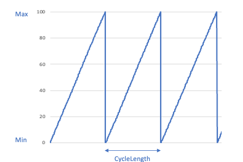

# Simulator Configuration

[SFC Configuration](../core/sfc-configuration.md) > [Sources](../core/sfc-configuration.md#sources) >  [Source](../core/source-configuration.md) 

The Simulator Adapter is a special-purpose adapter that generates synthetic data using [configurable simulations](#simulations) instead of reading data from physical industrial devices. This makes it ideal for testing, development, and demonstration purposes without requiring actual hardware.

Unlike other adapters that interface with industrial protocols and devices, the Simulator Adapter uses [simulation configurations](#simulations) to generate data values. Each channel in the adapter configuration contains one or more simulations that define how values should be generated.

In order to use this adapter as in [in-process](../sfc-running-adapters.md#running-protocol-adapters-in-process) type adapter the type must be added to the [AdapterTypes](../core/sfc-configuration.md#adaptertypes) section in the [SFC configuration file](../core/sfc-configuration.md).

```json
"AdapterTypes" :{
  "SIMULATOR" : {
    "JarFiles" : ["<location of deployment>/simulator/lib"]
  },
  "FactoryClassName" :"com.amazonaws.sfc.simulator.SimulatorAdapter"
}
```

**Configuration:**

- [SimulatorSourceConfiguration](#simulatorsourceconfiguration)
- [SimulatorChannelConfiguration](#simulatorchannelconfiguration)
- [SimulatorAdapterConfiguration](#simulatoradapterconfiguration)
- [**Simulations**](#simulations)


- [Simulation to OPCUA Example](#simulation-to-opc-ua-example)


## SimulatorSourceConfiguration

Source configuration for the Simulator protocol adapter. This type extends the [SourceConfiguration](../core/source-configuration.md) type. 

- [Schema](#simulatorsourceconfiguration-schema)
- [Example](#simulatorsourceconfiguration-example)

**Properties:**

- [Channels](#channels)

---
### Channels
The channels of a simulator source hold the configuration for the [simulation](#simulations) that generates the simulation values. Each channel is represented as a map indexed by its channel identifier. Channels can be "commented out" by prefixing their identifier with a "#".

**Type**: Map[String,[SimalatorChannelConfiguration](#simulatorchannelconfiguration)]

At least 1 channel must be configured.

[^top](#simulator-configuration)

### SimulatorSourceConfiguration Schema

```json
{
  "$schema": "http://json-schema.org/draft-07/schema#",
  "definitions": {
    "SimulationSourceConfiguration": {
      "type": "object",
      "description": "Configuration for Simulator source adapter",
      "allOf": [
        {
          "$ref": "#/definitions/BaseSourceConfiguration"
        },
        {
          "type": "object",
          "properties": {
            "Channels": {
              "type": "object",
              "description": "Map of Simulator channel configurations",
              "additionalProperties": {
                "$ref": "#/definitions/SimulatorChannelConfiguration"
              },
              "minProperties": 1
            }
          },
          "required": [
            "Channels"
          ]
        }
      ]
    }
  }
}

```

### SimulatorSourceConfiguration Example

```json
{
  "ProtocolAdapter": "SimulatorAdapter",
  "Channels": {
    "counter": {
      "Simulation": {
        "SimulationType": "Counter",
        "DataType": "Int",
        "Min": 0,
        "Max": 100
      }
    },
    "sinus": {
      "Simulation": {
        "SimulationType": "Sinus",
        "DataType": "Byte",
        "Min": 0,
        "Max": 100
      }
    },
    "triangle": {
      "Simulation": {
        "SimulationType": "Triangle",
        "DataType": "Byte",
        "Min": 0,
        "Max": 100
      }
    }
  }
}
```


## SimulatorChannelConfiguration

[SFC Configuration](../core/sfc-configuration.md) > [Sources](../core/sfc-configuration.md#sources) > [Source](../core/source-configuration.md)  > [Channels](../core/source-configuration.md#channels) > [Channel](../core/channel-configuration.md)


The SimulatorChannelConfiguration type extends the [ChannelConfiguration](../core/channel-configuration.md) class with channel properties for the Simulator protocol adapter.

- [Schema](#simulatorchannelconfiguration-schema)
- [Examples](#simulatorchannelconfiguration-examples)

**Properties:**
- [Simulation](#simulation)

---
### Simulation

The configuration for the simulation that generates values for this channel. The simulation determines how and what kind of values are produced. Required property that must contain a valid  [simulation configuration](#simulations)  object.

**Type:** Simulation


---

[^top](#simulator-configuration)

### SimulatorChannelConfiguration Schema

```json
{
  "$schema": "http://json-schema.org/draft-07/schema#",
  "type": "object",
  "description": "Configuration for Simulator channel",
  "allOf": [
    {
      "$ref": "#/definitions/ChannelConfiguration"
    },
    {
      "type": "object",
      "properties": {
        "Simulation": {
          "type": "#/definitions/Simulation"
        }
      },
      "required": [
        "Simulation"
      ]
    }
  ]
}
```


[^top](#simulator-configuration)


### SimulatorChannelConfiguration Examples

Defines  a channel that uses a [counter simulation](#counter) to count from 0 to 100 and returns an integer value.

```json
{
  "Simulation": {
    "SimulationType": "Counter",
    "DataType": "Int",
    "Min": 0,
    "Max": 100
  }
}
```


Defines a channel that utilizes the [sinus simulation](#sinus) algorithm to generate a byte value that ranges from 0 to 100.

```json
{
    "Simulation": {
       "SimulationType": "Sinus",
       "DataType": "Byte",
       "Min": 0,
       "Max": 100
    }
}
```


Defines a channel that utilizes the [random simulation](#random) algorithm to generate a byte value that ranges between 0 (inclusive)  and 100 (exclusive)

```json
{
    "Simulation": {
       "SimulationType": "Random",
       "DataType": "Byte",
       "Min": 0,
       "Max": 100
    }
}
```

[^top](#simulator-configuration)


## SimulatorAdapterConfiguration

[SFC Configuration](../core/sfc-configuration.md) > [ProtocolAdapters](../core/sfc-configuration.md#protocoladapters) > [Adapter](../core/protocol-adapter-configuration.md) 

SimulatorAdapterConfiguration extents  the [AdapterConfiguration](../core/protocol-adapter-configuration.md) for the Simulator

- [Schema](#simulatoradapterconfiguration-schema)
- [Example](#simulatoradapterconfiguration-example)


[^top](#simulator-configuration)

### SimulatorAdapterConfiguration Schema

```json
{
  "$schema": "http://json-schema.org/draft-07/schema#",
  "type": "object",
  "description": "Configuration for Simulator adapter",
  "allOf": [
    {
      "$ref": "#/definitions/AdapterConfiguration"
    }
  ]
}
```

### SimulatorAdapterConfiguration Example

```json
{
  "AdapterType": "SIMULATOR"
}
```

[^top](#simulator-configuration)


---


# Simulations

Simulations are used to generate values.

There are two types of simulations:

- [Value simulations](#value-simulations) - These simulations generate actual values directly (like constant values, sine waves, or random numbers)

- [Composite simulations](#composite-simulations) - Composite simulations are simulations that contain one or more embedded simulations to generate actual values. These simulations allow complex behaviors to be built by combining simulations.

  

## Value simulations:

- [Constant](#constant)

- [Counter](#counter)

- [Random](#random)

- [Range](#range)

- [Sawtooth](#sawtooth)

- [Sinus](#sinus)

- [Square](#square)

- [Triangle](#triangle)

  

## Composite simulations

- [Buffered](#buffered)
- [Interval](#interval-2)
- [List](#list)
- [Structure](#structure)


## Constant

The Constant simulation type of simulation returns a constant value or an array of values of a specific data type.

- [Schema](#constant-schema)
- [Examples](#constant--examples)

**Properties:**

- [DataType](#datatype)
- [SimulationType](#simulationtype)
- [Value](#value)

---

### DataType

The data type of the returned constant value or the elements of an array, if applicable.

Possible values are:

- `Boolean`
- `Byte`
- `Short`
- `Int`
- `Long`
- `Float`
- `Double`
- `String`
- `Char`
- `UByte`
- `UShort`
- `UInt`
- `ULong`

**Type:** String

---

### SimulationType

Type of the simulation, value is "**Constant**".

---

### Value

The return value of the simulation function must be of the specified type or compatible with that type. The return value can be a single value or an array of values.

**Type:** Must match or be compatible with the Constant simulation's defined data type

---


## Constant schema

```json
{
  "$schema": "http://json-schema.org/draft-07/schema#",
  "type": "object",
  "description": "Configuration constant simulation",
  "properties": {
    "SimulationType": {
      "type": "String",
      "enum": "Constant"
    },
    "DataType": {
      "type": "String",
      "enum": [
        "Boolean",
        "Byte",
        "Short",
        "Int",
        "Long",
        "Float",
        "Double",
        "String",
        "Char",
        "UByte",
        "UShort",
        "ULong"
      ],
      "description": "Type of the returned value"
    },
    "Value": {
      "type": "any",
      "description": "Value returned by the simulation"
    }
  },
  "required": [
    "DataType",
    "SimulationType",
    "Value"
  ]
}
```


## Constant  examples

Simulation returning a a 16-bit interger value of 100

```json
{
  "SimulationType" : "Constant",
  "DataType" : "Short",
  "Value" : "100"
}
```


Simulation returning boolean type value of false

```json
{
  "SimulationType" : "Constant",
  "DataType" : "Boolean",
  "Value" : false
}
```


Simulation returning float type value of 3.14

```json
{
  "SimulationType" : "Constant",
  "DataType" : "Float",
  "Value" : 3.14
}
```


Simulation returning array of bytes

```json
{
 "SimulationType" : "Constant",
  "DataType" : "Byte"
  "Value" : [1,2,3,4]
}
```


## Counter

A Counter Simulation generates sequential values that change by a fixed amount each time a value is returned. The counter can operate in two directions: incrementing (counting up) or decrementing (counting down).

For incrementing counters, ([Direction](#direction) is set to "UP"):

- Starts at the minimum value (specified by [Min](#min) property, defaults to 0)
- Increases by the [Step](#step) amount with each value returned, defaults to 1.
- When reaching or exceeding the maximum value (specified by [Max](#max) property, or type's maximum), resets to the start value

For decrementing counters  ([Direction](#direction) is set to "DOWN"):

- Starts at the maximum value (specified by [Max](#max) property, or type's maximum)
- Decreases by the [Step](#step) amount with each value returned
- When reaching or falling below the minimum value (specified by [Min](#min) property, or type's minimum), resets to the start value.

- [Schema](#counter-schema)
- [Examples](#counter-examples)

**Properties:**

- [DataType](#datatype-2)

- [Direction](#direction)

- [Max](#max)

- [Min](#min)

- [SimulationType](#simulationtype-2)

- [Size](#size)

- [Step](#step)

  

---

### DataType

The data type of the returned counter value or the elements of an array, if applicable.

Possible values are:

- `Byte`
- `Short`
- `Int`
- `Long`
- `Float`
- `Double`
- `UByte`
- `UShort`
- `UInt`
- `ULong`

**Type:** String

---

### Direction

Controls the direction of the counter.

- "UP" for incrementing (Default), starts counting up from at [Min](#min) value
- "DOWN" for decrementing,  starts counting down from at [Max](#max) value

**Type:** String

---

### Max

Sets the upper boundary and starting point for decrementing counters. The default value is the maximum value for the data type of the counter.

**Type :**  Compatible number with type of counter

---

### Min

Sets the lower boundary and starting point for incrementing counters. The default value is 0.

**Type :**  Compatible number with type of counter

---

### SimulationType

Type of the simulation, value is "**Counter**".

**Type:** String

---

### Size

Controls output format:

- When set to 0, returns individual values
- When greater than 0, returns an array of values of the specified size, incrementing or decrementin the counter value for every returned item.

**Type:** Int

---

### Step

The amount to change by each time (defaults to 1)

**Type:** Compatible number with type of counter

---


## Counter schema

```json
{
  "$schema": "http://json-schema.org/draft-07/schema#",
  "type": "object",
  "description": "Configuration counter simulation",
  "properties": {
   "SimulationType": {
      "type": "string",
      "enum" : ["Counter"]
    },
    "Size": {
      "type" : "int"
    },
    "Direction": {
      "type" : "string",
      "enum" : ["UP", "DOWN"]
      "default": "UP"
    },
    "Max": {
      "type" : "number"
    },
    "Min": {
      "type" : "number"
    },
    "Step": {
      "type" : "number"
    },
     "DataType": {
      "type": "String",
      "enum": [
        "Byte",
        "Short",
        "Int",
        "Long",
        "Float",
        "Double",
        "UByte",
        "UShort",
        "ULong"
      ],
      "description": "Type of the returned value"
    },
    
  },
  "required": ["SimulationType", "DataType"]
}
```


## Counter examples

Counter returning an integer value

Returned Values: 0, 1, 2, 3, 4, .... MAXINT

```json
{
  "SimulationType" : "Counter",
  "DataType" : "Int"
}
```


Counter returning a byte value with a custom step size of 2.

Returned Values:  0, 2, 4, .... 100, then reset to 0

```json
{
  "SimulationType" : "Counter",
  "Step" : 2,
  "Max" : 100,
  "DataType" : "Byte"
}
```


Counter counting down from 100 to 0,, then reset at 0 

Returned values: 100, 99, 98, ... 0, 100, 99, 98...

```json
{
  "SimulationType" : "Counter",
  "Direction" : "DOWN",
  "Max" : 100,
  "Min" : 0,
  "DataType" : "Int"
}
```


Counter counting  up from  0 to 255, which is the maximum value for an Unsigned Byte value, then reset to 0

Returned values:  0,  1, 2,  3, ...255

```json
{
  "SimulationType" : "UByteCounter",
}
```


Counter counting down from  0 to -128 which is the minumum value for a Byte value, then rest to 0

Returned values 0, -1, -2, ... -128

```json
{
  "SimulationType" : "ByteCounter",
  "Direction" : "DOWN",
  "Max" : 0
}
```


Counter returning multiple values

Returned values [0,1], [2,3], [4,5]...

```json
{
 "SimulationType" : "IntCounter",
  "Direction" : "UP",
  "ArraySize" : 2
}
```


Counter with fractional step

Returned values 0.0, 0.5, 1.0, 1.5...

```json
{
  "SimulationType" : "Counter",
  "Direction" : "UP",
  "DataType" : "Float",
  "Step" : 0.5
}
```


Counter returning integer array values

Returned values [0,1],  [2,3], [4,5]...

```json
 {
   "SimulationType" : "Counter",
   "DataType" : "Int",
   "Size" : 2
 }
```


## Random

Random Simulation generates random values within a specified range. It requires a minimum value, maximum value, and data type. Optionally, it can generate an array of random values when an array size is specified. 

- [Schema](#random-schema)
- [Examples](#random-examples)

**Properties:**

- [DataType](#datatype-3)

- [Max](#max-2)

- [Min](#min-2)

- [SimulationType](#simulationtype-3)

- [Size](#size-2)

  

### DataType

The data type of the returned random value or the elements of an array, if applicable.

Possible values are:

- `Boolean`

- `Byte`
- `Short`
- `Int`
- `Long`
- `Float`
- `Double`
- `UByte`
- `UShort`
- `UInt`
- `ULong`

**Type:** String

---

### Max

Maximum value (non-inclusive) for the random number generation. Must be greater than or equal to the minimum value and must be compatible with the specified data type. This value is ignored for [DataType](#datatype-3) "Boolean". When this proprty is ommited the maximum value of the specified [DataType](#datatype-3) is used.

**Type :**  Number

---

### Min

Minimum value (inclusive) for the random number generation. Must be less than or equal to the maximum value and must be compatible with the specified data type. This value is ignored for [DataType](#datatype-3) "Boolean". When this proprty is ommited the minimum value of the specified [DataType](#datatype-3) is used.

**Type :**  Number

---

### SimulationType

Type of the simulation, value is "**Random**".

**Type:** String

---

### Size

Controls output format:

- When set to 0, returns individual values
- When greater than 0, returns an array of values of the specified size, incrementing or decrementin the counter value for every returned item.

**Type:** Int


## Random schema

```json
{
  "$schema": "http://json-schema.org/draft-07/schema#",
  "type": "object",
  "description": "Configuration random simulation",
  "properties": {
   "SimulationType": {
      "type": "string",
      "enum" : ["Random"]
    },
    "Size": {
      "type" : "int"
    },
    "Max": {
      "type" : "number"
    },
    "Min": {
      "type" : "number"
    },
     "DataType": {
      "type": "String",
      "enum": [
        "Boolean"
        "Byte",
        "Short",
        "Int",
        "Long",
        "Float",
        "Double",
        "UByte",
        "UShort",
        "ULong"
      ],
      "description": "Type of the returned value"
    },
    
  },
  "required": ["SimulationType", "DataType"]
}
```


## Random examples

Random integer values within the range of 0 (inclusive) and the range of 100 (exclusive).

```json
{
   "SimulationType" : "Random",
   "DataType" : "Int",
   "Min" : 0,
   "Max" : 100
}
```

Random byte values between -128 (inclusive) and 127 (exclusive).

```json
{
  "SimulationType" : "Random",
  "DataType" : "Byte"
}
```


Arrays containing 10 integer random values between 0 (inclusive) and 100 (inclusive).

```json
{
  "SimulationType" : "Random",
  "DataType" : "Int",
  "Min": 0,
  "Max" : 100,
  "Size" : 10
}
```


## Range

Returns values, or arrays of values, from a set of values configured for the simulation. Values are returned either sequentially or randomly selected from the range values.

- [Schema](#range-schema)
- [Examples](#range-examples)

**Properties:**

- [DataType](#datatype-4)

- [Random](#random-2)

- [SimulationType](#simulationtype-4)

- [Size](#size-3)

- [Values](#values)

  

### DataType

The data type of the returned range value or the elements of an array, if applicable.

Possible values are:

- `Boolean`

- `Byte`
- `Short`
- `Int`
- `Long`
- `Float`
- `Double`
- `String`
- `Char`
- `UByte`
- `UShort`
- `UInt`
- `ULong`

**Type:** String

---

### Random

Controls whether values are returned in random or sequential order. When set to true, values will be selected randomly from the specified [range values](#values). When set to false (default), values will be returned in sequential order, cycling back to the beginning after reaching the end of the range.

**Type:** Boolean

---

### SimulationType

Type of the simulation, value is "**Range**".

**Type:** String

---

### Size

Controls output format:

- When set to 0, returns individual values
- When greater than 0, returns an array of values of the specified size, selecting a new value from the range values for every item.

**Type:** Int

---

### Values

One or more values used by the Range simulation that will be returned as output values. The values must be compatible with the type specified in the DataType property and can include array values. When the [Random](#random-2) property is set to true, items are selected randomly from these values. When [Random](#random-2) is false (default), values are returned sequentially in order, cycling back to the beginning after reaching the end of the list.

Type: Any value compatible with type specified by [DataType](#datatype-4)


## Range schema

```json
{
  "$schema": "http://json-schema.org/draft-07/schema#",
  "type": "object",
  "description": "Configuration range simulation",
  "properties": {
   "SimulationType": {
      "type": "string",
      "enum" : ["Range"]
    },
    "Size": {
      "type" : "int"
    },
    "DataType": {
      "type": "String",
      "enum": [
        "Boolean",
        "Byte",
        "Short",
        "Int",
        "Long",
        "Float",
        "Double",
        "String",
        "Char",
        "UByte",
        "UShort",
        "ULong"
      ],
      "description": "Type of the returned value"
    },
    
  },
  "required": ["SimulationType", "DataType", "Values"]
}
```


## Range examples


Returned integer values 1, 3, 5, 7...31 and cycling back to 1 after value 31

```json
{
  "SimulationType" : "Range",
  "DataType" : "Int",
  "Values" : [1, 3, 5, 7, 11, 13, 17, 19, 23, 29, 31]
}
```


Returns values from the range as arrays of size 2, with the returned values being [1, 3], [5, 7], [11, 13], and so on.

```json
{
  "SimulationType" : "Range",
  "DataType" : "Int",
  "Values" : [1, 3, 5, 7, 11, 13, 17, 19, 23, 29, 31],
  "Size" : 2
}
```


Returns values from range in random order.

```json
{
  "SimulationType" : "Range",
  "DataType" : "Int",
  "Values" : [1, 3, 5, 7, 11, 13, 17, 19, 23, 29, 31],
  "Random" : true
}
```


## Sawtooth

Returns values using a sawtooth wave pattern, where values increase linearly from a minimum to a maximum value and then reset back to the minimum to start the pattern again. The pattern repeats continuously throughout the simulation.

- [Schema](#sawtooth-schema)
- [Examples](#sawtooth-examples)

**Properties:**

- [CycleLength](#cyclelength)

- [DataType](#datatype-5)
- [Max](#max-3)
- [Min](#min-3)
- [SimulationType](#simulationtype-5)
- [Size](#size-4)


---

### CycleLength

Length of a sawtooth cycle in milliseconds, representing the time taken for the value to increase linearly from the minimum to maximum value before resetting back to the minimum value. The default cyclelength  is 10000 (10 sec).

---

### DataType

The data type of the returned sawtooth value or the elements of an array, if applicable.

Possible values are:

- `Byte`
- `Short`
- `Int`
- `Long`
- `Float`
- `Double`
- `UByte`
- `UShort`
- `UInt`
- `ULong`

**Type:** String

---

### Max

Maximum value (non-inclusive) for the sawtooth number generation. Must be greater than or equal to the [minimum](#min-3) value and must be compatible with the specified [data type](#datatype-5). The default value is 100.

**Type :**  Number

---

### Min

Minimum value (inclusive) for the sawtooth number generation. Must be less than or equal to the [maximum](#max-3) value and must be compatible with the specified [data type](#datatype-5). The default value is 0.

**Type :**  Number

---

### SimulationType

Name of the simulation, value is "**Sawtooth**".

**Type:** String

---

### Size

Controls output format:

- When set to 0, returns individual values
- When greater than 0, returns an array of values of the specified size,.

**Type:** Int

## Sawtooth schema

```json
{
  "$schema": "http://json-schema.org/draft-07/schema#",
  "type": "object",
  "description": "Configuration sawtooth simulation",
  "properties": {
   "SimulationType": {
      "type": "string",
      "enum" : ["Sawtooth"]
    },
    "Size": {
      "type" : "int"
    },
    "Max": {
      "type" : "number"
    },
    "Min": {
      "type" : "number"
    },
    "CycleLength":{
      "type" : "integer",
      "default" : 10000
    },
     "DataType": {
      "type": "String",
      "enum": [
        "Byte",
        "Short",
        "Int",
        "Long",
        "Float",
        "Double",
        "UByte",
        "UShort",
        "ULong"
      ],
      "description": "Type of the returned value"
    },
    
  },
  "required": ["SimulationType", "DataType"]
}
```


## Sawtooth examples

Integer values within the range of 0 (inclusive) and the 100 (inclusive).

```json
{
   "SimulationType" : "Sawtooth",
   "DataType" : "Int",
   "Min" : 0,
   "Max" : 100
}
```




Integer values within the range of 100 (inclusive) and the range of 200 (inclusive).

```json
{
   "SimulationType" : "Sawtooth",
   "DataType" : "Int",
   "Min" : 100,
   "Max" : 200
}
```


Simulation return arrays values  containing 10 integer  values between 0 (inclusive) and 100 (inclusive).

```json
{
  "SimulationType" : "SawTooth",
  "DataType" : "Int",
  "Min": 0,
  "Max" : 100,
  "Size" : 10
}
```


## Sinus

Returns values using a sine wave pattern, where values oscillate smoothly between minimum and maximum values following a sinusoidal curve. The pattern repeats continuously throughout the simulation.

- [Schema](#sinus-schema)
- [Examples](#sinus-examples)

**Properties:**

- [CycleLength](#cyclelength-2)
- [DataType](#datatype-6)
- [Max](#max-4)
- [Min](#min-4)
- [SimulationType](#simulationtype-6)
- [Size](#size-5)
- [Shift](#shift)

---

### CycleLength

Length of a sine wave cycle in milliseconds, representing the time taken for one complete oscillation from [minimum](#min-4) to [maximum](#max-4) and back to [minimum](#min-4) value, completing a full 360-degree cycle. The default cyclelength  is 10000 (10 sec).

---

### DataType

The data type of the returned sinus value or the elements of an array, if applicable.

Possible values are:

- `Byte`
- `Short`
- `Int`
- `Long`
- `Float`
- `Double`
- `UByte`
- `UShort`
- `UInt`
- `ULong`

**Type:** String

---

### Max

Maximum value (non-inclusive) for the sinus number generation. Must be greater than or equal to the [minimum](#min-4) value and must be compatible with the specified [data type](#datatype-6). The default value is 100.

**Type :**  Number

---

### Min

Minimum value (inclusive) for the sinus number generation. Must be less than or equal to the [maximum](#max-4) value and must be compatible with the specified [data type](#datatype-6). The default value is 0.

**Type :**  Number

---

### SimulationType

Type of the simulation, value is "**Sinus**".

**Type:** String

---

### Size

Controls output format:

- When set to 0, returns individual values
- When greater than 0, returns an array of values of the specified size,.

**Type:** Int

---

### Shift

The Shift property specifies the starting phase angle (in degrees) of the sine wave, accepting values between 0 and 360 degrees. This determines where in the sine wave cycle the simulation begins generating values. For example, a shift of 90 degrees would start the sine wave at its maximum value, while a shift of 180 degrees would start at zero but decreasing.

## Sinus schema

```json
{
  "$schema": "http://json-schema.org/draft-07/schema#",
  "type": "object",
  "description": "Configuration sinus simulation",
  "properties": {
   "SimulationType": {
      "type": "string",
      "enum" : ["Sinus"]
    },
    "Size": {
      "type" : "int"
    },
    "Max": {
      "type" : "number"
    },
    "Min": {
      "type" : "number"
    },
    "CycleLength":{
      "type" : "integer",
      "default" : 10000
    },
    "Shift": {
      "type" : "integer"
    },
     "DataType": {
      "type": "String",
      "enum": [
        "Byte",
        "Short",
        "Int",
        "Long",
        "Float",
        "Double",
        "UByte",
        "UShort",
        "ULong"
      ],
      "description": "Type of the returned value"
    },
    
  },
  "required": ["SimulationType", "DataType"]
}
```


## Sinus examples

Integer values within the range of 0 to 100

```
{
   "SimulationType" : "Sinus",
   "DataType" : "Int",
   "Min" : 0,
   "Max" : 100
}
```


Integer values within the range of 100 to 200.

```
{
   "SimulationType" : "Sinus",
   "DataType" : "Int",
   "Min" : 100,
   "Max" : 200
}
```


## Square

Returns values using a square wave pattern, where values alternate between minimum and maximum values with abrupt transitions. The pattern switches instantly between the two levels and repeats continuously throughout the simulation.

- [Schema](#square-schema)
- [Examples](#square-examples)

**Properties:**

- [CycleLength](#cyclelength-3)

- [DataType](#datatype-7)

- [Max](#max-5)

- [Min](#min-5)

- [SimulationType](#simulationtype-7)

- [Size](#size-6)

  

---

### CycleLength

Length of a square wave cycle in milliseconds, representing the time taken for one complete cycle consisting of both the high (maximum) and low (minimum) states before repeating the pattern. The default cyclelength  is 10000 (10 sec).

---

### DataType

The data type of the returned square  value or the elements of an array, if applicable.

Possible values are:

- `Boolean`
- `Byte`
- `Short`
- `Int`
- `Long`
- `Float`
- `Double`
- `String`
- `Char`
- `UByte`
- `UShort`
- `UInt`
- `ULong`

**Type:** String

---

### Max

Maximum value for the square wave generation. Must be greater than or equal to the [minimum](#min-5) value and must be compatible with the specified [data type](#datatype-7). The value represents the upper level of the square wave. The default value is 100.

**Type :**  Number

---

### Min

Minimum value for the square wave generation. Must be less than or equal to the [maximum](#max-5) value and must be compatible with the specified [data type](#datatype-7). The value represents the lower level of the square wave. The default value is 0.

**Type :**  Number

---

### SimulationType

Type of the simulation, value is "**Square**".

**Type:** String

---

### Size

Controls output format:

- When set to 0, returns individual values
- When greater than 0, returns an array of values of the specified size,.

**Type:** Int

---


## Square schema

```json
{
  "$schema": "http://json-schema.org/draft-07/schema#",
  "type": "object",
  "description": "Configuration square simulation",
  "properties": {
   "SimulationType": {
      "type": "string",
      "enum" : ["Square"]
    },
    "Size": {
      "type" : "int"
    },
    "Max": {
      "type" : "number"
    },
    "Min": {
      "type" : "number"
    },
    "CycleLength":{
      "type" : "integer",
      "default" : 10000
    },
    "DataType": {
      "type": "String",
      "enum": [
        "Boolean",
        "Byte",
        "Short",
        "Int",
        "Long",
        "Float",
        "Double",
        "String",
        "Char",
        "UByte",
        "UShort",
        "ULong"
      ],
      "description": "Type of the returned value"
    },
    
  },
  "required": ["SimulationType", "DataType"]
}
```


## Square examples

Integer values within the range of 0 to 100

```
{
   "SimulationType" : "Square",
   "DataType" : "Int",
   "Min" : 0,
   "Max" : 100
}
```


Integer values within the range of 100 to 200.

```
{
   "SimulationType" : "Square",
   "DataType" : "Int",
   "Min" : 100,
   "Max" : 200
}
```


## Triangle

Returns values using a triangle wave pattern, where values increase and decrease linearly between minimum and maximum values. The pattern creates a series of triangular shapes with equal rising and falling slopes, repeating continuously throughout the simulation.

- [Schema](#square-schema)
- [Examples](#square-examples)

**Properties:**

- [CycleLength](#cyclelength-3)

- [DataType](#datatype-8)

- [Max](#max-6)

- [Min](#min-6)

- [SimulationType](#simulationtype-7)

- [Size](#size-6)

  

---

### CycleLength

Length of a square wave cycle in milliseconds, representing the time taken for one complete cycle consisting of both the high (maximum) and low (minimum) states before repeating the pattern. The default cyclelength  is 10000 (10 sec).

---

### DataType

The data type of the returned triangle value or the elements of an array, if applicable.

Possible values are:

- `Boolean`
- `Byte`
- `Short`
- `Int`
- `Long`
- `Float`
- `Double`
- `String`
- `Char`
- `UByte`
- `UShort`
- `UInt`
- `ULong`

**Type:** String

---

### Max

Maximum value for the triangle wave generation. Must be greater than or equal to the [minimum](#min-6) value and must be compatible with the specified [data type](#datatype-8). The value represents the upper level of the square wave. The default value is 100.

**Type :**  Number

---

### Min

Minimum value for the triangle wave generation. Must be less than or equal to the [maximum](#max-6) value and must be compatible with the specified [data type](#datatype-8). The value represents the lower level of the square wave. The default value is 0.

**Type :**  Number

---

### SimulationType

Name of the simulation, value is "**Triangle**".

**Type:** String

---

### Size

Controls output format:

- When set to 0, returns individual values
- When greater than 0, returns an array of values of the specified size,.

**Type:** Int

---


## Triangle schema

```json
{
  "$schema": "http://json-schema.org/draft-07/schema#",
  "type": "object",
  "description": "Configuration square simulation",
  "properties": {
   "SimulationType": {
      "type": "string",
      "enum" : ["Triangle"]
    },
    "Size": {
      "type" : "int"
    },
    "Max": {
      "type" : "number"
    },
    "Min": {
      "type" : "number"
    },
    "CycleLength":{
      "type" : "integer",
      "default" : 10000
    },
    "DataType": {
      "type": "String",
      "enum": [
        "Byte",
        "Short",
        "Int",
        "Long",
        "Float",
        "Double",
        "String",
        "Char",
        "UByte",
        "UShort",
        "ULong"
      ],
      "description": "Type of the returned value"
    },
    
  },
  "required": ["SimulationType", "DataType"]
}
```


## Triangle examples

Integer values within the range of 0 to 100

```
{
   "SimulationType" : "Triangle",
   "DataType" : "Int",
   "Min" : 0,
   "Max" : 100
}
```


Integer values within the range of 100 to 200.

```
{
   "SimulationType" : "Triangle",
   "DataType" : "Int",
   "Min" : 100,
   "Max" : 200
}
```


## Buffered

The Buffered simulation acts as a wrapper around another simulation, collecting values over a specified time period without immediately returning them. Instead of providing values in real-time, it accumulates the generated values along with their timestamps, and releases them as a batch when the collection period ends. This behavior emulates systems that use subscription-based data collection, such as MQTT or NATS messaging systems in KeepAll reading mode, where multiple values may be received during a single reading cycle before being processed together.

- [Schema](#buffered-schema)
- [Examples](#buffered-examples)

**Properties:**

- [Interval](#interval)

- [Item](#item)

- [SimulationType](#simulationtype-9)

  

---

### Interval

Length of the collection period in milliseconds during which values from the [embedded simulation item](#item) are accumulated. At the end of each interval, all collected values and their corresponding timestamps are returned as a batch. The default value is 1000 milliseconds.

**Type:** Int

---

### Item

The embedded simulation that generates the actual values to be buffered. This simulation runs continuously, and its values are collected and timestamped during each [interval period](#interval) before being returned as a batch. 

**Type**: Simulation

---

### SimulationType

Type of the simulation, value is "**Buffered**".

**Type:** String

---

## Buffered schema

```json
{
  "$schema": "http://json-schema.org/draft-07/schema#",
  "type": "object",
  "description": "Configuration buffered simulation",
  "properties": {
   "SimulationType": {
      "type": "string",
      "enum" : ["Buffered"]
    },
    "Item": {
      "$ref": "#/definitions/Simulation"
    },
    "Interval": {
      "type" : "integer",
      "default" : 1000
    }
  },
  "required": ["SimulationType", "Item"]
}
```


## Buffered examples

This simulation buffers values returned from the embedded Random simulation, which generates random integers between 0 and 100. When queried for values, it does not return any until the 5000ms interval period has expired, after which it returns all collected values with their timestamps.

```json
{
  "SimulationType": "Buffered",
  "Interval": 5000,
  "Item": {
   "SimulationType": "Random",
    "DataType": "Int",
    "Min": 0,
    "Max": 100
  }
}
```

If the simulation is queried for a value every second, it will return no values for the first four queries. However, on the fifth query, it will return the following collected values:

 `[`
	`(2025-03-19T16:51:30.941798Z, 99),`
	`(2025-03-19T16:51:30.970677Z, 67,`
	`(2025-03-19T16:51:30.989699Z, 38),`
	`(2025-03-19T16:51:31.008582Z, 60),`
	`(2025-03-19T16:51:31.024338Z, 55)`
`]`


## Interval

The Interval simulation wraps another simulation and controls when its values are returned based on a specified time interval. Unlike the Buffered simulation, it doesn't collect values during the interval period. Instead, it only returns a single value from the embedded simulation when the interval period expires. This creates a time-based filter that limits how frequently values are provided, regardless of how often the simulation is queried for values.

- [Schema](#interval-schema)
- [Example](#interval-example)

**Properties:**

- [Interval](#interval-3)

- [Item](#item-1)

- [SimulationType](#simulationtype-10)

  

---

### Interval

Length of the interval period in milliseconds. The simulation will only return a value from the [embedded simulation item](#item-1) after this time period has elapsed since the last returned value. The default value is 1000 milliseconds.

**Type:** Int

---

### Item

The embedded simulation that generates values is queried for its value every time the Interval simulation is queried. However, it only returns its value after the specified [interval](#interval-3) period has elapsed.

**Type**: Simulation

---

### SimulationType

Type of the simulation, value is "**Interval**".

**Type:** String

---

## Interval schema

```json
{
  "$schema": "http://json-schema.org/draft-07/schema#",
  "type": "object",
  "description": "Configuration interval simulation",
  "properties": {
   "SimulationType": {
      "type": "string",
      "enum" : ["Interval"]
    },
    "Item": {
       "$ref": "#/definitions/Simulation"
    },
    "Interval": {
      "type" : "integer",
      "default" : 1000
    }
  },
  "required": ["SimulationType", "Item"]
}
```


## Interval example

This simulation buffers values returned from the embedded Random simulation, which generates random integers between 0 and 100. When queried for values, it does not return any until the 5000ms interval period has expired, after which it returns just the last value.

```json
{
  "SimulationType": "Interval",
  "Interval": 5000,
  "Item": {
   "SimulationType": "Random",
    "DataType": "Int",
    "Min": 0,
    "Max": 100
  }
}
```


## List

The List simulation contains multiple embedded simulations and returns their values as a combined list. When queried, it collects the current value from each simulation in its list and returns them together as an array. This allows for grouping multiple simulations and retrieving their values simultaneously in a single operation as a list of values.

- [Schema](#list-schema)
- [Examples](#list-example)

**Properties:**

- [DataType](#datatype-9)

- [Items](#items)

- [SimulationType](#simulationtype-11)

---


### DataType

The data type of all values returned by the [embedded simulation items](#items). The data types of all simulations specified in the Items property must be either the same as this type or compatible with it through conversion.

Possible values are:

- `Boolean`
- `Byte`
- `Short`
- `Int`
- `Long`
- `Float`
- `Double`
- `String`
- `Char`
- `UByte`
- `UShort`
- `UInt`
- `ULong`

**Type:** String

---

### Items

A list of one or more embedded simulations that generate the values. The data type of each simulation must be the same as, or compatible with, the data type specified in the [DataType](#datatype-8) property of the List simulation.

**Type**:  List of  Simulation

---

### SimulationType

Type of the simulation, value is "**List**".

**Type:** String

---

## List schema

```json
{
  "$schema": "http://json-schema.org/draft-07/schema#",
  "type": "object",
  "description": "Configuration list simulation",
  "properties": {
    "SimulationType": {
      "type": "string",
      "enum" : ["List"]
    },
    "Items": {
      "type": "array",
      "items": {
        "$ref": "#/definitions/Simulation"
      },
      "minItems": 1
     }
  },
  "required": ["SimulationType", "Items", "DataType"]
}
```


## List example

This simulation collects the values from three embedded simulations and returns the values of these simulations, as a list of values, every time it is queried.

```json
{
      "SimulationType": "List",
      "DataType": "Int",
      "Items": [
        {
          "SimulationType": "Random",
          "DataType": "Int",
          "Min": 0,
          "Max": 10
        },
        {
          "SimulationType": "Sinus",
          "DataType": "Int",
          "Min": 0,
          "Max": 10
        },
        {
         "SimulationType": "Triangle",
          "DataType": "Int",
          "Min": 0,
          "Max": 10
        }
      ]
    }
```


## Structure

The Structure simulation organizes multiple [embedded simulations](#properties) as named properties in a map. When queried, it collects the current value from each embedded simulation and returns them as a structure where each value is accessible by the simulation's name. This allows for creating composite values where each component has a meaningful identifier

- [Schema](#structure-schema)
- [Examples](#structure-example)

**Properties:**

- [Properties](#properties)

- [SimulationType](#simulationtype-11)

---

### Properties

A map of embedded simulations where each key is the name of the simulation and the value is the simulation configuration. Each embedded simulation can have its own data type, as the Structure simulation returns a map where each value maintains its original type.

**Type**:  Map[String, Simulation]

---

### SimulationType

Type of the simulation, value is "**Structure**".

**Type:** String

---

## Structure schema

```json
{
  "$schema": "http://json-schema.org/draft-07/schema#",
  "type": "object",
  "description": "Configuration structure simulation",
  "properties": {
    "SimulationType": {
      "type": "string",
      "enum" : ["Structure"]
    },
    "Properties":{
      "type": "object",
      "additionalProperties": {
        "$ref": "#/definitions/Simulation"
      },
      "minProperties": 1
}
  },
  "required": ["SimulationType", "Properties", "DataType"]
}
```


## Structure example

This simulation collects the values from three embedded simulations and returns the values of these simulations, as a list of values, every time it is queried.

```json
{
  "SimulationType": "Structure",
  "DataType": "Int",
  "Properties": {
    "random": {
      "SimulationType": "Random",
      "DataType": "Int",
      "Min": 0,
      "Max": 10
    },
    "sinus": {
      "SimulationType": "Sinus",
      "DataType": "Int",
      "Min": 0,
      "Max": 10
    },
    "triangle": {
     "SimulationType": "Triangle",
      "DataType": "Int",
      "Min": 0,
      "Max": 10
    }
  }
}
```

The output values for this simulation are a composed type containing the values of each embedded simulation.

`{random=6, sinus=0, triangle=5}`


## Simulation to OPC UA example

Im process example using Simulator adapter writing to OPC UA target.

Environment variable `$DeploymentDir` must be set to SFC deployment directory.

```json
{
  "AWSVersion": "2022-04-02",
  "Schedules": [
    {
      "Name": "SimulationData",
      "Interval": 1000,
      "Sources": {
        "SimulatorSource": [
          "*"
        ]
      },
      "Targets": [
        "DebugTarget",
        "OpcuaTarget"
      ],
      "TimestampLevel": "Both"
    }
  ],
  "Sources": {
    "SimulatorSource": {
      "Name": "SimulatorSource",
      "ProtocolAdapter": "Simulator",
      "Channels": {
        "counter": {
          "Simulation": {
            "SimulationType": "Counter",
            "DataType": "Int",
            "Min": 0,
            "Max": 100
          }
        },
        "sinus": {
          "Simulation": {
            "SimulationType": "Sinus",
            "DataType": "Byte",
            "Min": 0,
            "Max": 100
          }
        },
        "triangle": {
          "Simulation": {
            "SimulationType": "Triangle",
            "DataType": "Byte",
            "Min": 0,
            "Max": 100
          }
        }
      }
    }
  },
  "ProtocolAdapters": {
    "Simulator": {
      "AdapterType": "SIMULATOR"
    }
  },
  "AdapterTypes": {
    "SIMULATOR": {
      "JarFiles": [
        "${Deployment}/simulator/lib"
      ],
      "FactoryClassName": "com.amazonaws.sfc.simulator.SimulatorAdapter"
    }
  },
  "Targets": {
    "OpcuaTarget": {
      "TargetType": "OPCUA-TARGET"
    },
    "DebugTarget": {
      "TargetType": "DEBUG-TARGET"
    }
  },
  "TargetTypes": {
    "OPCUA-TARGET": {
      "JarFiles": [
        "${Deployment}/opcua-target/lib"
      ],
      "FactoryClassName": "com.amazonaws.sfc.opcuatarget.OpcuaTargetWriter"
    },
    "DEBUG-TARGET": {
      "JarFiles": [
        "${Deployment}/debug-target/lib"
      ],
      "FactoryClassName": "com.amazonaws.sfc.debugtarget.DebugTargetWriter"
    }
  }
}
```

