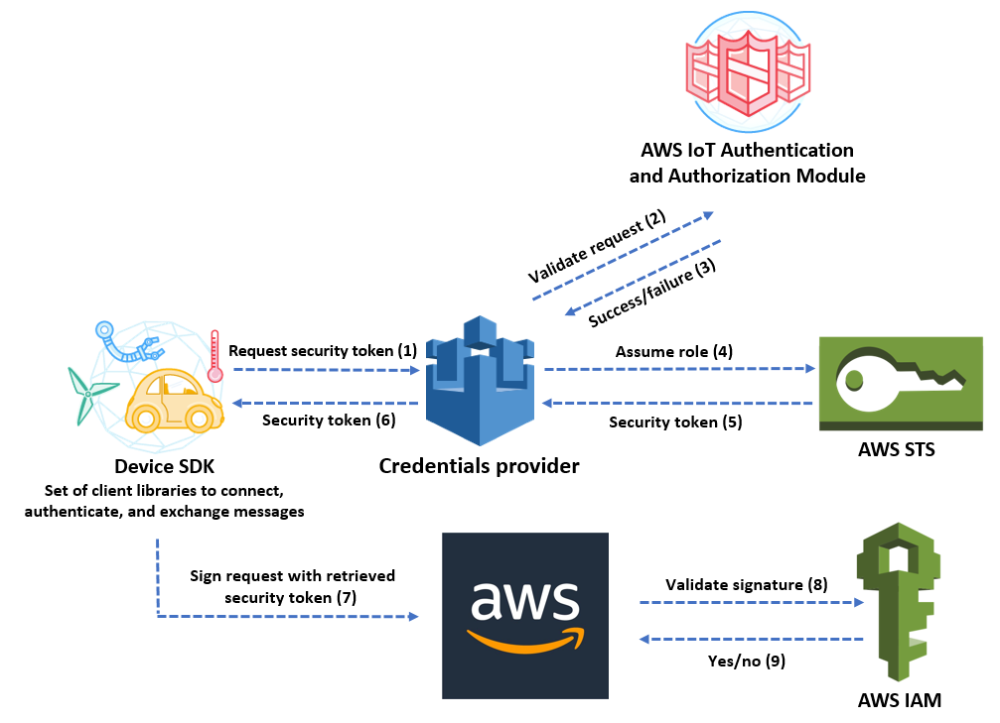

# Session credentials for targets accessing AWS Services


Targets publishing their data to AWS services need credentials to get access to these services. Besides using the
standard chain credential (environment variables, credentials files) used by the (Java) AWS SDK, SFC has additional
support for using device certificates to obtain session credentials from
the [AWS IoT Credentials Provider Service](https://aws.amazon.com/blogs/security/how-to-eliminate-the-need-for-hardcoded-aws-credentials-in-devices-by-using-the-aws-iot-credentials-provider/).
Targets can refer to a client configuration that contains entries for the files with for the required device
certificate, private key and root CA certificate. SFC provides helpers, that can be used by the targets, to obtain
session credentials using these certificates and key files. These client configurations are in the
[AwsIotCredentialProviderClients](./core/aws-iot-credential-provider-configuration.md) section of the configuration file and are referred by the targets by setting the
CredentialProviderClient to an entry in that section. If the CredentialProviderClient is not set then SFC will fall back
on the default credentials provider chain as described [here](https://docs.aws.amazon.com/sdk-for-java/latest/developer-guide/credentials-chain.html).
The same CredentialProviderClient setting is also used by the [AWS CloudWatch metrics writer](./metrics/aws-cloudwatch.md)
and by the [SecretsManager](./core/secrets-manager-configuration.md) configuration.



A client, and a target that uses it:

```json
"AwsIotCredentialProviderClients": {
  "AwsIotClient": {
    "IotCredentialEndpoint": "<id>.credentials.iot.<region>.amazonaws.com",
    "RoleAlias": "<role alias>",
    "ThingName": "<thing name>",
    "CertificateFile": "<path>/device.pem.crt",
    "PrivateKeyFile": "<path>/private.pem.key",
    "RootCa": "<path>/AmazonRootCA1.pem"
  }
},
"Targets": {
  "S3Target": {
    "TargetType": "AWS-S3",
    "Region": "eu-west-1",
    "BucketName": "my-sfc-bucket",
    "CredentialProviderClient": "AwsIotClient"
  }
}
```

On Windows write the paths with forward slashes, e.g. `"CertificateFile": "C:/sfc/certs/device.pem.crt"`; a single
backslash is a JSON escape. Relative paths are resolved against the directory SFC is started from.

**Runnable example:** [SLMP to S3](../examples/in-process-slmp-s3/README.md) defines the client in
`credential-providers.json` and the target that uses it in `templates.json`.

The SFC system incorporates logic for obtaining session credentials, ported from Greengrass V2, ensuring compatibility without dependency. This approach offers flexibility in certificate deployment, allowing manual deployment to the SFC-running device or utilization of Greengrass certificate management when available. The configuration provides a streamlined option to use Greengrass deployment certificate and key files without specifying individual file locations: on a Greengrass V2 core device, `"GreenGrassDeploymentPath": "/greengrass/v2"` (the Greengrass root folder; on Windows write it with forward slashes, e.g. `"C:/greengrass/v2"`) in the client reads the endpoint, role alias, thing name, certificate, private key and root CA from that Greengrass installation, and values that are set in the client take precedence. See [GreenGrassDeploymentPath](./core/aws-iot-credential-provider-configuration.md#greengrassdeploymentpath).

The SFC core includes certificate and key file content in the target configuration. Targets can use this information to obtain session credentials, leveraging SFC helper classes that cache session access key ID, secret access key, and session token, while managing token expiration and renewal.

For scenarios where targets run as IPC services on different devices than the SFC core, protecting configuration data transmission, including device certificates and private keys, is crucial:

- Enable the CertificatesAndKeysByFileReference option in the client configuration. This setting instructs the SFC core to transmit only file paths rather than actual certificate and key content, requiring secure file access or physical deployment on the target device.
- Encrypting the traffic between the SFC core and a target service with TLS is currently not possible: target services accept PlainText connections only (see [Securing network traffic between SFC components](./sfc-securing-component-traffic.md)). Use CertificatesAndKeysByFileReference and deploy the certificate and key files to the target device.

To accommodate targets that require internet access via proxy servers for obtaining session credentials or making AWS service calls, the client configuration can include proxy configuration information.

> **Known issue:** the proxy of the client configuration is currently not applied, neither to the request for session
> credentials nor to the AWS service calls of the targets (see [Proxy](./core/aws-iot-credential-provider-configuration.md#proxy)).

This comprehensive approach to credential management and secure communication ensures that SFC can operate efficiently and securely across various deployment scenarios and network configurations.


