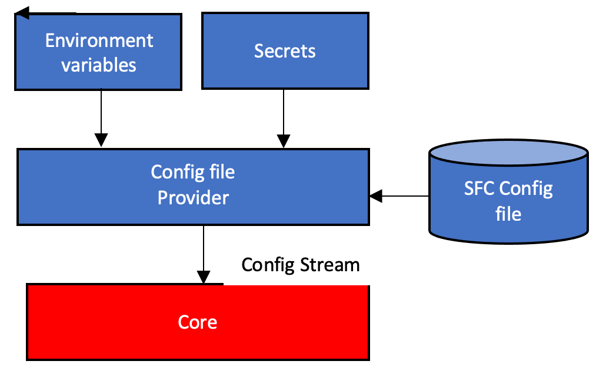
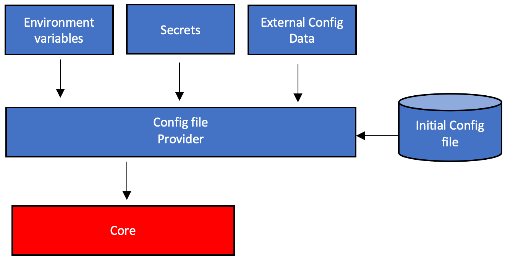

# SFC Configuration

- [Configuration Concepts](#configuration-concepts)
- [Configuration placeholders](#configuration-placeholders)
- [Configuration secrets](#configuration-secrets)
- [Deferred placeholder replacement](#deferred-placeholder-replacement)
- [Configuration templates](#configuration-templates)
- [Including configuration sections](#including-configuration-sections)
- [Selective Inclusions](#selective-inclusions)
- [Combining Templates and Inclusions](#combining-templates-and-inclusions)
- [Configuration providers](#configuration-providers)
- [Custom configuration](#custom-configuration)
- [Securing the configuration](#securing-the-configuration)
- [SFC top level configuration](./core/sfc-configuration.md)

## Configuration concepts

SFC is based on the concept of configuration providers, that collect data from internal or external sources. These
providers can constantly monitor resources, periodically make calls or wait for incoming configuration data, and apply
the providers logic to build the actual SFC configuration that is provided to a configuration data stream of the SFC
core. If an updated version of configuration data is provided to the SFC core , it will automatically restart its
internal processes to let the internal and external processes use this updates version of the configuration data,
without the need to restart the core process.

As SFC is deployed in a distributed mode, where protocol and target adapters can be running as standalone services,
potentially on different systems, the SFC core will automatically extract the subsets of relevant data and send this to
the adapter services when the SFC core is started or when it received an update configuration from its configuration
provider. This means that there is no need to manually distribute the confirmation data to these services, even when
they run remotely, as they will automatically and constantly receive a consistent in of the SFC configuration. The only
information that is required to bootstrap these services is the port number on which they can receive the configuration
update.

This feature ensures that the SFC system is always up-to-date with the latest configuration data.

The default SFC configuration provider is based on reading a JSON format configuration file. This file can contain
placeholders for environment variables as well as secrets which are stored in the AWS Secrets Manager's secure store.
The provider is constantly monitoring the actual configuration files, and environment variables for the used
placeholders, and if the files or the environment variables are updated, will provide a new version of the configuration
to the SFC Core.

<p align="center">



<p align="center">
    <em>Fig. 3. SFC default config provider</em>


As in customer environment configuration data may be managed and stored in external systems, it is possible to implement
and configure a custom configuration provider to retrieve that data. An instance of a configured custom provider will be
created by the SFC Core at startup. It will receive the content of the initial configuration file, which can be a subset
of the SFC configuration, combined with (or just) custom provider specific configuration data it needs to obtain the
data it will use to build the SFC configuration.

<p align="center">



<p align="center">
    <em>Fig. 4. Extensible config providers</em>


SFC employs a modular configuration approach, separating generic core data from adapter-specific data. This design allows the SFC Core to operate with abstract, non-adapter specific information while passing specialized configuration data to individual adapters. This separation enables the addition of new adapters with unique configuration requirements without necessitating changes to the SFC core.

The configuration structure includes generic core data used by the SFC Core and adapter-specific extensions of core data classes. Adapters are responsible for handling their specific configuration data, with the option to implement custom validation logic. The SFC Core provides a consistent configuration reader used by both the core and target adapters for reading, validating, and replacing placeholders in configuration data.

To ensure configuration integrity, SFC incorporates tooling and an API for digitally signing configuration data. The SFC Core verifies this signature and rejects configurations that fail verification, protecting against unauthorized modifications.

The core's awareness of input sources and output targets is limited to their identifiers, maintaining abstraction from protocol or target-specific details. Each adapter type (input protocol or target) has its own configuration model containing specific details. SFC's configuration layer provides each adapter or target with a tailored view of its configuration data, preventing dependencies, mix-ups, or redefinition of attributes across different types.

For loading configuration data from a JSON source, consumers call the configuration layer, specifying the class implementing the type-specific data model. These classes can optionally include additional validation logic, raising detailed configuration exceptions for invalid data.

This comprehensive approach to configuration management ensures flexibility in adapter integration, maintains security through digital signatures, and provides clear separation of concerns in configuration handling across the SFC system.


## Configuration placeholders

The JSON configuration can contain placeholders in the format **${name}**. These placeholders are replaced by the value
of environment variables with the specified name or a configured secret (see below). Using placeholders will help to
keep consistency between (repeated) values in the configuration and values used in other configuration types.

Name of the placeholders can contain the characters:

- a-z 
- A-Z 
- 0-9  
- :  
- /   
- \-
- _

## Configuration secrets

SFC integrates with AWS Secrets Manager following the same logic as used in GreenGrass Secret manager. Secrets are
defined in the configuration file using the [SecretsManager](./core/secrets-manager-configuration.md) Element.
This element includes a list of configured secrets.
Each secret has an id, which can either be the arn or name of the secret, and an optional alias. Secrets can be used by
using placeholders of the format \${name} in the configuration file. Name can be the name, arn or alias of the secret.
If just an arn is used for a configured secret either this arn or the name of the secret in the AWS Secrets manager
service can be used as name in the placeholder.

When resolving the placeholders, the configuration manager will first try to replace the placeholder with the value of
an environment variable with that name, or when no variable with that name exists it will try to replace it with
configured secret value.

If the device running SFC does not have access at startup, or when a configuration is updated and reloaded, it uses the
values stored from the last time the secrets were read from the AWS Secrets Manager service.

In order to read the secrets stored in the AWS Secrets Manager service a reference to a Credentials Client, configured
in the configuration, can be used. The certificate/role alias configured for that client must give permission to make a
getSecretValue API request for the configured secrets. Without client the normal credential chain path for the AWS SDK
is used to obtain the required credentials.

Secrets which are stored locally are encrypted using a file with a secret key, which can be configured to point to an
existing file, or as a reference to a GreenGrass deployment in which case the GreenGrass configured private key will be
used. If a path to a file with a private key is used then there is also an option to automatically generate this file
containing the secret key at first use, if it does not exist.

[^top](#sfc-configuration)

## Deferred placeholder replacement

In normal case placeholders for environment variables and secrets are resolved in the SFC core Configuration logic. When
the core build subsets of the configuration, used to initialize external IPC servers for source protocol adapter or
target IPC services, the placeholders are replaced with their environment variable or secret values. It is possible to
defer the replacement of these placeholders on the receiving service, allowing to resolve environment variables by the
system/process running the service or preventing secret values to be passed over the network. (please note that IPC
traffic between the core and external services can be configured to be encrypted) Deferring placeholder can be done by
using placeholders in the format **${{name}}**. If the placeholders are used for replacement by configured secrets from
AWS Systems Manager, all required configuration elements to resolve the secrets by the service process will be included
in the configuration that is used to initialize it. (SecretsManager with selected configured secrets, credentials
manager client etc.)

[^top](#sfc-configuration)

## Configuration templates


SFC configuration templates are used to make the configuration more modular and enable re-use of repeating sections of configuration. Replacing repeating sections of a configuration will also reduce the size of the configuration file.

Templates are JSON elements containing configuration data and are defined in the “Templates” section of the SFC configuration file. These templates in the "Templates" section are indexed by a unique name.

Below is a snippet of an SFC configuration file defining an S3 Target
```json
"Targets": {
    "S3Target": {
    "Active": true,
    "TargetType": "AWS-S3",
    "Region": "eu-west-1",
    "BucketName": "sfc-bucket",
    "Interval": 60,
    "BufferSize": 1,
    "Prefix": "data",
    "CredentialProviderClient": "AwsClient",
    "CertificatesAndKeysByFileReference": false,
    "Compression": "Zip"
}
```

We can define a template for this section:

```json
"Templates" : {
    "S3Target": {
        "Active": true,
        "TargetType": "AWS-S3",
        "Region": "eu-west-1",
        "BucketName": "sfc-bucket",
        "Interval": 60,
        "BufferSize": 1,
        "Prefix": "data",
        "CredentialProviderClient": "AwsIotClient",
        "Compression": "Zip"
    }
}
```

The template can be used from its original location in the Targets section. The syntax for using a template is **"$(name of the template)"**.

```json
"Targets": {
    "S3Target": "$(S3Target)"
}
```


Within a template it is possible to have placeholders for values making these templates more generic. In the example below the name of the bucket and its region are replaces by placeholders. Placeholders consist of the name of the placeholder within a "%" prefix and suffix.


```json
"Templates" : {
    "S3Target": {
        "Active": true,
        "TargetType": "AWS-S3",
        "Region": "%region%",
        "BucketName": "%bucket-name%",
        "Interval": 60,
        "BufferSize": 1,
        "Prefix": "data",
        "CredentialProviderClient": "AwsIotClient",
        "Compression": "Zip"
    }
}
```

Now this template can be used by specifying in an SFC  its name and the names of the placeholders with their values. Below is an example and Targets with two S3 targets defined using the template. The values for the placeholders used by the template are provided by a comma separated list, which is separated from the name of the template by a comma as well, including the names and values of the placeholders. The actual values should nor be included in quotes. Leading and training whitespaces will be trimmed from the values.

```json
"Targets": {
    "S3Target-1": "$(S3Target, bucket-name=sfc-bucket-1, region=eu-west-1)",
    "S3Target-2": "$(S3Target, bucket-name=sfc-bucket-2, region=eu-west-1)"
}
```


It is also possible to use nested  templates within templates, Below is the S3 template using a second template named S3Prefix.

```json
"Templates" : {
    "S3Target": {
      "Active": true,
      "TargetType": "AWS-S3",
      "Region": "%region%",
      "BucketName": "%bucket-name%",
      "Interval": 60,
      "BufferSize": 1,
      "Prefix": "$(S3Prefix)",
      "CredentialProviderClient": "AwsIotClient",
      "CertificatesAndKeysByFileReference": false,
      "Compression": "Zip"
    },

		"S3Prefix" : "data"
}
```

Templates can be used for all values in and SFC configuration file to replace values.

It is possible to partially replace parts of  values. Note that this works only for single value templates, not for structured values. Below is a template used to define the S3 and debug  target types. A third template named "DeploymentDir" is used in the other two templates to specify the directory in which the targets are deployed.

```json
"Templates" : {

    "S3Type" : {
        "JarFiles": ["$(DeploymentDir)/aws-s3-target/lib"],
        "FactoryClassName": "com.amazonaws.sfc.awss3.AwsS3TargetWriter"
    },
    "DebugType" : {
        "JarFiles": ["$(DeploymentDir)/debug-target/lib"],
        "FactoryClassName":"com.amazonaws.sfc.debugtarget.DebugTargetWriter"
    },

    "DeploymentDir" : "/sfc"
}
```

When rendering the templates the SFC core will check for circular dependencies between templates. After resolving the templates SFC will remove the “Templates” section from the configuration.

## Including configuration sections

During configuration file processing, SFC provides the functionality to incorporate sections from external sources by employing statements that instruct the configuration reader to include data from either external files or the responses obtained from HTTP GET requests.

These statements can be categorized into two groups:

\* [@include](#include-statement): This statement enables the inclusion of data from an external file. The included data does not adhere to JSON syntax and can be utilized to replace either a JSON element or a single element value.

\* [@file, @http, @https](#file-http-https-statements): These statements facilitate the inclusion of data from either an external file or the response obtained from an HTTP or HTTPS GET request. The included data must adhere to valid JSON syntax, and selective sections of the data can be inserted.

Both groups may contain nested inclusion statements of both types within the included content.

During configuration file processing, the following sequence is utilized:

- @include statements and possible nested @include statements are processed in a depth-first order.

- @file, @http, @https statements are processed in a depth-first order.

As the content of each step may include new inclusion statements for statements of the other type, the sequence is repeated until the configuration file no longer contains inclusion statements from any type.


### @include statement

The SFC supports data inclusion from external files using the **@include** statement, which provides a syntax for replacing a complete JSON element or the value of an element. The choice between these two syntaxes depends on maintaining the validity of the JSON data in the configuration file.

```json
{
  "@include" : "path to filename"
}
```

or

```json
{
  "elementname" : "@include:path to filename"
}
```

When processing the @include statement in both syntaxes, the complete statement, including a potential trailing comma character, will be removed and replaced by the content of the specified file.

Although the content of the file may not adhere to a valid JSON syntax, the result of including the file should still adhere to a valid JSON syntax.

The included files may contain nested @include statements, which will be included in the configuration file, along with detection or circular references.


### @file, @http, @https statements

An alternative method include configuration data from an external the file the syntax is **“@file:\<pathname of the file>”**.  

For including data from a get request he syntax is **“@http://\<url>”** or **“@https://\<url>**”. 

After reading the content from the file or the get response SFC will replace the reference to the file or the url with this content.

The main difference of the  @file, @http and @https staye ments with the **@include** is that the data read from the file of GET requests response payload must be a valid JSON syntax. Additionaly ithey offer the possibility or select sections from the JSON data to insert in the configuration file.

Below is an example where the value of “AwsIoTClient” is read from a file named “aws-iot-client.json”.

```json
"AwsIotCredentialProviderClients": {
		"AwsIotClient": "@file:aws-iot-client.json"
}
```

This file contains the following JSON data:

```json
{
    "IotCredentialEndpoint": "abcdefghijklmn.credentials.iot.eu-west-1.amazonaws.com",
    "RoleAlias": "GreengrassV2TokenExchangeRoleAlias",
    "ThingName": "GreengrassCore-1",
    "CertificateFile": "../thingCert.crt",
    "PrivateKeyFile": "../privKey.key",
    "RootCa": "../rootCA.pem"
}
```


For getting the content from a hypothetical configuration server named "config-server" the syntax would be:

```json
"AwsIotCredentialProviderClients": {
		"AwsIotClient": "@https:config-server/sfc/aws-iot-client.json"
}
```


It is possible to nest, mixing includes from files and from get requests, in the included content. When including the content SFC will detect circular references between include sections.

SFC will check if the included configuration content is changed by external processes, and if this is the case reloaded the SFC configuration file. For included files SFC will monitor the file system to detect changes to the included file. Monitoring the included files can be disabled by including a configuration item **"MonitorIncludedConfigFiles" : false** at the top level of the SFC configuration.

To check if the content loaded from he get-request to the configured url is updated, SFC will make a request every 60 seconds to that url. If the content was retrieved successfully, it will compare a checksum of that data with the crc from a previous request to detect changes to the data. If a change is detected then the SFC config will be reloaded. The interval can bet set by including a configuration item **“MonitorIncludedConfigContentInterval” : <interval in seconds>** at the top level of the SFC configuration. To disable set the value to 0.

SFC will cache the content included content, as long as it is not modified, for faster re-loading of the data.

## Selective Inclusions

Instead of including the complete content obtained from an included file or response of a service call it is also possible to select a subset of this content.
In order to select a subset the filename or the url must be followed by a "@" and a valid <a href="https://jmespath.org/">JMESPath expression</a> that selects the section of the content to include.  Selectors allowto combine related configuration sections in a combined inclusion  content obtained from a file or a service call.

**Selective inclusion is only feasible when utilizing the @file, @http, or @https inclusion statements for data inclusion.**

The following included file "s3-inproc.json" contains two elements. The first element "S3TargetType" defined the type of the in-process S3 target. The second element "S3Target" defined the actual S3 target.

```json
{
  "S3TargetType" : {
      "JarFiles": ["/sfc/s3-target/aws-s3-target/lib"],
      "FactoryClassName": "com.amazonaws.sfc.awss3.AwsS3TargetWriter"
  },

  "S3Target": {
      "TargetType": "AWS-S3",
      "Region": "eu-west-1",
      "BucketName": "sfc-bucket-name",
      "Interval": 60,
      "BufferSize": 1,
      "CredentialProviderClient": "AwsIotClient",
      "Compression": "Zip"
  }

}
```

The "S3TargetType" and "S3Target" are selected in the "TargetTypes" and "Target" sections of the SFC configuration by appending a "@" to the filename followed by the JMESPath expression to select that section, as shown below.

```json
"TargetTypes": {
		"AWS-S3":  "@file:s3-inproc.json@S3TargetType"
}
```

```json
"Targets": {
		"S3Target": "@file:s3-inproc.json@S3Target"
}
```

[^top](#sfc-configuration)

## Combining Templates and Inclusions


Templates can be loaded from external sources, making it possible to use them as building blocks in different configuration files.

For example the file s3-target.json does include the following definition of an S3 bucket, and using the **"%region%"** and **"bucket-name"**.

```json
{
    "Active": true,
    "TargetType": "AWS-S3",
    "Region": "%region%",
    "BucketName": "%bucket-name%",
    "Interval": 60,
    "BufferSize": 1,
    "CredentialProviderClient": "AwsIotClient",
    "CertificatesAndKeysByFileReference": false,
    "Compression": "Zip"
}
```


This file is loaded from the templates section:

```json
"Templates" : {
		"S3Target": "@file:s3-target.json"
}
```


The template then can be used as a normal template in the targets section:

```json
"Targets": {
		"S3Target": "$(S3Target, bucket-name=sfc-bucket, region=eu-west-1)"
}
```


When processing a configuration file SFC will first load all included content and then resolve all templates in the file.

## Configuration providers

In the architecture of the SFC core the [configuration method](./core/sfc-configuration.md) is abstracted by using configuration providers. These
plug-able providers read the configuration data from their specific source and method and provide the initial
configuration and updates to an SFC service process, which can be the Service, a source service or a target service,
as a channel of configuration versions. An SFC service process will receive the new configuration version and apply
these to the internal service instance that will use these new settings without the need to restart the service.

Service providers can read configuration data from files, by making service calls or listening to service requests.

By default, the configuration is read from a configuration file which is specified by the `-config` command line parameter
for all services. The ConfigFileServiceProvider, which is used for configuration files, will detect updates to the
configuration file, or changes made to environment variables used in placeholders in the configuration file, and provide
the updated configuration data to the service.

If you don't specify the `-config` parameter SFC will check the environment variable `SFC_CONFIG` if it exists and holds
a json configuration. This helps in environment where even default configuration is not passed as a file (e.g. in an AWS
IoT Greengrass component) 

[^top](#sfc-configuration)

## Custom configuration

The ConfigFileServiceProvider, which is used when a config file is specified by using the -config parameter, can be used
to configure a handler for custom or additional processing to the configuration file processing. Example of custom
processing are the dynamic creation of enriching the passed in configuration data with additional data that could come
from an additional source/service/logic.

When such a handler is configured, by specifying the jar files that implement it and a factory class, an instance of
that handler is created. The data that was in the specified configuration file is passed to the instance. The data is
passed "as-is" and could include custom handler specific data. The custom handler is responsible for interpreting this
data and (periodically) returning a valid version of an SFC configuration as a channel.

If the configuration file specified by the -config parameter or its reference environment variables a new instance of
the custom handler is created.

# Securing the configuration

In order to secure the content of configuration data passed to the SFC Core the content can be digitally signed with a
secret key. The digital signature, which is added to the configuration, will be checked using the public key related to
the key that was used to sign the configuration data.

The configuration can be signed using a command line application as shown below:

```kotlin
import com.amazonaws.sfc.config.ConfigVerification
import File
import kotlin.system.exitProcess

fun main(args: Array<String>) {
    checkArguments(args)
    val privateKeyFile = File(args[0])
    val inputConfigFile = File(args[1])
    val signedConfigFile = File(args[2])
    ConfigVerification.sign(inputConfigFile, privateKeyFile, signedConfigFile)
    println("Signed configuration file written to ${signedConfigFile.* absoluteFile}")

}

private fun checkArguments(args: Array<String>) {
    if (args.size != 3) {
        println("Usage: sign-sfc-config <private-key-file> <config-file> <signed-config-file>")
        exitProcess(0)
    }
}
```

This code loads the input configuration file to be signed, and adds an entry named "ConfigSignature", containing the
digital signature of the configuration data, to the signed configuration output file.

In order to check the digital signature, the -verify parameter of the sfc-main module, which runs the SFC core, is used
to specify the file containing the public key for the private key that was used to sign the configuration.

If the verification of the signature fails, because of the configuration being changed after signing it or the signature
is missing the SFC core will not process the configuration.

In situation where the configuration file is generated programmatically by an application or a custom config provider,
the one of the ConfigVerification's sign methods can be used to calculate and add the digital signature.

```kotlin
fun sign(configFile, privateKeyFile: File, signedConfigFile: File): Unit
fun sign(configFile: File, privateKeyFile: File, signedConfig: OutputStream): Unit
fun sign(configFile: File, privateKey: PrivateKey, signedConfigFile: File): kotlin.
fun sign(configFile: File, privateKey: PrivateKey, signedConfig: OutputStream): Unit
fun sign(config: InputStream, privateKeyFile: File, signedConfigFile: File): Unit
fun sign(configStream: InputStream, privateKeyFile: File, signedConfig: OutputStream): Unit
fun sign(config: InputStream, privateKey: PrivateKey, signedConfigFile: File): Unit
fun sign(configStream: InputStream, privateKey: PrivateKey, signedConfig: OutputStream): Unit
fun sign(configJson: String, privateKeyFile: File): String
fun sign(configJson: String, privateKeyFile: File, signed: OutputStream): Unit
fun sign(configJson: String, privateKey: PrivateKey): String
fun sign(configJson: String, privateKey: PrivateKey, signedConfig: OutputStream): Unit
```

If a custom configuration provider is used, the public key read from the public key file specified by the -very
parameter of the sfc-main application will be passed to the instance of the provider, where it can be used to verify the
initial configuration passed to the instance. If the public key is provided, meaning it was passed to the sfc-main
module for verification pf the configuration, the data which is produced by the provider needs to be signed using one of
the sign methods listed above.

To verify the input configuration passed to the custom provider one of the following ConfigValidation's verify methods
can be used:

```kotlin
fun verify(configFile: File, publicKeyFile: File): Boolean
fun verify(configFile: File, publicKey: PublicKey): Boolean
fun verify(configStream: InputStream, publicKeyFile: File): Boolean
fun verify(configStream: InputStream, publicKey: PublicKey): Boolean
fun verify(configJson: String, publicKeyFile: File): Boolean
fun verify(configJson: String, publicKey: PublicKey): Boolean
```
