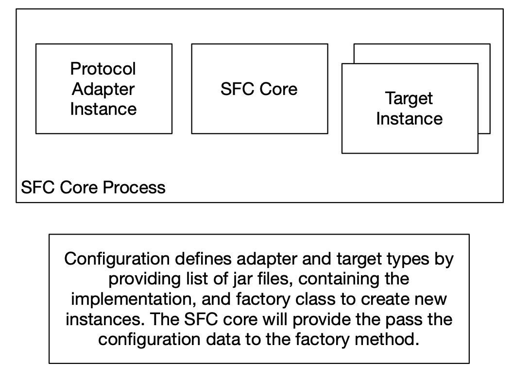
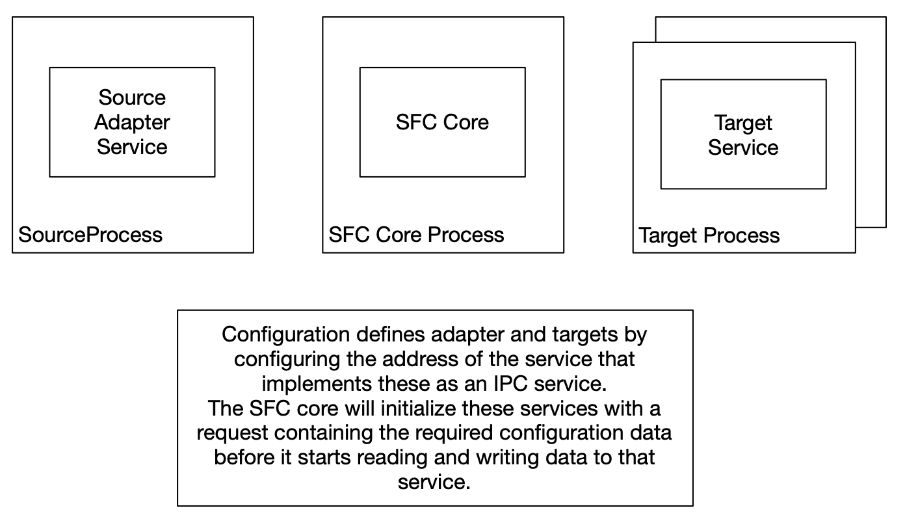
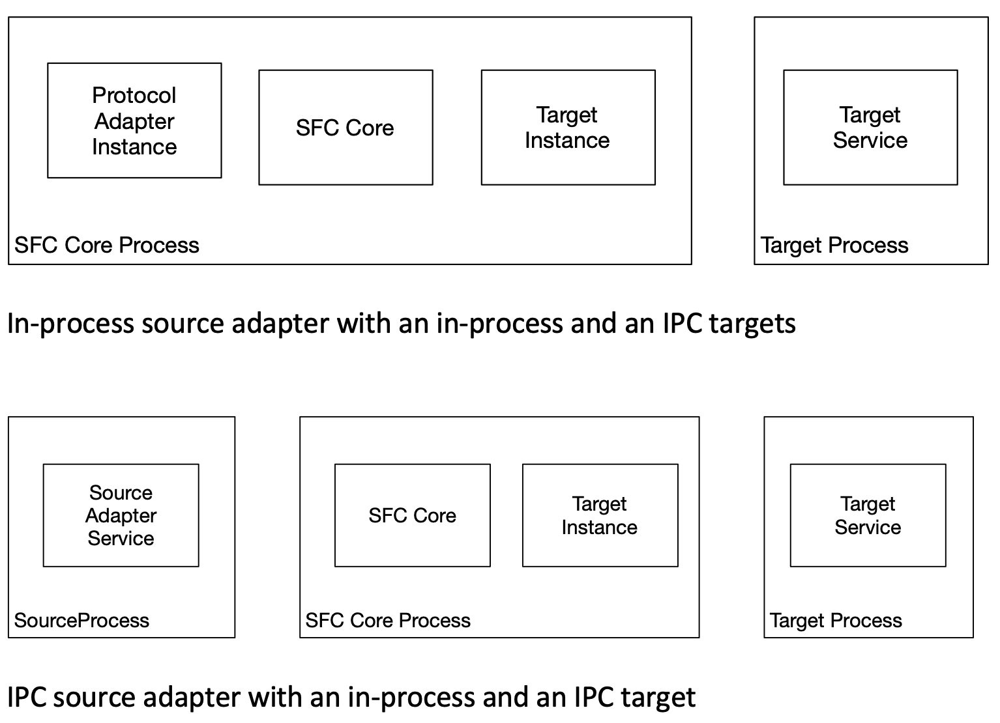

# SFC Deployment

- [Deployment types](#deployment-options)
- [In-process and IPC deployment models](#in-process-and-ipc-deployment-models)
- [Mixed models](#mixed-models)

## Deployment options

The SFC core module is implemented to run in a Java Virtual Machine (JVM). Input adapters and targets can be implemented for the JVM as well, or for other runtimes, depending on the platforms where these are deployed and the libraries required for the protocol implementation.

JVM implementations have the option to be loaded in the same process as the SFC Core. When other runtimes are used, any language can be used for the implementation. These adapters and targets run as separate processes and use streaming gRPC IPC to communicate with the SFC core.

The framework contains classes that speed up the development of JVM protocol and target services, as well as an abstraction layer for the gRPC IPC layer.

The components don't have any runtime environment-specific dependencies. They can be deployed as:

- *Standalone applications* on target platforms supporting the JVM or runtimes used to implement additional adapters and targets.
- *AWS IoT Greengrass v2 components* or containers
- *Docker* or *Kubernetes* containers

## In-process and IPC deployment models

Protocols, adapters, and targets can be implemented as jar files containing Java bytecode. These can be configured to be loaded and executed in the SFC core process. The configuration for each adapter or target type includes:

- A list of jar files that are explicitly loaded by the SFC core process.
- The name of a static factory class that implements a method called 'newInstance'.

The 'newInstance' method is called by the core to create a new instance. The configuration is passed to this method and is used to initialize the adapter or target instance.

This approach allows for flexible and modular implementation of protocols, adapters, and targets within the SFC core process.

    <em>Fig. 7. SFC In-process deployment (e.g. in a single host context)</em>

As an alternative, components can be deployed to run in their own processes and communicate with the core using gRPC. This deployment model allows for the following scenarios:

- Non-JVM execution environments or languages to build/execute components
- Flexible deployment on IT/OT networks
- Distribution of load over multiple systems
- Application of lifecycle control with Greengrass v2 or Docker/Kubernetes

When the processes running the adapter or target services are started, a port number is passed as a parameter on which the service listens for requests from the core. Alternatively, the path to a configuration file can be used, from which the process will retrieve the port number (using an additional target identifier parameter if the configuration file contains more than one target for a target type).

During initialization, the SFC core sends an initialization request to the protocol source and/or target servers, containing only the sections of its configuration used by that adapter or target. When the configuration is modified and the core process is restarted, it sends an initialization request to each adapter or target with the newly updated subset of relevant configuration data.

If an adapter or target server is stopped, it will be detected by the SFC Core. The core will attempt to reconnect to the service and send an initialization request when it succeeds in connecting to a new instance of the server.

As the SFC core acts as the provider for configuration data to the servers, these will always work with the latest and consistent configuration data from a single source. No additional configuration files need to be distributed to the protocol and adapter processes.

    <em>Fig. 8. SFC IPC deployment (e.g. in a distributed OT/IT context)</em>

See Also

- [Running SFC protocol adapters](./sfc-running-adapters.md)

- [Running SFC targets](./sfc-running-targets.md)

## Mixed models

It is possible to mix instances of in-process and IPC adapters and targets in a single configuration.

    <em>Fig. 9. SFC Mixed deployment options</em>

## Single file deployments

As an alternative deployment scenario for both in process as well as with IPC communication we have SFC also available
as a single uber jar that contains all SFC code including dependencies. That helps 

