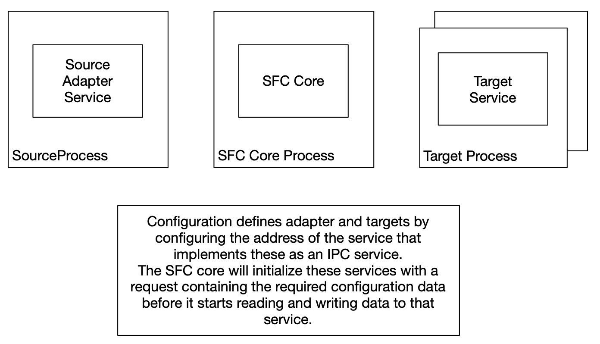
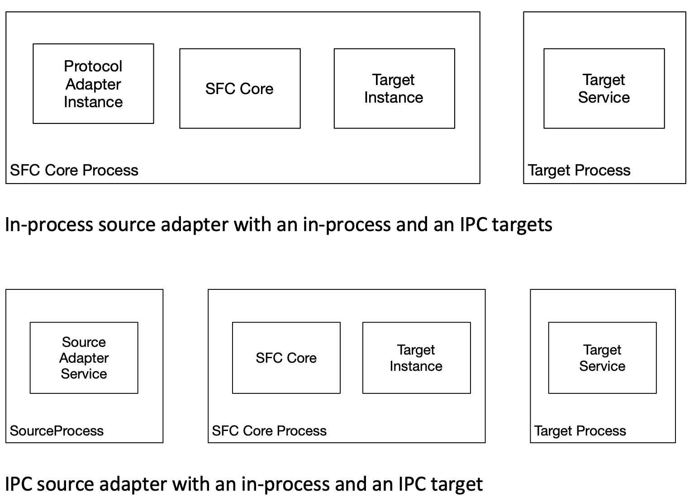

# SFC Deployment

- [Deployment types](#deployment-options)
- [In-process and IPC deployment models](#in-process-and-ipc-deployment-models)
- [Mixed models](#mixed-models)
- [Single file deployments](#single-file-deployments) — the uberjar

## Deployment options

The SFC core module is implemented to run in a Java Virtual Machine (JVM). Input adapters and targets can be implemented for the JVM as well, or for other runtimes, depending on the platforms where these are deployed and the libraries required for the protocol implementation.

JVM implementations have the option to be loaded in the same process as the SFC Core. When other runtimes are used, any language can be used for the implementation. These adapters and targets run as separate processes and use streaming gRPC IPC to communicate with the SFC core.

The framework contains classes that speed up the development of JVM protocol and target services, as well as an abstraction layer for the gRPC IPC layer.

The components don't have any runtime environment-specific dependencies. They can be deployed as:

- *Standalone applications* on target platforms supporting the JVM or runtimes used to implement additional adapters and targets.
- *AWS IoT Greengrass v2 components* or containers
- *Docker* or *Kubernetes* containers

## In-process and IPC deployment models

Protocols, adapters, and targets can be implemented as jar files containing Java bytecode. These can be configured to be loaded and executed in the SFC core process. The configuration for each adapter or target type includes:

- A list of jar files that are explicitly loaded by the SFC core process.
- The name of a static factory class that implements a method called 'newInstance'.

The 'newInstance' method is called by the core to create a new instance. The configuration is passed to this method and is used to initialize the adapter or target instance.

This approach allows for flexible and modular implementation of protocols, adapters, and targets within the SFC core process.

<p align="center">


<p align="center">
    <em>Fig. 7. SFC In-process deployment (e.g. in a single host context)</em>


As an alternative, components can be deployed to run in their own processes and communicate with the core using gRPC. This deployment model allows for the following scenarios:

- Non-JVM execution environments or languages to build/execute components
- Flexible deployment on IT/OT networks
- Distribution of load over multiple systems
- Application of lifecycle control with Greengrass v2 or Docker/Kubernetes

When the processes running the adapter or target services are started, a port number is passed as a parameter on which the service listens for requests from the core. Alternatively, the path to a configuration file can be used, from which the process will retrieve the port number (using an additional target identifier parameter if the configuration file contains more than one target for a target type).

During initialization, the SFC core sends an initialization request to the protocol source and/or target servers, containing only the sections of its configuration used by that adapter or target. When the configuration is modified and the core process is restarted, it sends an initialization request to each adapter or target with the newly updated subset of relevant configuration data.

If an adapter or target server is stopped, it will be detected by the SFC Core. The core will attempt to reconnect to the service and send an initialization request when it succeeds in connecting to a new instance of the server.

As the SFC core acts as the provider for configuration data to the servers, these will always work with the latest and consistent configuration data from a single source. No additional configuration files need to be distributed to the protocol and adapter processes.


<p align="center">



<p align="center">
    <em>Fig. 8. SFC IPC deployment (e.g. in a distributed OT/IT context)</em>


See Also

- [Running SFC protocol adapters](./sfc-running-adapters.md)

- [Running SFC targets](./sfc-running-targets.md)


## Mixed models

It is possible to mix instances of in-process and IPC adapters and targets in a single configuration.

<p align="center">



<p align="center">
    <em>Fig. 9. SFC Mixed deployment options</em>

## Single file deployments

SFC is also published as a single **uberjar** containing the core, every protocol adapter, every
target, the metrics writers and the example components — all with their dependencies included. It
works for both of the models above, and removes the step of deciding which module bundles a host
needs and unpacking them side by side.

The release asset is `sfc-uberjar.tar.gz`. It unpacks to a launcher and one jar:

```
sfc-uberjar/
├── bin/sfc-uberjar        # and sfc-uberjar.bat on Windows
└── lib/sfc-uberjar-<version>.jar
```

### Running it

In-process, either through the launcher or by calling the jar directly — it is executable, with
`com.amazonaws.sfc.MainController` as its `Main-Class`:

```shell
sfc-uberjar/bin/sfc-uberjar -config example.json
java -jar sfc-uberjar/lib/sfc-uberjar-<version>.jar -config example.json
```

For IPC, the same jar carries every adapter and target service, so a service is started by naming its
class instead:

```shell
java -cp sfc-uberjar/lib/sfc-uberjar-<version>.jar com.amazonaws.sfc.opcua.OpcuaProtocolService -port 50000
```

### Configuration differences

Because every component is already on the jar's own classpath, an `AdapterTypes` or `TargetTypes`
entry needs **no `JarFiles`** — the `FactoryClassName` is enough to locate it:

```json
"TargetTypes": {
  "DEBUG-TARGET": {
    "FactoryClassName": "com.amazonaws.sfc.debugtarget.DebugTargetWriter"
  }
}
```

That is the only configuration change. Everything else — schedules, sources, channels, transformations
— is identical to the per-module deployments.

### The trade-off

One jar means **one flat classpath**, and therefore exactly one version of every shared dependency.
That is a deliberate constraint, not an oversight: a fat jar can hold only one copy of a class, so
components cannot each bring their own version of a library.

A component whose dependencies cannot be reconciled with the rest of the product is therefore not
eligible for the uberjar, and should be deployed from its own module bundle with `JarFiles`, or in its
own process over IPC. The per-module bundles keep their jars separate, so each one is internally
consistent by construction.

The jar is also large — a few hundred MB — since it carries every protocol implementation whether a
given deployment uses it or not.

### When to use which

| | Uberjar | Per-module bundles |
|---|---|---|
| Artifacts to deploy | one | one per adapter and target in use |
| `JarFiles` in the configuration | none | one path per component |
| Dependency versions | one set, shared | independent per component |
| Download size | the whole product | only what is used |
| Best for | getting started, single-host deployments, Greengrass components, CI | production images tuned to a site, and components with conflicting dependencies |

See Also

- [Running the core process from a single jar](./sfc-running-core-process.md#running-the-process-from-a-single-jar-file)
- [Uberjar OPC-UA tests example](../examples/uberjar-opcua-tests/README.md) — both directions run from the uberjar
- [Greengrass uberjar example](../examples/greengrass-uberjar/README.md) — the uberjar as a Greengrass V2 component

