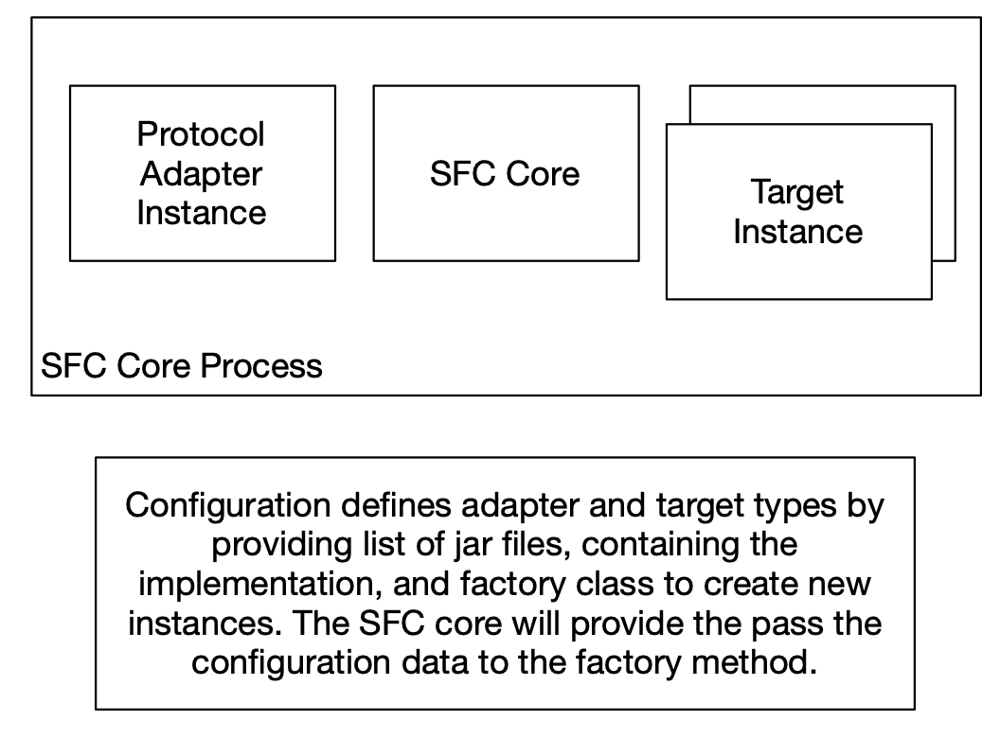
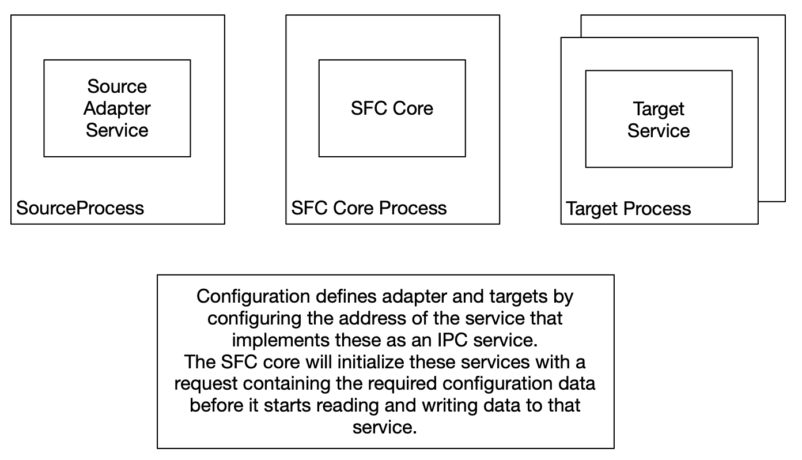
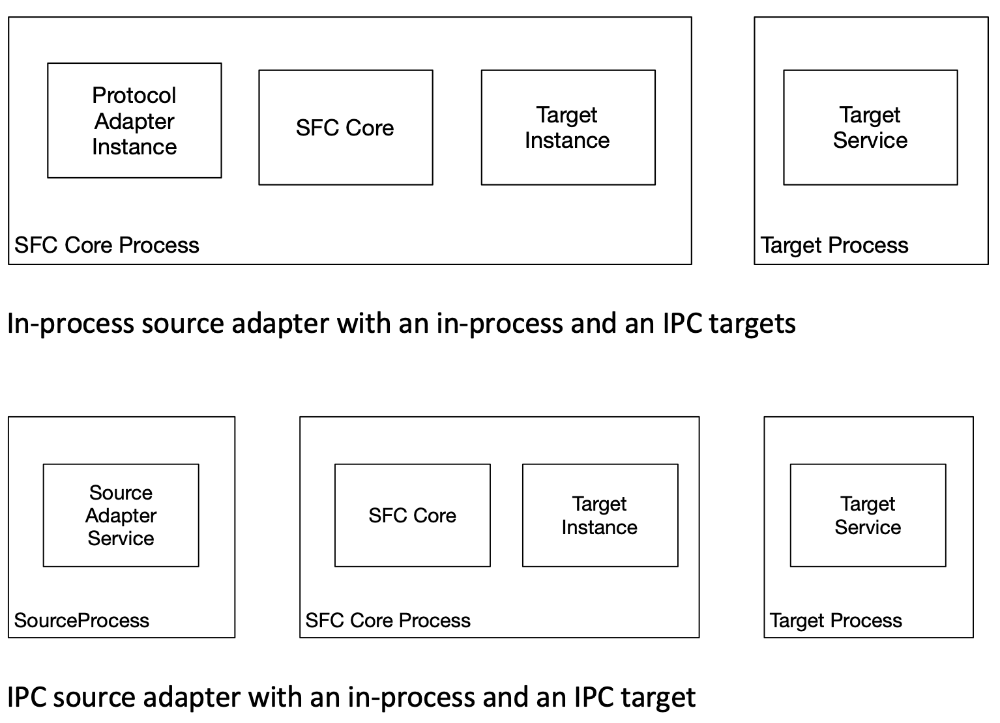

# SFC Deployment

- [Deployment options](#deployment-options)
- [Choose a deployment mode](#choose-a-deployment-mode)
- [Configure a component in each mode](#configure-a-component-in-each-mode)
- [In-process and IPC deployment models](#in-process-and-ipc-deployment-models)
- [Mixed models](#mixed-models)
- [Single file deployments](#single-file-deployments) — the uberjar

## Deployment options

The SFC core module is implemented to run in a Java Virtual Machine (JVM). Input adapters and targets can be implemented for the JVM as well, or for other runtimes, depending on the platforms where these are deployed and the libraries required for the protocol implementation.

JVM implementations have the option to be loaded in the same process as the SFC Core. When other runtimes are used, any language can be used for the implementation. These adapters and targets run as separate processes and use streaming gRPC IPC to communicate with the SFC core.

The framework contains classes that speed up the development of JVM protocol and target services, as well as an abstraction layer for the gRPC IPC layer.

The components don't have any runtime environment-specific dependencies (the few OS limits are listed under [Platform support](./README.md#platform-support)). They can be deployed as:

- *Standalone applications* on target platforms supporting the JVM or runtimes used to implement additional adapters and targets.
- *AWS IoT Greengrass v2 components* or containers: see the [uberjar](../examples/greengrass-uberjar/README.md), [in-process](../examples/greengrass-in-process/README.md) and [IPC](../examples/greengrass-ipc/README.md) Greengrass examples
- *Docker* or *Kubernetes* containers

## Choose a deployment mode

SFC runs its adapters and targets in one of three modes. The mode decides where their code comes from and in which process it runs; schedules, sources, channels and transformations are configured the same way in all three, and the modes can be [mixed](#mixed-models) in one configuration.

| | Uberjar | In-process | IPC |
|---|---|---|---|
| Processes | one: the core with every adapter and target | one: `sfc-main`, which loads each adapter and target from its own module bundle | the core (uberjar or `sfc-main`) plus one service per adapter or target, on the same or on other hosts |
| Artifacts to deploy | one, installed by [sfcup](../README.md#1-install) | `sfc-main` plus one bundle per adapter and target in use | the core, and on each service host the uberjar or the bundles of its services |
| `AdapterTypes` / `TargetTypes` entries | `FactoryClassName` only | `FactoryClassName` plus one `JarFiles` path per component | none; adapters and targets name an `AdapterServer` / `TargetServer` |
| Start | `sfcx -config <file>` | `sfc-main/bin/sfc-main -config <file>` (Windows: `java -cp`, see [In-process](#in-process)) | each service with `-port`, then the core |
| Dependency versions | one set, shared | independent per component, except for the libraries that `sfc-main` itself carries | independent per service when started from its bundle |
| Download size | about 240 MB, once | about 95-180 MB per module plus about 110 MB for `sfc-main`; each bundle carries its own copy of the shared libraries | the uberjar or the bundles, on each host that runs a service |
| Best for | getting started, single-host deployments, Greengrass components, CI | production images tuned to a site, and components with conflicting dependencies | flexible deployment on IT/OT networks, load spread over several hosts, non-JVM components |
| Example | [PLC simulator to file and S3 Tables](../examples/uberjar-plc-sim-s3tables/README.md) | [Simulator to S3 Tables](../examples/in-process-sim-s3tables/README.md) | [OPC-UA to MSK over IPC](../examples/ipc-opcua-msk/README.md) |

New to SFC? Start with the uberjar: the [Quickstart](../README.md#1-install) installs it and shows first data in a minute, and the [examples catalog](./examples/README.md#start-here) lists the next steps.

## Configure a component in each mode

Every adapter and target has a type code, listed in [Protocol adapter types and classes](./sfc-running-adapters.md#protocol-adapter-types-and-classes) and [Target types and classes](./sfc-running-targets.md#target-types-and-classes). `AdapterType` and `TargetType` are mandatory in every mode and must equal that code, and in the uberjar and in-process modes the `AdapterTypes` and `TargetTypes` keys are the same code. Instance names, the keys under `ProtocolAdapters`, `Targets`, `Sources`, `AdapterServers` and `TargetServers`, are free.

Each mode is shown below with the [Quickstart `simulator.json`](../README.md#2-first-data--no-hardware-no-cloud). Only the sections that differ are listed; the rest of the file stays as it is. All modes need a Java 17 (or newer) runtime (Windows: `winget install EclipseAdoptium.Temurin.17.JDK`).

### Uberjar

This is the Quickstart as shipped. Every component is on the uberjar's classpath, so the type entries name `FactoryClassName` only:

```json
"Targets": {
  "DebugTarget": { "Active": true, "TargetType": "DEBUG-TARGET" }
},
"TargetTypes": {
  "DEBUG-TARGET": { "FactoryClassName": "com.amazonaws.sfc.debugtarget.DebugTargetWriter" }
},
"ProtocolAdapters": {
  "SimulatorAdapter": { "AdapterType": "SIMULATOR" }
},
"AdapterTypes": {
  "SIMULATOR": { "FactoryClassName": "com.amazonaws.sfc.simulator.SimulatorAdapter" }
}
```

```shell
sfcx -config simulator.json -info
```

The one exception is a `ConfigProvider` or `LogWriter` section: SFC ignores it unless it has a `JarFiles` key, so in the uberjar give it an empty list:

```json
"LogWriter": {
  "JarFiles": [],
  "FactoryClassName": "com.amazonaws.sfc.log.CustomLogWriter"
}
```

Example: [PLC simulator to file and S3 Tables](../examples/uberjar-plc-sim-s3tables/README.md).

### In-process

`sfc-main` loads each component from its own module bundle, so each type entry adds the `lib` directory of that bundle in `JarFiles`:

```json
"TargetTypes": {
  "DEBUG-TARGET": {
    "JarFiles": ["${SFC_DEPLOYMENT_DIR}/debug-target/lib"],
    "FactoryClassName": "com.amazonaws.sfc.debugtarget.DebugTargetWriter"
  }
},
"AdapterTypes": {
  "SIMULATOR": {
    "JarFiles": ["${SFC_DEPLOYMENT_DIR}/simulator/lib"],
    "FactoryClassName": "com.amazonaws.sfc.simulator.SimulatorAdapter"
  }
}
```

Unpack the bundles `sfc-main`, `simulator` and `debug-target` into one directory, point `SFC_DEPLOYMENT_DIR` at it, and start `sfc-main`:

**Linux / macOS**

```shell
export SFC_DEPLOYMENT_DIR="$HOME/sfc"
mkdir -p "$SFC_DEPLOYMENT_DIR"
for m in sfc-main simulator debug-target; do
  curl -fsSL "https://github.com/awslabs/industrial-shopfloor-connect/releases/latest/download/$m.tar.gz" | tar -xzf - -C "$SFC_DEPLOYMENT_DIR"
done
"$SFC_DEPLOYMENT_DIR/sfc-main/bin/sfc-main" -config simulator.json -info
```

**Windows (PowerShell)**

```powershell
$env:SFC_DEPLOYMENT_DIR = "C:/sfc"
New-Item -ItemType Directory -Force C:\sfc | Out-Null
foreach ($m in "sfc-main", "simulator", "debug-target") {
    curl.exe -fsSL -o "C:\sfc\$m.tar.gz" "https://github.com/awslabs/industrial-shopfloor-connect/releases/latest/download/$m.tar.gz"
    tar -xf "C:\sfc\$m.tar.gz" -C C:\sfc
}
java -cp "C:\sfc\sfc-main\lib\*" com.amazonaws.sfc.MainController -config simulator.json -info
```

On Windows start `sfc-main` with `java -cp` as shown, not with `bin\sfc-main.bat`; see [Platform support](./README.md#platform-support). More on placeholders and `JarFiles`: [Running protocol adapters in-process](./sfc-running-adapters.md#running-protocol-adapters-in-process) and [Running targets in-process](./sfc-running-targets.md#running-targets-in-process).

Example: [Simulator to S3 Tables](../examples/in-process-sim-s3tables/README.md), which runs the same pipeline in-process and from the uberjar.

### IPC

Each adapter and target runs in its own service process. Remove `AdapterTypes` and `TargetTypes`, keep `AdapterType` and `TargetType`, and point the adapter and the target at a server entry:

```json
"Targets": {
  "DebugTarget": { "Active": true, "TargetType": "DEBUG-TARGET", "TargetServer": "DebugTargetServer" }
},
"TargetServers": {
  "DebugTargetServer": { "Address": "localhost", "Port": 50001 }
},
"ProtocolAdapters": {
  "SimulatorAdapter": { "AdapterType": "SIMULATOR", "AdapterServer": "SimulatorAdapterServer" }
},
"AdapterServers": {
  "SimulatorAdapterServer": { "Address": "localhost", "Port": 50000 }
}
```

Start each service in its own terminal, on the port of its server entry, and then the core. From the module bundles unpacked under [In-process](#in-process):

**Linux / macOS**

```shell
~/sfc/simulator/bin/simulator -port 50000
~/sfc/debug-target/bin/debug-target -port 50001
~/sfc/sfc-main/bin/sfc-main -config simulator.json -info
```

**Windows (PowerShell)**

```powershell
java -cp "C:\sfc\simulator\lib\*" com.amazonaws.sfc.simulator.SimulatorService -port 50000
java -cp "C:\sfc\debug-target\lib\*" com.amazonaws.sfc.debugtarget.DebugTargetService -port 50001
java -cp "C:\sfc\sfc-main\lib\*" com.amazonaws.sfc.MainController -config simulator.json -info
```

Or from the uberjar installed by sfcup, which contains every service:

**Linux / macOS**

```shell
java -cp "$HOME/.sfc/current/lib/*" com.amazonaws.sfc.simulator.SimulatorService -port 50000
java -cp "$HOME/.sfc/current/lib/*" com.amazonaws.sfc.debugtarget.DebugTargetService -port 50001
sfcx -config simulator.json -info
```

**Windows (PowerShell)**

```powershell
java -cp "$HOME\.sfc\versions\$(Get-Content $HOME\.sfc\current.txt)\lib\*" com.amazonaws.sfc.simulator.SimulatorService -port 50000
java -cp "$HOME\.sfc\versions\$(Get-Content $HOME\.sfc\current.txt)\lib\*" com.amazonaws.sfc.debugtarget.DebugTargetService -port 50001
sfcx -config simulator.json -info
```

The records now print in the terminal of the debug target service. The first values arrive about 10 seconds after the core starts, because an adapter service applies its configuration only when the core sends it for the second time. In `Address` use `localhost` or the address of the service host: services listen only on the address their host name resolves to, which is not necessarily `127.0.0.1`. Service options and current limitations: [Running SFC protocol adapters](./sfc-running-adapters.md#running-the-jvm-protocol-adapters-as-an-ipc-service) and [Running SFC targets](./sfc-running-targets.md#running-targets-as-an-ipc-service).

Example: [OPC-UA to MSK over IPC](../examples/ipc-opcua-msk/README.md).

## In-process and IPC deployment models

Protocols, adapters, and targets can be implemented as jar files containing Java bytecode. These can be configured to be loaded and executed in the SFC core process. The configuration for each adapter or target type includes:

- A list of jar files (`JarFiles`) that are explicitly loaded by the SFC core process. It is left out when the component is already on the classpath of the core, as in the [uberjar](#uberjar).
- The name of a static factory class that implements a method called 'newInstance'.

The 'newInstance' method is called by the core to create a new instance. The configuration is passed to this method and is used to initialize the adapter or target instance.

This approach allows for flexible and modular implementation of protocols, adapters, and targets within the SFC core process.

<p align="center">



<p align="center">
    <em>Fig. 7. SFC In-process deployment (e.g. in a single host context)</em>


As an alternative, components can be deployed to run in their own processes and communicate with the core using gRPC. This deployment model allows for the following scenarios:

- Non-JVM execution environments or languages to build/execute components
- Flexible deployment on IT/OT networks
- Distribution of load over multiple systems
- Application of lifecycle control with Greengrass v2 or Docker/Kubernetes

When the processes running the adapter or target services are started, a port number is passed as a parameter on which the service listens for requests from the core. Alternatively, the path to a configuration file can be used, from which the process will retrieve the port number (an adapter service then also needs the `-adapter` parameter to select its adapter, and a target service the `-target` parameter if the configuration file contains more than one active target).

During initialization, the SFC core sends an initialization request to the protocol source and/or target servers, containing only the sections of its configuration used by that adapter or target. When the configuration is modified and the core process is restarted, it sends an initialization request to each adapter or target with the newly updated subset of relevant configuration data. Adapter services may currently keep their previous configuration in that case; restart them as well.

If an adapter or target server is stopped, it will be detected by the SFC Core. The core will attempt to reconnect to the service and send an initialization request when it succeeds in connecting to a new instance of the server.

As the SFC core acts as the provider for configuration data to the servers, these will always work with the latest and consistent configuration data from a single source. No additional configuration files need to be distributed to the protocol and adapter processes.


<p align="center">



<p align="center">
    <em>Fig. 8. SFC IPC deployment (e.g. in a distributed OT/IT context)</em>


See Also

- [Running SFC protocol adapters](./sfc-running-adapters.md)

- [Running SFC targets](./sfc-running-targets.md)

- In-process example: [Simulator to S3 Tables](../examples/in-process-sim-s3tables/README.md), in-process and from the uberjar

- IPC examples: [OPC-UA to MSK](../examples/ipc-opcua-msk/README.md), [ADS to S3](../examples/ipc-ads-s3/README.md), [SLMP to S3](../examples/ipc-slmp-s3/README.md)

- [Greengrass in-process](../examples/greengrass-in-process/README.md) and [Greengrass IPC](../examples/greengrass-ipc/README.md) labs: the same OPC-UA pipeline in both models

- All examples: [examples catalog](./examples/README.md)


## Mixed models

It is possible to mix instances of in-process and IPC adapters and targets in a single configuration.

<p align="center">



<p align="center">
    <em>Fig. 9. SFC Mixed deployment options</em>

## Single file deployments

SFC is also published as a single **uberjar** containing the core, every protocol adapter, every
target, the metrics writers and seven example extensions (the custom config provider, log writer and
target formatter, the MQTT, YAML and OPC UA auto-discovery config providers, and the config signing
tool) — all with their dependencies included. It works for both of the models above, and removes the
step of deciding which module bundles a host needs and unpacking them side by side.

The release asset is `sfc-uberjar.tar.gz`. It unpacks to a launcher and one jar:

```
sfc-uberjar/
├── bin/sfc-uberjar        # and sfc-uberjar.bat on Windows
└── lib/sfc-uberjar-<version>.jar
```

### Running it

[sfcup](../README.md#1-install) installs it and puts it on your `PATH` as `sfcx`:

```shell
sfcx -config example.json
```

sfcup unpacks the bundle into `~/.sfc/versions/<version>/` (Windows: `$HOME\.sfc\versions\<version>\`), and
`~/.sfc/current` points at the active version (Windows: `current.txt` names it). Re-run `sfcup` to upgrade;
`sfcup --uninstall` (Windows: `sfcup -Uninstall`) removes it, and `sfcup --help` (Windows: `sfcup -Help`) lists the
options for pinning a version or choosing another directory.

From an unpacked `sfc-uberjar.tar.gz`, run it either through the launcher or by calling the jar directly — it is
executable, with `com.amazonaws.sfc.MainController` as its `Main-Class`:

**Linux / macOS**

```shell
tar -xzf sfc-uberjar.tar.gz
sfc-uberjar/bin/sfc-uberjar -config example.json
java -jar sfc-uberjar/lib/sfc-uberjar-<version>.jar -config example.json
```

**Windows (PowerShell)**

```powershell
tar -xf sfc-uberjar.tar.gz
.\sfc-uberjar\bin\sfc-uberjar.bat -config example.json
java -jar sfc-uberjar\lib\sfc-uberjar-<version>.jar -config example.json
```

`tar` ships with Windows 10 and later.

For IPC, the same jar carries every adapter and target service, so a service is started by naming its
class instead (all classes: [Protocol adapter types and classes](./sfc-running-adapters.md#protocol-adapter-types-and-classes)
and [Target types and classes](./sfc-running-targets.md#target-types-and-classes)):

**Linux / macOS**

```shell
java -cp "$HOME/.sfc/current/lib/*" com.amazonaws.sfc.opcua.OpcuaProtocolService -port 50000
# from an unpacked sfc-uberjar.tar.gz
java -cp "sfc-uberjar/lib/*" com.amazonaws.sfc.opcua.OpcuaProtocolService -port 50000
```

**Windows (PowerShell)**

```powershell
java -cp "$HOME\.sfc\versions\$(Get-Content $HOME\.sfc\current.txt)\lib\*" com.amazonaws.sfc.opcua.OpcuaProtocolService -port 50000
# from an unpacked sfc-uberjar.tar.gz
java -cp "sfc-uberjar\lib\*" com.amazonaws.sfc.opcua.OpcuaProtocolService -port 50000
```

### Configuration differences

Because every component is already on the jar's own classpath, an `AdapterTypes` or `TargetTypes`
entry needs **no `JarFiles`** — the `FactoryClassName` is enough to locate it:

```json
"TargetTypes": {
  "DEBUG-TARGET": {
    "FactoryClassName": "com.amazonaws.sfc.debugtarget.DebugTargetWriter"
  }
}
```

Compared with a per-module in-process configuration, that is the only change, with one exception: a
`ConfigProvider` or `LogWriter` section is ignored unless it has a `JarFiles` key, so in the uberjar it
keeps `"JarFiles": []`. Components that are not in the uberjar, such as your own, keep their `JarFiles`.
IPC configurations need no change. Everything else — schedules, sources, channels, transformations
— is identical to the per-module deployments.

### The trade-off

One jar means **one flat classpath**, and therefore exactly one version of every shared dependency.
That is a deliberate constraint, not an oversight: a fat jar can hold only one copy of a class, so
components cannot each bring their own version of a library.

A component whose dependencies cannot be reconciled with the rest of the product is therefore not
eligible for the uberjar, and should be deployed from its own module bundle with `JarFiles`, or in its
own process over IPC. The per-module bundles keep their jars separate, so each one is internally
consistent by construction.

The jar is also large — a few hundred MB — since it carries every protocol implementation whether a
given deployment uses it or not. How it compares with the other modes: [Choose a deployment mode](#choose-a-deployment-mode).

See Also

- [Running the SFC core process](./sfc-running-core-process.md) — the command-line options of `sfcx` and `sfc-main`
- [Uberjar PLC simulator example](../examples/uberjar-plc-sim-s3tables/README.md) — S7, ADS and PCCC from `omni-plc-sim` to a file and S3 Tables
- [Greengrass uberjar example](../examples/greengrass-uberjar/README.md) — the uberjar as a Greengrass V2 component

