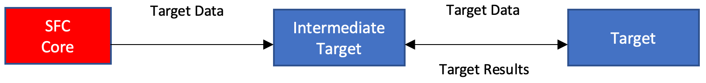

# Target Chaining

- [Target chaining](#target-chaining)
- [Store and forward target](#store-and-forward)
- [Router Target](#routing)

## Target chaining

To enable scenarios like store and forward, compression and encryption of data sent to targets, targets can now be chained. Intermediate adapters can be placed in between the core and the adapters that deliver the data to the actual destination. These intermediate targets are responsible for creating the adapter instances which are configured to forward the data to.

When an intermediate target creates the target instances, it can optionally pass an implementation of theTargetResultHandler interface. The instance of the created targets can use the instance of the passed interface implementation to acknowledge, dis-acknowledge or report the forwarded data messages as failed back to the forwarding intermediate target. The same interface can be used to query the data that the result of the forwarding target expects . This can be just the serial number, the complete message or no data, for acknowledged, dis-acknowledged or error messages.

Targets receive data from the SFC core to deliver to a target-specific destination, which could be a local store, a local service, or a cloud service.To enhance the functionality of target data delivery, special intermediate targets can be configured between the sfc-core and the final targets. From the sfc-core's perspective, these intermediate targets appear as regular targets when writing data. 

However, they serve a unique purpose:

- Intermediate targets implement specific logic to process the received data. They then pass the processed data to the next targets in the chain. They provide a handler to subsequent targets for reporting delivery results.

- The data messages can be acknowledged if successfully delivered to the destination, not acknowledged if the destination was unavailable (e.g., due to connectivity loss), or reported as an error if the target couldn't process the data (e.g., due to invalid data format).Intermediate targets can then take appropriate actions based on the results received from the next targets in the chain.

This strategy allows for the addition of new functionalities in data delivery to target destinations without modifying the actual end-targets. It provides a flexible and modular approach to extending the capabilities of the SFC system's data delivery process.

    <em>Fig. 3. Example of target daisy-chaining</em>

## Store and forward

The [Store and forwarding](file:///Applications/Typora.app/Contents/Resources/TypeMark/targets/store-and-forward-target.md) target for SFC targets is implemented as an intermediate adapter. This target serves two primary purposes:

- The store-forward-target buffers messages that could not be delivered to the destinations of the targets behind it. This decision is based on the results returned from these downstream targets. When the downstream targets can resume delivering data to their destinations, the store and forward target will resubmit the buffered data to these targets.

- This mechanism ensures that data is not lost when downstream targets are temporarily unable to deliver it, providing a robust solution for handling intermittent connectivity or destination unavailability issues in the SFC system.

## Routing

The [Router Target](./targets/router.md) enables intelligent data routing by redirecting messages to alternate targets based on the delivery outcome of a primary target. Implemented as an intermediate target that can be configured between SFC-Core and end targets, it can be used for bundling data over a network, routing to alternative targets if data cannot be written to primary targets, and routing to a success target after successful delivery. The RouterTargetConfiguration schema defines the routing policy and routes, including primary, alternate, and success targets, allowing flexible configuration of the data flow through the processing pipeline.

