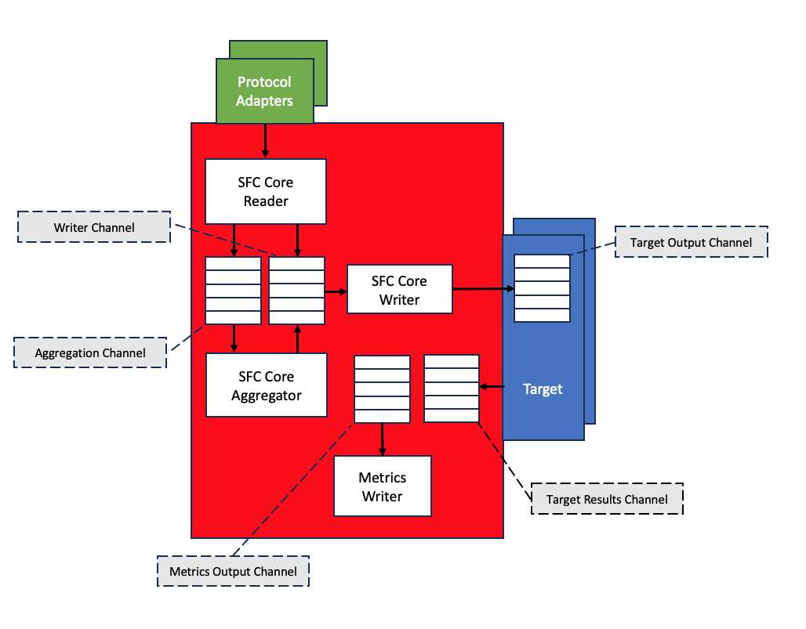

[SFC Configuration](./core/sfc-configuration.md) > [Tuning](./core/sfc-configuration.md#tuning)

# SFC tuning

This section describes the tuning of SFC using the elements of the [Tuning](./core/tuning-configuration.md) configuration at the top level of the SFC
configuration file.

- [SFC channel tuning](#sfc-channel-tuning)
- [Channel capacity warnings](#channel-capacity-warnings)
 - [Channel capacity errors](#channel-capacity-errors)
 - [SFC memory monitoring](#sfc-memory-monitoring)
 - [Concurrent reading from sources.](#concurrent-reading-from-sources)

This section describes the tuning of SFC using the elements of the [Tuning](./core/tuning-configuration.md) configuration at the top level of the SFC
configuration file.

## SFC channel tuning

SFC Internal Communication and Channel Management

The internal processes of SFC utilize memory-buffered channels for communication, enabling decoupled and parallel data processing. When writing data to a channel, SFC initially attempts a non-blocking call. If this fails due to the channel reaching its maximum capacity, a warning is generated. This warning includes the channel name, current parameter size, and the tuning parameter name for adjusting channel capacity.

Following a failed non-blocking attempt, SFC makes a blocking call, waiting for available channel capacity. If a timeout occurs during this wait, an error message is generated, detailing the channel name, timeout period, and the tuning parameter name for adjusting the timeout.

Channel sizing is specified by the number of items, meaning actual memory usage depends on the size of items sent to the channel. All timeouts are specified in milliseconds.

Channel warnings and errors typically occur when SFC collects data from sources faster than it can process and deliver to targets. For occasional occurrences due to data collection peaks or temporarily slower target processing, increasing the buffer size can help. Alternative solutions include reducing the data reading interval in the schedule or enabling batching for compatible targets.

This approach to channel management allows SFC to handle varying data loads efficiently while providing clear feedback for system optimization.it.

### Channel capacity warnings

When a channel reaches full capacity and data cannot be sent directly, SFC generates a notification. This message informs that sending data to the specified channel is blocking, and suggests increasing the value of the tuning parameter. The current channel size is also provided for reference.

In cases where data is successfully sent to the channel after waiting for available capacity, SFC logs this occurrence. The message includes the channel name, the duration of the blocking period, and recommends adjusting the tuning parameter to a higher value. Again, the current channel size is provided for context.

These notifications serve as important indicators of system performance and potential bottlenecks. They allow administrators to fine-tune the system by adjusting channel capacities based on observed behavior, ensuring optimal data flow through the SFC system. Regular monitoring of these messages can help in proactive system optimization and prevent potential data processing delays.

### Channel capacity errors

SFC monitors channel capacity and memory usage, generating alerts for potential issues. When a timeout occurs while waiting for channel capacity, SFC notifies that data sending to the specified channel timed out after the given period. It suggests increasing the value of the tuning parameter for channel timeout to address this issue.

In more critical situations, an out-of-memory error may occur when sending data to a channel. SFC logs this event, detailing the channel name and the specific out-of-memory error. The system recommends decreasing the value of the channel size tuning parameter, providing the current channel size for context.

These notifications are vital for maintaining system health and efficiency. They enable administrators to make informed decisions about resource allocation and system configuration, helping to prevent data loss, reduce processing delays, and optimize overall system performance.

The SFC architecture employs several main channels for its operations, as illustrated in the subsequent diagram. This visual representation aids in understanding the data flow and potential bottlenecks within the system.

**Aggregation Channel**

When a schedule is configured to apply aggregation on the collected data then this channel is used to send the data to
the aggregation process. Note that the aggregation process reads the data from the channel and stores it until the
configured size is reached and the data is aggregated.
Tuning parameters: AggregatorChannelSize/AggregatorChannelTimeout

**Writer Channel**

Processed data from either the reading or aggregation process is sent to this channel from where the SFC writer will
read it and send it to the configured targets
Tuning parameters: WriterInputChannelSize / WriterInputChannelTimeout

**Target Output Channel**

Target output data is written to the target output channel of a target from where it is read for sending it to the
target’s specific destination.
Tuning parameters: TargetChannelSize/TargetChannelTimeout

**Metrics Output Channel**

If metrics collection is enabled then this channel is used to send data to an instance of a metrics writer that writes
the metrics data.
Tuning parameters : ChannelSizePerMetricsProvider/MetricsChannelTimeout

**Targets Results Channel**

This channel is used to receive the results from delivering the data by the targets.
Tuning parameters: TargetResultsChannelSize/TargetResultsChannelTimeout

**Additional channel parameters (not in picture)**

Tuning parameters: TargetForwardingChannelSize/TargetForwardingChannelTimeout
Used by targets that do forward data (e.g. store-and-forward-target and router-target) to the next adapter in a
configured adapter chain.

Tuning parameters: TargetResubmitChannelSize/TargetResubmitChannelTimeout
Used by targets that do resubmit data (e.g. store-and-forward-target) to the next adapter in a configured adapter chain.

## SFC memory monitoring

SFC implements a comprehensive memory usage monitoring system across all its components. Every minute, each component checks its memory consumption. At 10-minute intervals, the system calculates memory allocation trends for the past 10 and 60 minutes. This trend is represented as a numerical value, positive for increasing memory usage and negative for decreasing usage.

If the 60-minute memory usage trend shows an upward trajectory, SFC generates a warning. This situation typically arises when SFC collects data faster than it can process and deliver to targets. The accumulation of in-flight data stored in processing pipeline channels may lead to increased memory usage, potentially causing out-of-memory errors if left unchecked.

The system is particularly vigilant about long-term memory usage patterns. When the memory usage trend continues to increase over a 60-minute period, SFC issues a warning to alert administrators of the potential issue.

For more detailed analysis, SFC offers enhanced logging capabilities. When tracing is enabled for logging, the system outputs both the minute-interval sampling data and the 10-minute trend calculations to the logging output. This feature provides administrators with granular insights into memory usage patterns, enabling proactive system optimization and preventing potential performance issues.

By continuously monitoring and analyzing memory usage trends, SFC ensures efficient operation and helps prevent memory-related issues that could impact system performance or stability.

## Concurrent reading from sources.

SFC schedules are designed to read data from multiple sources concurrently, enhancing efficiency and reducing overall data collection time. By default, the system is configured to read from a maximum of 5 sources simultaneously. This parallel processing capability can be adjusted to suit specific system requirements and resource constraints.

The MaxConcurrentSourceReaders tuning parameter allows administrators to modify the number of sources that can be read in parallel. Increasing this value enables the system to read from more sources simultaneously, potentially reducing the total time required for data collection. Conversely, decreasing this value can help manage system load, particularly in environments where network or system resources are limited.

To ensure timely completion of data collection, SFC provides the AllSourcesReadTimeout parameter. This setting specifies the maximum duration within which reading from all sources must be completed. This timeout helps prevent scenarios where slow or unresponsive sources might delay the entire data collection process.

Careful tuning of these parameters allows administrators to optimize the balance between rapid data collection and efficient resource utilization. By adjusting the level of parallelism and setting appropriate timeouts, SFC can be configured to perform optimally across a wide range of operational environments and data collection requirements.

