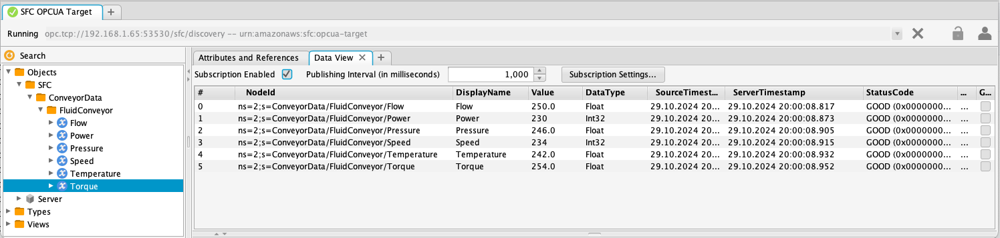
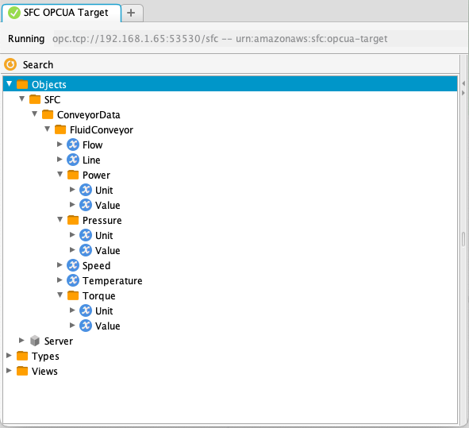
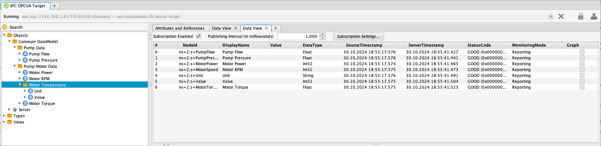

# OPC UA target adapter


The OPC UA target adapter for SFC implements an OPC UA server that exposes source data to OPC UA clients. It can operate in two modes: automatically generating a dynamic data model based on the incoming target data structure, or mapping the data to a custom-configured OPC UA data model.  

An alternative OPC UA target to this adapter is the [OPCUA Writer](./opcua-writer.md) target adapter, which does not host the OPCUA UA server within the target, but writes the data to an external server.

In order to use this target as in [in-process](../sfc-running-targets.md#running-targets-in-process) type target the type must be added to the [TargetTypes](../core/sfc-configuration.md#TargetTypes) section in the [SFC configuration file](../core/sfc-configuration.md).

```json
"TargetTypes" :{
   "OPCUA-TARGET": {
      "JarFiles" : ["<location of deployment>/opcua-target/lib"],
      "FactoryClassName": "com.amazonaws.sfc.opcuatarget.OpcuaTargetWriter"
   }
}
```


**Configuration:**


- [OPC UA target adapter data models and mapping](#opc-ua-target-adapter-data-models-and-mapping)
  - [Automatic model mapping](#automatic-model-mapping)
  - [Query mapping](#query-mapping)

**Configuration:**

- [OpcuaTargetConfiguration](#opcuatargetconfiguration)
- [DataModelConfiguration](#datamodelconfiguration)
- [FolderNodeConfiguration](#foldernodeconfiguration)
- [OpcuaCertificateValidationConfiguration](#opcuacertificatevalidationconfiguration)
- [OpcuaCertificateValidationOptions](#opcuacertificatevalidationoptions-type)
- [VariableNodeConfiguration](#variablenodeconfiguration)


# OPC UA target adapter data models and mapping

The OPC UA (Open Platform Communications Unified Architecture) target adapter exposes data collected from SFC source adapters as an OPC UA model. 
This model can be generated automatically by the adapter, which uses the structure and types of the received data. Alternatively,
you can configure a data model as part of the target configuration, mapping the received data to that model by specifying queries for its
variables to obtain the corresponding values.

There are two different mapping methods available for associating target data with the nodes of an OPC UA data model:

- [Automatic mapping](#automatic-model-mapping): The adapter generates the model based on incoming data structure and types.
- [Query mapping](#query-mapping): Custom models are defined, and queries are used to extract specific values from the incoming data.

## Automatic model mapping


The most straightforward method to expose the data received by the target adapter as an OPC UA model is to allow the 
adapter to  automatically generate the model based on the structure and values of the incoming data.

Below is an example of the target data received by the adapter. The schedule named "ConveyorData" collects data from a single source called "FluidConveyor," from which five values are read.

```json
{
  "schedule": "ConveyorData",
  "serial": "947a28de-d6c5-4e09-ab45-c8821fed89ba",
  "timestamp": "2024-10-29T12:55:59.665789Z",
  "sources": {
    "FluidConveyor": {
      "values": {
        "Power": {
          "value": 230,
          "timestamp": "2024-10-29T12:55:59.664717Z"
        },
        "Speed": {
          "value": 234,
          "timestamp": "2024-10-29T12:55:59.664717Z"
        },
        "Temperature": {
          "value": 242.0,
          "timestamp": "2024-10-29T12:55:59.664717Z"
        },
        "Pressure": {
          "value": 246.0,
          "timestamp": "2024-10-29T12:55:59.664717Z"
        },
        "Flow": {
          "value": 250.0,
          "timestamp": "2024-10-29T12:55:59.664717Z"
        },
        "Torque": {
          "value": 254.0,
          "timestamp": "2024-10-29T12:55:59.664717Z"
        }
      },
      "timestamp": "2024-10-29T12:55:59.664717Z"
    }
  }
}
```

The configuration below illustrates the minimum requirements to use the OPC UA target adapter, utilizing all defaults and enabling automatic mapping of the
data to a dynamically created model.

```json
  "OpcuaTarget": {
    "TargetType": "OPCUA-TARGET"
  }

```

The automatic creation of OPCUA nodes is controlled by the "AutoCreate" setting, which is enabled by default.

Data is now exposed through an automatically generated model, where all nodes are read-only for clients. 
When a client connects to the server through any of the available endpoints, the model becomes viewable, subject to the configured network interfaces, security policies, and modes.



When new nodes are created from the initial or subsequent target data, a data model change event (ns=0;i=2133) is raised for the server source (ns=0;i=2253).

---

When the target data contains metadata at the schedule, source, and/or channel levels, additional folder and variable nodes are created to store these values.

```json
{
  "schedule": "ConveyorData",
  "serial": "65e10488-d15d-46ba-9c1f-3c630a7a6b87",
  "timestamp": "2024-10-29T14:54:20.234465Z",
  "sources": {
    "FluidConveyor": {
      "values": {
        "Power": {
          "value": 230,
          "metadata": {
            "Unit": "Watt"
          },
          "timestamp": "2024-10-29T14:54:20.233361Z"
        },
        "Speed": {
          "value": 234,
          "timestamp": "2024-10-29T14:54:20.233361Z"
        },
        "Temperature": {
          "value": 242.0,
          "timestamp": "2024-10-29T14:54:20.233361Z"
        },
        "Pressure": {
          "value": 246.0,
          "metadata": {
            "Unit": "Bar"
          },
          "timestamp": "2024-10-29T14:54:20.233361Z"
        },
        "Flow": {
          "value": 250.0,
          "timestamp": "2024-10-29T14:54:20.233361Z"
        },
        "Torque": {
          "value": 254.0,
          "metadata": {
            "Unit": "NM"
          },
          "timestamp": "2024-10-29T14:54:20.233361Z"
        }
      },
      "metadata": {
        "Line": "1"
      },
      "timestamp": "2024-10-29T14:54:20.233361Z"
    }
  }
}
```

In the data above, there is metadata at the source level and for three of the six channel values.




To accommodate metadata, an additional node named "Line" is created within the "FluidConveyor" 
source node to store the metadata value. For the three channel values that include metadata, 
a folder node is created instead of a variable node. This folder contains a variable node 
named "Value" for the actual channel value, along with additional variable nodes for the metadata items.

The rule is that when metadata or aggregated values are present for a value, a folder is created for 
that value. If these are not present, a variable node is created.

Full example at [examples/in-process-s7-opcua, config file s7-opcua-auto-create.json](../../examples/in-process-s7-opcua/README.md)

## Query mapping

For query mapping, one or more data models are created for a target. The variable nodes in these models 
include a JMESPath query, named "ValueQuery," in their definitions, which selects values for the variable nodes 
from the target data. Optionally, a transformation can be specified to apply to the selected value before it 
is written to the node.

The [DataModels](#datamodelconfiguration) configuration contains the definition for a single custom model named "ConveyorDataModel," 
which has a structure different from the target data. For each variable node in this model, 
a JMESPath query is specified to query the target data. If the query returns a value, the variable node is 
updated with that value.

"Temperature" is configured as a [folder](#foldernodeconfiguration) node because it includes metadata. This metadata, along with the actual value, is stored as [variable](#variablenodeconfiguration) nodes within the "MotorTemperature" folder node. Additionally, this variable has a transformation applied to convert the value into degrees Celsius and round it to an integer to match the datatype in the model. The transformation, "ToCelsius", is defined in the ["Transformations"](../core/sfc-configuration.md#transformations) section of the [SFC configuration](../core/sfc-configuration.md).

<details>
<summary>Show Transformations</summary>

```json
  "Transformations" :{
    "ToCelsius" : [
         { "Operator" : "Celsius"},
         { "Operator" : "ToInt"}

    ]
  },
```

</details>

<details>

<summary>Show target data</summary>


```json
{
  "schedule": "ConveyorData",
  "serial": "20eba6be-398c-47c2-bf1b-a7a7f14fb0c0",
  "timestamp": "2024-10-30T17:51:00.191939Z",
  "sources": {
    "FluidConveyor": {
      "values": {
        "Power": {
          "value": 230,
          "timestamp": "2024-10-30T17:51:00.191409Z"
        },
        "Speed": {
          "value": 234,
          "timestamp": "2024-10-30T17:51:00.191409Z"
        },
        "Temperature": {
          "value": 242.0,
          "metadata": {
            "Unit": "Celsius"
          },
          "timestamp": "2024-10-30T17:51:00.191409Z"
        },
        "Pressure": {
          "value": 246.0,
          "timestamp": "2024-10-30T17:51:00.191409Z"
        },
        "Flow": {
          "value": 250.0,
          "timestamp": "2024-10-30T17:51:00.191409Z"
        },
        "Torque": {
          "value": 254.0,
          "timestamp": "2024-10-30T17:51:00.191409Z"
        }
      },
      "timestamp": "2024-10-30T17:51:00.191409Z"
    }
  }
}

```

</details>

The code below shows the [DataModels](#datamodels) section of the OPC UA target adapter configuration. To keep this 
JSON example brief, optional configuration settings for the nodes, except for [DisplayName](#displayname) are omitted.

The node configurations allow setting the identifier of NodeId by specifying the [Id](#id) setting as a numeric, 
string, or GUID value. Alternatively, you can use [BrowseName](#browsename) to set a node's browse name. If these fields are 
not specified, the key's value from the model configuration map is used as the default.

**Note that if the schedule, source, or channel name used in the JMESPath query contains non-alphanumeric characters, 
these names should be enclosed in double quotes. In JSON, double quotes need to be escaped with a \ character.**


```json
 "DataModels": {
      "ConveyorDataModel": {
        "DisplayName": "Conveyor DataModel",
        "Folders": {
          "DeviceData": {
            "DisplayName": "Pump Motor Data",
            "Variables": {
              "MotorPower": {
                "DisplayName": "Motor Power",
                "DataType": "INT32",
                "ValueQuery" : "@.sources.FluidConveyor.values.Power.value"
              },
              "MotorSpeed": {
                "DisplayName": "Motor RPM",
                "DataType": "INT32",
                "ValueQuery" : "@.sources.FluidConveyor.values.Speed.value"

              },
              "MotorTorque": {
                "DisplayName": "Motor Torque",
                "DataType": "REAL",
                "ValueQuery" : "@.sources.FluidConveyor.values.Torque.value"
              }
            },
            "Folders": {
              "MotorTemperature": {
                "DisplayName": "Motor Temperature",
                "Variables" :{
                    "Value" :{
                         "DataType" : "INT",
                         "ValueQuery" : "@.sources.FluidConveyor.values.Temperature.value",
                         "Transformation" : "ToCelsius"
                    },
                    "Unit" : {
                      "DataType" : "STRING",
                      "ValueQuery" : "@.sources.FluidConveyor.values.Temperature.metadata.Unit"
                    }
                }
              }
            }
          },
          "PumpData": {
            "DisplayName": "Pump Data",
            "Variables": {
              "PumpFlow": {
                "DisplayName": "Pump Flow",
                "DataType": "REAL",
                "ValueQuery" : "@.sources.FluidConveyor.values.Flow.value"
              },
              "PumpPressure": {
                "DisplayName": "Pump Pressure",
                "DataType": "REAL",
                "ValueQuery" : "@.sources.FluidConveyor.values.Pressure.value"
              }
            }
          }
        }
      }
    }
```

This configuration results in the model below.



---


## OpcuaTargetConfiguration

[SFC Configuration](../core/sfc-configuration.md) > [Targets](../core/sfc-configuration.md#targets) >  [Target](../core/target-configuration.md) 

OpcuaTargetConfiguration extends the type TargetConfiguration with specific configuration data for publishing the data through an OPC UA model. The Targets configuration element can contain entries of this type; the TargetType of these entries must be set to **"OPCUA-TARGET"**.

- [Schema](#opcuatargetconfiguration-schema)
- [Examples](#opcuatargetconfiguration-examples)

**Properties:**

- [AutoCreate](#autocreate)
- [CertificateValidation](#certificatevalidation)
- [DataModels](#datamodels)
- [InitValuesWithNull](#initvalueswithnull)
- [ServerAnonymousDiscoveryEndPoint](#serveranonymousdiscoveryendpoint)
- [ServerMessageSecurityModes](#servermessagesecuritymodes)
- [ServerNetworkInterfaces](#servernetworkinterfaces)
- [ServerPath](#serverpath)
- [ServerSecurityPolicies](#serversecuritypolicies)
- [ServerCertificate](#servercertificate)
- [ServerTcpPort](#servertcpport)

  

---
### AutoCreate
Controls automatic node creation for unmapped target data elements in the OPC UA server.

When set to true, the adapter automatically creates nodes for data elements that aren't mapped to existing nodes in the configured models, or when no models are defined. If false, unmapped data elements are not stored in the model. Setting this to true without specifying any model results in a data model that is entirely generated from received target data.

**Type**: Boolean


Default is true

---

### Certificate

Defines the settings for the server's security certificate, which is used for secure communication and authentication. This configuration determines how the server's certificate is created, stored, and managed for establishing secure connections with clients.

**Type**: [CertificateConfiguration](../core/certificate-configuration.md)n

---
### CertificateValidation
Configuration settings for OPC UA server certificate validation and security. Certificate validation is a security process that verifies the authenticity and trustworthiness of digital certificates used in secure communications.

**Type**: [OpcuaCertificateValidationConfiguration](#opcuacertificatevalidationconfiguration)

---
### DataModels
OPC UA data model definitions that specify how data is structured and exposed through the OPC UA server.

One or more data models can be configured to expose SFC target data through the OPC UA server. These models define the mapping of incoming data to specific OPC UA nodes. If no models are specified, the target adapter automatically generates a model structure based on the received SFC target data and values.

**Type**: Map[String, [DataModelConfiguration](#datamodelconfiguration)]

---
### InitValuesWithNull
Controls whether variable nodes are initialized with null values when no explicit initialization value is provided.

When set to true, any variable node that doesn't have a specific initialization value will be set to null. This affects the initial state of variables in the OPC UA server before actual data values are received.

**Type**: Boolean


---
### ServerAnonymousDiscoveryEndPoint
Controls the availability of an anonymous discovery endpoint for the OPC UA server.

When enabled, creates a dedicated endpoint with no security requirements specifically for discovery purposes. This follows OPC UA Part 6 specifications and is considered a best practice, allowing clients to discover the server's capabilities before establishing a secure connection.


**Type**: Boolean

Default is true

---
### ServerMessageSecurityModes
Specifies the supported message security modes for the OPC UA server.

Type: Array of Strings

Defines how messages between clients and the server are secured. Accepts one or more of these values:

- "None" (Default): No message security
- "Sign": Messages are digitally signed
- "SignAndEncrypt": Messages are both signed and encrypted

**Type**: [String]


---
### ServerNetworkInterfaces
Specifies which network interfaces can be used to access the OPC UA server.

Lists the names of network interfaces, e.g. en0,  that will be bound to the OPC UA server. If not specified, the server will bind to all available network interfaces by default.

**Type:** Array of Strings

---
### ServerPath
ServerPath defines the URI path segment in the OPC UA server endpoint URL.

The ServerPath is used to create unique endpoint URLs for the OPC UA server. For example, if your server is running on "opc.tcp://hostname:4840" and the ServerPath is set to "sfc", the complete endpoint URL would be "opc.tcp://hostname:4840/sfc". This path helps organize and distinguish between different OPC UA servers running on the same host, allowing for better endpoint organization and identification.

**Type**: String

Default is "sfc"


---
### ServerSecurityPolicies
Defines the security policies supported by the OPC UA server. 

**Type:** Array of Strings

Specifies which encryption and security algorithms are available for client connections. Available options:

- "None": No security
- "Basic128Rsa15": Basic RSA 15 with 128-bit encryption (deprecated)
- "Basic256": Basic encryption with 256-bit security (deprecated) [[2\]](https://docs.aws.amazon.com/iot-sitewise/latest/userguide/configure-opcua-source.html)
- "Basic256Sha256": SHA-256 with 256-bit encryption
- "Aes128Sha256RsaOaep": AES-128 with SHA-256 and RSA-OAEP

Default includes all policies except Aes128Sha256RsaOaep.Note that Basic128Rsa15 and Basic256 are considered legacy options.

---
### ServerCertificate

Defines the certificate settings used for secure communication. If no certificate is explicitly configured, the server will automatically generate and use a self-signed certificate. This certificate is used for authentication and securing communications with clients.

Type: [CertificateConfiguration](../core/certificate-configuration.md)

No certificate is configured then a default self-signed certificate will be created.

---

### ServerTcpPort

Defines which network port the OPC UA server will use for communication with clients. This port needs to be available on the host system and accessible through any firewalls if remote clients need to connect.

**Type**: Integer

Default is 53530


### OpcuaTargetConfiguration Schema

```json
{
  "$schema": "http://json-schema.org/draft-07/schema#",
  "title": "OpcuaTargetConfiguration",
  "type": "object",
  "allOf": [
    {
      "$ref": "#/definitions/TargetConfiguration"
    },
    {
      "$ref": "#/definitions/AwsServiceConfig"
    },
    {
      "type": "object",
      "properties": {
        "AutoCreate": {
          "type": "boolean",
          "description": "Automatically create nodes if they don't exist",
          "default": false
        },
        "CertificateValidation": {
          "$ref": "#/definitions/OpcuaCertificateValidationConfiguration",
          "description": "Certificate validation configuration"
        },
        "DataModels": {
          "$ref": "#/definitions/DataModelConfiguration",
          "description": "Data models configuration"
        },
        "InitValuesWithNull": {
          "type": "boolean",
          "description": "Initialize values with null",
          "default": false
        },
        "ServerAnonymousDiscoveryEndPoint": {
          "type": "boolean",
          "description": "Enable anonymous discovery endpoint",
          "default": false
        },
        "ServerMessageSecurityModes": {
          "type": "array",
          "items": {
            "type": "string",
            "enum": ["None", "Sign", "SignAndEncrypt"]
          },
          "description": "Supported message security modes"
        },
        "ServerNetworkInterfaces": {
          "type": "array",
          "items": {
            "type": "string"
          },
          "description": "Network interfaces to bind server to"
        },
        "ServerPath": {
          "type": "string",
          "description": "Server path"
        },
        "ServerSecurityPolicies": {
          "type": "array",
          "items": {
            "type": "string",
            "enum": [
              "None",
              "Basic128Rsa15",
              "Basic256",
              "Basic256Sha256",
              "Aes128_Sha256_RsaOaep",
              "Aes256_Sha256_RsaPss"
            ]
          },
          "description": "Supported security policies"
        },
        "ServerCertificate":{
          "$ref": "#/definitions/CertificateConfiguration",
          "description": "Server Certificate configuration"
        },
        "ServerTcpPort": {
          "type": "integer",
          "description": "Server TCP port",
          "default": 4840
        }
      },
      "required": ["ServerPath"]
    }
  ]
}

```

### OpcuaTargetConfiguration Examples

Basic Configuration, model is created automatically from received data.

```json
{
  "TargetType": "OPCUA-TARGET",
  "ServerPath": "/opcua/server",
  "ServerTcpPort": 4840,
  "ServerNetworkInterfaces": [
    "lo",
    "en1"
  ],
  "ServerSecurityPolicies": [
    "None",
    "Basic128Rsa15",
    "Basic256",
    "Basic256Sha256"
  ],
  "AutoCreate": true
}
```

Configuration with data model

```json
{
  "TargetType": "OPCUA-TARGET",
  "ServerPath": "/opcua/server",
  "ServerTcpPort": 4840,
  "ServerNetworkInterfaces": [
    "lo",
    "en1"
  ],
  "ServerSecurityPolicies": [
    "None",
    "Basic128Rsa15",
    "Basic256",
    "Basic256Sha256"
  ],
  "DataModels": {
    
    "ConveyorDataModel": {
      "DisplayName": "Conveyor DataModel",
      
      "Folders": {
        
        "DeviceData": {
          "DisplayName": "Pump Motor Data",
          "Variables": {
            "MotorPower": {
              "DisplayName": "Motor Power",
              "DataType": "INT32",
              "ValueQuery": "@.sources.FluidConveyor.values.Power.value"
            },
            
            "MotorSpeed": {
              "DisplayName": "Motor RPM",
              "DataType": "INT32",
              "ValueQuery": "@.sources.FluidConveyor.values.Speed.value"
            },
            
            "MotorTorque": {
              "DisplayName": "Motor Torque",
              "DataType": "REAL",
              "ValueQuery": "@.sources.FluidConveyor.values.Torque.value"
            }
          }
        }
      }
    }
  }
}
```


[^top](#opc-ua-target-adapter-data-models-and-mapping)


## DataModelConfiguration

[OpcuaTargetConfiguration](#opcuatargetconfiguration) > [DataModels](#datamodels) 

Defines the configuration for data models, specifying how data is structured, organized, and represented within the system. 

- [Schema](#datamodelconfiguration-schema)
- [Examples](#datamodelconfiguration-examples)

**Properties:**
- [BrowseName](#browsename)
- [Description](#description)
- [DisplayName](#displayname)
- [Folders](#folders)
- [Id](#id)
- [Namespace](#namespace)
- [Variables](#variables)

---
### BrowseName
Specifies the name used when browsing through the OPC UA address space.

Defaults to using the Id value if not specified

**Type**: String

---
### Description
Specifies the human-readable name shown in the user interface.

Defaults to using the Id value if not specified.

**Type**: String

---
### DisplayName
Specifies the human-readable name shown in the user interface.

Defaults to using the ID value if not specified.

**Type**: String

---
### Folders
Defines a map of sub-folders to be created within the main folder structure.

Allows organizing data into a hierarchical folder structure within the data model.

**Type**: Map[String, [FolderNodeConfiguration](#foldernodeconfiguration)]

---
### Id
Specifies the unique identifier for the node in the OPC UA address space.

**Type**: String

Optional,defaults to using the model's key from the OPC UA target configuration DataModels table. The ID format determines the node identifier type (numeric, GUID, or string) and is combined with a namespace index to create the complete node identifier. Must be unique across all tables in the DataModel configuration.

The value of the id is used as the identifier in the node id for the folder. 

- Id is a number: "ns=[namespace index];i= [numeric id]"

- Id is a guid: "ns=[namespace index];g= [guid id]"

- Id is a string : "ns=[namespace index];s= [guid id]"

  

The value of the namespace index is set by the server when the model is built from the model specification.


---
### Namespace
Specifies the namespace URI for the data model.

**Type**: String

Default is "urn:amazonaws.sfc"

---
### Variables
Used to specify data points or variables that will be available in the top-level folder

**Type**: Map[String, [VariableNodeConfiguration](#variablenodeconfiguration)]


### DataModelConfiguration Schema

```json
{
  "$schema": "http://json-schema.org/draft-07/schema#",
  "title": "DataModelConfiguration",
  "type": "object",
  "properties": {
    "BrowseName": {
      "type": "string",
      "description": "Browse name of the data model"
    },
    "Description": {
      "type": "string",
      "description": "Description of the data model"
    },
    "DisplayName": {
      "type": "string",
      "description": "Display name of the data model"
    },
    "Folders": {
      "type": "object",
      "description": "Map of folder configurations",
      "additionalProperties": {
        "$ref": "#/definitions/FolderNodeConfiguration"
      }
    },
    "Id": {
      "type": "string",
      "description": "Identifier of the data model"
    },
    "Variables": {
      "type": "object",
      "description": "Map of variable configurations",
      "additionalProperties": {
        "$ref": "#/definitions/VariableNodeConfiguration"
      }
    }
  }
}

```

### DataModelConfiguration Examples

```json
{
  "DisplayName": "Conveyor DataModel",
  "Folders": {
    "DeviceData": {
      "DisplayName": "Pump Motor Data",
      "Variables": {
        "MotorPower": {
          "DisplayName": "Motor Power",
          "DataType": "INT32",
          "ValueQuery": "@.sources.FluidConveyor.values.Power.value"
        },
        "MotorSpeed": {
          "DisplayName": "Motor RPM",
          "DataType": "INT32",
          "ValueQuery": "@.sources.FluidConveyor.values.Speed.value"
        },
        "MotorTorque": {
          "DisplayName": "Motor Torque",
          "DataType": "REAL",
          "ValueQuery": "@.sources.FluidConveyor.values.Torque.value"
        }
      },
      "Folders": {
        "MotorTemperature": {
          "DisplayName": "Motor Temperature",
          "Variables": {
            "Value": {
              "DataType": "INT",
              "ValueQuery": "@.sources.FluidConveyor.values.Temperature.value",
              "Transformation": "ToCelsius"
            },
            "Unit": {
              "DataType": "STRING",
              "ValueQuery": "@.sources.FluidConveyor.values.Temperature.metadata.Unit"
            }
          }
        }
      }
    },
    "PumpData": {
      "DisplayName": "Pump Data",
      "Variables": {
        "PumpFlow": {
          "DisplayName": "Pump Flow",
          "DataType": "REAL",
          "ValueQuery": "@.sources.FluidConveyor.values.Flow.value"
        },
        "PumpPressure": {
          "DisplayName": "Pump Pressure",
          "DataType": "REAL",
          "ValueQuery": "@.sources.FluidConveyor.values.Pressure.value"
        }
      }
    }
  }
}
```

[^top](#opc-ua-target-adapter-data-models-and-mapping)


## FolderNodeConfiguration

[OpcuaTargetConfiguration](#opcuatargetconfiguration) > [DataModels](#datamodels) > [Model](#datamodelconfiguration) > [Folders](#folders)

\* > [Folder](#foldernodeconfiguration) > [Folders](#folders)

Defines the configuration for a folder node in a hierarchical data structure, specifying properties like display name, browse name, and nested folders or variables. Allows organization of data points and sub-folders within the system's folder structure.

**Properties:**

- [BrowseName](#browsename)
- [Description](#description)
- [DisplayName](#displayname)
- [Folders](#folders)
- [Id](#id)
- [Variables](#variables)

---
### BrowseName
Specifies the name used when browsing through the folder structure.
Defaults to using the Id property value  if not specified

**Type**: String

---
### Description
Description for the folder node.

**Type**: String

---
### DisplayName
Specifies the human-readable name shown in the user interface for the folder node.

Defaults to using the Id property value  if not specified

**Type**: String

---
### Folders
Defines a map of sub-folders to be created within this folder. Used to create nested folder structures within the parent folder.

**Type**: Map[String, [FolderNodeConfiguration](#foldernodeconfiguration)]

---
### Id

Specifies the unique identifier for the folder node in the OPC UA address space.

**Type**: String

Optional,defaults to using the model's key from the OPC UA target configuration DataModels table. The ID format determines the node identifier type (numeric, GUID, or string) and is combined with a namespace index to create the complete node identifier. Must be unique across all tables in the DataModel configuration.

The value of the id is used as the identifier in the node id for the folder. 

- Id is a number: "ns=[namespace index];i= [numeric id]"

- Id is a guid: "ns=[namespace index];g= [guid id]"

- Id is a string : "ns=[namespace index];s= [guid id]"

  

The value of the namespace index is set by the server when the model is built from the model specification.


---
### Variables
Used to specify data points or variables that will be available in the  folder

**Type**: Map[String, [VariableNodeConfiguration](#variablenodeconfiguration)]


### FolderNodeConfiguration Schema

```json
{
  "$schema": "http://json-schema.org/draft-07/schema#",
  "title": "FolderNodeConfiguration",
  "type": "object",
  "properties": {
    "BrowseName": {
      "type": "string",
      "description": "Browse name of the data model"
    },
    "Description": {
      "type": "string",
      "description": "Description of the data model"
    },
    "DisplayName": {
      "type": "string",
      "description": "Display name of the data model"
    },
    "Folders": {
      "type": "object",
      "description": "Map of folder configurations",
      "additionalProperties": {
        "$ref": "#/definitions/FolderNodeConfiguration"
      }
    },
    "Id": {
      "type": "string",
      "description": "Identifier of the folder"
    },
    "Variables": {
      "type": "object",
      "description": "Map of variable configurations",
      "additionalProperties": {
        "$ref": "#/definitions/VariableNodeConfiguration"
      }
    }
  }
}

```

### FolderNodeConfiguration Examples

```json
{
  "DeviceData": {
    "DisplayName": "Pump Motor Data",
    "Variables": {
      "MotorPower": {
        "DisplayName": "Motor Power",
        "DataType": "INT32",
        "ValueQuery": "@.sources.FluidConveyor.values.Power.value"
      },
      "MotorSpeed": {
        "DisplayName": "Motor RPM",
        "DataType": "INT32",
        "ValueQuery": "@.sources.FluidConveyor.values.Speed.value"
      },
      "MotorTorque": {
        "DisplayName": "Motor Torque",
        "DataType": "REAL",
        "ValueQuery": "@.sources.FluidConveyor.values.Torque.value"
      }
    },
    "Folders": {
      "MotorTemperature": {
        "DisplayName": "Motor Temperature",
        "Variables": {
          "Value": {
            "DataType": "INT",
            "ValueQuery": "@.sources.FluidConveyor.values.Temperature.value",
            "Transformation": "ToCelsius"
          },
          "Unit": {
            "DataType": "STRING",
            "ValueQuery": "@.sources.FluidConveyor.values.Temperature.metadata.Unit"
          }
        }
      }
    }
  }
}
```

[^top](#opc-ua-target-adapter-data-models-and-mapping)


## OpcuaCertificateValidationConfiguration

[OpcuaTargetConfiguration](#opcuatargetconfiguration) > [CertificateValidation](#certificatevalidation)

The OpcuaCertificateValidationConfiguration class defines the configuration settings for OPC UA certificate validation.

- [Schema](#opcuacertificatevalidationconfiguration-schema)
- [Examples](#opcuacertificatevalidationconfiguration-example)

**Properties:**

- [Active](#active)
- [Directory](#directory)
- [ValidationOptions](#validationoptions)

------

### Active

The Active property is a flag that enables or disables the validation of server certificates.

**Type** : Boolean

When set to true, server certificate validation is enabled.
When set to false, server certificate validation is disabled

------

### Directory

The Directory property specifies the pathname to the base directory where certificates and certificate revocation lists (CRLs) are stored.

**Type** : String

Important notes:

- This directory must exist prior to use
- The adapter will automatically create any required subdirectories if they don't exist

Directory structure

```
[Configured directory name]
   |----- issuers
   |        |---- certs
   |        |---- crl
   |      trusted
   |        |---- certs
   |        |---- crl
   |----- rejected
```

This structure shows:

- A root directory (specified by the Directory property)

- Three main subdirectories:

  - issuers/ - Contains two subdirectories:

    - certs/ - For issuer certificates
    - crl/ - For issuer certificate revocation lists

  - trusted/ - Contains two subdirectories:

    - certs/ - For trusted certificates
    - crl/ - For trusted certificate revocation lists

  - rejected/ - For rejected certificates

------

### ValidationOptions

The ValidationOptions property configures optional certificate validation checks.

 If this property is not set, all validation options are enabled by default.

**Type**: [OpcuaCertificateValidationOptions](#opcuacertificatevalidationoptions-type)


### OpcuaCertificateValidationConfiguration Schema

```json
 {
  "$schema": "http://json-schema.org/draft-07/schema#",
  "type": "object",
  "description": "Configuration for certificate validation",
  "properties": {
    "Active": {
      "type": "boolean",
      "description": "Enable or disable certificate validation",
      "default": true
    },
    "Directory": {
      "type": "string",
      "description": "Directory path for certificate storage and validation"
    },
    "ValidationOptions": {
      "$ref": "#/definitions/ValidationOptions",
      "description": "Options for certificate validation"
    }
  }
}
```

### OpcuaCertificateValidationConfiguration Example

Basic configuration:

```json
{
  "Directory": "./certificates",
  "Active": true
}
```

With validation options:

```json
{
  "Directory": "./certificates",
  "Active": true,
  "ValidationOptions": {
    "ApplicationUri": false,
    "ExtKeyUsageEndEntity": false,
    "HostOrIp": false,
    "KeyUsageEndEntity": false,
    "KeyUsageIssuer": true,
    "Revocation": true,
    "Validity": true
  }
}
```


## OpcuaCertificateValidationOptions type

[OpcuaTargetConfiguration](#opcuatargetconfiguration) > [CertificateValidation](#certificatevalidation) > [ValidationOptions](#validationoptions)

The OpcuaCertificateValidationOptions class defines configuration options for certificate validation checks during OPC UA connections.

This class allows you to specify which validation checks should be performed when validating certificates. When a certificate validation option is disabled, that specific check will be skipped during the validation process.

- [Schema](#opcuacertificatevalidationoptions-type-schema)
- [Examples](#opcuacertificatevalidationoptions-type-example)

**Properties:**

- [ApplicationUri](#applicationuri)
- [ExtKeyUsageEndEntity](#extkeyusageendentity)
- [HostOrIp](#hostorip)
- [KeyUsageEndEntity](#keyusageendentity)
- [KeyUsageIssuer](#keyusageissuer)
- [Revocation](#revocation)
- [Validity](#validity)

---

### ApplicationUri

The ApplicationUri property determines whether to validate the Application URI against the Subject Alternative Names in the certificate.

When enabled (true):

- The Application URI from the server's application description will be checked against the ApplicationUri specified in the Subject Alternative Names field of the certificate 
- This validation helps ensure the certificate belongs to the expected application

When disabled (false):

- This specific validation check will be skipped

**Type** : Boolean

**Default** : true

---

### ExtKeyUsageEndEntity

The ExtKeyUsageEndEntity property determines whether to check the Extended Key Usage (EKU) extension in end-entity certificates.

When enabled (true):

- The Extended Key Usage extension must be present in end-entity certificates
- The extension will be validated to ensure proper usage constraints
- This helps ensure the certificate is being used for its intended purpose

When disabled (false):

- The Extended Key Usage extension check will be skipped for end-entity certificates

**Type** : Boolean

**Default** : true

---

### HostOrIp

The HostOrIp property controls whether the host name or IP address must be present and validated in the Subject Alternative Names (SAN) field of the certificate.

When enabled (true):

- Requires the host name or IP address to be present in the certificate's Subject Alternative Names
- Validates that the connection endpoint matches the host name or IP address specified in the SAN
- Helps prevent connection to unauthorized endpoints

When disabled (false):

- Skips the validation of host name or IP address in the Subject Alternative Names

**Type** : Boolean

**Default** : true

---

### KeyUsageEndEntity

The KeyUsageEndEntity property controls the validation of the Key Usage extension for end-entity certificates.

When enabled (true):

- Requires the Key Usage extension to be present in end-entity certificates
- Validates the extension content to ensure proper key usage constraints
- Verifies that the certificate's key is being used for its intended purposes (such as digital signatures, key encipherment, etc.)

When disabled (false):

- Skips the validation check for the Key Usage extension in end-entity certificates

**Type** : Boolean

**Default** : true

---

### KeyUsageIssuer

The KeyUsageIssuer property controls the validation of the Key Usage extension for Certificate Authority (CA) certificates. 

When enabled (true):

- Requires the Key Usage extension to be present in CA certificates
- Validates that the CA certificate has appropriate key usage flags set
- Ensures the CA certificate has proper permissions for signing other certificates
- Verifies the CA certificate is being used within its intended constraints

When disabled (false):

- Skips the validation check for Key Usage extension in CA certificates

**Type** : Boolean

**Default** : true

---

### Revocation

The Revocation property controls whether certificate revocation checking is performed during the validation process.

When enabled (true):

- Checks if certificates have been revoked
- Verifies certificate status using Certificate Revocation Lists (CRLs) 
- Helps ensure that invalid or compromised certificates are not accepted
- Provides an additional security layer by detecting and rejecting certificates that have been explicitly invalidated

When disabled (false):

- Skips all certificate revocation checks
- Will not verify if certificates have been revoked by the issuing authority

**Type** : Boolean

**Default** : true

---
### Validity

The Validity property controls whether to check the certificate's validity period during validation. 

When enabled (true):

- Verifies that the current date/time falls within the certificate's validity period
- Checks both the "Not Before" and "Not After" dates of the certificate
- Ensures that expired certificates or certificates that are not yet valid are rejected
- Helps maintain security by preventing the use of certificates outside their intended timeframe

When disabled (false):

- Skips the certificate validity period check
- Will accept certificates regardless of their expiration status or future validity dates

Note: It's generally recommended to keep this enabled as using expired certificates can pose security risks.

**Type** : Boolean
**Default** : true


### OpcuaCertificateValidationOptions Type Schema

```json
{
  "$schema": "http://json-schema.org/draft-07/schema#",
  "type": "object",
  "description": "Configuration options for certificate validation",
  "properties": {
    "ApplicationUri": {
      "type": "boolean",
      "description": "Enable validation of application URI",
      "default": true
    },
    "ExtKeyUsageEndEntity": {
      "type": "boolean",
      "description": "Enable validation of extended key usage for end entity certificates",
      "default": true
    },
    "HostOrIp": {
      "type": "boolean",
      "description": "Enable validation of host name or IP address",
      "default": true
    },
    "KeyUsageEndEntity": {
      "type": "boolean",
      "description": "Enable validation of key usage for end entity certificates",
      "default": true
    },
    "KeyUsageIssuer": {
      "type": "boolean",
      "description": "Enable validation of key usage for issuer certificates",
      "default": true
    },
    "Revocation": {
      "type": "boolean",
      "description": "Enable certificate revocation checking",
      "default": true
    },
    "Validity": {
      "type": "boolean",
      "description": "Enable validation of certificate validity period",
      "default": true
    }
  }
}

```

### OpcuaCertificateValidationOptions Type Example

```json
{
  "ApplicationUri": false,
  "ExtKeyUsageEndEntity": false,
  "HostOrIp": false,
  "KeyUsageEndEntity": false,
  "KeyUsageIssuer": true,
  "Revocation": true,
  "Validity": true
}

```


## VariableNodeConfiguration

[OpcuaTargetConfiguration](#opcuatargetconfiguration) > [DataModels](#datamodels) > [Model](#datamodelconfiguration) > [Folders](#folders) > [Folder](#foldernodeconfiguration) > [Variables](#variables)

 \* > [Folder](#foldernodeconfiguration) > [Variables](#variables)

Defines configuration settings for a variable node in the data model and how to map the values for the variables from the target data received by the adapter.

[Folder](#foldernodeconfiguration) > [Folders](#folders)

- [Schema](#variablenodeconfiguration-schema)
- [Examples](#variablenodeconfiguration-examples)

**Properties:**
- [ArrayDimensions](#arraydimensions)
- [BrowseName](#browsename)
- [DataType](#datatype)
- [Description](#description)
- [DisplayName](#displayname)
- [Id](#id)
- [InitValue](#initvalue)
- [TimestampQuery](#timestampquery)
- [Transformation](#transformation)
- [ValueQuery](#valuequery)

---
### ArrayDimensions
Specifies the dimensions and size of an array value.

**Type**: [Int]


The array contains the sizes for the dimensions for an array variable;
e.g.

[3] : Value array of 3 element
[3,2] : Value array of 3 by 2 elements


---
### BrowseName

Specifies the name used for the variable when browsing through the OPC UA address space.

Defaults to using the Id value if not specified

**Type**: String

---
### DataType
Specifies the data type of the variable node's value. 

**Type**: String

The following data types are supported:

- BOOLEAN
- BYTE, SBYTE (signed byte)
- BYTE_STRING
- DATETIME
- DOUBLE (double)
- REAL (float)
- EXPANDED_NODE_ID
- FLOAT
- INT, INTEGER, INT32 (Int32)
- LOCALIZED_TEXT
- LONG, INT64 (Int64)
- NODE_ID
- QUALIFIED_NAME
- SHORT, INT16 (Int16)
- STRING
- UINT, UINT32, UINTEGER (UInt32)
- UUID
- XML_ELEMENT
- UBYTE,  (unsigned byte)
- ULONG, UINT64 ()
- USHORT, UINT16 (UInt16)
- STRUCT
- VARIANT (note that this type does not support array type)

Please note that for certain types, alternative names may be utilized.

The underscores (_) employed in the type names serve to enhance clarity and may be omitted.

Type names are case-insensitive.


---
### Description
Description for the variable node.

**Type**: String

---
### DisplayName

Specifies the human-readable name shown in the user interface for the folder node.

Defaults to using the Id property value  if not specified

---
### Id
Specifies the unique identifier for the variable node in the OPC UA address space

Optional, defaults to using the model's key from the OPC UA target configuration DataModels table. The Id format determines the node identifier type (numeric, GUID, or string) and is combined with a namespace index to create the complete node identifier. Must be unique across all tables in the DataModel configuration.

- Id is a number: "ns=[namespace index];**i**= [numeric id]"
- Id is a guid: "ns=[namespace index];g= [guid id]"
- Id is a string : "ns=[namespace index];s= [guid id]"

The value of the namespace index is set by the server when the model is built from the model specification.

Note that all keys in all tabled in a DataModel configuration must be unique.

**Type**: String


---
### InitValue
Defines the starting value for the variable node when it is first created.

If no initial value is specified, the value of the node will be set to null when the "InitValuesWithNull" setting for the target is set to true, or left 
undefined when it is false. The value must match the data type for the node. 

If the value is an array, as described in "ArrayDimensions," the dimensions of the initial value must match those of the variable. Initial array values can be specified with up to three dimensions.

**Type**: Any

---
### TimestampQuery
JMESPath expression used to extract timestamp data from the target data structure.

The value must be a valid JMESPath query https://jmespath.org.

e.g. @.sources..values..timestamp

Note that if the source or channel name contains  characters, not in  the ranges A-Z, a-z, 0-9, then these must be quoted.
These quoted must be escaped with a '' character in the JSON configuration.

If no query is specified in addition to the ValueQuery described above, then the adapter will try to build a query from that ValueQuery by replacing the 
"value" section of the query with  "timestamp". If that query does not return a timestamp, then either the source or schedule timestamp will be used.

**Type**: String

---
### Transformation
Specifies a transformation ID to process the value before writing it to the variable node.

References a transformation defined in the  [Transformations](../core/sfc-configuration.md#transformations) section of the SFC configuration, applied after ValueQuery retrieval but before writing to the OPC UA node

**Type**: String

---
### ValueQuery
JMESPath expression used to extract the value from the target data structure.

**Type**: String

The value must be a valid JMESPath query https://jmespath.org.

Note that if the source or channel name contains non-alphanumeric characters, then these elements must be quoted.
The quoted characters must be escaped with a \ character in the JSON configuration.

### VariableNodeConfiguration Schema

```json
{
  "$schema": "http://json-schema.org/draft-07/schema#",
  "title": "VariableNodeConfiguration",
  "type": "object",
  "properties": {
    "ArrayDimensions": {
      "type": "array",
      "items": {
        "type": "integer"
      },
      "description": "Array dimensions for array variables"
    },
    "BrowseName": {
      "type": "string",
      "description": "Browse name of the variable node"
    },
    "DataType": {
      "type": "string",
      "description": "Data type of the variable",
      "enum": [
        "BOOLEAN",
        "BYTE",
        "SBYTE",
        "BYTE_STRING", 
        "DATETIME",
        "DOUBLE",
        "REAL",
        "EXPANDED_NODE_ID",
        "FLOAT",
        "INT",
        "INTEGER",
        "INT32",
        "LOCALIZED_TEXT",
        "LONG",
        "INT64",
        "NODE_ID",
        "QUALIFIED_NAME",
        "SHORT",
        "INT16",
        "STRING",
        "UINT",
        "UINT32",
        "UINTEGER",
        "UUID",
        "XML_ELEMENT",
        "UBYTE",
        "ULONG",
        "UINT64",
        "USHORT",
        "UINT16",
        "STRUCT",
        "VARIANT"
      ]
    },
    "Description": {
      "type": "string",
      "description": "Description of the variable node"
    },
    "DisplayName": {
      "type": "string", 
      "description": "Display name of the variable node"
    },
    "Id": {
      "type": "string",
      "description": "Identifier of the variable node"
    },
    "InitValue": {
      "description": "Initial value of the variable"
    },
    "TimestampQuery": {
      "type": "string",
      "description": "Query to extract timestamp information"
    },
    "Transformation": {
      "type": "string",
      "description": "Transformation to apply to the value"
    },
    "ValueQuery": {
      "type": "string",
      "description": "Query to extract the variable value"
    }
  },
  "required": [ "DataType"]
}

```

### VariableNodeConfiguration Examples

Node with explicit string id, browsename  and displayname. Node id will be `ns:<ns>;s=speed`

```json
{
  "Id" : "speed",
  "DisplayName": "Motor RPM",
  "BrowseName" : "motors-speed"
  "DataType": "INT32",
  "ValueQuery": "@.sources.FluidConveyor.values.Speed.value"
}
```


Node with explicit numeric id, Node id will be `ns:<ns>;i=1001`

```json
{
  "Id" : "1001",
  "DataType": "INT32",
  "ValueQuery": "@.sources.FluidConveyor.values.Speed.value"
}
```


[^top](#opc-ua-target-adapter-data-models-and-mapping)

