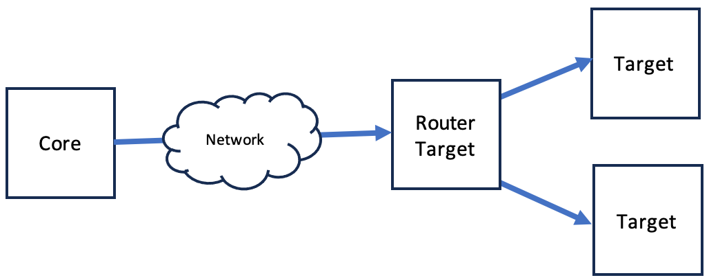
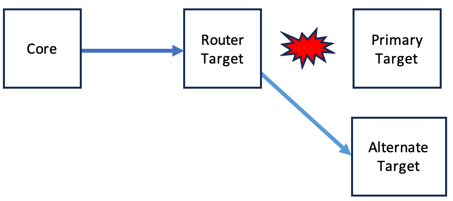
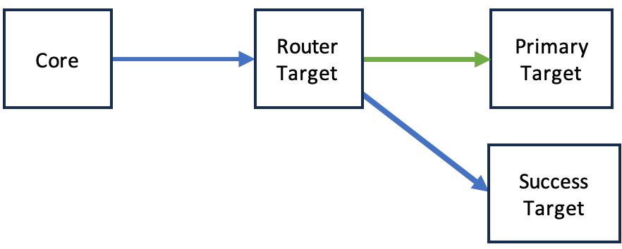
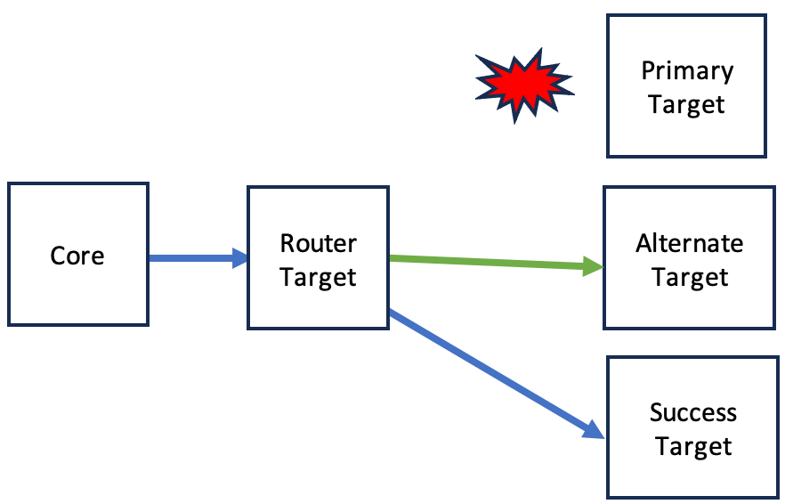

# Router Target

[SFC Configuration](../core/sfc-configuration.md) > [Targets](../core/sfc-configuration.md#targets) >  [Target](../core/target-configuration.md) 

The SFC Router Target provides intelligent data routing capabilities by redirecting messages to alternate targets based on the delivery outcome of a primary target. When the primary target successfully processes data, the router can forward to a "success" target. Conversely, if the primary target fails, data can be redirected to a "failure" target. This enables flexible data flow control and reliable message handling through configurable routing paths.

## Deploy this target

`TargetType` is `ROUTER` in every deployment mode. In the uberjar and in-process modes the `TargetTypes` key is the same value. How the modes differ: [Configure a component in each mode](../sfc-deployment.md#configuration-in-each-mode). All types and classes: [Target types and classes](../sfc-running-targets.md#target-types-and-classes).

**Uberjar** - installed by [sfcup](../../README.md#1-install); run with `sfcx`:

```json
"TargetTypes": {
  "ROUTER": { "FactoryClassName": "com.amazonaws.sfc.router.RouterTargetWriter" }
}
```

**In-process** - module bundle `router-target` unpacked into the directory named by `SFC_DEPLOYMENT_DIR`, run with `sfc-main`:

```json
"TargetTypes": {
  "ROUTER": {
    "JarFiles": ["${SFC_DEPLOYMENT_DIR}/router-target/lib"],
    "FactoryClassName": "com.amazonaws.sfc.router.RouterTargetWriter"
  }
}
```

**IPC** - no `TargetTypes`; the target runs as its own service:

```json
"Targets": {
  "RouterTarget": {
    "TargetType": "ROUTER",
    "TargetServer": "RouterTargetServer"
  }
},
"TargetServers": {
  "RouterTargetServer": { "Address": "localhost", "Port": 50001 }
}
```

> **Known issue:** a router that runs as an IPC service (with `TargetServer`) does not start yet: the core passes the service only the targets listed in the router's `Targets` property, not the targets of its `Routes`. Run the router in-process or from the uberjar.

Start the service before SFC, on the port of its `TargetServers` entry:

**Linux / macOS**

```shell
router-target/bin/router-target -port 50001
```

**Windows (PowerShell)**

```powershell
java -cp "C:\sfc\router-target\lib\*" com.amazonaws.sfc.router.AwsRouterTargetService -port 50001
```

From an sfcup install, start the same service from the uberjar: `java -cp "$HOME/.sfc/current/lib/*" com.amazonaws.sfc.router.AwsRouterTargetService -port 50001` (Windows: `java -cp "$HOME\.sfc\versions\$(Get-Content $HOME\.sfc\current.txt)\lib\*" com.amazonaws.sfc.router.AwsRouterTargetService -port 50001`).

**Examples:** none yet - start from [Quickstart step 2](../../README.md#2-helloworld-simulator-example) and swap in this component. All: [examples catalog](../examples/README.md)

**Configuration:**

The router target can be used to forward data to one or more targets in a [target chain](../sfc-targets-chaining.md). For each target an alternative
target can be configured to which the data is routed if that data cannot be written to its primary target.

Each primary target can also have a target configured to which the data is routed if it has been written successfully to its primary target. Data delivered through the alternative target is not forwarded to that success target.

Use cases for the router target are:

- *Bundling* of (compressed) message data over a network to a system on which a group of targets, running as external
  services, are hosted.

<p align="center">



<p align="center">
    <em>Fig. 1. SFC Router target - bundling data</em>


- *Routing* of data *to alternative targets* if data cannot be written to primary targets

<p align="center">



<p align="center">
    <em>Fig. 2. SFC Router target - failover target</em>


- *Routing* of data to a *success target* after it has been written to primary targets. Data delivered through an
  alternative target is not forwarded to the success target. The
  success target can be used to archive delivered messages or a custom target can notify the source of the data that the
  data has been delivered.

<p align="center">



<p align="center">
    <em>Fig. 3. SFC Router target - routing to a final `success` target</em>


<p align="center">



<p align="center">
    <em>Fig. 4. SFC Router target - failover to the alternate target together with a `success` target; currently data delivered through the alternate target is not forwarded to the success target</em>


## RouterTargetConfiguration

- [Schema](#routertargetconfiguration-schema)
- [Examples](#routertargetconfiguration-examples)

RouterTargetConfiguration extends the type  [TargetConfiguration](../core/target-configuration.md) with specific configuration data for routing target data to next (primary) targets and alternative and success targets for these targets. The Targets configuration element can contain entries of this type, the TargetType of these entries must be set to **"ROUTER"**.


**Properties:**

- [ResultHandlerPolicy](#resulthandlerpolicy)
- [Routes](#routes)


---
### ResultHandlerPolicy
The ResultHandlerPolicy determines how the router evaluates the overall success of data routing operations. This policy can be set to one of two values:

- "AllTargets" : The routing operation is considered successful only if the data is successfully written to all configured primary targets, or their corresponding alternative routes if primary targets fail.
- "AnyTarget" : The routing operation is considered successful if the data is successfully written to at least one configured primary target, or an alternative route for any primary target.

If not specified, the default policy is "AllTargets", ensuring the most stringent delivery guarantee across all configured targets.

**Type**: String

---
### Routes
The Routes property defines the routing paths for data through a map of target configurations. Each entry in the map is keyed by the target ID of a primary target and contains its associated routing rules:

- Primary targets receive data first
- Alternative routes specify fallback targets when primary target delivery fails
- Success targets receive data after successful delivery to the primary target (not after delivery through the alternative target)

The map uses target IDs as keys, with each value being a RoutesConfiguration object that specifies the alternative and success routes. All referenced targets must be properly configured either as in-process targets or IPC service [targets](../core/sfc-configuration.md#targets) within the configuration.

**Type**: Map[String, [RoutesConfiguration](#routesconfiguration)]

The targets must be targets that are configured either as in-process or IPC service targets in the same configuration. List only the router target in the schedule's `Targets`; the targets in its routes are defined in `Targets` like any other target, see [Configuring a chain](../sfc-targets-chaining.md#configuring-a-chain).


### RouterTargetConfiguration Schema

```json
{
  "$schema": "http://json-schema.org/draft-07/schema#",
  "title": "RouterTargetConfiguration",
  "type": "object",
  "allOf": [
    {
      "$ref": "#/definitions/TargetConfiguration"
    },
    {
      "type": "object",
      "properties": {
        "ResultHandlerPolicy": {
          "type": "string",
          "enum" : ["AllTargets", "AnyTarget"],
          "default" : "AllTargets",
          "description": "Policy for handling routing results"
        },
        "Routes": {
          "type": "object",
          "description": "Map of route configurations",
          "additionalProperties": {
            "$ref": "#/definitions/RoutesConfiguration"
          },
          "minProperties": 1
        }
      },
      "required": ["Routes"]
    }
  ]
}

```

### RouterTargetConfiguration Examples
```json
{
  "TargetType" : "ROUTER",
  "ResultHandlerPolicy": "AllTargets",
  "Routes": {
    "s3-target": {
      "Alternate": "fallback-file-target",
      "Success": "archive-file-target"
    }
  }
}

```

[^top](#router-target)

## RoutesConfiguration

[RouterTarget](#routertargetconfiguration) > [Routes](#routes)

The RoutesConfiguration class defines routing paths for a primary target, specifying alternative targets for handling delivery failures and success targets for post-delivery processing. Each configuration can include an alternative target ID to route data when the primary target fails, and a success target ID to receive data after successful delivery to the primary target.


- [Schema](#routesconfiguration-schema)
- [Examples](#routesconfiguration-examples)

**Properties:**

- [Alternate](#alternate)
- [Success](#success)

---

### Alternate

The Alternate property specifies the target ID of a fallback target that will receive data when the primary target fails to process it. This optional property enables automatic failover routing, ensuring data can be processed through an alternative path when the primary route is unavailable.

Type: String

Optional	

---

### Success

The Success property specifies the target ID of a destination that will receive data after successful processing by the primary target; data delivered through the alternative target is not forwarded to it. This optional property enables chaining of targets for post-success processing or monitoring workflows.

Type: String

Optional

### RoutesConfiguration Schema

```json
{
  "$schema": "http://json-schema.org/draft-07/schema#",
  "title": "RoutesConfiguration",
  "type": "object",
  "properties": {
    "Alternate": {
      "type": "string",
      "description": "Target ID for routing when primary target is unavailable"
    },
    "Success": {
      "type": "string", 
      "description": "Target ID for routing on successful write to the primary target"
    }
  }
}
```

### RoutesConfiguration Examples

Basic Routing:

```json
{
  "Alternate": "fallback-target",
  "Success": "archive-target"
}
```

Failover Only:

```json
{
  "Alternate": "fallback-target"
}
```


Success Route Only:

```json
{
  "Success": "analytics-target"
}
```

