SFC `in-process` setup in Greengrass V2
=======================================

### TOC
  - [Preconditions](#preconditions)
  - [Introduction](#introduction)
  - [Setup](#setup)
    - [Step 1: Preparing the Working Directories](#step-1-preparing-the-working-directories)
    - [Step 2: Downloading the SFC modules](#step-2-downloading-the-sfc-modules)
    - [Step 3: Creating Greengrass recipes](#step-3-creating-greengrass-recipes)
    - [Step 4: Local Deployment](#step-4-local-deployment)
    - [Step 5: Testing the deployment](#step-5-testing-the-deployment)
    - [Step 6: Remove the local deployment](#step-6-remove-the-local-deployment)
    - [Step 7: Publish the components](#step-7-publish-the-components)
    - [Step 8: Deploy the components with AWS IoT Core web console on your device](#step-8-deploy-the-components-with-aws-iot-core-web-console-to-your-device)
  - [Removing Components from deployment and IOT Core](#removing-components-from-deployment-and-deleting-components)
    - [Remove SFC components from deployment](#remove-sfc-components-from-deployment)
    - [Delete SFC components from IOT Core](#delete-sfc-components-from-iot-core)

# Preconditions

>**Important!** <br> If the SFC Greengrass components are already installed on your device, then 
you should start with [Step 3](#step-3-creating-greengrass-recipes) and *only* create a custom recipe and custom 
sfc-config for `sfc-main`. You can query the AWS IoT Greengrass API and fetch the current recipe for `sfc-main` using:

**Linux / macOS**

```shell
aws greengrassv2 get-component \
--arn arn:aws:greengrass:<your-region>:<your-aws-account-id>:components:com.amazon.sfc.sfc-main:versions:<your-Version> --output text \
--recipe-output-format JSON  \
--query recipe | base64 --decode #| jq
```

**Windows (PowerShell)**

```powershell
$recipe = aws greengrassv2 get-component `
  --arn "arn:aws:greengrass:<your-region>:<your-aws-account-id>:components:com.amazon.sfc.sfc-main:versions:<your-Version>" `
  --recipe-output-format JSON --query recipe --output text
[Text.Encoding]::UTF8.GetString([Convert]::FromBase64String($recipe))
```
> use the JSON returned from above command for `sfc-main` (keep only the URI entry in the Artifacts section). 

1. We assume that your Greengrass environment is Linux based as we use bash scripts and the components recipes will target Linux as operating system. On a Windows core device use the [Greengrass uberjar](../greengrass-uberjar/README.md) example instead.

2. We assume that you have an embedded device or AWS Cloud9 environment already setup with the Greengrass-CLI similar to the chapter <a href="https://catalog.us-east-1.prod.workshops.aws/workshops/5ecc2416-f956-4273-b729-d0d30556013f/en-US/chapter3-greengrasssetup ">3.Greengrass environment </a> of the AWS IoT Greengrass V2 workshop.
3. You have a Greengrass environment and a token exchange role assigned to it.

4. Please make sure that your token exchange role has the following permissions:

```json
{
    "Version": "2012-10-17",
    "Statement": [
        {
            "Sid": "S3BucketActions",
            "Effect": "Allow",
            "Action": [
                "s3:CreateBucket",
                "s3:ListAllMyBuckets",
                "s3:GetBucketLocation",
                "s3:PutObject",
                "s3:GetObject"
            ],
            "Resource": [
                "arn:aws:s3:::*"
            ]
        },
        {
            "Effect": "Allow",
            "Action": [
                "iot:*"
            ],
            "Resource": "*"
        },
        {
            "Sid": "GreengrassActions",
            "Effect": "Allow",
            "Action": [
                "greengrass:*"
            ],
            "Resource": "*"
        }
    ]
}

```
>Note! <br> This permission set is too open for production and should be reduced. It is used here only for simplicity!

5. Furthermore, we assume you have Docker in your Greengrass environment to run the OPC UA test server, which is started in [Step 5](#step-5-testing-the-deployment). It can also run on another host that the core device reaches; then set `Address` of `OPCUA-SERVER-1` to `opc.tcp://<that-host>`.

6. Java 17 or newer as the `java` that the components run with. SFC is built for Java 17, so an older `java` fails with `UnsupportedClassVersionError`. The recipes set `RequiresPrivilege`, so check it with `sudo java -version`.

7. The AWS CLI on the device, with credentials that may upload to S3 and create Greengrass components ([Step 7](#step-7-publish-the-components)), and two S3 buckets: one in your Greengrass region for the component artifacts and recipes, and one for the OPC UA data. Create both before you start; the S3 target does not create buckets.

# Introduction

This setup will demonstrate how to integrate SFC into Greengrass V2. After following the steps you will have a docker container with OPCUA server running. The SFC setup will poll the values from this OPCUA server and write those into a logfile, AWS S3 and AWS IOT MQTT channel.

First we create for each SFC module a local component and deploy it locally from within Greengrass. After testing we upload the Greengrass components to AWS S3 and register the components in AWS Iot Core and deploy them remotely with AWS Iot Core web console.

The complete setup will create components for the SFC modules:
- sfc-main
- debug-target
- aws-s3-target
- mqtt-target
- opcua

**The setup will configure all modules to be started in SFC's [`in-process mode`](../../docs/sfc-running-adapters.md#running-protocol-adapters-in-process)**. That means that all SFC modules run inside the sfc-main process on a single host.

>Note! <br>
If you have previously installed the modules in SFC's IPC mode   you must remove the components from IOT CORE and from your Greengrass deployment! 


# Setup

All commands in this section run in a shell on the Linux core device (from a Windows PC, connect to it first with `ssh <user>@<core-device>`).

## Step 1: Preparing the working directories
Log into the Greengrass environment and switch to your home directory 
and create the working folders with the following command:

```bash
mkdir -p ~/environment/GreengrassSFC/artifacts/com.amazon.sfc.{sfc-main,opcua,aws-s3-target,mqtt-target,debug-target}/1.0.0

mkdir -p ~/environment/GreengrassSFC/recipes
```
You should now see the following directory structure:

```text
~/environment/GreengrassSFC
├── artifacts
│   ├── com.amazon.sfc.aws-s3-target/1.0.0
│   ├── com.amazon.sfc.debug-target/1.0.0
│   ├── com.amazon.sfc.mqtt-target/1.0.0
│   ├── com.amazon.sfc.opcua/1.0.0
│   └── com.amazon.sfc.sfc-main/1.0.0
└── recipes
```

## Step 2: Downloading the SFC modules
Download the sfc modules of the latest SFC release and store them into the artifacts folder with the following command:
  
```bash
PATH_TO_REPOSITORY=https://github.com/awslabs/industrial-shopfloor-connect/releases/latest/download

curl -fL $PATH_TO_REPOSITORY/sfc-main.tar.gz -o ~/environment/GreengrassSFC/artifacts/com.amazon.sfc.sfc-main/1.0.0/sfc-main.tar.gz

curl -fL $PATH_TO_REPOSITORY/debug-target.tar.gz -o ~/environment/GreengrassSFC/artifacts/com.amazon.sfc.debug-target/1.0.0/debug-target.tar.gz

curl -fL $PATH_TO_REPOSITORY/mqtt-target.tar.gz -o ~/environment/GreengrassSFC/artifacts/com.amazon.sfc.mqtt-target/1.0.0/mqtt-target.tar.gz

curl -fL $PATH_TO_REPOSITORY/aws-s3-target.tar.gz -o ~/environment/GreengrassSFC/artifacts/com.amazon.sfc.aws-s3-target/1.0.0/aws-s3-target.tar.gz

curl -fL $PATH_TO_REPOSITORY/opcua.tar.gz -o ~/environment/GreengrassSFC/artifacts/com.amazon.sfc.opcua/1.0.0/opcua.tar.gz
```

You should see now the following directory structure:

```text
~/environment/GreengrassSFC
├── artifacts
│   ├── com.amazon.sfc.aws-s3-target/1.0.0/aws-s3-target.tar.gz
│   ├── com.amazon.sfc.debug-target/1.0.0/debug-target.tar.gz
│   ├── com.amazon.sfc.mqtt-target/1.0.0/mqtt-target.tar.gz
│   ├── com.amazon.sfc.opcua/1.0.0/opcua.tar.gz
│   └── com.amazon.sfc.sfc-main/1.0.0/sfc-main.tar.gz
└── recipes
```


## Step 3: Creating Greengrass recipes
Now we create the recipes for the sfc modules. Execute the following command:

```sh
touch ~/environment/GreengrassSFC/recipes/com.amazon.sfc.{sfc-main,debug-target,opcua,mqtt-target,aws-s3-target}-1.0.0.json
```

You should see now the following directory structure:

```text
~/environment/GreengrassSFC
├── artifacts
│   └── (the five module folders from Step 2)
└── recipes
    ├── com.amazon.sfc.aws-s3-target-1.0.0.json
    ├── com.amazon.sfc.debug-target-1.0.0.json
    ├── com.amazon.sfc.mqtt-target-1.0.0.json
    ├── com.amazon.sfc.opcua-1.0.0.json
    └── com.amazon.sfc.sfc-main-1.0.0.json
```


Now copy the following content into the file **~/environment/GreengrassSFC/recipes/com.amazon.sfc.mqtt-target-1.0.0.json**:

```json
{
   "RecipeFormatVersion": "2020-01-25",
   "ComponentName": "com.amazon.sfc.mqtt-target",
   "ComponentVersion": "1.0.0",
   "ComponentDescription": "SFC mqtt-target component",
   "ComponentPublisher": "Amazon",
   "ComponentConfiguration": {
      "DefaultConfiguration": {
         "ipc_mode": "false",
         "ipc_port": "50004"
         }
   },
   "Manifests": [
      {
         "Platform": {
            "os": "linux"
         },
         "Lifecycle": {
             
            "Install": {
                "RequiresPrivilege": true,
                "Script": "cd {artifacts:path} && tar -xvf mqtt-target.tar.gz"
            }, 
            "Run": {
                "RequiresPrivilege": true,
                "Script": "if $IPC_MODE; then {artifacts:path}/mqtt-target/bin/mqtt-target -port {configuration:/ipc_port}; fi",
                "Setenv": {
                    "IPC_MODE": "{configuration:/ipc_mode}"
                }
            }
         },
         "Artifacts":[
            {
               "URI": "s3://[REPLACE WITH YOUR S3 BUCKET]/artifacts/com.amazon.sfc.mqtt-target/1.0.0/mqtt-target.tar.gz"
            }
            
         ]
      }
   ]
}

``` 

>Note! <br> Replace the placeholder ***[REPLACE WITH YOUR S3 BUCKET]*** with an S3 bucket name where you want later to store your Greengrass components artifacts and recepes! 


Now copy the following content into the file **~/environment/GreengrassSFC/recipes/com.amazon.sfc.aws-s3-target-1.0.0.json**:
```json
{
   "RecipeFormatVersion": "2020-01-25",
   "ComponentName": "com.amazon.sfc.aws-s3-target",
   "ComponentVersion": "1.0.0",
   "ComponentDescription": "SFC aws-s3-target component",
   "ComponentPublisher": "Amazon",
   "ComponentConfiguration": {
      "DefaultConfiguration": {
         "ipc_mode": "false",
         "ipc_port": "50003"
         }
   },
   "Manifests": [
      {
         "Platform": {
            "os": "linux"
         },
         "Lifecycle": {
             
            "Install": {
                "RequiresPrivilege": true,
                "Script": "cd {artifacts:path} && tar -xvf aws-s3-target.tar.gz"
            }, 
            "Run": {
                "RequiresPrivilege": true,
                "Script": "if $IPC_MODE; then {artifacts:path}/aws-s3-target/bin/aws-s3-target -port {configuration:/ipc_port}; fi",
                "Setenv": {
                    "IPC_MODE": "{configuration:/ipc_mode}"
                }
            }
         },
         "Artifacts":[
            {
               "URI": "s3://[REPLACE WITH YOUR S3 BUCKET]/artifacts/com.amazon.sfc.aws-s3-target/1.0.0/aws-s3-target.tar.gz"
            }
            
         ]
      }
   ]
}

```

>Note! <br> Replace the placeholder ***[REPLACE WITH YOUR S3 BUCKET]*** with an S3 bucket name where you want later to store your Greengrass components artifacts and recepes! 

Now copy the following content into the file **~/environment/GreengrassSFC/recipes/com.amazon.sfc.debug-target-1.0.0.json**:
```json
{
   "RecipeFormatVersion": "2020-01-25",
   "ComponentName": "com.amazon.sfc.debug-target",
   "ComponentVersion": "1.0.0",
   "ComponentDescription": "SFC debug target component",
   "ComponentPublisher": "Amazon",
   "ComponentConfiguration": {
      "DefaultConfiguration": {
         "ipc_mode": false,
         "ipc_port": "50001"
         }
   },
   "Manifests": [
      {
         "Platform": {
            "os": "linux"
         },
         "Lifecycle": {
             
            "Install": {
                "RequiresPrivilege": true,
                "Script": "cd {artifacts:path} && tar -xvf debug-target.tar.gz"
            }, 
            "Run": {
                "RequiresPrivilege": true,
                "Script": "if $IPC_MODE; then {artifacts:path}/debug-target/bin/debug-target -port {configuration:/ipc_port}; fi",
                "Setenv": {
                    "IPC_MODE": "{configuration:/ipc_mode}"
                }
            }
         },
         "Artifacts":[
            {
               "URI": "s3://[REPLACE WITH YOUR S3 BUCKET]/artifacts/com.amazon.sfc.debug-target/1.0.0/debug-target.tar.gz"
            }
            
         ]
      }
   ]
}

```
>Note! <br> Replace the placeholder ***[REPLACE WITH YOUR S3 BUCKET]*** with an S3 bucket name where you want later to store your Greengrass components artifacts and recepes! 

Now copy the following content into the file **~/environment/GreengrassSFC/recipes/com.amazon.sfc.opcua-1.0.0.json**:
```json
{
   "RecipeFormatVersion": "2020-01-25",
   "ComponentName": "com.amazon.sfc.opcua",
   "ComponentVersion": "1.0.0",
   "ComponentDescription": "SFC-OPCUA adapter component",
   "ComponentPublisher": "Amazon",
   "ComponentConfiguration": {
      "DefaultConfiguration": {
         "ipc_mode": false,
         "ipc_port": "50002"
         }
   },
   "Manifests": [
      {
         "Platform": {
            "os": "linux"
         },
         "Lifecycle": {
             
            "Install": {
                "RequiresPrivilege": true,
                "Script": "cd {artifacts:path} && tar -xvf opcua.tar.gz"
            }, 
            "Run": {
                "RequiresPrivilege": true,
                "Script": "if $IPC_MODE; then {artifacts:path}/opcua/bin/opcua -port {configuration:/ipc_port}; fi",
                "Setenv": {
                    "IPC_MODE": "{configuration:/ipc_mode}"
                }
            }
         },
         "Artifacts":[
            {
               "URI": "s3://[REPLACE WITH YOUR S3 BUCKET]/artifacts/com.amazon.sfc.opcua/1.0.0/opcua.tar.gz"
            }
            
         ]
      }
   ]
}

```
>Note! <br> Replace the placeholder ***[REPLACE WITH YOUR S3 BUCKET]*** with an S3 bucket name where you want later to store your Greengrass components artifacts and recepes! 

Now copy the following content into the file **~/environment/GreengrassSFC/recipes/com.amazon.sfc.sfc-main-1.0.0.json**:

```json
{
   "RecipeFormatVersion": "2020-01-25",
   "ComponentName": "com.amazon.sfc.sfc-main",
   "ComponentVersion": "1.0.0",
   "ComponentDescription": "SFC-Core component",
   "ComponentPublisher": "Amazon",
   "ComponentDependencies": {
    "com.amazon.sfc.opcua": {
      "VersionRequirement": "^1.0.0",
      "DependencyType": "HARD"
    },
    "com.amazon.sfc.debug-target": {
      "VersionRequirement": "^1.0.0",
      "DependencyType": "HARD"
    },
    "com.amazon.sfc.aws-s3-target": {
      "VersionRequirement": "^1.0.0",
      "DependencyType": "HARD"
    },
    "com.amazon.sfc.mqtt-target": {
      "VersionRequirement": "^1.0.0",
      "DependencyType": "HARD"
    }
  },
   "ComponentConfiguration": {
      "DefaultConfiguration": {
         "SFC_CONFIG_JSON": {
              "AWSVersion": "2022-04-02",
              "Name": "OPCUA to S3, using in process source and targets",
              "Version": 1,
              "LogLevel": "Info",
              "ElementNames": {
                "Value": "value",
                "Timestamp": "timestamp",
                "Metadata": "metadata"
              },
              "Schedules": [
                {
                  "Name": "OpcuaToS3",
                  "Interval": 1000,
                  "Description": "Read data of all OPCUA data types once per second and send to S3",
                  "Active": true,
                  "TimestampLevel": "Both",
                  "Sources": {
                    "OPCUA-SOURCE": [
                      "*"
                    ]
                  },
                  "Targets": [
                    "DebugTarget",
                    "S3Target",
                    "IOTCore"
                  ]
                }
              ],
              "Sources": {
                "OPCUA-SOURCE": {
                  "Name": "OPCUA-SOURCE",
                  "ProtocolAdapter": "OPC-UA",
                  "AdapterOpcuaServer": "OPCUA-SERVER-1",
                  "Description": "OPCUA local test server",
                  "SourceReadingMode": "Polling",
                  "SubscribePublishingInterval": 100,
                  "Channels": {
                    "ServerStatus": {
                      "Name": "ServerStatus",
                      "NodeId": "ns=0;i=2256"
                    },
                    "ServerTime": {
                      "Name": "ServerTime",
                      "NodeId": "ns=0;i=2256",
                      "Selector": "@.currentTime"
                    },
                    "State": {
                      "Name": "State",
                      "NodeId": "ns=0;i=2259"
                    },
                    "Machine1AbsoluteErrorTime": {
                      "Name": "AbsoluteErrorTime",
                      "NodeId": "ns=20;i=59217"
                    },
                    "Machine1AbsoluteLength": {
                      "Name": "AbsoluteLength",
                      "NodeId": "ns=20;i=59235"
                    },
                    "Machine1AbsoluteMachineOffTime": {
                      "Name": "AbsoluteMachineOffTime",
                      "NodeId": "ns=20;i=59210"
                    },
                    "Machine1AbsoluteMachineOnTime": {
                      "Name": "AbsoluteMachineOnTime",
                      "NodeId": "ns=20;i=59219"
                    },
                    "Machine1AbsolutePiecesIn": {
                      "Name": "AbsolutePiecesIn",
                      "NodeId": "ns=20;i=59237"
                    },
                    "Machine1FeedSpeed": {
                      "Name": "FeedSpeed",
                      "NodeId": "ns=20;i=59208"
                    }
                  }
                }
              },
              "Targets": {
                "DebugTarget": {
                  "Active": true,
                  "TargetType": "DEBUG-TARGET"
                },
                "S3Target": {
                    "Active": true,
                    "TargetType": "AWS-S3",
                    
                    "Region": "[AWS BUCKET REGION]",
                    "BucketName":"[REPLACE WITH YOUR S3 BUCKET FOR OPCUA DATA]",
                    "CredentialProviderClient" :"AwsIotClient",
                    
                    "Interval": 60,
                    "BufferSize": 1,
                    "Prefix": "sfc",
                    "Compression": "NONE"
                    
                },
                "IOTCore": {
                  "Active": true,
                  "TargetType": "MQTT-TARGET",
                  
                  "TopicName":"sfc-greengrass",
                  "EndPoint":"ssl://[AWS IOT DATA ENDPOINT]",
                  "Port": 8883,
              
                  "Certificate": "/greengrass/v2/thingCert.crt",
                  "PrivateKey": "/greengrass/v2/privKey.key",
                  "RootCA": "/greengrass/v2/rootCA.pem"
                }
              },
              "TargetTypes": {
                "DEBUG-TARGET": {
                  "JarFiles": [
                    "{com.amazon.sfc.debug-target:artifacts:path}/debug-target/lib"
                  ],
                  "FactoryClassName": "com.amazonaws.sfc.debugtarget.DebugTargetWriter"
                },
                "AWS-S3": {
                  "JarFiles": [
                    "{com.amazon.sfc.aws-s3-target:artifacts:path}/aws-s3-target/lib"
                  ],
                  "FactoryClassName": "com.amazonaws.sfc.awss3.AwsS3TargetWriter"
                },
                "MQTT-TARGET": {
                  "JarFiles": [
                    "{com.amazon.sfc.mqtt-target:artifacts:path}/mqtt-target/lib"
                  ],
                  "FactoryClassName": "com.amazonaws.sfc.mqtt.MqttTargetWriter"
                }
                
              },
              "AdapterTypes": {
                "OPCUA": {
                  "JarFiles": [
                    "{com.amazon.sfc.opcua:artifacts:path}/opcua/lib"
                  ],
                  "FactoryClassName": "com.amazonaws.sfc.opcua.OpcuaAdapter"
                }
              },
              "ProtocolAdapters": {
                "OPC-UA": {
                  "AdapterType": "OPCUA",
                  "OpcuaServers": {
                    "OPCUA-SERVER-1": {
                      "Address": "opc.tcp://localhost",
                      "Path": "/",
                      "Port": 4840,
                      "ConnectTimeout": "10000",
                      "ReadBatchSize": 500
                    }
                  }
                }
              },
              "AwsIotCredentialProviderClients": {
                "AwsIotClient": {
                  "#ThingName": "<GG-thingName>",
                  "#IotCredentialEndpoint": "<uniqueID>.credentials.iot.<region>.amazonaws.com",
                  "#CertificateFile": "[path to certificates here, commented out as GreenGrasDeploymentPath is set, so these are used]/Certificates/thingCert.crt",
                  "#PrivateKeyFile": "[path to certificates here, commented out as GreenGrasDeploymentPath is used]/privKey.key",
                  "#RootCa": "[path to certificates here, commented out as GreenGrasDeploymentPath is used]/rootCA.pem",
                  "SkipCredentialsExpiryCheck": false,
                  "GreenGrassDeploymentPath": "/greengrass/v2"
                }
              }
            }
         }
   },
   "Manifests": [
      {
         "Platform": {
            "os": "linux"
         },
         "Lifecycle": {
             
            "Install": {
                "RequiresPrivilege": true,
                "Script": "cd {artifacts:path} && tar -xvf sfc-main.tar.gz"
            }, 
            "Run": {
                "RequiresPrivilege": true,
                "Script": "{artifacts:path}/sfc-main/bin/sfc-main",
                "Setenv": {
                    "SFC_CONFIG": "{configuration:/SFC_CONFIG_JSON}"
                }
            }
         },
         "Artifacts":[
            {
               "URI": "s3://[REPLACE WITH YOUR S3 BUCKET]/artifacts/com.amazon.sfc.sfc-main/1.0.0/sfc-main.tar.gz"
            }
            
         ]
      }
   ]
}

```
>Note! <br>
 1. Replace the placeholder ***[REPLACE WITH YOUR S3 BUCKET]*** with an S3 bucket name where you want later to store your Greengrass components artifacts and recepes!
 
 2. Replace the placeholder ***[REPLACE WITH YOUR S3 BUCKET FOR OPCUA DATA]*** with an S3 bucket name and ***[AWS BUCKET REGION]*** with the AWS region where you want to store the data collected from the OPCUA server!

 3. Replace ***[AWS IOT DATA ENDPOINT]*** with the value you get with the following command, and keep the `ssl://` in front of it:
 ```
 aws iot describe-endpoint --region [YOUR AWS REGION] --endpoint-type iot:Data-ATS --output text
 ```
Alternatively you can find the device data endpoint name in the AWS IOT Core web console under ***Settings*** (choose the right region!)

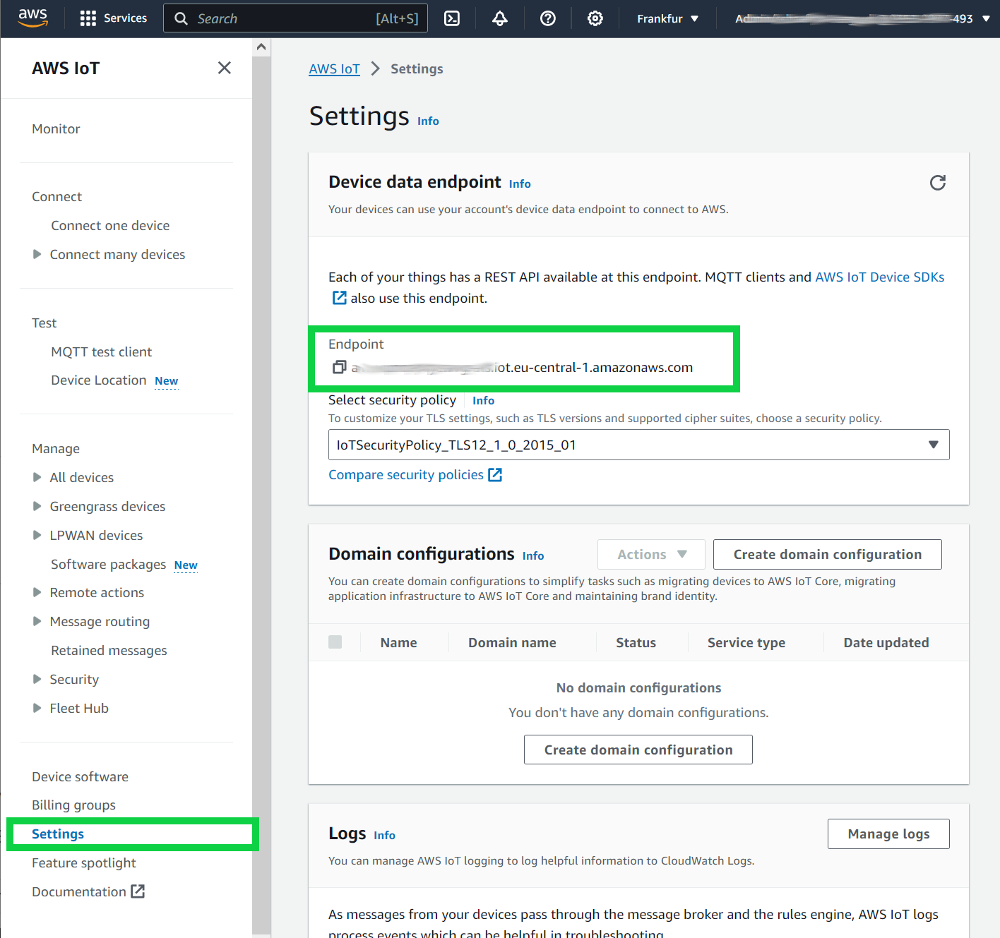

The MQTT target `IOTCore` connects to AWS IoT Core with the certificate and key of the core device in `/greengrass/v2`, so the device's AWS IoT policy must allow `iot:Connect` (the target uses a client ID that starts with `MqttTargetWriter_IOTCore_`) and `iot:Publish`.

>Notice: <br>
Please pay attention to the section ComponentDependencies in the JSON document. There we define which components are needed for com.amazon.sfc.sfc-main to be able to run. It is important to remember to add dependencies when you want to use other SFC modules in future!

>Notice: <br>
The `Install` step of each recipe unpacks its module in the artifact folder of that component, so the `JarFiles` entries use `{<component>:artifacts:path}/<module>/lib` instead of `${SFC_DEPLOYMENT_DIR}/<module>/lib`. `sfc-main` reads its configuration from the `SFC_CONFIG` environment variable that the `Run` lifecycle sets.

>Note! <br>
To reuse this configuration as the `SFC_CONFIG` of the [uberjar component](../greengrass-uberjar/README.md) on a Windows core device, delete the `JarFiles` entries and write the Windows Greengrass root with forward slashes: `"GreenGrassDeploymentPath": "C:/greengrass/v2"`, and `"C:/greengrass/v2/thingCert.crt"`, `"C:/greengrass/v2/privKey.key"` and `"C:/greengrass/v2/rootCA.pem"` for the MQTT target.

## Step 4: Local Deployment
 Here we deploy locally and start the `com.amazon.sfc.sfc-main` component. As we have defined the other modules as dependencies Greengrass will automatically try to deploy them.


To deploy the component use the following command:
```bash
sudo /greengrass/v2/bin/greengrass-cli deployment create \
--recipeDir ~/environment/GreengrassSFC/recipes \
--artifactDir ~/environment/GreengrassSFC/artifacts \
--merge "com.amazon.sfc.sfc-main=1.0.0"
```

Check if the deployment worked by using the following command:

```bash
 sudo /greengrass/v2/bin/greengrass-cli component list
``` 


You should see all the following lines:

```sh
Component Name: com.amazon.sfc.debug-target
    Version: 1.0.0
    State: FINISHED
    Configuration: {"ipc_mode":false,"ipc_port":"50001"}
Component Name: com.amazon.sfc.aws-s3-target
    Version: 1.0.0
    State: FINISHED
    Configuration: {"ipc_mode":"false","ipc_port":"50003"}
Component Name: com.amazon.sfc.opcua
    Version: 1.0.0
    State: FINISHED
    Configuration: {"ipc_mode":false,"ipc_port":"50002"}
Component Name: com.amazon.sfc.mqtt-target
    Version: 1.0.0
    State: FINISHED
    Configuration: {"ipc_mode":"false","ipc_port":"50004"}
Component Name: com.amazon.sfc.sfc-main
    Version: 1.0.0
    State: RUNNING
    Configuration: {"SFC_CONFIG_JSON":{"AdapterTypes":{"OPCUA": ....
```

>Notice: <br>
Because we use [`in process model`](../../docs/sfc-running-adapters.md#running-protocol-adapters-in-process) the components on which sfc-main depends only unpack the modules during deployment and do not start a process. So they report State: *Finished*. <br>
The component sfc-main is the only component which actually start a process and keeps running.

>Note! <br>
If you do not find this lines then you have to analyze the log files which can be found in directory **/greengrass/v2/logs**.

>Note! <br>
You can remove the deployment the component with the following command:

```bash
sudo /greengrass/v2/bin/greengrass-cli deployment create --remove "com.amazon.sfc.sfc-main"
```

>Note! <br>
If you had not started the OPCUA test docker container before deploying the sfc-main component you will see in the **/greengrass/v2/logs/com.amazon.sfc.sfc-main.log** the following error code which you can ignore: <br>
*ERROR - Error creating client for for source "OPCUA-SOURCE" at  opc.tcp://localhost:4840//, Connection refused: localhost/127.0.0.1:4840*. 


## Step 5: Testing the deployment
To test the deployment we have to start the docker container with the test OPCUA server. Do this use the following command:

```bash
docker run -d -p 4840:4840 ghcr.io/umati/sample-server:main

```

After starting the docker container with the test OPCUA server use the following command to look into the traces of the **com.amazon.sfc.sfc-main** component to see the values read from OPCUA server:

```bash
sudo grep -A3 -e Absolute -e FeedSpeed /greengrass/v2/logs/com.amazon.sfc.sfc-main.log
``` 

you should see the similar lines written by the debug-target module:

```bash
023-10-26T22:09:31.217Z [INFO] (Copier) com.amazon.sfc.sfc-main: stdout. "AbsoluteErrorTime": {. {scriptName=services.com.amazon.sfc.sfc-main.lifecycle.Run.Script, serviceName=com.amazon.sfc.sfc-main, currentState=RUNNING}
2023-10-26T22:09:31.218Z [INFO] (Copier) com.amazon.sfc.sfc-main: stdout. "value": 315547.0,. {scriptName=services.com.amazon.sfc.sfc-main.lifecycle.Run.Script, serviceName=com.amazon.sfc.sfc-main, currentState=RUNNING}
2023-10-26T22:09:31.218Z [INFO] (Copier) com.amazon.sfc.sfc-main: stdout. "timestamp": "2023-10-26T22:09:31.209830Z". {scriptName=services.com.amazon.sfc.sfc-main.lifecycle.Run.Script, serviceName=com.amazon.sfc.sfc-main, currentState=RUNNING}
2023-10-26T22:09:31.218Z [INFO] (Copier) com.amazon.sfc.sfc-main: stdout. },. {scriptName=services.com.amazon.sfc.sfc-main.lifecycle.Run.Script, serviceName=com.amazon.sfc.sfc-main, currentState=RUNNING}
2023-10-26T22:09:31.218Z [INFO] (Copier) com.amazon.sfc.sfc-main: stdout. "AbsoluteLength": {. {scriptName=services.com.amazon.sfc.sfc-main.lifecycle.Run.Script, serviceName=com.amazon.sfc.sfc-main, currentState=RUNNING}
2023-10-26T22:09:31.218Z [INFO] (Copier) com.amazon.sfc.sfc-main: stdout. "value": 33546.0,. {scriptName=services.com.amazon.sfc.sfc-main.lifecycle.Run.Script, serviceName=com.amazon.sfc.sfc-main, currentState=RUNNING}
2023-10-26T22:09:31.218Z [INFO] (Copier) com.amazon.sfc.sfc-main: stdout. "timestamp": "2023-10-26T22:09:31.209848Z". {scriptName=services.com.amazon.sfc.sfc-main.lifecycle.Run.Script, serviceName=com.amazon.sfc.sfc-main, currentState=RUNNING}
2023-10-26T22:09:31.218Z [INFO] (Copier) com.amazon.sfc.sfc-main: stdout. },. {scriptName=services.com.amazon.sfc.sfc-main.lifecycle.Run.Script, serviceName=com.amazon.sfc.sfc-main, currentState=RUNNING}
2023-10-26T22:09:31.218Z [INFO] (Copier) com.amazon.sfc.sfc-main: stdout. "AbsoluteMachineOffTime": {. {scriptName=services.com.amazon.sfc.sfc-main.lifecycle.Run.Script, serviceName=com.amazon.sfc.sfc-main, currentState=RUNNING}
2023-10-26T22:09:31.218Z [INFO] (Copier) com.amazon.sfc.sfc-main: stdout. "value": 53350.0,. {scriptName=services.com.amazon.sfc.sfc-main.lifecycle.Run.Script, serviceName=com.amazon.sfc.sfc-main, currentState=RUNNING}
2023-10-26T22:09:31.218Z [INFO] (Copier) com.amazon.sfc.sfc-main: stdout. "timestamp": "2023-10-26T22:09:31.209852Z". {scriptName=services.com.amazon.sfc.sfc-main.lifecycle.Run.Script, serviceName=com.amazon.sfc.sfc-main, currentState=RUNNING}
2023-10-26T22:09:31.218Z [INFO] (Copier) com.amazon.sfc.sfc-main: stdout. },. {scriptName=services.com.amazon.sfc.sfc-main.lifecycle.Run.Script, serviceName=com.amazon.sfc.sfc-main, currentState=RUNNING}
2023-10-26T22:09:31.218Z [INFO] (Copier) com.amazon.sfc.sfc-main: stdout. "AbsoluteMachineOnTime": {. {scriptName=services.com.amazon.sfc.sfc-main.lifecycle.Run.Script, serviceName=com.amazon.sfc.sfc-main, currentState=RUNNING}
2023-10-26T22:09:31.218Z [INFO] (Copier) com.amazon.sfc.sfc-main: stdout. "value": 55670.0,. {scriptName=services.com.amazon.sfc.sfc-main.lifecycle.Run.Script, serviceName=com.amazon.sfc.sfc-main, currentState=RUNNING}
2023-10-26T22:09:31.218Z [INFO] (Copier) com.amazon.sfc.sfc-main: stdout. "timestamp": "2023-10-26T22:09:31.209855Z". {scriptName=services.com.amazon.sfc.sfc-main.lifecycle.Run.Script, serviceName=com.amazon.sfc.sfc-main, currentState=RUNNING}
2023-10-26T22:09:31.218Z [INFO] (Copier) com.amazon.sfc.sfc-main: stdout. },. {scriptName=services.com.amazon.sfc.sfc-main.lifecycle.Run.Script, serviceName=com.amazon.sfc.sfc-main, currentState=RUNNING}
2023-10-26T22:09:31.218Z [INFO] (Copier) com.amazon.sfc.sfc-main: stdout. "AbsolutePiecesIn": {. {scriptName=services.com.amazon.sfc.sfc-main.lifecycle.Run.Script, serviceName=com.amazon.sfc.sfc-main, currentState=RUNNING}
2023-10-26T22:09:31.218Z [INFO] (Copier) com.amazon.sfc.sfc-main: stdout. "value": 7543.0,. {scriptName=services.com.amazon.sfc.sfc-main.lifecycle.Run.Script, serviceName=com.amazon.sfc.sfc-main, currentState=RUNNING}
2023-10-26T22:09:31.218Z [INFO] (Copier) com.amazon.sfc.sfc-main: stdout. "timestamp": "2023-10-26T22:09:31.209858Z". {scriptName=services.com.amazon.sfc.sfc-main.lifecycle.Run.Script, serviceName=com.amazon.sfc.sfc-main, currentState=RUNNING}
2023-10-26T22:09:31.218Z [INFO] (Copier) com.amazon.sfc.sfc-main: stdout. },. {scriptName=services.com.amazon.sfc.sfc-main.lifecycle.Run.Script, serviceName=com.amazon.sfc.sfc-main, currentState=RUNNING}
2023-10-26T22:09:31.218Z [INFO] (Copier) com.amazon.sfc.sfc-main: stdout. "FeedSpeed": {. {scriptName=services.com.amazon.sfc.sfc-main.lifecycle.Run.Script, serviceName=com.amazon.sfc.sfc-main, currentState=RUNNING}
2023-10-26T22:09:31.218Z [INFO] (Copier) com.amazon.sfc.sfc-main: stdout. "value": 0.0,. {scriptName=services.com.amazon.sfc.sfc-main.lifecycle.Run.Script, serviceName=com.amazon.sfc.sfc-main, currentState=RUNNING}
2023-10-26T22:09:31.218Z [INFO] (Copier) com.amazon.sfc.sfc-main: stdout. "timestamp": "2023-10-26T22:09:31.209862Z". {scriptName=services.com.amazon.sfc.sfc-main.lifecycle.Run.Script, serviceName=com.amazon.sfc.sfc-main, currentState=RUNNING}
2023-10-26T22:09:31.218Z [INFO] (Copier) com.amazon.sfc.sfc-main: stdout. },. {scriptName=services.com.amazon.sfc.sfc-main.lifecycle.Run.Script, serviceName=com.amazon.sfc.sfc-main, currentState=RUNNING}
```

- Now we want to see if the data is written also to the S3 bucket. <br>For that open the AWS S3 web console and look into the S3 bucket with the name you entered for ***[REPLACE WITH YOUR S3 BUCKET FOR OPCUA DATA]*** in the **com.amazon.sfc.sfc-main-1.0.0.json** file.<br>
There you should see the folder with the name **sfc**. In this folder the data is written by the **aws-s3-target** module (with `"Interval": 60` it writes once a minute).

- Now we check if the data is also written to IOT Core MQTT topic: **sfc-greengrass**. <br>
For that open the **IOT Core web console** and select **MQTT test client**.

- Then enter into the topic filter sfc-greengrass and select **Subscribe**.

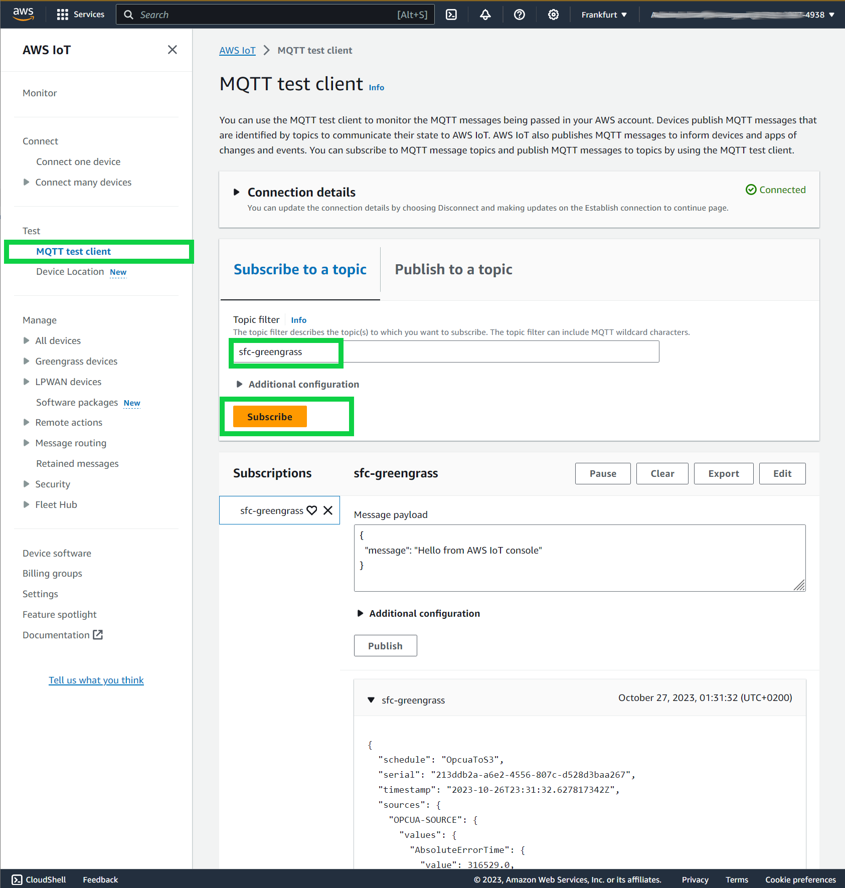

You should be able to see messages being received.

## Step 6: Remove the local deployment
After successful testing we remove the deployment which was done locally with the following command:

```bash
sudo /greengrass/v2/bin/greengrass-cli deployment create --remove "com.amazon.sfc.sfc-main"
```


## Step 7: Publish the components
To publish these components make one more time sure that you have replaced the ***[REPLACE WITH YOUR S3 BUCKET]*** placeholder with the S3 bucket where you want to upload the components in all recipes!

Upload all artifacts and recipies to S3 with the following command:

```bash
aws s3 cp --recursive  ~/environment/GreengrassSFC s3://[REPLACE WITH YOUR S3 BUCKET]
```

First we switch to the recipes folder with the command:

```sh
cd ~/environment/GreengrassSFC/recipes
```
Then we set the AWS_DEFAULT_Region variable:

```sh
AWS_DEFAULT_REGION=[REPLACE WITH YOUR IOT AWS REGION]
``` 

Now we register all components with the following commands:

```bash
aws greengrassv2 create-component-version  --inline-recipe fileb://com.amazon.sfc.sfc-main-1.0.0.json --region $AWS_DEFAULT_REGION

aws greengrassv2 create-component-version  --inline-recipe fileb://com.amazon.sfc.debug-target-1.0.0.json --region $AWS_DEFAULT_REGION

aws greengrassv2 create-component-version  --inline-recipe fileb://com.amazon.sfc.aws-s3-target-1.0.0.json --region $AWS_DEFAULT_REGION

aws greengrassv2 create-component-version  --inline-recipe fileb://com.amazon.sfc.mqtt-target-1.0.0.json --region $AWS_DEFAULT_REGION

aws greengrassv2 create-component-version  --inline-recipe fileb://com.amazon.sfc.opcua-1.0.0.json --region $AWS_DEFAULT_REGION
```

You should see for each component a similar output as in:

```json
{
    "arn": "arn:aws:greengrass:eu-central-1:xxxxx:components:com.amazon.sfc.sfc-main:versions:1.0.0",
    "componentName": "com.amazon.sfc.sfc-main",
    "componentVersion": "1.0.0",
    "creationTimestamp": "2023-10-27T09:46:02.349000+00:00",
    "status": {
        "componentState": "REQUESTED",
        "message": "NONE",
        "errors": {},
        "vendorGuidance": "ACTIVE",
        "vendorGuidanceMessage": "NONE"
    }
}
```
You also should see in the AWS IoT Core web console under **Manage/Greengrass devices/Components** all components under the tab **"My Components"**:

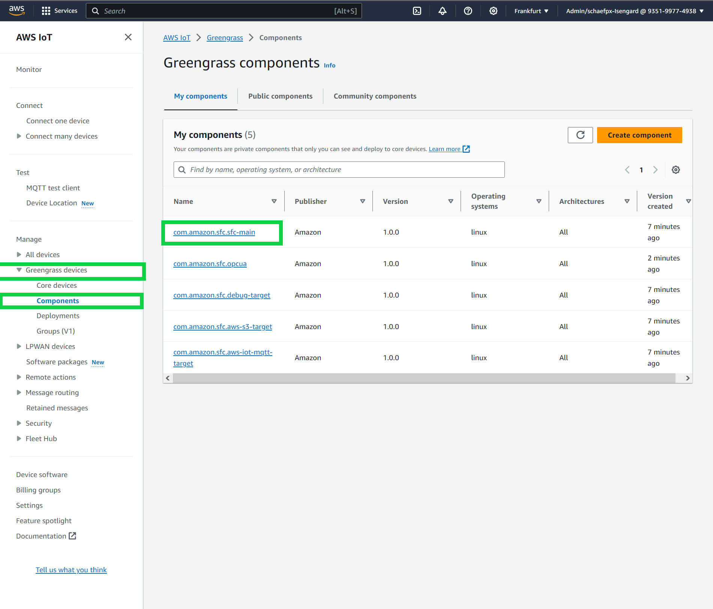

(The console screenshots on this page are from an earlier version of this lab: where they show `com.amazon.sfc.aws-iot-mqtt-target`, your console lists `com.amazon.sfc.mqtt-target`.)

 

## Step 8: Deploy the components with AWS IoT Core web console to your device

Now we can deploy remotely the components from AWS IoT Core console. To do so, follow the following steps:  
1. Go to the AWS IoT Core web console and select **Greengrass devices** then select **Deployments** then check the box before your deployment then select **Revise** 

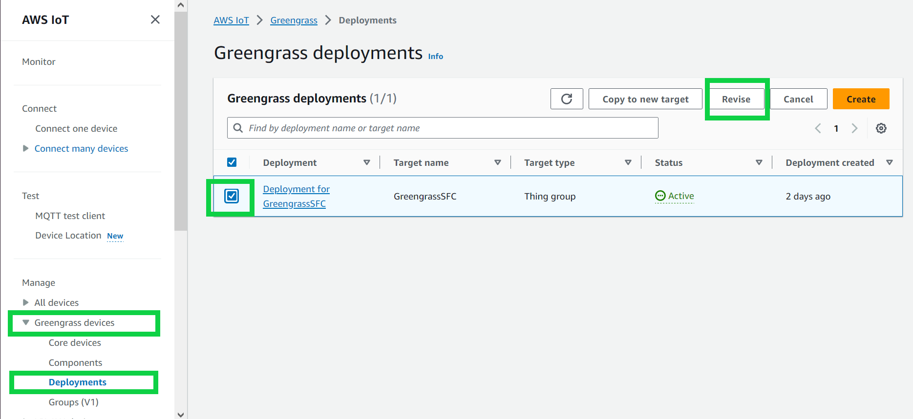

2. In `Step 1` - Specify Target, you can leave all values as default and select **Next**

3. In `Step 2` - select under My components **com.amazon.sfc.sfc-main** and the select **Next**

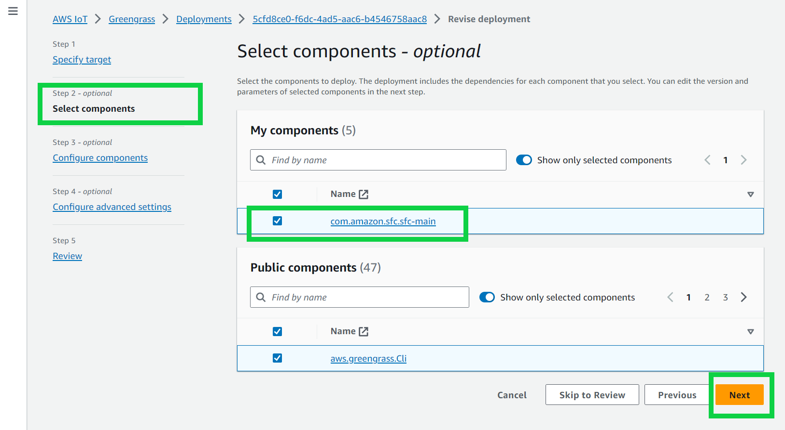

4. In `Step 3` select  **Next** 

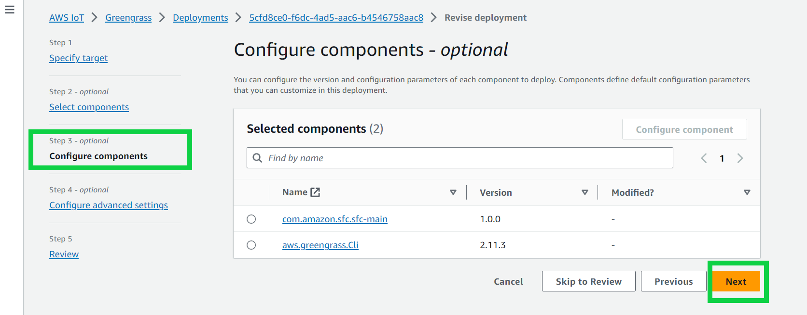

5. In `Step 4` select  **Next** 

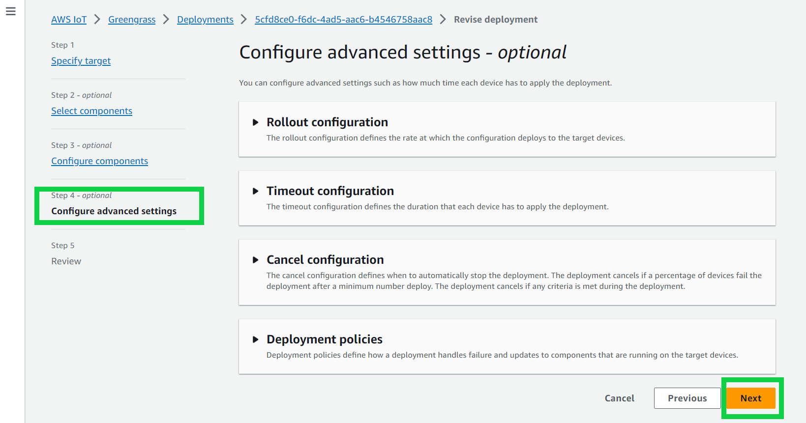

5. In `Step 5` select  **Deploy** 

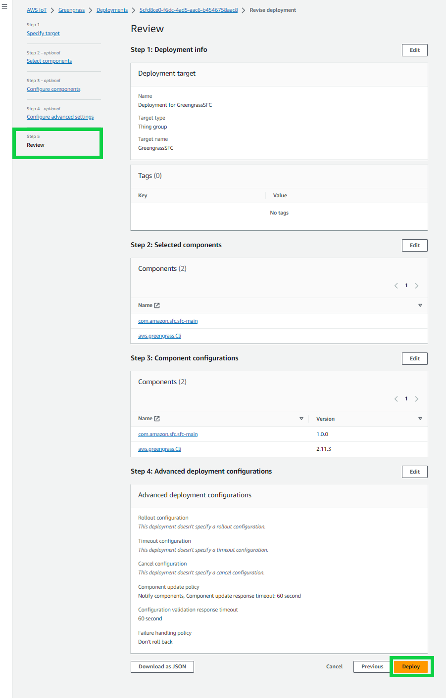


To check if the deployment succeeded select  **Greengrass devices** then select **Core Devices** then select your device

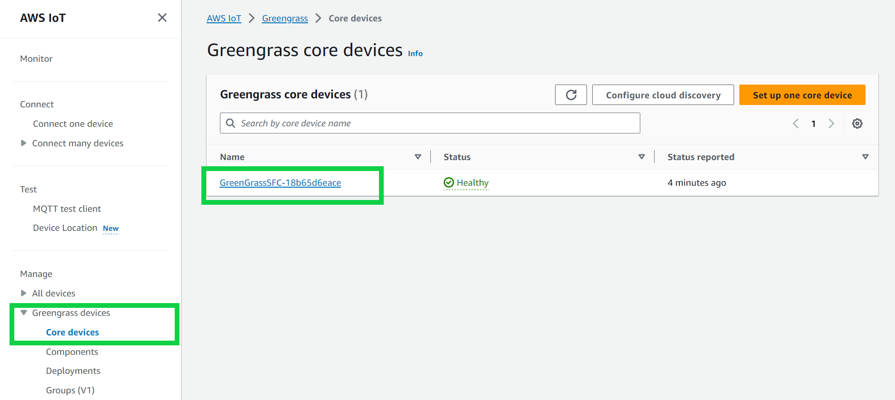

Then select the tab **Components** and in the search box enter **com.amazon.sfc**

There you should see all modules on your device:

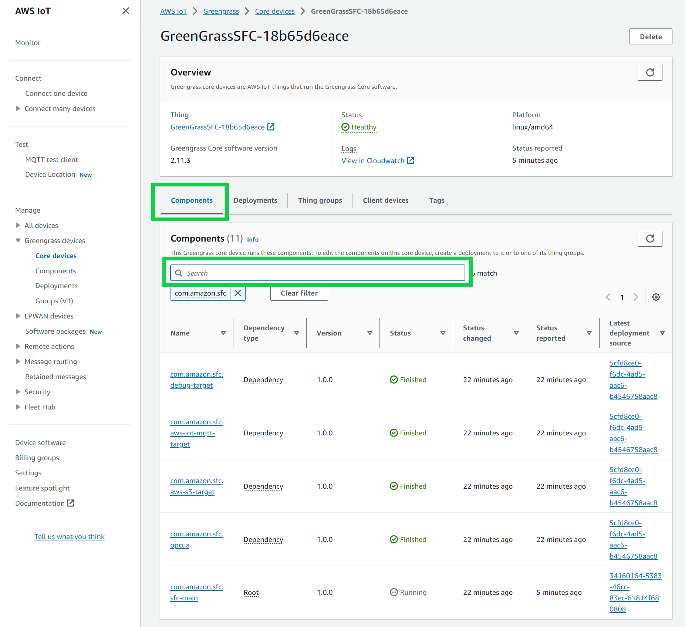


>Notice: <br>
Although we deployed only **com.amazon.sfc.sfc-main** component all components where deployed to fulfill the dependencies!
Because we used SFC's `in-process` model all components which deploy the dependencies are in the state *Finished* and only **`com.amazon.sfc.sfc-main`** is in the state *Running* and dependency type *Root*.


# Removing components from deployment and deleting components
## Remove SFC components from deployment

To remove the components from the Greengrass environment do the following steps:

1. Go to the AWS IoT Core web console and select **Greengrass devices** then select **Deployments** then check the box before your deployment then select **Revise** 


2. In `Step 1` - **Specify Target**, you can leave all values as default and select **Next**

3. In `Step 2`- **Select components**, under **My components** de-select the component **com.amazon.sfc.sfc-main** and the select **Next**

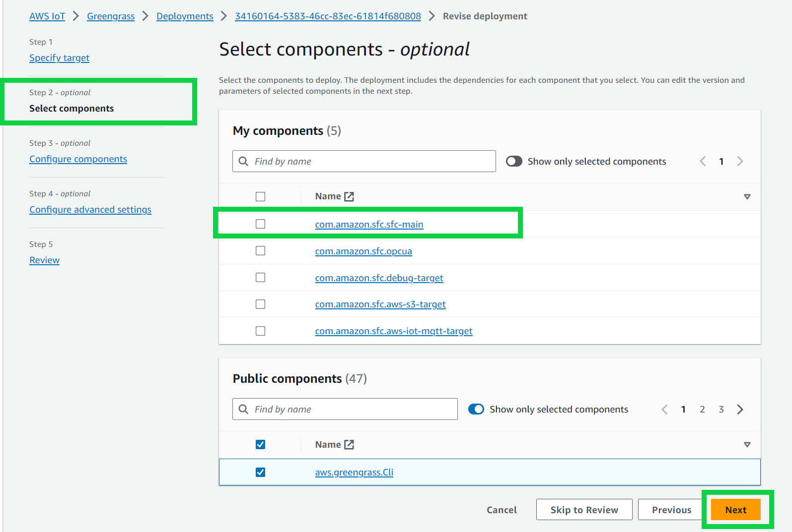

4. In `Step 3` - **Configure components**, select **Next** 

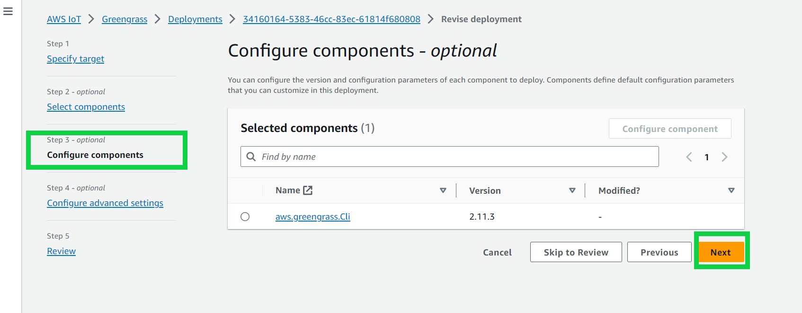

  
5. In `Step 4` - **Configure Advanced settings**, select  **Next** 


6. In `Step 5` -**Review** select  **Deploy** 


## Delete SFC components from IOT Core

To delete the components from IOT Core do the following steps:

1. Go to the AWS IoT Core web console and select **Greengrass devices** then select **Components** then click on the **com.amazon.sfc.sfc-main** 

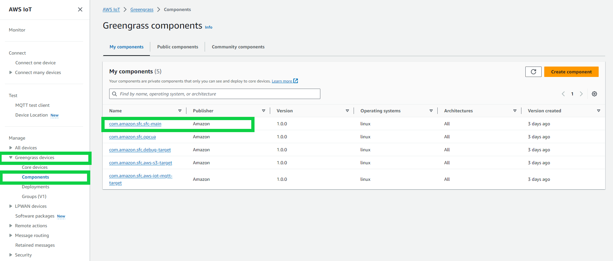


2. Check you have selected the right component **com.amazon.sfc.sfc-main** and select **Delete Version** 

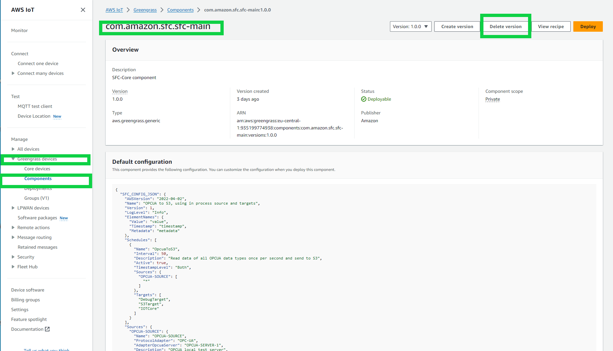

3. Confirm by selecting **Delete** in the confirmation dialog.

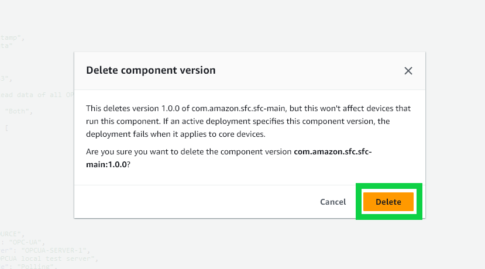


4. Repeat the steps 1 to 3 for all the other modules:
- com.amazon.sfc.opcua
- com.amazon.sfc.aws-s3-target
- com.amazon.sfc.mqtt-target
- com.amazon.sfc.debug-target

5. Remove what else the lab left behind: the OPC UA test container (find its ID with `docker ps`, then `docker rm -f <id>`), the **sfc** folder in your OPC UA data bucket, the uploaded `artifacts/com.amazon.sfc.*` and `recipes/com.amazon.sfc.*` objects in your component bucket, and any bucket you created only for this lab.


Docs used: [OPC UA adapter](../../docs/adapters/opcua.md) · [AWS S3 target](../../docs/targets/aws-s3.md) · [MQTT target](../../docs/targets/mqtt.md) · [Debug target](../../docs/targets/debug.md) · [AWS IoT credential provider](../../docs/core/aws-iot-credential-provider-configuration.md#greengrassdeploymentpath) · [In-process mode](../../docs/sfc-deployment.md#in-process) · [All examples](../../docs/examples/README.md)