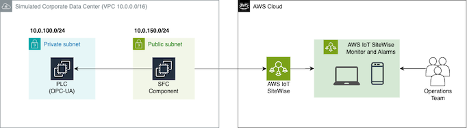
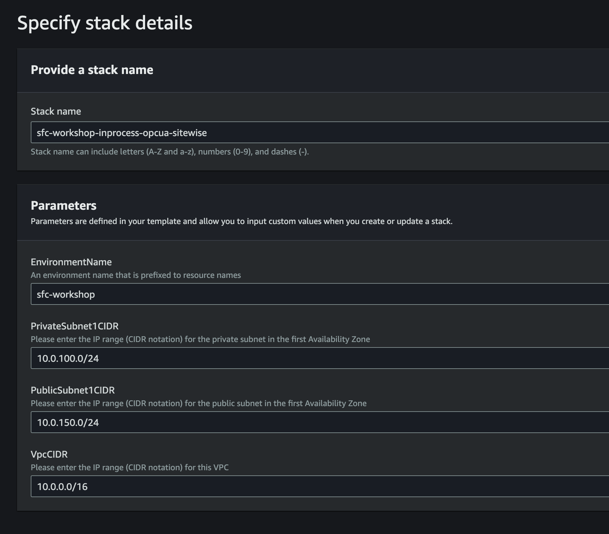
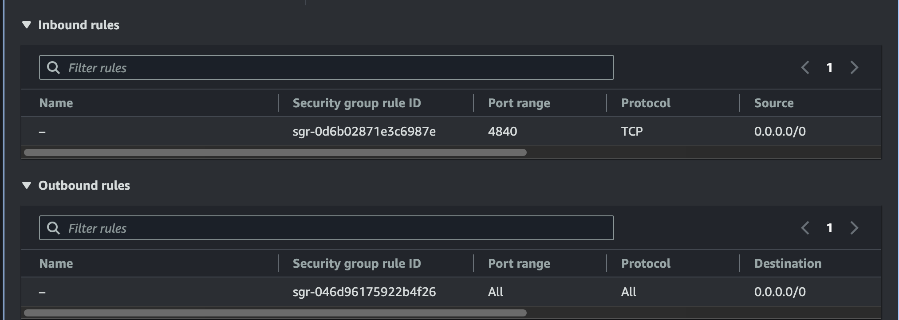
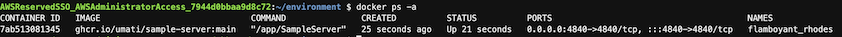
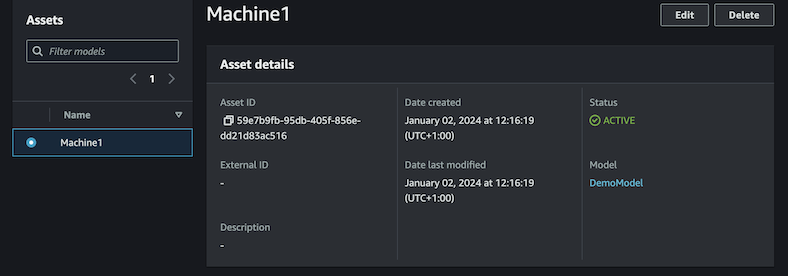
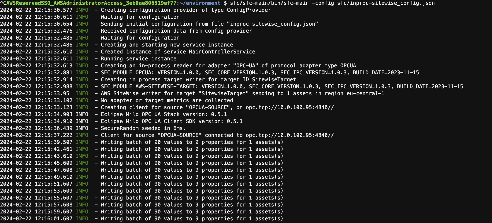
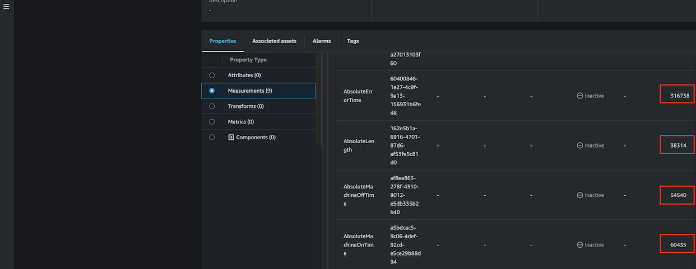
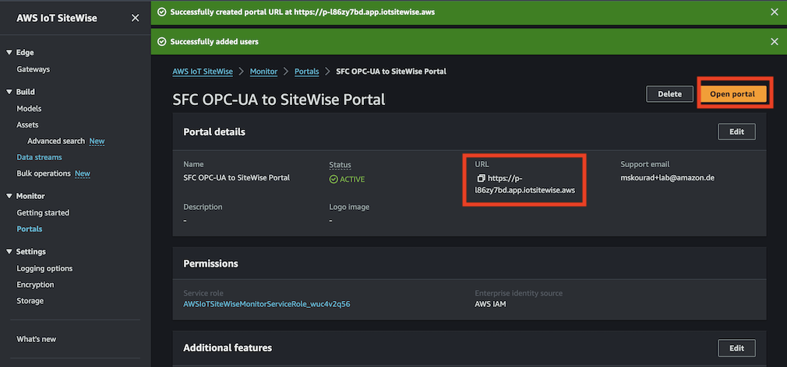
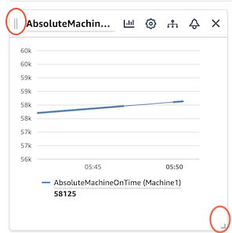
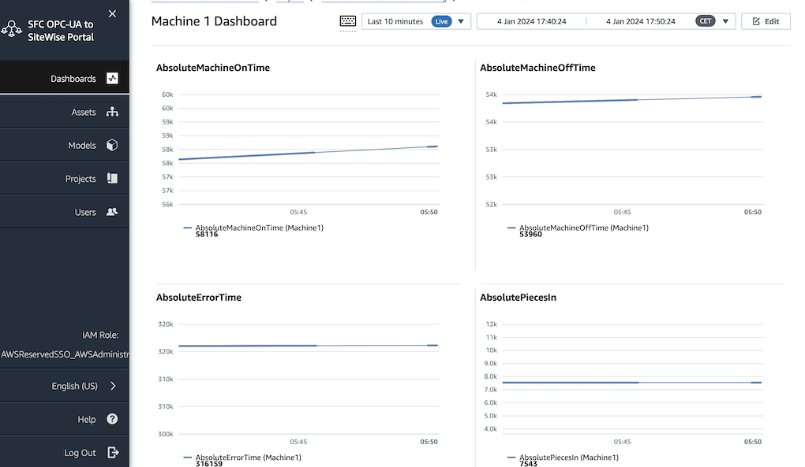

Shop Floor Connectivity (SFC) Framework Workshop: OPC-UA to SiteWise Connectivity (In-Process)
==============================

## Introduction

Shop Floor Connectivity (SFC) is a data ingestion technology that can deliver data to multiple AWS Services.
SFC extends and unifies data collection capabilities additionally to our existing Industrial Internet of Things (IIoT)
data collection services, allowing customers to provide data in a consistent way to a wide range of AWS Services. 
It allows customers to collect data from their industrial equipment and deliver it to the AWS services that work best 
for their requirements. 
Customers get the cost and functional benefits of specific AWS services and save costs on licenses 
for additional connectivity products.


[AWS IoT SiteWise](https://aws.amazon.com/iot-sitewise/) is a managed service that can collect, organise, search, 
and consume equipment data from industrial equipment at scale.
Normally, AWS IoT SiteWise provides a gateway software that can run on common industrial gateways. 
The software can read data directly from servers and historians over the OPC-UA protocol, 
and enables the data ingestion to the Cloud.
Data is ingested into the AWS IoT SiteWise data store and is accessible via APIs.

_This workshop demonstrates data ingestion from an on premises OPC-UA server to AWS IoT SiteWise using
the SFC in-process deployment. So, we omit the installation of the gateway software to ingest the data._

Using the AWS IoT SiteWise Monitor feature, you have the ability to launch a web application with your asset data 
in minutes and give industrial engineers the visibility to react to issues or identify differences across facilities.
We will also use the AWS IoT SiteWise Monitor feature to visualize near-real time the ingested data.

### Table of Contents

- [Introduction](#introduction)
  - [Prerequisites ](#prerequisites)
  - [What you are going to build](#what-you-are-going-to-build)
  - [Workshop Environment](#workshop-environment)
- [Workshop Objectives](#workshop-objectives)
   + [Launch the workshop environment](#launch-the-workshop-environment)
   + [Overview the EC2 for the OPC-UA Server (PLC)](#overview-the-ec2-for-the-opc-ua-server-plc)
   + [Create the AWS IoT SiteWise model and asset](#create-the-aws-iot-sitewise-model-and-asset)
   + [Access and prepare the Cloud9 of the SFC Component](#access-and-prepare-the-cloud9-of-the-sfc-component)
   + [Enable Data Ingestion from OPC-UA Server](#enable-data-ingestion-from-opc-ua-server)
   + [Visualize Data Near Real-Time](#visualize-data-near-real-time)
- [Clean-up](#clean-up)

### Prerequisites

To conduct the workshop you will need the following tools/setup/knowledge:

- AWS Account with admin privileges. If you don't have an AWS Account follow [the instructions](https://aws.amazon.com/premiumsupport/knowledge-center/create-and-activate-aws-account/) to create one. 
If you are participating in an AWS event an account can be provided by AWS.
- Laptop or computer
- Browser
- No background knowledge is needed, however basic Linux knowledge and basic AWS knowledge is preferred 

This workshop will take 1-2 hours to complete, depending on your pace.

### What you are going to build

This workshop demonstrates how to send data from an on premises OPC-UA server to AWS IoT SiteWise using 
the SFC [in-process deployment](https://github.com/aws-samples/shopfloor-connectivity/tree/mainline/docs#in-process-and-ipc-deployment-models).
You will: 

1. Set-up the infrastructure simulating the on-premises environment
2. Organize the data using AWS IoT SiteWise models and assets
3. Install the SFC Component, and drive the data ingestion to AWS IoT SiteWise.
4. Create dashboards to visualize the ingested data near real-time, using AWS IoT SiteWise Monitor.

### Workshop environment

To simulate the on premises environment we will use an Amazon Virtual Private Cloud (Amazon VPC).
An Amazon VPC enables you to launch AWS resources into a virtual network that you have defined. 
This virtual network closely resembles a traditional network that you would operate in your own data center, 
with the benefits of using the scalable infrastructure of AWS.

The setup shown in the following figure simulates the OT-IT network infrastructure in AnyCompany Inc. 
OT assets, like PLCs, will be in a private OT network (private subnet) and the IT network (public subnet) 
contains assets that will establish the connection to AWS. 
For this setup, we simulate a PLC in a private subnet and in a public subnet a Linux-based device with the 
SFC component installed in it.
We will use the [in-process deployment](https://github.com/aws-samples/shopfloor-connectivity/tree/mainline/docs#in-process-and-ipc-deployment-models)
meaning, that the SFC adapter will be running in the same process as the SFC component.

For demonstration purposes both the PLC device will be simulated with a pre-configured EC2 instance, while the device
running the SFC Component will be simulated with a [Cloud9](https://docs.aws.amazon.com/cloud9/latest/user-guide/welcome.html) instance.
The AWS Cloud9 IDE offers a rich code-editing experience with support for several programming languages and runtime 
debuggers, and a built-in terminal. 
It contains a collection of tools that you use to code, build, run, test, and debug software, 
and helps you release software to the cloud.
You access the AWS Cloud9 IDE through a web browser.
The AWS Command Line Interface (AWS CLI) will be installed and configured on the AWS Cloud9 Instance automatically. 
If the instructions refer to the AWS CLI use the one that is installed on the Cloud9 instance.

In this workshop we will also use [AWS IoT SiteWise](https://docs.aws.amazon.com/iot-sitewise/latest/userguide/what-is-sitewise.html). 
It is a managed service that lets you collect, model, analyze, and visualize data from industrial equipment at scale. 
With AWS IoT SiteWise Monitor, you can quickly create web applications for operational users to view and analyze your industrial data in real time. 
You can gain insights about your industrial operations by configuring and monitoring metrics such as mean time between failures and overall equipment effectiveness (OEE). 

Your main workplaces will be the [AWS Management Console](https://aws.amazon.com/console/) and the [AWS Cloud9](https://docs.aws.amazon.com/cloud9/latest/user-guide/welcome.html) environment.

<p align="center">
  
</p>

## Workshop Objectives
### Launch the workshop environment
The workshop environment described in the previous section will be created by [AWS CloudFormation](https://docs.aws.amazon.com/AWSCloudFormation/latest/UserGuide/Welcome.html) using 
[nested stacks](https://docs.aws.amazon.com/AWSCloudFormation/latest/UserGuide/using-cfn-nested-stacks.html)
This section only needs to be executed if you execute the workshop on an own account.
If this workshop is provided to you by AWS the environment is provisioned to you, 
and you [can move to the next session](#overview-the-ec2-for-the-opc-ua-server-plc).

**Upload the CloudFormation templates in S3:**
1. Steps 1-3 only needs to be completed if you execute the workshop on your own environment
If the environment is provisioned to you by AWS you can proceed to the next step (Create the CloudFormation stacks).
2. Go to **S3** and create a bucket to upload the CloudFormation templates. Pick a name of your choice for the S3 bucket
3. Navigate to the new S3 bucket and upload all the files located in the ```resources\cf-templates``` folder of this workshop
4. When the upload is finished, navigate to the **S3 Bucket** and select the ```root.yaml```. 
5. Select the **Copy URL** and copy the value to your clipboard. You will need this to the next steps.

**Create the CloudFormation stacks**
1. In you AWS Management Console search and select CloudFormation
2. Select **Create Stack**
3. Select **Template is ready**
4. In the **Amazon S3 URL** copy the URL value of the ```root.yaml```
4. Provide the URL of the **root.yaml** file in the S3 bucket
5. Click **Next**
6. Enter ```sfc-workshop-inprocess-opcua-sitewise``` as **Stack name** and leave the rest of the options as default.
The default properties are shown in the image below.
Click **Next**

<p align="center">
  
</p>

7. Leave the rest of the properties as default and click **Next**.
8. Check the checkboxes for:
   - "I acknowledge that AWS CloudFormation might create IAM resources with custom names" and
   - "I acknowledge that AWS CloudFormation might require the following capability: CAPABILITY_AUTO_EXPAND".
9. Review the selected properties and click **Submit**.
10. Wait for the stack to be created, it will take 2-3'. 
After some minutes press the refresh button until the stack information will show **CREATE_COMPLETE** for all stacks.

### Overview the EC2 for the OPC-UA Server (PLC)

In this section you will review the EC2 instance, on which the OPC-UA server is deployed.
This section is mostly informative, created for your understanding of the environment. 
If you feel comfortable with the environment set-up, feel free to jump to the
[next session](#access-and-prepare-the-cloud9-of-the-sfc-component).
The instance creation, deployment of the server, and security configurations have been done
automatically by the CloudFormation stack.
More particularly, the instance is deployed on the private subnet, and listens to port 4840 for incoming requests.
All outbound connection is allowed.
To review these security inbound and outbound rules of the instance, you can do the following steps:

1. In the AWS Management Console, search for **EC2** and select the EC2 service.
2. Select **Instances (running)**
3. Select the clickable Instance ID of the instance named **plc-opcua-server**
4. Scroll down and select the **Security** tab.
5. Review the Inbound rules allowing traffic from anywhere (0.0.0.0/0) to port 4840, and outbound rules, 
allowed to anywhere. The rules should be defined as shown in the figure below.

<p align="center">
  
</p>

As a next step, you can connect to the EC2 instance and review that the OPC-UA server is running.
1. Navigate to your instances through the AWS Management Console, and select the checkbox to the left of
the **plc-opcua-server** instance. 
2. Select **Connect** on top of the screen
3. Select **Session Manager**
4. Select **Connect**
5. Run ```docker ps -a``` and expect the following result, proving that the server is up and running

<p align="center">
  
</p>

### Create the AWS IoT SiteWise model and asset

In this section, we create the asset model for AWS IoT SiteWise.
You can create SiteWise asset models and assets manually one at a time. 
This process is more time-consuming and prone to human errors, especially when dealing with a large number of assets.

AWS IoT SiteWise offers a capability called 
[Bulk operations](https://docs.aws.amazon.com/iot-sitewise/latest/userguide/bulk-operations-assets-and-models.html) 
that allows you to seamlessly import thousands of assets at once using console or API.
In this workshop, we describe both options.
If you are not familiar with the AWS IoT SiteWise service, we suggest you to follow the manual option.

#### Manual asset model and asset creation 

**Asset model creation:**
1. Navigate to the AWS IoT SiteWise console
2. Select **Models** under **Build** on the left-hand pane
3. Click on **Create model** button
4. Enter ```DemoModel``` as a **Name**
5. Scroll down to **Definitions** and select **Measurements**
6. Click **Add new measurement** and insert the following:
   - ServerStatus, String
   - ServerTime, String
   - State, Integer
   - AbsoluteErrorTime, Double
   - AbsoluteLength, Double
   - AbsoluteMachineOffTime, Double
   - AbsoluteMachineOnTime, Double
   - AbsolutePiecesIn, Double
   - FeedSpeed, Double
7. Click on **Create Model** for the model to be created. You should see the message "Model successfully created".

**Asset creation:**

1. Click **Assets** on the left-hand pane
2. Click on **Create Asset**
3. For **Model** select the **DemoModel** created in the previous step.
4. For Name in Asset Information give ```Machine1``` and click **Create Asset**. 

The following overview screen appears.
<p align="center">

</p>

#### Bulk asset model and asset creation

**Bulk asset model and asset creation**
1. Navigate to **S3** and create an **S3 Bucket** with naming of your choice.
2. Upload the file ```sitewise_model_asset.json``` to the new S3 Bucket
3. Navigate to **AWS IoT SiteWise**
4. On the left-hand pane menu choose **Bulk operations**
5. Click **New import**
6. Click **Browse S3** and choose the newly created bucket
7. Select the file ```sitewise_model_asset.json```. Click **Choose** 
8. Click **Import**
9. On the **Job progress** board click on the newly created import. Wait for a few moments until the status 
is changed to **COMPLETED**
10. On the left hand pane navigate to **Models** and **Assets** and confirm that **DemoModel**,
**Machine1** and **Measurements** are created.

### Access and prepare the Cloud9 of the SFC Component

In this section we set up a local SFC installation that receives the data from the OPC-UA server 
and sends it to the AWS IoT SiteWise.
The Cloud9 environment simulates the industrial equipment, on which the SFC Component needs to be installed.

**Install the SFC Component:**
1. Choose **Cloud9** in your AWS console
2. Locate the **sfc** Cloud9 instance and click **Open**. This opens Cloud9 IDE in the browser.
3. Select **Window --> New Terminal** to open a new terminal.
4. Set the required environmental variables by executing the following commands:

```
# Define sfc version and directory
export VERSION="1.0.3"
export SFC_DEPLOYMENT_DIR="./sfc"
```

5. Then, we need to download and extract the SFC bundles.
These are precompiled executables to get started quickly.
Copy and paste the following command to the terminal:

```
# Download and extract bundles into folder ./sfc
mkdir $SFC_DEPLOYMENT_DIR && cd $SFC_DEPLOYMENT_DIR
wget https://github.com/aws-samples/shopfloor-connectivity/releases/download/v$VERSION/\
{aws-sitewise-target,debug-target,opcua,sfc-main}.tar.gz

for file in *.tar.gz; do
  tar -xf "$file"
  rm "$file"
done
cd -
```

Now your Cloud9 environment is now set-up with the SFC component.

### Enable Data Ingestion from OPC-UA Server

To connect the SFC component to the OPC-UA server, we need to configure the file ```inproc-sitewise_config.json```.
The initial configuration file is a template that needs to be edited with environment-specific values to enable the connection.

**Configure the SFC Component:**
1. Upload the template configuration file 
[inproc-sitewise_config_template.json](resources/inproc-sitewise_config.json) from your local computer 
to the Cloud9 SFC instance using **File -> Upload Local Files**
2. Move the uploaded file under the created sfc folder

The template file contains placeholder values enclosed in brackets that need to be replaced:
- **[MODEL_ID]**: ID of the **DemoModel** created in AWS IoT SiteWise
- **[ASSET_ID]**: ID of the **Machine1** asset created in AWS IoT SiteWise
- **[PROPERTY_ID]**: ID of measurements like ServerStatus, State etc.
- **[REGION]**: Region were the workload is deployed
- **[PRIVATE_IP]**: Private IP of the EC2 instance simulating the OPC-UA server.

There are two ways to retrieve the values needed for the configuration file:
a) Through the AWS Management Console b) Using AWS CLI commands (more automated)
We will use AWS CLI commands to export the required values. 
These commands execute REST API requests to retrieve information from the AWS environment and the AWS IoT SiteWise service.
[AWS CLI Commands](https://docs.aws.amazon.com/cli/latest/#) are leveraged to automate retrieving the values from AWS.

To get the **[MODEL_ID]**:
```
MODEL_ID=$(aws iotsitewise list-asset-models --query 'assetModelSummaries[?name==`DemoModel`].id' | tr -d "[","]","\"","[:space:]")
```
This returns a list of assets and models, filters for the model named "DemoModel", gets the ID, and removes whitespace and quotes.
Then, it saves the resulting ID in the ```$MODEL_ID`` variable.

To get the **[ASSET_ID]**:
```
ASSET_ID=$(aws iotsitewise list-assets --asset-model-id "$MODEL_ID" --query 'assetSummaries[?name==`Machine1`].id' | tr -d "[","]","\"","[:space:]")
```
This lists all assets for the model with ID stored in ```$MODEL_ID```.
It queries the result to filter for the asset named "Machine1", gets the ID of that asset,
and removes whitespace and quotes.
Then, it saves the ID into the ```$ASSET_ID``` variable.

To get the **[PROPERTY_ID]**:
```
aws iotsitewise list-asset-properties --asset-id "$ASSET_ID" --query 'assetPropertySummaries[*].path[?(!(name==`Machine1`))]' >> machine1_properties.json
```
This command lists all the properties (measurements) for the asset with ID stored in ```$ASSET_ID```.
It queries the result to return only the property paths, excluding the root asset name path. 
This gives just pairs of the measurement names and IDs.
The filtered query result is exported to a file called ```machine1_properties.json```.
Later, we will use this file to lookup the property IDs to populate the **[PROPERTY_ID]** values in the configuration file.

By exporting the measurements to a file, we avoid having to hard code the IDs directly. 
Instead, we can programmatically lookup the values from the exported JSON as needed.

To get the **[REGION]**:
```
REGION=$(aws configure get region)
```
This returns the current region where the workload is running.

To get the **[PRIVATE_IP]** of the EC2 instance running the OPC-UA server:
```
STACK_NAME=$(aws cloudformation list-stacks --stack-status-filter CREATE_COMPLETE --query 'StackSummaries[*].StackName' | grep sfc-workshop-inprocess-opcua-sitewise-nestedPlcStack- | tr -d "[","]","\"","[:space:]")
PRIVATE_IP=$(aws cloudformation --region "$REGION" describe-stacks --stack-name "$STACK_NAME" --query "Stacks[0].Outputs[0].OutputValue" | tr -d "[","]","\"","[:space:]")
```
When we created the stack with the CloudFormation template, this value has been saved as an output of the stack.
So, the only thing we need to do now, is to get the CloudFormation stack name that was created earlier.
Then use that to query the stack outputs and get the private IP address stored there.

To summarize, at this point we have:

- Saved the needed IDs and other values in local variables:
  - ```$ASSET_ID```
  - ```$REGION```
  - ```$PRIVATE_IP```
- Exported the measurement properties to a file:
  - ```machine1_properties.json```

The final step is to print out these values and manually copy them into the placeholder positions in the configuration 
file template (```inproc-sitewise_config.json```):

```
echo REGION=$REGION
echo PRIVATE_IP=$PRIVATE_IP
echo ASSET_ID=$ASSET_ID
```

For ```[PROPERTY_ID]```, we will lookup the appropriate IDs from the ```machine1_properties.json``` file.
and copy them to the respective properties with the same name in the configuration file.
For convenience, you can right click on the tab of the open file, and select **Split Pane in Two Columns**

As soon as the configuration file is ready, the final step is to start ingesting data, execute the SFC component with the following command: 

```
# run sfc
cd ~/environment
sfc/sfc-main/bin/sfc-main -config sfc/inproc-sitewise_config.json
```

<p align="center">

</p>

Go back to the AWS IoT SiteWise console and select **Assets** on the left-hand pane.
Under **Properties/Measurements** you can observe the changing values of the asset properties.

<p align="center">

</p>

### Visualize Data Near Real-Time

You are ready to create an **IoT SiteWise Monitor portal** to visualize data arriving from your equipment.

#### To create the portal

1. Navigate to the [AWS IoT SiteWise console](https://console.aws.amazon.com/iotsitewise/)
2. Open the navigation pane by choosing the three bars in the upper left corner.
3. In the navigation pane, choose **Portals**, and then **Create portal**.
4. Under **Portal name**, enter **SFC OPC-UA to SiteWise Portal**.
5. Under **User authentication**, choose **IAM**.
6. Under **Email**, enter a valid email address where you have access to. 
7. Under Permissions, choose **Create and use a new service role**
8. Choose **Next**. 
9. Leave the **Alarms** and **Edge Configuration** section as default. 
10. Choose **Create**. 
11. In the **Invite administrators** section, click on **Roles** and choose the role you are using, and then choose **Next**. 
12. Under **Assign users** do not choose any user role, choose **Assign users** to continue.
Under **Portals** you should find the portal with the name **SFC OPC-UA to SiteWise Portal**.

#### Signing in to the AWS IoT SiteWise Monitor portal

SiteWise Monitor validates your credentials with AWS Single Sign-On or IAM to ensure that only authorized users can access your company assets.
Open the link which starts with **https://** located right from your portal name or click on **Open Portal** to get access to the AWS IoT SiteWise Monitor.

<p align="center">

</p>

#### Browse the asset library

By browsing the asset library you can get a first impression about the visualisations for your data.

**In your SiteWise Monitor portal**

1. Choose **Assets**.
2. Under **Assets**, select **Machine1**.
3. Under **Machine1** in the right pane you should see the measurements and metrics that you have defined in the previous section.
4. Feel free to browse around.

#### Create a project

To build dashboards later first you need to create a project.

1. Select **Projects** in the navigation window and click on **Create Project**.
2. Enter **SFC OPC-UA to SiteWise Monitoring** as the Project Name.
3. Project description: **Machine1 monitoring**.
4. Click on **Create project**.

#### Add project assets

Each project contains assets based. Based on these assets you can create dashboards to visualize your data.

1. Select **Assets** in the navigation menu
2. Select  **Machine1**
3. Add asset to project
4. Check: **Select existing project**
5. Select an existing project: **SFC OPC-UA to SiteWise Monitoring**
6. Add asset to project
7. Select **Projects** in the navigation menu and verify that Machine1 is now listed in **Project Assets**

#### Create a Dashboard

The dashboard should contain the overall measurements of **Machine1**.

1. In the **SFC OPC-UA to SiteWise Monitoring** project, click **Create Dashboard**
2. In the top left corner, change the dashboard name from the default **New Dashboard** to **Machine1 Dashboard**.
3. In the lower right corner, select the following properties to add them to the dashboard. 
4. Drag AbsoluteMachineOnTime to the left
5. Drag AbsoluteMachineOffTime to the left
6. Drag AbsoluteErrorTime to the left
7. Drag AbsolutePiecesIn to the left
8. To adjust your dashboard layout, use the control icon in the upper left, and to change the size of a visualization, use the resize control in the lower right. Drag the corner to a new size and shape.

<p align="center">

</p>

>! Feel free to play around with the set of measurements you choose.

9. Click on **Save Dashboard** in the top right corner to save your dashboard.

<p align="center">

</p>

**You have successfully created a web based applications to monitor **Machine1** near real-time.**

## Clean-up

If the AWS environment was not provisioned for you during a 
workshop, remember to clean up your resources afterwards to avoid unwanted charges.

**Delete the Stack**
1. Go to **CloudFormation**, and select **Stacks**
2. Select the root stack named **sfc-workshop-inprocess-opcua-sitewise**
3. Click **Delete**


[Examples](../../docs/examples/README.md)