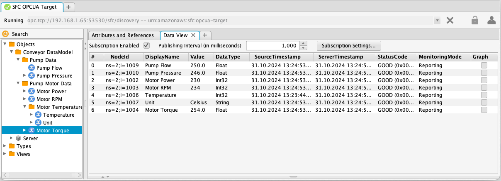
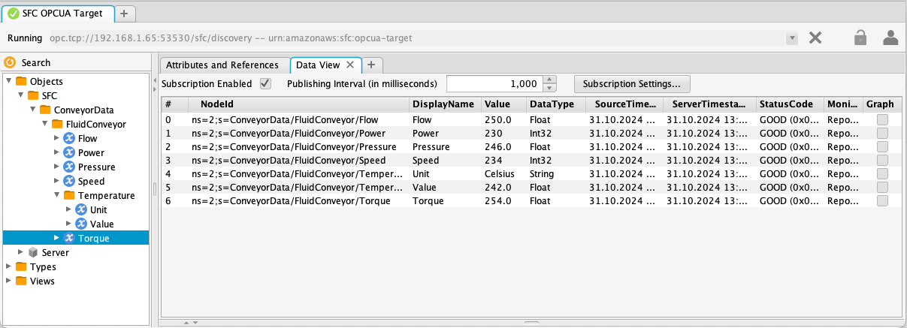
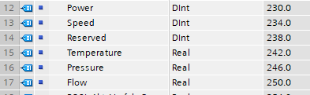

# SFC Example in process configuration for Siemens S7-1200 to OPC UA datamodel

The file [`s7-opcua-datamodel.json`](s7-opcua-datamodel.json) contains an example template for reading data from a 
Siemens S7-1200 controller using the S7 protocol and making the data available as a configured OPC UA data model. 
This results in the data being represented in a model, as shown below. In the model definition, all configuration options 
are utilized to set the identifier in the ModeId, as well as the browse name and the display name, instead of using the defaults.
&nbsp;



&nbsp;
A second configuration file [`s7-opcua-auto-create.json`](s7-opcua-auto-create.json) is using the option of the OPC UA target adapter
to automatically the OPC UA data model for the collected data. This results in the data being represented in a model, as shown below.



In order to use the configuration, make the changes described below, and
use it as the value of the --config parameter when starting sfc-main.

A debug target is included in the example to optionally write the output
to the console.
&nbsp;  
&nbsp;  


## Deployment directory

A Placeholder ${SFC_DEPLOYMENT_DIR} is used in the configuration. SFC
dynamically replaces these placeholders with the value of the
environment variable from the placeholder. In this example it should
have the value of the pathname of the directory where sfc-main, the used
adapters and targets are deployed with the following directory
structure. (This structure can be changed by setting the pathname in
the AdapterTypes and TargetTypes sections)

${SFC_DEPLOYMENT_DIR}  
&nbsp;&nbsp;&nbsp;|-sfc-main  
&nbsp;&nbsp;&nbsp;|-debug-target    
&nbsp;&nbsp;&nbsp;|-opcua-target   
&nbsp;&nbsp;&nbsp;|-s7  
&nbsp;  

## Target section
```json
"Targets": [
  "#DebugTarget",
  "OpcuaTarget"
]
```

In order to write the data to both Sitewise and the console
uncomment the DebugTarget by deleting the '#'.  
&nbsp;


TIA Portal data block 120




[Examples](../../docs/examples/README.md)