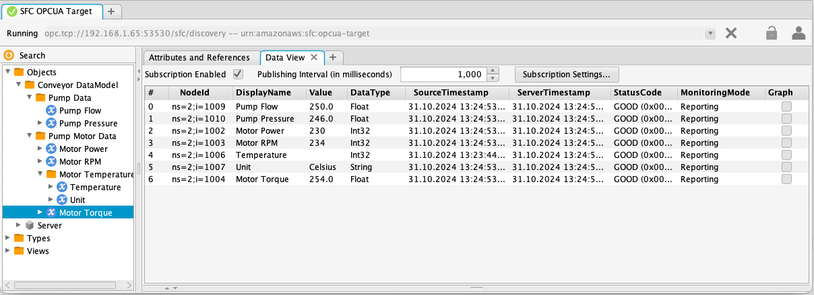
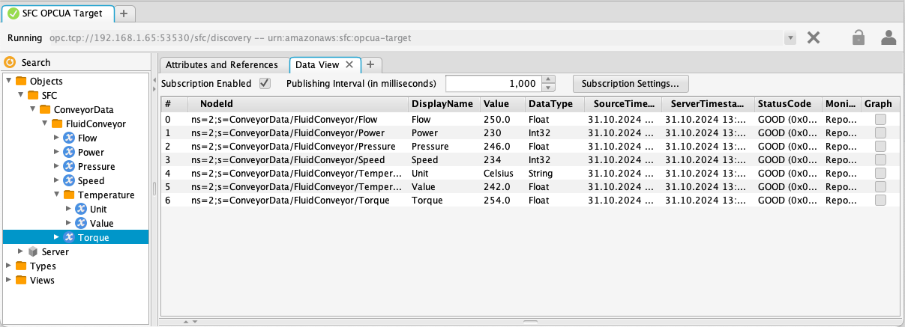
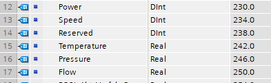

# SFC Example in process configuration for Siemens S7-1200 to OPC UA datamodel

The file [`s7-opcua-datamodel.json`](s7-opcua-datamodel.json) contains an example template for reading data from a 
Siemens S7-1200 controller using the S7 protocol and making the data available as a configured OPC UA data model. 
This results in the data being represented in a model, as shown below. In the model definition, all configuration options 
are utilized to set the identifier in the NodeId, as well as the browse name and the display name, instead of using the defaults.
The Temperature variable applies the transformation `ToCelsius` (the operators
[Celsius](../../docs/core/transformation-operator-configuration.md#celsius) and
[ToInt](../../docs/core/transformation-operator-configuration.md#toint)) through its
[Transformation](../../docs/targets/opcua.md#transformation) setting. `Celsius` converts Fahrenheit to Celsius, so
the example assumes that the PLC holds the temperature in Fahrenheit; the channel's `Unit` metadata, shown in the Unit
node, names the unit of the converted value. If your PLC already holds Celsius, remove the `Celsius` operator.
&nbsp;



&nbsp;
A second configuration file [`s7-opcua-auto-create.json`](s7-opcua-auto-create.json) is using the option of the OPC UA target adapter
to automatically create the OPC UA data model for the collected data. This results in the data being represented in a model, as shown below.



In order to use the configuration, make the changes described below, and
use it as the value of the `-config` parameter when starting sfc-main, as
shown under [Deployment directory](#deployment-directory).

A debug target is included in the example to optionally write the output
to the console.
&nbsp;  
&nbsp;  


## Deployment directory

The `JarFiles` entries of both configurations use the placeholder
`${SFC_DEPLOYMENT_DIR}`, which SFC replaces with the value of the
environment variable `SFC_DEPLOYMENT_DIR`. Point it at the directory into
which you unpack the module bundles `sfc-main`, `debug-target`,
`opcua-target` and `s7` of the
[latest release](https://github.com/awslabs/industrial-shopfloor-connect/releases/latest)
(for another layout, change the `JarFiles` paths). `sfc-main` needs a
Java 17 (or newer) runtime (Windows: `winget install EclipseAdoptium.Temurin.17.JDK`).
More about this mode: [In-process](../../docs/sfc-deployment.md#in-process).

Unpack the bundles, set the variable and, once you have made the changes
described below, start `sfc-main` from this example's folder (use
`s7-opcua-auto-create.json` for the auto-created model):

**Linux / macOS**

```shell
export SFC_DEPLOYMENT_DIR="$HOME/sfc"
mkdir -p "$SFC_DEPLOYMENT_DIR"
for m in sfc-main debug-target opcua-target s7; do
  curl -fsSL "https://github.com/awslabs/industrial-shopfloor-connect/releases/latest/download/$m.tar.gz" | tar -xzf - -C "$SFC_DEPLOYMENT_DIR"
done
"$SFC_DEPLOYMENT_DIR/sfc-main/bin/sfc-main" -config s7-opcua-datamodel.json
```

**Windows (PowerShell)**

```powershell
$env:SFC_DEPLOYMENT_DIR = "C:/sfc"
New-Item -ItemType Directory -Force C:\sfc | Out-Null
foreach ($m in "sfc-main", "debug-target", "opcua-target", "s7") {
    curl.exe -fsSL -o "C:\sfc\$m.tar.gz" "https://github.com/awslabs/industrial-shopfloor-connect/releases/latest/download/$m.tar.gz"
    tar -xf "C:\sfc\$m.tar.gz" -C C:\sfc
}
java -cp "C:\sfc\sfc-main\lib\*" com.amazonaws.sfc.MainController -config s7-opcua-datamodel.json
```

On Windows start `sfc-main` with `java -cp` as shown, not with
`bin\sfc-main.bat` ([Platform support](../../docs/README.md#platform-support)).
With the uberjar from [sfcup](../../README.md#1-install), remove the
`JarFiles` entries and run `sfcx -config s7-opcua-datamodel.json`.

To browse the model, connect an OPC UA client to `opc.tcp://<sfc-host>:53530/sfc`, the target's default
[ServerTcpPort](../../docs/targets/opcua.md#servertcpport) and [ServerPath](../../docs/targets/opcua.md#serverpath).

> **Windows:** when the OPC UA client runs on another machine, allow the port in Windows Defender Firewall from an
> elevated PowerShell: `New-NetFirewallRule -DisplayName "SFC OPC UA target" -Direction Inbound -Protocol TCP -LocalPort 53530 -Action Allow`
&nbsp;  

## Target section
```json
"Targets": [
  "#DebugTarget",
  "OpcuaTarget"
]
```

In order to write the data to both the OPC UA target and the console
uncomment the DebugTarget by deleting the '#'.  
&nbsp;

## Controller

Set the `Address` of the controller `S7-PLC-1` (`192.168.1.130`) in the
`ProtocolAdapters` section of both files to the address of your PLC. The
channels read data block 120: the DInt values Power (offset 230) and Speed
(234), and the Real values Temperature (242), Pressure (246), Flow (250)
and Torque (254). DB120 must be a non-optimized data block, and PUT/GET
access must be enabled in the PLC; see the [S7 adapter](../../docs/adapters/s7.md).

This configuration needs a real S7-1200 with DB120, which omni-plc-sim,
the PLC simulator that [uberjar-plc-sim-s3tables](../uberjar-plc-sim-s3tables/README.md)
uses, does not provide. That example reads a simulated S7-1500, so it
shows the S7 adapter without hardware. The OPC UA target without a PLC is
shown by the [Simulation to OPC UA example](../../docs/adapters/simulator.md#simulation-to-opc-ua-example), which
serves simulated signals as an OPC UA server.

TIA Portal data block 120




Docs used: [S7 adapter](../../docs/adapters/s7.md) · [OPC UA target: automatic model mapping](../../docs/targets/opcua.md#automatic-model-mapping) · [query mapping](../../docs/targets/opcua.md#query-mapping) · [Celsius operator](../../docs/core/transformation-operator-configuration.md#celsius) · [Debug target](../../docs/targets/debug.md) · [In-process mode](../../docs/sfc-deployment.md#in-process) · [All examples](../../docs/examples/README.md)