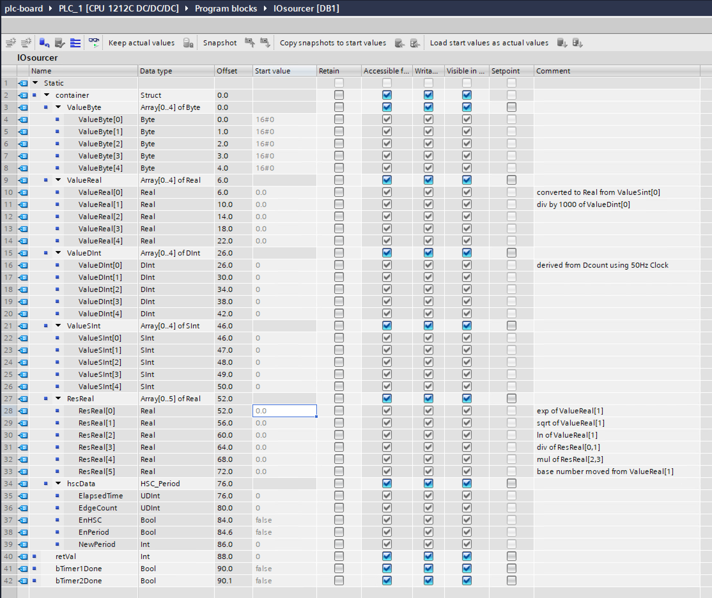

# SFC Example in process configuration for Siemens S7-1200 to AWS IoT Sitewise

The file [`in-process-s7-sitewise.json`](in-process-s7-sitewise.json) contains an example template for
reading data from a Siemens S7-1200 controller using S7 protocol and
sending the data to AWS IoT Sitewise.

A second configuration file [`in-process-s7-sitewise-autocreate-assets.json`](in-process-s7-sitewise-autocreate-assets.json) is using the option of the sitewise target adapter
to automatically create the required sitewise asset models and assets to store the data from the S7 controller.
With its [AssetCreation](../../docs/targets/aws-sitewise.md#assetcreation) settings the target creates the asset model
`SitewiseTarget-TestSchedule-S7-SOURCE-Model` and the asset `SitewiseTarget-TestSchedule-S7-SOURCE`, with one
measurement per channel. This needs the additional IAM permissions marked (*) in the
[SiteWise target](../../docs/targets/aws-sitewise.md#awssitewisetargetconfiguration) documentation. The created asset
and asset model stay in your account; when you no longer need them, delete the asset first, then the asset model.

In order to use the configuration, make the changes described below, and
use it as the value of the `-config` parameter when starting sfc-main, as
shown under [Deployment directory](#deployment-directory).

A debug target is included in the example to optionally write the output
to the console.
&nbsp;  
&nbsp;  

## Deployment directory

The `JarFiles` entries of both configurations use the placeholder
`${SFC_DEPLOYMENT_DIR}`, which SFC replaces with the value of the
environment variable `SFC_DEPLOYMENT_DIR`. Point it at the directory into
which you unpack the module bundles `sfc-main`, `debug-target`,
`aws-sitewise-target` and `s7` of the
[latest release](https://github.com/awslabs/industrial-shopfloor-connect/releases/latest)
(for another layout, change the `JarFiles` paths). `sfc-main` needs a
Java 17 (or newer) runtime (Windows: `winget install EclipseAdoptium.Temurin.17.JDK`).
More about this mode: [In-process](../../docs/sfc-deployment.md#in-process).

Unpack the bundles, set the variable and, once you have made the changes
described below, start `sfc-main` from this example's folder (use
`in-process-s7-sitewise-autocreate-assets.json` for the auto-create variant):

**Linux / macOS**

```shell
export SFC_DEPLOYMENT_DIR="$HOME/sfc"
mkdir -p "$SFC_DEPLOYMENT_DIR"
for m in sfc-main debug-target aws-sitewise-target s7; do
  curl -fsSL "https://github.com/awslabs/industrial-shopfloor-connect/releases/latest/download/$m.tar.gz" | tar -xzf - -C "$SFC_DEPLOYMENT_DIR"
done
"$SFC_DEPLOYMENT_DIR/sfc-main/bin/sfc-main" -config in-process-s7-sitewise.json
```

**Windows (PowerShell)**

```powershell
$env:SFC_DEPLOYMENT_DIR = "C:/sfc"
New-Item -ItemType Directory -Force C:\sfc | Out-Null
foreach ($m in "sfc-main", "debug-target", "aws-sitewise-target", "s7") {
    curl.exe -fsSL -o "C:\sfc\$m.tar.gz" "https://github.com/awslabs/industrial-shopfloor-connect/releases/latest/download/$m.tar.gz"
    tar -xf "C:\sfc\$m.tar.gz" -C C:\sfc
}
java -cp "C:\sfc\sfc-main\lib\*" com.amazonaws.sfc.MainController -config in-process-s7-sitewise.json
```

On Windows start `sfc-main` with `java -cp` as shown, not with
`bin\sfc-main.bat` ([Platform support](../../docs/README.md#platform-support)).
With the uberjar from [sfcup](../../README.md#1-install), remove the
`JarFiles` entries and run `sfcx -config in-process-s7-sitewise.json`.
&nbsp;  
&nbsp;


## Target section
```json
"Targets": [
  "#DebugTarget",
  "SitewiseTarget"
]
```

In order to write the data to both Sitewise and the console
uncomment the DebugTarget by deleting the '#'.  
&nbsp;
&nbsp;  


## SitewiseTarget section

```json
 "SitewiseTarget": {
      "Active": true,
      "TargetType": "AWS-SITEWISE",
      "Region": "<YOUR-REGION>",
      "CredentialProviderClient": "AwsIotClient",
      "Assets": [
        {
          "AssetId": "<SITEWISE-ASSET-ID>",
          "Properties": [
            {
              "PropertyId":"<SITEWISE-PROPERTY-ID>",
              "DataType": "double",
              "DataPath": "sources.S7-SOURCE.values.Ln"
            }
          ]
        },{
          "AssetId": "<SITEWISE-ASSET-ID>",
          "Properties": [
            {
              "PropertyId":"<SITEWISE-PROPERTY-ID>",
              "DataType": "double",
              "DataPath": "sources.S7-SOURCE.values.Exp"
            }
          ]
        },{
          "AssetId": "<SITEWISE-ASSET-ID>",
          "Properties": [
            {
              "PropertyId":"<SITEWISE-PROPERTY-ID>",
              "DataType": "double",
              "DataPath": "sources.S7-SOURCE.values.Sqrt"
            }
          ]
        }
      ]
    }
```

-   \<YOUR-REGION\>, your region e.g., eu-west-1

-  \<SITEWISE-ASSET-ID\>, your sitewise asset ID

-  \<SITEWISE-PROPERTY-ID\>, id of the Sitewise attribute or measurement

The assets and their three measurements of data type Double must exist in
AWS IoT SiteWise before you start SFC (or use the auto-create variant).
Writing to them needs the IAM permission `iotsitewise:BatchPutAssetPropertyValue`.

`CredentialProviderClient` specifies the credentials provider which is
used to give access to the used AWS service. For more information see
section AwsIotCredentialProviderClients below.
&nbsp;  
&nbsp;  


## Sources Section

```json
"Sources": {
    "S7-SOURCE": {
      "Name": "S7-SOURCE",
      "ProtocolAdapter": "S7",
      "AdapterController": "S7-PLC-1",
      "Description": "S7 PLC local server",
      "Channels": {
        
        "RealValueLn-DB1": {
          "Name": "Ln",
          "Address": "%DB1:60:REAL"
        },
		"RealValueExp-DB1": {
          "Name": "Exp",
          "Address": "%DB1:52:REAL"
        },
		"RealValueSqrt-DB1": {
          "Name": "Sqrt",
          "Address": "%DB1:56:REAL"
        }
      }
    }
  }
```

In this section, the values are defined as channels, which are read from
the controller. In order to change the name of
the value as it is included in the data which is sent to the targets,
include a setting "Name" for the channel.

<p align="center">
  
</p>
<p align="center">
    <em>Fig. 1. Screenshot of Siemens TIA Portal (non-optimized) Datablock DB1; Offset column details refer to the above json config.</em>
</p>

&nbsp;  
&nbsp;  

## ProtocolAdapters section

```json
 "ProtocolAdapters": {
    "S7": {
	  "AdapterType": "S7",
      "Controllers": {
        "S7-PLC-1": {
          "Address": "<CONTROLLER IP ADDRESS>",
		  "ReadPerSingleField": false,
          "LocalRack": 0,
          "LocalSlot": 1,
          "RemoteRack": 0,
          "RemoteSlot": 1,
          "PduSize": 1024,
          "MaxAmqCaller": 8,
          "MaxAmqCallee": 8,
          "ControllerType": "S7-1200",
          "ReadTimeout": 10000,
          "ConnectTimeout": 10000
          
        }
      }
    }
  }

```

-   \<CONTROLLER IP ADDRESS\>, IP address of the controller

This section configures the controller from which the data is read. The
S7 default port 102 is used; to use another port, append it to the
address, e.g. `"Address": "192.168.0.2:10102"`.

DB1 must be a non-optimized data block, and PUT/GET access must be enabled
in the PLC; see the [S7 adapter](../../docs/adapters/s7.md). This
configuration needs a real S7-1200 that holds REAL values at offsets 52, 56
and 60 of DB1. omni-plc-sim, the PLC simulator that
[uberjar-plc-sim-s3tables](../uberjar-plc-sim-s3tables/README.md) uses,
holds other data types there; that example reads a simulated S7-1500, so it
shows the S7 adapter without hardware.
&nbsp;  
&nbsp;  


## AwsIotCredentialProviderClients

The client `AwsIotClient` in this section obtains temporary credentials for
the SiteWise target from the AWS IoT credentials provider, using the
certificate of a Thing in AWS IoT. Fill in `IotCredentialEndpoint`,
`RoleAlias`, `ThingName`, `CertificateFile`, `PrivateKeyFile` and `RootCa`.
On a Greengrass V2 core device you can instead remove the `#` from
`GreenGrassDeploymentPath`, set it to the Greengrass root folder, e.g.
`/greengrass/v2`, and delete the other settings. The role that
`RoleAlias` points to must allow the SiteWise permissions named above. On
Windows write the file paths with forward slashes, e.g.
`"C:/sfc/certs/device.crt"`.

All settings:
[AwsIotCredentialProviderClients](../../docs/core/aws-iot-credential-provider-configuration.md).
To use the AWS SDK default credentials chain instead, delete this section
and the target's `CredentialProviderClient`; see
[AWS service credentials](../../docs/sfc-aws-service-credentials.md). For
production environments the temporary credentials of a credential provider
client are strongly recommended.

Docs used: [S7 adapter](../../docs/adapters/s7.md) · [SiteWise target](../../docs/targets/aws-sitewise.md) · [asset creation](../../docs/targets/aws-sitewise.md#assetcreation) · [Debug target](../../docs/targets/debug.md) · [AWS service credentials](../../docs/sfc-aws-service-credentials.md) · [In-process mode](../../docs/sfc-deployment.md#in-process) · [All examples](../../docs/examples/README.md)