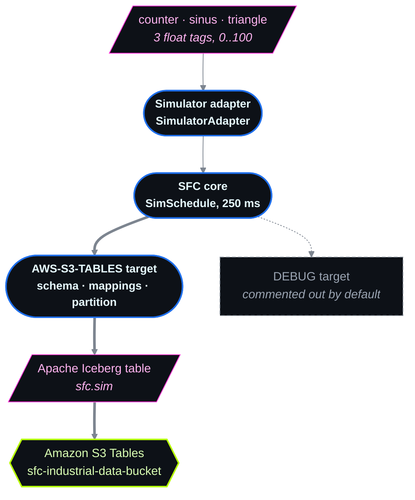

SFC Simulator to Amazon S3 Tables: high-frequency machine data as Apache Iceberg
================================================================================

## Introduction

This example takes high-frequency industrial machine readings — the kind a PLC or a historian emits
every few hundred milliseconds, almost all of it numeric float values — and lands them in
[Amazon S3 Tables](https://docs.aws.amazon.com/AmazonS3/latest/userguide/s3-tables.html) as
[Apache Iceberg](https://iceberg.apache.org/) tables, ready for SQL.

The pipeline runs in process: one `sfc-main` process hosts both the
[Simulator adapter](../../docs/adapters/simulator.md), which stands in for a machine, and the
[AWS S3 Tables target](../../docs/targets/aws-s3-tables.md), which writes Iceberg.



The Simulator is used instead of a real protocol adapter so you can exercise the whole path — channel
definitions, schema mapping, Iceberg partitioning, write batching — without a PLC on the bench.
Replace `SimulatorAdapter` with [OPC-UA](../../docs/adapters/opcua.md),
[Siemens S7](../../docs/adapters/s7.md), [Modbus-TCP](../../docs/adapters/modbus.md) or any other
[supported adapter](../../docs/adapters/README.md) and nothing in the target configuration changes.

Two directories:

| Directory | What it is |
|---|---|
| [`sfc-to-s3tables/`](./sfc-to-s3tables) | The pipeline. This is the subject of most of this README. |
| [`cdk/`](./cdk) | Optional. A Cognito-secured web app that queries the resulting Iceberg tables with DuckDB in AWS Lambda. Covered in [Querying the data](#querying-the-data). |

### Table of contents

- [Prerequisites](#prerequisites)
- [Run the pipeline](#run-the-pipeline)
- [How the configuration is built](#how-the-configuration-is-built)
  - [1. Wiring: which code implements which type](#1-wiring-which-code-implements-which-type)
  - [2. The source: what to read](#2-the-source-what-to-read)
  - [3. The schedule: when to read it, and where it goes](#3-the-schedule-when-to-read-it-and-where-it-goes)
  - [4. The target: where it lands, and in what shape](#4-the-target-where-it-lands-and-in-what-shape)
- [Tuning for high-frequency machine data](#tuning-for-high-frequency-machine-data)
- [Querying the data](#querying-the-data)
- [Clean up](#clean-up)

## Prerequisites

- A Java runtime. Plus `curl`, `jq`, `wget` and `tar` if you let `run.sh` download the
  release bundles; not needed when you build from source.
- AWS credentials resolvable by the
  [default provider chain](https://docs.aws.amazon.com/sdk-for-java/latest/developer-guide/credentials-chain.html).
  Because the target uses `AutoCreate: true`, its first write creates the table bucket, the namespace
  and the table, so it needs all of these
  ([target documentation](../../docs/targets/aws-s3-tables.md#awss3tablestargetconfiguration)):

  ```
  "ListNamespaces", "ListTables", "ListTableBuckets", "CreateTableBucket",
  "CreateNamespace", "CreateTable",
  "GetTableBucket", "GetTableData", "GetTable", "GetTableMetadataLocation",
  "PutTableData", "UpdateTableMetadataLocation"
  ```

  For production, prefer temporary credentials through the
  [AWS IoT credentials provider](../../docs/sfc-aws-service-credentials.md): add a
  `CredentialProviderClient` to the target plus an
  [`AwsIotCredentialProviderClients`](../../docs/core/sfc-configuration.md#awsiotcredentialproviderclients)
  section.
- A region where S3 Tables is available — see the
  [regions and quotas list](https://docs.aws.amazon.com/AmazonS3/latest/userguide/s3-tables-regions-quotas.html).

## Run the pipeline

```shell
cd examples/in-process-sim-s3tables/sfc-to-s3tables
./run.sh
```

That is the whole setup. `run.sh` finds the four modules this example needs — `sfc-main`, the
`simulator` adapter, the `aws-s3-tables-target` and the `debug-target` — from whichever source is
available, in this order:

| Source | When it is used |
|---|---|
| `SFC_MODULES_DIR` | Whenever you set it, unchecked — the escape hatch for a deployment laid out some other way. |
| `build/distribution` | Whenever this working copy has been built with `./gradlew build` from the repository root. **A local build wins**, so a change you just made to an adapter or target is what actually runs. |
| `./modules` | Otherwise. The precompiled bundles for the latest release are downloaded here on first use and reused afterwards; the directory is gitignored. |

A module counts as present either extracted or as a `.tar.gz`, because `gradlew build` leaves both
kinds side by side — anything still archived is unpacked in place, and reruns skip what is already
there. Set `VERSION=vX.Y.Z` to pin the download to a specific release.

`AWS_REGION` defaults to `us-west-2`; export it beforehand to write elsewhere. The download path
needs `curl`, `jq`, `wget` and `tar`; building from source needs none of them.

Nothing is printed per sample by default. To watch the data flow, delete the `#` from
`"#DEBUGTarget"` in the schedule — the debug target prints each `TargetData` set to the console, and
it is the fastest way to confirm a `ValueQuery` actually resolves before you chase it through Iceberg.

After the first flush — up to ten seconds with the shipped settings — the table exists:

```shell
ACCOUNT=$(aws sts get-caller-identity --query Account --output text)
BUCKET_ARN="arn:aws:s3tables:${AWS_REGION:-us-west-2}:${ACCOUNT}:bucket/sfc-industrial-data-bucket"
aws s3tables list-tables --table-bucket-arn "$BUCKET_ARN" --namespace sfc
```

## How the configuration is built

[`simulator-to-s3tables.json`](./sfc-to-s3tables/simulator-to-s3tables.json) is a complete
[SFC configuration](../../docs/core/sfc-configuration.md). It is easiest to read from the bottom up,
because the lower sections declare *what exists* and the upper sections declare *what happens*.

### 1. Wiring: which code implements which type

Running [in process](../../docs/sfc-running-adapters.md#running-protocol-adapters-in-process) means
`sfc-main` loads the adapter and target JARs into its own JVM, so it has to be told where they are
and which class to instantiate. That is all [`AdapterTypes`](../../docs/core/sfc-configuration.md#adaptertypes) and [`TargetTypes`](../../docs/core/sfc-configuration.md#targettypes) do:

```json
"AdapterTypes": {
  "SIMULATOR": {
    "JarFiles": ["${SFC_MODULES_DIR}/simulator/lib"],
    "FactoryClassName": "com.amazonaws.sfc.simulator.SimulatorAdapter"
  }
},
"TargetTypes": {
  "AWS-S3-TABLES": {
    "JarFiles": ["${SFC_MODULES_DIR}/aws-s3-tables-target/lib"],
    "FactoryClassName": "com.amazonaws.sfc.awss3tables.AwsS3TablesTargetWriter"
  },
  "DEBUG-TARGET": {
    "JarFiles": ["${SFC_MODULES_DIR}/debug-target/lib"],
    "FactoryClassName": "com.amazonaws.sfc.debugtarget.DebugTargetWriter"
  }
}
```

[`ProtocolAdapters`](../../docs/core/sfc-configuration.md#protocoladapters) then declares an *instance* of an adapter type. The Simulator needs no connection
settings, so this is as small as it gets — a real adapter would carry device addresses, ports and
security settings here:

```json
"ProtocolAdapters": {
  "SimulatorAdapter": { "AdapterType": "SIMULATOR" }
}
```

The names on the left of each of these maps (`SIMULATOR`, `AWS-S3-TABLES`, `SimulatorAdapter`) are
yours to choose; everything above refers to them by those names.

### 2. The source: what to read

A [source](../../docs/core/source-configuration.md) binds an adapter instance to a set of [`Channels`](../../docs/core/source-configuration.md#channels) through its
[`ProtocolAdapter`](../../docs/core/source-configuration.md#protocoladapter). Each channel is one machine tag:

```json
"Sources": {
  "Simulator": {
    "Name": "Sim",
    "ProtocolAdapter": "SimulatorAdapter",
    "Channels": {
      "counter":  { "Simulation": { "SimulationType": "Counter",  "DataType": "Int",  "Min": 0, "Max": 100 } },
      "sinus":    { "Simulation": { "SimulationType": "Sinus",    "DataType": "Byte", "Min": 0, "Max": 100 } },
      "triangle": { "Simulation": { "SimulationType": "Triangle", "DataType": "Byte", "Min": 0, "Max": 100 } }
    }
  }
}
```

With a real adapter each channel would instead carry an address — an OPC-UA node id, an S7 `DB`
offset, a Modbus register. Here the [`Simulation`](../../docs/adapters/simulator.md#simulation) block of a
[`SimulatorChannelConfiguration`](../../docs/adapters/simulator.md#simulatorchannelconfiguration) generates the value instead.
The full set of generators is listed under [Simulations](../../docs/adapters/simulator.md#simulations) — this example uses
[`Counter`](../../docs/adapters/simulator.md#counter), [`Sinus`](../../docs/adapters/simulator.md#sinus) and [`Triangle`](../../docs/adapters/simulator.md#triangle), and
[`Random`](../../docs/adapters/simulator.md#random), [`Sawtooth`](../../docs/adapters/simulator.md#sawtooth), [`Square`](../../docs/adapters/simulator.md#square),
[`Range`](../../docs/adapters/simulator.md#range), [`List`](../../docs/adapters/simulator.md#list) and [`Structure`](../../docs/adapters/simulator.md#structure) are also available.

Worth knowing about this particular data: [`Counter`](../../docs/adapters/simulator.md#counter) with
[`Min`](../../docs/adapters/simulator.md#min)`: 0`, [`Max`](../../docs/adapters/simulator.md#max)`: 100` **wraps**. It is a 0..100
sawtooth, not a monotonically increasing counter. All three channels are therefore periodic signals,
and all three are summarised the same way downstream — average, with a min/max band.

A channel can be commented out by prefixing its name with `#`, which is the same convention used for
schedule [`Sources`](../../docs/core/schedule-configuration.md#sources) and [`Targets`](../../docs/core/schedule-configuration.md#targets). Channels also accept
[`Transformation`](../../docs/core/channel-configuration.md#transformation), [`ChangeFilter`](../../docs/core/channel-configuration.md#changefilter),
[`ValueFilter`](../../docs/core/channel-configuration.md#valuefilter) and [`Metadata`](../../docs/core/channel-configuration.md#metadata) — see
[ChannelConfiguration](../../docs/core/channel-configuration.md).

### 3. The schedule: when to read it, and where it goes

```json
"Schedules": [
  {
    "Name": "SimSchedule",
    "Interval": 250,
    "Active": "true",
    "TimestampLevel": "Both",
    "Sources": { "Simulator": ["*"] },
    "Targets": ["S3TablesTarget", "#DEBUGTarget"]
  }
]
```

- [`Interval`](../../docs/core/schedule-configuration.md#interval)`: 250` polls every listed source four times a second. This is what makes the example
  high-frequency, and it is the number every tuning decision below follows from.
- [`Sources`](../../docs/core/schedule-configuration.md#sources) maps a source name to the channels to read; `["*"]` means all of them.
- [`Targets`](../../docs/core/schedule-configuration.md#targets) lists where each read goes. `#DEBUGTarget` is commented out, so data goes only to
  S3 Tables until you enable it.
- [`TimestampLevel`](../../docs/core/schedule-configuration.md#timestamplevel)`: "Both"` emits a timestamp at both the individual value level and the whole-read
  level. Keep this for machine data: it lets a mapping choose between when a tag was sampled and when
  SFC assembled the read, and the gap between a device clock and an ingest clock is diagnostic
  information you cannot recover later.

### 4. The target: where it lands, and in what shape

```json
"S3TablesTarget": {
  "Active": "True",
  "TargetType": "AWS-S3-TABLES",
  "Region": "${AWS_REGION}",
  "TableBucket": "sfc-industrial-data-bucket",
  "Namespace": "sfc",
  "AutoCreate": true,
  "Tables": [ … ]
}
```

[`TableBucket`](../../docs/targets/aws-s3-tables.md#tablebucket), [`Namespace`](../../docs/targets/aws-s3-tables.md#namespace) and [`TableName`](../../docs/targets/aws-s3-tables.md#tablename) are
the three levels of an S3 Tables address. With [`AutoCreate`](../../docs/targets/aws-s3-tables.md#autocreate)`: true`, all three are
created on the first write if they do not already exist — which is
why the pipeline must run before the query app is deployed.

Each entry in [`Tables`](../../docs/targets/aws-s3-tables.md#tables) is a [TableConfiguration](../../docs/targets/aws-s3-tables.md#tableconfiguration) with three
parts. **[`Schema`](../../docs/targets/aws-s3-tables.md#schema)** declares the Iceberg columns, each one a
[ColumnConfiguration](../../docs/targets/aws-s3-tables.md#columnconfiguration):

```json
"Schema": [
  { "Name": "event_time", "Type": "timestamptz", "Optional": false },
  { "Name": "counter",    "Type": "float",       "Optional": false },
  { "Name": "sinus",      "Type": "float",       "Optional": true  },
  { "Name": "triangle",   "Type": "float",       "Optional": true  },
  { "Name": "build_info", "Type": [ { "Name": "number", "Type": "string" },
                                    { "Name": "version", "Type": "string" } ],
    "Optional": false }
]
```

[`Optional`](../../docs/targets/aws-s3-tables.md#optional) is more consequential than it looks. If a non-`Optional` column's mapping yields no value,
**no row is written at all** — which is the mechanism behind multiple mappings per table, and also the
usual cause of a silently empty table. The nested array [`Type`](../../docs/targets/aws-s3-tables.md#type) on `build_info` declares an Iceberg
`struct` — the accepted type strings are listed under [`Type`](../../docs/targets/aws-s3-tables.md#type).

Note that the `Byte` channels map into `float` columns and the `Int` counter into `float` as well.
That is intentional: the target coerces, and it reflects reality, where a tag's wire type and its
analytical type rarely match.

**[`Mappings`](../../docs/targets/aws-s3-tables.md#mappings)** says where each column's value comes from, as a
[JMESPath](https://jmespath.org) [`ValueQuery`](../../docs/targets/aws-s3-tables.md#valuequery) over the target data (whose shape is
described in [the SFC output data format](../../docs/sfc-data-format.md#output-data-format)):

```json
"Mappings": [
  {
    "event_time": { "ValueQuery": "@.timestamp" },
    "counter":    { "ValueQuery": "@.sources.Sim.values.counter.value" },
    "sinus":      { "ValueQuery": "@.sources.Sim.values.sinus.value" },
    "triangle":   { "ValueQuery": "@.sources.Sim.values.triangle.value" },
    "build_info": { "Mappings": {
        "number":  { "ValueQuery": "@.sources.Sim.values.triangle.value" },
        "version": { "ValueQuery": "@.sources.Sim.values.triangle.value" } } }
  }
]
```

A mapping entry is a [ColumnMappingConfiguration](../../docs/targets/aws-s3-tables.md#columnmappingconfiguration): either a
[`ValueQuery`](../../docs/targets/aws-s3-tables.md#valuequery) or a nested [`Mappings`](../../docs/targets/aws-s3-tables.md#mappings-1) block for a struct column,
never both. Each can also carry a [`Transformation`](../../docs/targets/aws-s3-tables.md#transformation) and a
[`ValueFilter`](../../docs/targets/aws-s3-tables.md#valuefilter), applied in that order after the query.

**`Mappings` is a list, and each entry produces one row.** One entry gives one wide row per read,
which is the shape here. Several entries produce several rows from the same read — which is how you
build a narrow, one-row-per-tag table instead:

A `ValueQuery` reads from the target data, so a constant such as the tag name has to come from
somewhere in that data. Attach it as channel
[`Metadata`](../../docs/core/channel-configuration.md#metadata), which appears alongside the value:

```json
"Channels": {
  "counter": { "Simulation": { … }, "Metadata": { "tag": "counter", "unit": "count" } },
  "sinus":   { "Simulation": { … }, "Metadata": { "tag": "sinus",   "unit": "pct"   } }
}
```

```json
"Schema": [
  { "Name": "event_time", "Type": "timestamptz", "Optional": false },
  { "Name": "tag",        "Type": "string",      "Optional": false },
  { "Name": "value",      "Type": "float",       "Optional": false },
  { "Name": "unit",       "Type": "string",      "Optional": true  }
],
"Mappings": [
  { "event_time": { "ValueQuery": "@.timestamp" },
    "tag":        { "ValueQuery": "@.sources.Sim.values.counter.metadata.tag" },
    "unit":       { "ValueQuery": "@.sources.Sim.values.counter.metadata.unit" },
    "value":      { "ValueQuery": "@.sources.Sim.values.counter.value" } },
  { "event_time": { "ValueQuery": "@.timestamp" },
    "tag":        { "ValueQuery": "@.sources.Sim.values.sinus.metadata.tag" },
    "unit":       { "ValueQuery": "@.sources.Sim.values.sinus.metadata.unit" },
    "value":      { "ValueQuery": "@.sources.Sim.values.sinus.value" } }
]
```

Because `value` and `tag` are non-`Optional`, a mapping whose channel produced no reading writes no
row at all — which is exactly what you want when a deadband suppressed that tag.

For machines with hundreds of tags that come and go, the narrow shape is usually the better one:
adding a tag becomes a configuration change rather than an Iceberg schema change, a single `value`
column compresses far better than hundreds of mostly-empty float columns, and a suppressed tag yields
no row instead of a row full of nulls. The query app in `cdk/` handles either shape. If you adopt it,
read the `BufferCount` warning in [Tuning](#how-writes-are-batched) first.

**[`Partition`](../../docs/targets/aws-s3-tables.md#partition)** is the Iceberg partition spec, a map of transform to column:

```json
"Partition": { "day": "event_time" }
```

See [Partitioning](#partitioning) below — `day` is the wrong default for a 250 ms writer.

## Tuning for high-frequency machine data

**The configuration as shipped is a demonstration, not a production setting.** It is left at the
target's defaults to keep it readable, and at a 250 ms schedule those defaults are wasteful. Read this
before pointing SFC at a real machine, and before leaving it running unattended.

### How writes are batched

The [target](../../docs/targets/aws-s3-tables.md#awss3tablestargetconfiguration) flushes on exactly two conditions, whichever comes
first:

| Setting | Default | What it really controls |
|---|---|---|
| [`BufferCount`](../../docs/targets/aws-s3-tables.md#buffercount) | 100 records | **File size.** Counted across every table in the target, not per table. |
| [`Interval`](../../docs/targets/aws-s3-tables.md#interval) | 10000 ms | **Maximum latency, and your loss window.** Buffered records live in JVM memory and are only flushed on a graceful shutdown. |

At 250 ms that is four records a second, so `BufferCount: 100` would take 25 seconds to fill and
`Interval` always wins: roughly 360 flushes an hour. Each flush issues one Iceberg append commit **per
partition group**, and every commit writes a new `metadata.json`, manifest list and manifest on top of
the data file — so the object count is not the file count:

```
files/hour   = flushes/hour × partition-groups/flush
objects/hour ≈ files/hour × 4        (data file + metadata.json + manifest list + manifest)
```

Roughly 1,440 objects an hour, about 35,000 a day, for one table with three tags. S3 Tables bills
per-object monitoring and automatic compaction, so an unattended simulator is by far the largest cost
in this example — much more than querying it.

For a genuinely high-frequency source, raise both:

```json
"S3TablesTarget": {
  "Interval": 900000,
  "BufferCount": 10000
}
```

That flushes every 15 minutes at about 3,600 rows per file: four or five files an hour instead of 360.
Do not push `Interval` much further, because it is also how much data a hard crash loses.

**If you switch to a narrow schema, re-derive `BufferCount`.** It counts *records*, and N mappings
produce N records per read, so it fills N times faster. Reusing a wide-schema `BufferCount` with 100
mappings silently shrinks every file by 100×. This is the most common mistake with this target.

### Partitioning

The example uses `{"day": "event_time"}`. For sustained high-frequency writes, prefer:

```json
"Partition": { "hour": "event_time" }
```

`day` yields the fewest files — one partition group per flush — but a one-hour query then scans a
whole day of manifests. `hour` costs at most one extra file per hour, since only the flush straddling
an hour boundary splits, and lets Iceberg prune far more aggressively.

Resist `bucket[N]` on a machine or tag id. Every distinct partition value is a separate file *and* a
separate commit, so `hour` + `bucket[16]` costs up to sixteen times the files and sixteen times the
snapshots — to buy pruning that Iceberg's per-column min/max statistics plus a table sort order
already give you. All available transforms are listed under
[`Partition`](../../docs/targets/aws-s3-tables.md#partition).

One setting to leave alone:
[`PartitioningOptimization`](../../docs/targets/aws-s3-tables.md#partitioningoptimization). Setting it
to `false` writes every buffered record in one action using **the first record's** partition values.
With a time-based transform, the flush that crosses an hour boundary is then filed under the wrong
hour, and those rows quietly disappear from any query that prunes on time.

### Send less in the first place

The cheapest record is the one never written. All of these run at the adapter, before any buffering:

- **[Change filters](../../docs/sfc-data-processing-filtering.md#data-change-filters)** — report only on meaningful change. A deadband on a
  noisy analogue tag routinely removes most of its traffic; keep a minimum-interval heartbeat so
  "unchanged" stays distinguishable from "dead". Declared under [`ChangeFilters`](../../docs/core/sfc-configuration.md#changefilters)
  and referenced from a [source](../../docs/core/source-configuration.md#changefilter) or a [channel](../../docs/core/channel-configuration.md#changefilter); the
  [`Type`](../../docs/core/change-filter-configuration.md#type), [`Value`](../../docs/core/change-filter-configuration.md#value) and [`AtLeast`](../../docs/core/change-filter-configuration.md#atleast) properties decide what
  counts as a change and how often to report regardless.
- **[Transformations](../../docs/sfc-data-processing-filtering.md#transformations)** — quantise before filtering, so the deadband behaves
  predictably. [`TruncAt`](../../docs/core/transformation-operator-configuration.md#truncat) or [`Round`](../../docs/core/transformation-operator-configuration.md#round) on a
  [channel](../../docs/core/channel-configuration.md#transformation) is usually enough.
- **[Aggregation](../../docs/core/aggregation-configuration.md)** — emit average, minimum and maximum over a window instead of every sample,
  with [`Size`](../../docs/core/aggregation-configuration.md#size) samples per window and the functions listed in [`Output`](../../docs/core/aggregation-configuration.md#output).
  Keeping min and max is what makes this lossy-but-honest for machine data, where the excursion
  matters more than the mean. It changes the output shape — see
  [the aggregated output data format](../../docs/sfc-data-format.md#aggregated-output-data-format) —
  so every [`ValueQuery`](../../docs/targets/aws-s3-tables.md#valuequery) gains a level.

See [SFC data processing and filtering](../../docs/sfc-data-processing-filtering.md), and [the SFC dataflow](../../docs/sfc-data-processing-filtering.md#sfc-dataflow) for the
order in which these run.

### Let S3 Tables maintain the table

Table buckets run compaction and snapshot expiry for you, which is what keeps a many-small-files
writer viable. For a long-running pipeline, check two things: a compaction target file size in the
128–256 MB range, and a snapshot retention shorter than the default, since `metadata.json` is
rewritten on every commit.

## Querying the data

The tables are ordinary Iceberg. They are readable from
[Amazon Athena](https://aws.amazon.com/athena/), Amazon Redshift, Amazon EMR and Apache Spark, and
from DuckDB on your laptop:

```sql
INSTALL aws; INSTALL httpfs; INSTALL avro; INSTALL iceberg;
CREATE SECRET (TYPE s3, PROVIDER credential_chain);
ATTACH 'arn:aws:s3tables:us-west-2:111122223333:bucket/sfc-industrial-data-bucket'
  AS ice (TYPE iceberg, ENDPOINT_TYPE s3_tables);
SELECT count(*), min(event_time), max(event_time) FROM ice.sfc.sim;
```

### The web app in `cdk/`

[`cdk/`](./cdk) packages that same DuckDB query path as a small application, so the tables are
explorable without a SQL client. It exists because writing Iceberg is only half a pipeline: until you
can see the data, you cannot tell whether the schema mapping, the partitioning or the batching
settings above were the right ones.

Why it is worth deploying rather than just reading:

- **It proves the data is queryable by anything.** The Lambda attaches the table bucket with the same
  `ATTACH … ENDPOINT_TYPE s3_tables` a laptop uses. If it works there, Athena, Redshift, EMR and Spark
  work too.
- **It closes the loop on the tuning decisions.** Drill-down is server-side: zooming re-queries the
  visible window at a finer bucket width, so you can go from a day of history down to individual
  250 ms samples against the same table. That is where a bad partition choice becomes obvious.
- **It is honest about downsampled data.** Every line carries a min/max band per bucket, so an
  averaged view still shows the excursions — which for machine data is usually the part you care
  about.
- **It is schema-agnostic.** It asks the API which columns exist and classifies each as time, numeric
  or dimension, so it charts both the wide table this example writes and the narrow one-row-per-tag
  variant above, with no code change.
- **It shows a real regression in SQL.** *Fit a linear trend* returns `regr_slope`, `regr_intercept`
  and `regr_r2` computed by DuckDB over the visible window, with its slope per second, R² and sample
  count — no ML infrastructure involved.
- **It is a complete, secured serverless pattern** you can lift elsewhere: CloudFront with Origin
  Access Control over a private S3 bucket, an API Gateway REST API imported from an OpenAPI document,
  a Cognito user pool with managed login, and a read-only, least-privilege Lambda role. The web app
  and the API are served from one distribution, so they are same-origin.
- **No data is copied and there is no per-GB scan charge** — the function reads Iceberg in place.

The table bucket name is chosen in the UI, so one deployment can explore several pipelines.

Deployment, configuration and teardown: [`cdk/README.md`](./cdk/README.md).

## Clean up

Stop `run.sh` with Ctrl-C. That is a graceful shutdown, which flushes whatever is still buffered — a
hard kill loses it. Then, if you deployed the query app, `npx cdk destroy` in `cdk/`.

The table bucket belongs to neither half, and it refuses deletion while it still holds tables:

```shell
ACCOUNT=$(aws sts get-caller-identity --query Account --output text)
BUCKET_ARN="arn:aws:s3tables:${AWS_REGION:-us-west-2}:${ACCOUNT}:bucket/sfc-industrial-data-bucket"
aws s3tables delete-table --table-bucket-arn "$BUCKET_ARN" --namespace sfc --name sim
aws s3tables delete-namespace --table-bucket-arn "$BUCKET_ARN" --namespace sfc
aws s3tables delete-table-bucket --table-bucket-arn "$BUCKET_ARN"
```

Leaving the bucket in place keeps costing money: per-object monitoring and maintenance are billed
whether or not anything reads the table.

[Examples](../../docs/examples/README.md)
