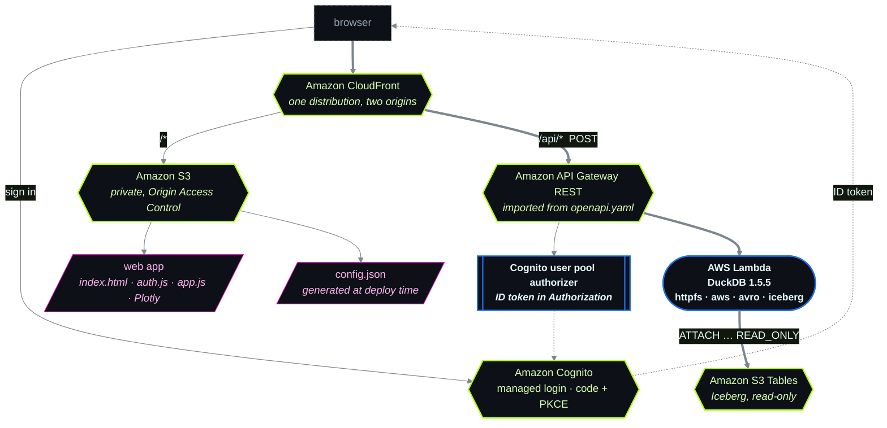

DuckDB query app for SFC data in Amazon S3 Tables
=================================================

A CDK app that deploys a Cognito-secured web app for exploring the Apache Iceberg tables SFC writes
to Amazon S3 Tables. Queries run in DuckDB inside AWS Lambda, against the Iceberg data in place.

The query Lambda is adapted from the AWS sample
[`ddb-duckdb-analytics`](https://github.com/aws-samples/aws-dynamodb-examples/tree/master/infrastructure_as_code/cdk/ddb-duckdb-analytics).

## What it deploys



Serving the API from the same distribution as the web app makes the two same-origin, so the browser
sends no preflight and the app needs no CORS for its own traffic.

| Resource | Notes |
|---|---|
| Lambda, container image | Python 3.12 + DuckDB 1.5.5 with the `httpfs`, `aws`, `avro` and `iceberg` extensions baked in. 3008 MB, 25 s timeout, 5 reserved concurrent executions. Read-only S3 Tables IAM. |
| API Gateway REST API | Defined by [`api/openapi.yaml`](api/openapi.yaml) — that file is the API surface. Every data operation is a `POST`; each path also has an unauthenticated `OPTIONS` for the CORS preflight. |
| Cognito user pool + managed login | Authorization code + PKCE, ID token in `Authorization`. Self sign-up disabled. |
| CloudFront distribution | `/*` serves the web app from a private S3 bucket via Origin Access Control; `/api/*` goes to API Gateway. Same origin, so the app needs no CORS for its own traffic. |
| S3 bucket | Private. Holds `web/` plus a generated `config.json`. |

The routes, in the order the app uses them:

| Path | Purpose |
|---|---|
| `POST /api/buckets` | Table buckets this deployment may read |
| `POST /api/catalog` | Namespaces and tables in a bucket |
| `POST /api/schema` | Columns and their roles (time / numeric / dimension / other) |
| `POST /api/extent` | First and last timestamp, and row count |
| `POST /api/distinct` | Distinct values of a dimension column |
| `POST /api/series` | Time-bucketed avg / min / max / count per series |
| `POST /api/trend` | Least-squares fit (`regr_slope`, `regr_r2`) over a window |
| `POST /api/rows` | Raw row preview |
| `POST /api/sql` | Arbitrary read-only SQL — absent unless `allowFreeSql=true` |

The app is schema-agnostic: it asks `/api/schema` what columns exist and builds the chart from those,
so it works against both the wide table this example writes and a narrow one-row-per-tag table.
Zooming re-queries the visible window at a finer bucket width server-side.

## Prerequisites

- **Run the SFC pipeline first** — [`../sfc-to-s3tables`](../sfc-to-s3tables). It creates the table
  bucket, namespace and table with `AutoCreate: true`; this stack never creates them.
- Node.js 20+, and **Docker running** — the query function is a container image with no zip fallback.
- `npx cdk bootstrap` once per account and region, for the container asset repository.
- Deploy into the same region as the table bucket, or pass `-c tableBucketRegion=…`: DuckDB derives
  the S3 Tables endpoint from the ARN's region.

## Deploy

```shell
cd examples/in-process-sim-s3tables/cdk
npm ci
npx cdk deploy

# self sign-up is disabled, so create yourself an account
./scripts/create-user.sh you@example.com
```

Then open the `SiteUrl` output and sign in. Outputs:

| Output | What it is |
|---|---|
| `SiteUrl` | Open this. Web app, plus the API under `/api/`. |
| `UserPoolId` | Used by `scripts/create-user.sh`. |
| `HostedUiUrl` | Cognito managed login domain. |
| `ApiExecuteUrl` | Direct execute-api URL, **including** the stage. Through CloudFront, omit the stage. |
| `QueryFunctionLogGroup` | Where query errors land. |

A freshly created Cognito prefix domain can take up to a minute to resolve — if sign-in 404s
immediately after deploying, wait and retry.

## Configuration

CDK context values; defaults in [`cdk.json`](cdk.json), override with `-c name=value`.

| Context | Default | Meaning |
|---|---|---|
| `tableBucketNames` | `sfc-industrial-data-bucket` | Table buckets this deployment may read. IAM is scoped to exactly these. |
| `allowAnyTableBucket` | `false` | Widen IAM to every table bucket in the account and let the app discover them. Read-only, but any signed-in user can then read every Iceberg table you own. |
| `tableBucketRegion` | stack region | Region of the table bucket. |
| `allowFreeSql` | `false` | Add `POST /api/sql`. See the warning below. |
| `devOrigins` | `http://localhost:5173` | Origins allowed to call the API cross-origin. |
| `siteOrigin` | unset | Adds the CloudFront domain to the CORS allowlist. Cannot be wired automatically (spec → API → distribution → spec is a CloudFormation cycle); the app does not need it, because it is same-origin. |
| `cognitoDomainPrefix` | `sfc-duckdb-<account>` | Globally unique per region. |
| `stackName` | `SfcS3TablesDuckDbQueryApp` | |

```shell
npx cdk deploy -c tableBucketNames=sfc-industrial-data-bucket,another-bucket
```

## Two things to know before enabling `allowFreeSql`

The reference sample accepts arbitrary SQL safely because its endpoint is an IAM-authorized Lambda
function URL — only IAM principals can reach it. A browser app in front of an API changes that, so:

- **The default contract is structured.** Each route composes SQL server-side from identifiers
  matched against the live Iceberg catalog; a column `DESCRIBE` did not report is rejected, not
  escaped.
- **`POST /api/sql` is removed from the API unless you opt in,** and is unsafe on an internet-facing
  deployment. DuckDB must keep `enable_external_access` at its default `true` because Iceberg data
  paths are discovered at query time, so arbitrary SQL reaches
  `read_text('/proc/self/environ')` — the execution role's credentials — and `COPY … TO 's3://…'`.
  With the flag on, the function disables the local filesystem after loading extensions and accepts
  one `SELECT`/`WITH` only, but an outbound HTTP GET stays reachable. Local use only.

## Cost

Reading is cheap: no per-GB scan charge, CloudFront and Cognito have large free tiers, and the
function bills only while a query runs. The expensive part is the **SFC writer** at a 250 ms
interval — see [the example README](../README.md#tuning-for-high-frequency-machine-data). Stop the
pipeline when you are done.

## Clean up

```shell
npx cdk destroy
```

Everything in the stack is removable, so a redeploy under the same name works; the distribution takes
15–25 minutes to disappear. Two things survive:

```shell
# the container image in the bootstrap ECR repo
npx cdk gc

# the table bucket, which is outside this stack and refuses deletion while it holds tables
BUCKET_ARN=arn:aws:s3tables:us-west-2:111122223333:bucket/sfc-industrial-data-bucket
aws s3tables delete-table --table-bucket-arn "$BUCKET_ARN" --namespace sfc --name sim
aws s3tables delete-namespace --table-bucket-arn "$BUCKET_ARN" --namespace sfc
aws s3tables delete-table-bucket --table-bucket-arn "$BUCKET_ARN"
```

## Development

```shell
npm test               # spectral lint + jest, no AWS credentials needed
npx cdk synth

# the SQL the function composes, against a local fixture. No AWS calls.
docker build --platform linux/amd64 -t sfc-duckdb-test lambda/
docker run --rm --platform linux/amd64 --entrypoint python \
  -e TABLE_BUCKET_REGION=us-west-2 -e ACCOUNT_ID=111122223333 \
  -e ALLOWED_TABLE_BUCKETS=sfc-industrial-data-bucket \
  -e AWS_ACCESS_KEY_ID=x -e AWS_SECRET_ACCESS_KEY=y \
  -v "$PWD/lambda:/opt/test:ro" sfc-duckdb-test /opt/test/test_handler.py

# the deployed surface really is POST-only
./scripts/verify-post-only.sh
```

`npm test` is the only automated gate — the repository's CI runs Gradle only and never type-checks
TypeScript. It asserts what API Gateway will not, most importantly that every `post` carries the
Cognito authorizer with an empty scope array and that there is no root-level `security:`, which
API Gateway silently *ignores* on REST import.

`web/` is plain HTML, CSS and JavaScript with no build step; redeploy with `npx cdk deploy`.

## Third-party content

`web/vendor/plotly-basic-4.1.1/` contains [plotly.js](https://plotly.com/javascript/) 4.1.1 (`basic`
bundle), © Plotly, Inc., used under the MIT licence, with the licence text in `LICENSE` alongside it
and the bundle's copyright banner intact. It is vendored rather than loaded from `cdn.plot.ly`, which
publishes no subresource-integrity hashes; the `basic` bundle avoids the `'unsafe-eval'` that the
full bundle's WebGL traces would require in the Content-Security-Policy.
