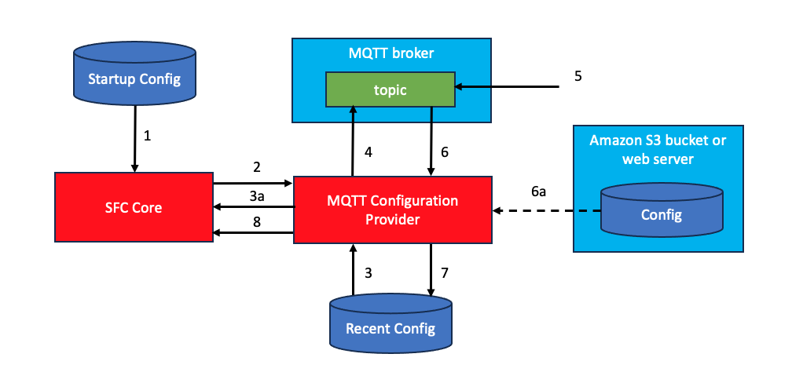

# SFC Example custom MQTT configuration provider

This is an example of a custom config provider allowing submitting configurations to SFC using a MQTT topic. The configuration provider will subscribe to a topic to which SFC configurations can be published.
The payload of the published message can either be 

-  an SFC configuration  in JSON format 
-  a (pre-signed) URL from where the configuration can be downloaded 

The latter can be used if the size of the configuration exceeds the maximum message size of the MQTT broker.

Configurations received on the topic are not signature-checked, even when SFC runs with `-verify`, so anyone who can publish to the topic can reconfigure SFC. Restrict who can publish to it, for example with the broker's access control and an `ssl://` connection with client certificates.

The provider stores the last received configuration in a local file (`LocalConfigFile`, required) and uses it the next time the SFC process is started, until a new configuration is published.

The SFC configuration that SFC is started with contains the configuration for the MQTT custom provider, including the required information to connect to the MQTT broker.
&nbsp;

### Configuration steps

The image below shows the steps executed by SFC configured to use the MQTT configuration provider.



1. The SFC main process is started with a startup configuration (see example configuration below) which contains the configuration for using the MQTT configuration provider.
2. The SFC main process will create an instance of the provider and will pass the startup configuration to the instance.
3. The provider will look for a recently used configuration (this step is optional) and will load that configuration.
   - 3a. If there was a recently used configuration it will be sent to the SFC which will use it to collect data.
4. The provider connects to the MQTT broker using information from the startup configuration and subscribes to a configured topic.
5. A new configuration is posted to the topic. If the size of the configuration is beyond the maximum payload size of the broker, the configuration is uploaded and instead of the actual configuration an url from where it can be downloaded is published on the topic.
6. The provider receives the messages from the topic, containing either a configuration or an url from where it can be downloaded.
   - 6a. If an url was received the configuration is downloaded making a GET request to the url.
7. After validation the received, or downloaded, configuration is stored as the last recent configuration.
8. The new configuration is sent to the SFC core.

### Example configuration

[config.json](./config.json) is the startup configuration for the in-process mode:

```json
{
  "ConfigProvider": {
    "JarFiles": ["${SFC_DEPLOYMENT_DIR}/mqtt-config-provider/lib"],
    "FactoryClassName": "com.amazonaws.sfc.config.MqttConfigProvider"
  },
  "LocalConfigFile" : "local-config.json",
  "Port" : "< PORT NUMBER >",
  "EndPoint" : "tcp://< BROKER ADDRESS >:< PORT NUMBER >",
  "TopicName" : "< TOPIC NAME >"
}
```

Replace the placeholders, for example with `"Port" : 1883` and `"EndPoint" : "tcp://localhost:1883"` for a broker on
the same host without TLS. For TLS give the host only, e.g. `"EndPoint" : "ssl://broker.example.com"`, set
`"Port" : 8883` and add `Certificate` and `PrivateKey` (see the table below).

### Run it

**Uberjar**: the provider is part of the uberjar installed by [sfcup](../../README.md#1-install). Change the
`JarFiles` entry of the `ConfigProvider` section to an empty list, `"JarFiles": []` (SFC ignores the section without
the key), and start SFC in the folder that holds `config.json` (the same command in Windows PowerShell):

```shell
sfcx -config config.json -info
```

**In-process**: unpack the module bundles `sfc-main` and `mqtt-config-provider` of the
[latest release](https://github.com/awslabs/industrial-shopfloor-connect/releases/latest) into one directory, point
`SFC_DEPLOYMENT_DIR` at it and start `sfc-main` in the folder that holds `config.json`. `sfc-main` needs a Java 17 (or
newer) runtime (Windows: `winget install EclipseAdoptium.Temurin.17.JDK`). More about this mode:
[In-process](../../docs/sfc-deployment.md#in-process).

**Linux / macOS**

```shell
export SFC_DEPLOYMENT_DIR="$HOME/sfc"
mkdir -p "$SFC_DEPLOYMENT_DIR"
for m in sfc-main mqtt-config-provider; do
  curl -fsSL "https://github.com/awslabs/industrial-shopfloor-connect/releases/latest/download/$m.tar.gz" | tar -xzf - -C "$SFC_DEPLOYMENT_DIR"
done
"$SFC_DEPLOYMENT_DIR/sfc-main/bin/sfc-main" -config config.json -info
```

**Windows (PowerShell)**

Give `SFC_DEPLOYMENT_DIR` forward slashes: SFC inserts the value into the JSON text as it is, so a backslash breaks
the JSON.
Start `sfc-main` with `java -cp`, not with `bin\sfc-main.bat` ([Platform support](../../docs/README.md#platform-support)):

```powershell
$env:SFC_DEPLOYMENT_DIR = "C:/sfc"
New-Item -ItemType Directory -Force C:\sfc | Out-Null
foreach ($m in "sfc-main", "mqtt-config-provider") {
    curl.exe -fsSL -o "C:\sfc\$m.tar.gz" "https://github.com/awslabs/industrial-shopfloor-connect/releases/latest/download/$m.tar.gz"
    tar -xf "C:\sfc\$m.tar.gz" -C C:\sfc
}
java -cp "C:\sfc\sfc-main\lib\*" com.amazonaws.sfc.MainController -config config.json -info
```

SFC will load the configured mqtt configuration provider. This provider will use saved configuration data from an
earlier program execution, if there is any, and subscribe to the configured topic to receive new versions of the
configuration. It logs `Connected to <EndPoint>, subscribing to topic <TopicName>`; for each message on the topic it
logs `Received configuration from topic <TopicName>` and, for a valid configuration, `Sending configuration to
SFC-Core`, after which SFC restarts with that configuration. To try it with the uberjar, publish the
[Quickstart `simulator.json`](../../README.md#2-helloworld-simulator-example) to the topic with any MQTT client.

### MQTT configuration provider configuration

<table>  
<colgroup>  
<col style="width: 17%" />  
<col style="width: 29%" />  
<col style="width: 20%" />  
<col style="width: 32%" />  
</colgroup>   
<tbody>  
<tr class="odd">  
<td><strong>Name</strong></td>  
<td><strong>Description</strong></td>  
<td><strong>Type</strong></td>  
<td><strong>Comments</strong></td>  
</tr>  
<tr class="even">  
<td>EndPoint</td>  
<td>Broker endpoint address</td>  
<td>String</td>  
<td>Required. Broker URL with scheme: "tcp://host:port" for plain MQTT, e.g. "tcp://localhost:1883" (without a port the client connects to 1883), or "ssl://host" for TLS, e.g. "ssl://broker.example.com". For "ssl://" the client connects to port 8883; do not put a port in an "ssl://" URL (see Port). Without a scheme, "tcp://" is added, or "ssl://" when Certificate, PrivateKey or RootCA is set.</td>  
</tr>  
<tr class="odd">  
<td>Port</td>  
<td>Port on MQTT broker</td>  
<td>Integer</td>  
<td>

When it is not set, a port in EndPoint sets it. For "ssl://" endpoints the provider also reads the broker's certificate from this port, so use 8883 there.

Commonly port numbers are 
-  1883 for plain MQTT ("tcp://")
-  8883 for MQTT over TLS ("ssl://"), also for AWS IoT Core endpoints

</td> 
</tr>  
<tr class="even">  
<td>SslServerCertificate</td>  
<td>Path to server certificate file to verify the identity of the broker.</td>  
<td>String</td>  
<td>Currently not applied: the provider reads the certificate from the broker instead and trusts it, so the broker is not authenticated.</td>  
</tr>  
<tr class="odd">  
<td>PrivateKey</td>  
<td>Path to client private key file</td>  
<td>String</td>  
<td>Required for "ssl://" endpoints</td>  
</tr>  
<tr class="even">  
<td>RootCA</td>  
<td>Path to root certificate file. The Root CA file in an MQTT client is used for server certificate verification when establishing a secure connection with the broker (using TLS/SSL)</td>  
<td>String</td>  
<td></td>  
</tr>  
<tr class="odd">  
<td>Certificate</td>  
<td>Path to client certificate file. Used if broker used certificate authentication</td>  
<td>String</td>  
<td>Required for "ssl://" endpoints: the provider loads a client certificate for every TLS connection</td>  
</tr>  

<tr class="even">  
<td>Username</td>  
<td>Username if broker is using username and password authentication</td>  
<td>String</td>  
<td>Username and password should not be included as clear text in the configuration. It is strongly recommended to use placeholders and use the SFC integration with the AWS secrets manager (<a href="../../docs/sfc-configuration.md#configuration-secrets">configuration secrets</a>).</td>
</tr>

<tr class="odd">  
<td>Password</td>  
<td>Password if broker is using username and password authentication</td>  
<td>String</td>  
<td>Username and password should not be included as clear text in the configuration. It is strongly recommended to use placeholders and use the SFC integration with the AWS secrets manager (<a href="../../docs/sfc-configuration.md#configuration-secrets">configuration secrets</a>).</td>  
</tr>  

<tr class="even">  
<td>ConnectTimeout</td>  
<td>Timeout for connecting to the broker in seconds</td>  
<td>Int</td>  
<td>Default is 10 seconds. Known limitation: the configured value is currently not applied, the timeout is always 10 seconds.</td>
</tr>

<tr class="odd">  
<td>VerifyHostname</td>  
<td>Verify that the host name in the broker's certificate matches the broker address</td>  
<td>Boolean</td>  
<td>Default is true</td>
</tr>

<tr class="even">  
<td>WaitAfterConnectError</td>  
<td>Period in seconds to wait before trying to connect after a connection failure</td>  
<td>Int</td>  
<td>Default is 60 seconds</td>
</tr>
<tr class="odd">
<td>TopicName</td>  
<td>Name of the topic which is used to publish configuration data.</td>  
<td>String</td>  
<td>Required</td>  
</tr> 
<tr class="even">  
<td>LocalConfigFile</td>  
<td>Pathname of a file to which received configurations are written. </td>  
<td>String</td>  
<td>Required. If the SFC process is executed it will check if this file exists and use it to load the 
initial configuration which is sent by the config provider to the SFC core before subscribing and awaiting configurations published to the topic. A relative path resolves against the directory SFC is started from.</td>
</tr>
<tr class="odd">  
<td>UseLocalConfigFileAtStartUp</td>  
<td>Controls if the last received and stored local configuration file may be used as initial configuration data which is sent to the SFC core.</td>  
<td>Boolean</td>  
<td>Default is true. 

Note that if this is set to false SFC can only start collecting and processing data after a first valid configuration
is received on the configured topic.
</td> 
</tr>  
</tbody>  
</table>

On Windows, write the paths in this configuration with forward slashes, e.g. `"RootCA": "C:/sfc/certs/AmazonRootCA1.pem"`;
a single backslash is a JSON escape.

Docs used: [MQTT broker settings](../../docs/adapters/mqtt.md#mqttbrokerconfiguration) · [ConfigProvider](../../docs/core/sfc-configuration.md#configprovider) · [Custom configuration handlers](../../docs/sfc-extending.md#custom-configuration-handlers) · [Configuration secrets](../../docs/sfc-configuration.md#configuration-secrets) · [All examples](../../docs/examples/README.md)